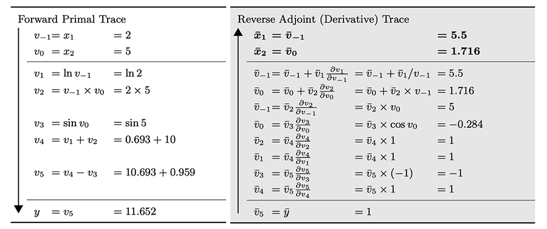
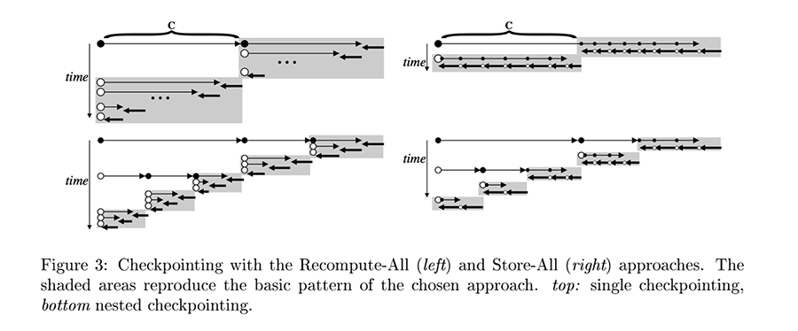

<!--适用于[License](https://github.com/chenzomi12/DeepLearningSystem/blob/main/LICENSE)版权许可-->
# 自动微分的挑战&未来
在前面的章节里面，分别介绍了什么是自动微分、如何实现自动微分，以及更加深入的自动微分的基本数学原理，并贯以具体的代码实现例子来说明业界主流的AI框架在自动微分实现方法，希望让你更加好地掌握自动微分端到端能力。
虽然计算机实现自动微分已经发展了几十年，不过在自动微分的演进过程和未来发展，仍然遇到诸多挑战，这里主要总结两点：1）易用性；2）高效性能。针对这两点的改进，也是自动微分技术未来演进可以重点优化和改进的方向。
## 易用性
易用性将是挑战的首位，是因为自动微分的数学原理比较固定，相对其他更加复杂的凸优化、群和商群等的数学原理而言，自动微分自动微分本身的数学原理相对简单，但其实现的难点在于：
- 理想中的自动微分是对**数学表达**的分解、微分和组合过程
- 实际中的自动微分是对**程序表达**的分界、微分和组合过程
而**数学表达**和**程序表达**之间存在显著的差异。
### 控制流的表达
如下公式所示，为对公式 $l_1 = x$ 具体的数学表达式进行多次展开：
$$𝑙_1=𝑥 \\ 𝑙_(𝑛+1)=4𝑙_𝑛 (1−𝑙_1) \\ 𝑓(𝑥)=𝑙_4=64𝑥(1−𝑥)(1−2𝑥)^2(1−8𝑥+8𝑥^2)^2$$
:eqlabel:`diff_07_eq0`
在程序的实现过程中，并不会针对上述公式展开成：
```python
f_3(x):
    l_1 = x
    l_2 = 4 * l_1 * (1 - l_1)
    l_3 = 4 * l_2 * (1 - l_1)
    return l_3
```
在更加通用的场景，大部分开发者或者程序会更加习惯于使用 for 循环对代码进行累加乘：
```python
f(x):
    v = x
    for i = 1 to 3:
        v = 4 * v * (1 - v)
    return v
```
通过公式 :eqref:`diff_07_eq0` 和对应的代码可以看出，在针对数学表达式中，递归属于一种隐式的存在，特别是针对下标及子表达式关系中。而在程序表达中，递归则显式的表达为语言中的 for 循环和入参 x。
虽然从计算的角度看二者是等价的（即数学计算过程相同及其计算结果相同），但是从自动微分的角度看却是截然不同。自动微分的计算机程序必须感知到 for i = 1 to 3 这个循环条件的计算过程和明确的入参 x ，这些并不属于开发者希望进行自动微分的部分。
换而言之，自动微分系统必须能够识别程序表达中用于计算控制流（例如for、while、loop、if、else等）的运算部分，并将其排除在微分过程外。
在主流的自动微分实现方法中，基本表达式法、操作符重载法的实现方案，好处在于：原生地只对特定的数据进行运算执行对应封装好的 API 或者操作符定义了自动微分规则，因此可以直接排除数学微分无关的控制流部分，只关注于具体的数学计算逻辑部分。
但是上述方法带来的问题，就是没有办法使用程序来表示闭包（closed form）的数学表达式进行"自动微分"求解，打破了数学表示完整性，不能够将将整个问题转换为一个纯数学符号问题。此外通过代码转换法，则通常需要进行程序分析或微分规则的扩展定义来完成控制流部分的过滤处理。
### 复杂数据类型
在数学表达式的微分过程中，通常处理的是连续可微的实数类型数据。然而在程序表达中，现代高级编程语言（Python、C/C++、JAVA等）通常提供了多种丰富特性，用于开发者自定义组合数据类型，如 tuple、record、struct、class、dict 等。
特别地，在这些封装的组合数据类型中，除了常规意义中可微的计算机浮点数据类型（如 FP32、FP16、INT8 等），还可能包含一些用于描述数据属性的字段，如索引值、名称、数据格式等等，而这些字段也应该被排除在微分过程外。
如下所示，针对源码转换法的第一性原理 ANF 定义和 Python、C++ 都有其复杂的数学类型没有办法通过数学计算来表达。
```shell
<aexp> ::= NUMBER | STRING | VAR | BOOLEAN | PRIMOP
Python ::= [List, Enum, Tuple, Dict, DefaultDict]
C++ ::= [size_t, whcar_t, enum, struct , STL::list]
```
因此在实际的实现过程中，基本表达式法、操作符重载法一般只能通过预定义数据类型（如张量 Tensor 数据结构）来指定数据类型中哪些字段需要被微分，哪些不需要被微调，需要有更多的细节约束，开发者可定制的自由度较低。源码转换法则可以结合编译器或解释器的扩展来暴露一些接口给开发者，用于指定自定义数据类型的微分规则，但是灵活度太高实现起来不容易。
### 语言特性
语言特性更多是关于设计，比如在设计一门高级的编程语言时，希望它有泛型有多态，实现过程中的特性就会包括泛型和多态。此外针对高级编程语言（High-level programming language）可以作为一种独立于机器，面向过程或对象的语言。
因此，自动微分使用程序表达的实现过程中，开发者还可以有许多其他非原数学表达、非业务逻辑的代码，特别是针对高级编程语言的多态性、面向对象实现、异常处理、调试调优、IO 输入输出等代码及其高级特性，这些部分也需要被自动微分程序特殊处理。否则会造成数学表达和程序表达之间的混乱。
在早期的 TensorFLow1.X 版本针对自动微分的实现逻辑来看，其定义了明确的前后向 API 及其严格符号定义，需要按照一定的符号规则才能执行自动微分功能。开发者根据符号定义来写完成程序后，TensorFlow 执行时需要记住在前向传递过程中哪些运算以何种顺序发生。随后，在后向传递期间，TensorFlow 以相反的顺序遍历此运算列表来计算梯度。这就造成了TensorFLow 易用性成为诟病的原因之一。
### 需求重写
**物理系统**的可微分模拟可以帮助解决混沌理论、电磁学、地震学、海洋学等领域中的很多重要问题, 但又因为其对计算时间和空间的苛刻要求而对自动微分技术本身提出了挑战。
其中最大的技术挑战是对电磁学、海洋学和地震学等问题中最核心的微分方程求解过程的自动微分。这些微分方程常见的求解方法是先将问题的时空坐标离散化，并以数值积分的形式完成求解。要得到精确的结果，离散化后的网格需要设计得很稠密，从而对存储空间和计算时间的需求巨大。
与此同时, 在自动微分计算过程中，机器学习中主流的后向自动微分库，如 Jax 、 TensorFlow 和 PyTorch，需要很多额外的空间来缓存中间结果, 导致开发者无法直接用它们对具有一定规模的实际物理模拟问题求导。
针对诸如物理模拟、游戏引擎、气候模拟、计算机图形学中的应用等具有领域专用属性的自动微分程序，可能需要根据具体的需求，设计出适合该领域的自动微分程序实现。
## 高效性能
在前面的章节中，介绍了自动微分在实际的计算实现过程，会涉及到程序的分解、微分和组合。因此如何对程序进行分解、微分和组合，及其执行顺序则会决定自动微分的性能。
### 程序与微分表达
首先我们看看程序和自动微分计算过程的简单实现方案。如对公式 $f(x)=x^3$ 下面代码所示：
```Python
def fun(x):
    t = x * x * x
    return t
```
对公式进行微分可以表示为 $f'(x)=3x^2$，其微分的代码实现方式为：
```Python
def dfun(x):
    dx = 3 * x * x
    return dx
```
在计算机程序中，可以将原函数计算过程和微分结果过程进行融合，并完成类似公共子表达式的提取优化。如下面代码将同时完成原函数计算和微分结果计算：
```Python
def fun(x):
    t = x * x
    v = x * t
    dx = 3 * t
    return v, dx
```
### 额外中间变量
以在AI框架中更加常用的后向自动微分模式为例（目前作为更多AI框架的实现方式），其计算过程表达如图 :numref:`autodiff01` 所示，表的左列浅色为前向计算函数值的过程，与前向计算时相同，右面列深色为反向计算导数值的过程。

:label:`autodiff01`
反向模式的计算过程如图所示，其中：
$$ \overline{v_i}=\dfrac{\delta y}{\delta v_i} $$
:eqlabel:`diff_07_eq1`
根据链式求导法则展开有：
$$ \frac{\partial f}{\partial x}=\sum_{k=1}^{N} \frac{\partial f}{\partial v_{k}} \frac{\partial v_{k}}{\partial \boldsymbol{x}} $$
:eqlabel:`diff_07_eq2`
可以看出，左侧是源程序分解后得到的基本操作集合，而右侧则是每一个基本操作根据已知的求导规则和链式法则**由下至上**计算的求导结果。在求解最后的倒数过程中，左侧的源程序分解后的变量，与右侧的由下至上的计算过程中，存在大量的变量在过程中被多次复用。
以更加通用的数学表示为例则二阶微分方程的一般形式为：
$$ 𝐹(x, y, {y}', {y}'')=0 $$
:eqlabel:`diff_07_eq3`
其中，$x$ 是自变量，$y$ 是未知函数，${y}'$ 是 $y$ 的一阶导数，${y}''$ 是 $y$ 的二阶导数。其二阶导数表示为：
$$ \frac{\partial^{2} y }{\partial x^{2}} = \frac{\mathrm{d}}{\mathrm{d} y}\left (\frac{\mathrm{d} y}{\mathrm{d} x} \frac{\mathrm{d} x}{x} \right ) $$
:eqlabel:`diff_07_eq4`
因此在复合求导函数中，会存在大量计算复用的情况。
额外中间变量存储得越多，会减少重复的计算量，即以空间换时间。在AI框架自动微分实现过程中，希望尽可能减少重复的计算，以更多的内存来存储额外产生的中间变量，这也是AI框架在实际执行网络模型计算的过程中，我们会遇到 NPU 的内存中除了模型权重参数、优化器参数以外，还会额外占用了很多的内存空间，这些内存空间就是用来存储上面所述的**额外中间变量**。
### 重计算的方式
自动微分的计算需要使用原程序计算的中间结果。在前向模式中，由于微分过程和原程序计算过程是同步的，因此不会引入额外的存储代价。但在反向模式中，必须将先执行原程序计算过程并将中间结果进行保存，再用于反向自动微分过程中。
因此，如何选择需要存储的程序中间结果点（check-point）将在很大程度上决定自动微分在运行速度和内存占用两项关键性能指标上的平衡表现。
如图 :numref:`autodiff02` 所示，从左向右的箭头表示原程序计算过程，而从右向左的箭头表示反向模式自动微分计算过程。圆圈点则表示所选择的中间结果存储点。

:label:`autodiff02`
图中左侧的策略为，将尽量少的存储中间结果，而当需要的时候，则会使用更早的中间结果进行重计算来得到当前所需的中间结果。图中右侧的策略即为，将尽可能多的存储每一步中间结果，因此当需要时，可以直接获得而不需重计算。
显然，上述两种策略即为在牺牲运行时间和牺牲内存占用间取得平衡，具体应该选择哪种复用策略取决于具体场景的需求和硬件平台的限制。
在AI框架的特性中，上述中间变量的存储过程其实被称为**重计算**的过程，也是在大模型训练或者分布式训练的过程中经过会使用到，根据不同的选择复用策略又叫做**选择性重计算**。
## 自动微分未来
可微编程是将自动微分技术与语言设计、编译器 / 解释器甚至 IDE 等工具链等深度融合，将微分作为高级编程语言中第一特性（first-class feature）。
而可微分编程是一种编程范型，在其中数值计算程序始终可通过自动微分来求导数。这允许了对程序中的参数的基于梯度优化（Gradient method），通常使用梯度下降或其他基于高阶微分信息的学习方法。可微分编程用于各个领域，尤其是科学计算和人工智能。
目前大多数可微编程框架，通过构建包含程序中的控制流和数据结构的图来工作。尝试通常分为两组：基于静态和编译图的方法，例如 TensorFlow、Theano、MXNet 和 PaddlePaddle。这些往往有助于良好的编译器优化和扩展到大型系统，但它们的静态特性使它们交互性较差，并且更易于编写程序类型（例如包含循环和递归的程序）。不仅有限，而且用户也难以推理、有效地解释他们的程序。
名为 Myia 的概念验证编译器工具链使用 Python 的一个子集作为前端，并支持高阶函数、递归和高阶导数。支持运算符重载、基于动态图的方法，例如 PyTorch、 AutoGrad 和 MindSpore。它们的动态性和交互性使大多数程序更易于编写和推理。但是，它们会导致解释器开销（尤其是在组合许多小操作时）、可扩展性降低以及编译器优化带来的好处减少。
先前方法的局限性在于它只能区分以适当语言编写的代码，AI 框架方法限制了与其他程序的互操作性。一种新可微编程的方法通过从语言的语法或 IR 构造图形来解决此问题，从而允许区分任意代码。
## 自动微分总结
- 自动微分挑战主要集中在易用性和性能两方面
- 易用性受限于控制流、数据类型等语言特性以外，还受限于领域需求
- 性能主要以程序表达与微分表达结合，编译，甚至高阶微分等引起

