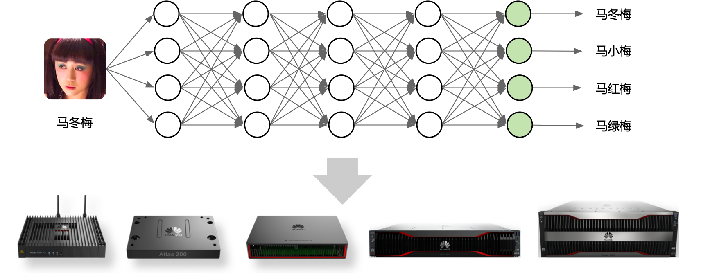
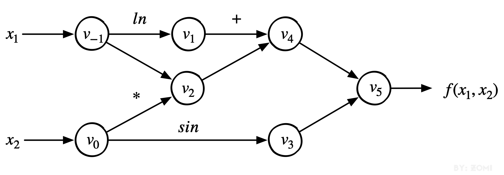
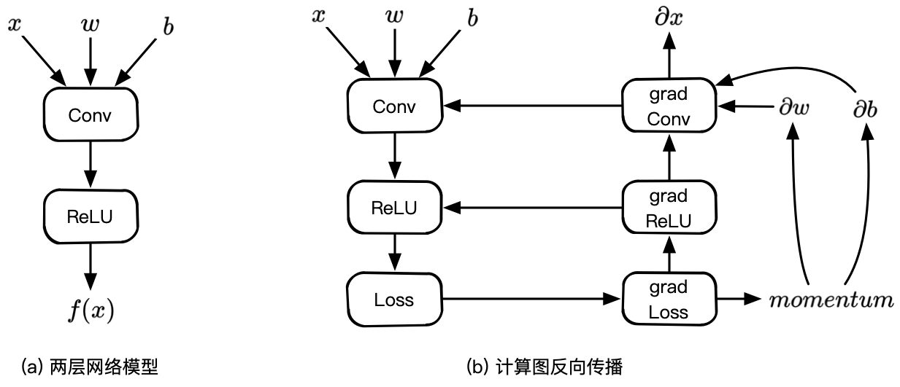

<!--适用于[License](https://github.com/chenzomi12/DeepLearningSystem/blob/main/LICENSE)版权许可-->
# 计算图原理
在前面的章节曾经提到过，目前主流的 AI 框架都选择使用**计算图**来抽象神经网络计算表达，通过通用的数据结构（张量）来理解、表达和执行神经网络模型，通过**计算图**可以把 AI 系统化的问题形象地表示出来。
本节将会以AI概念落地的时候，遇到的一些问题与挑战，因此引出了计算图的概念来对神经网络模型进行统一抽象。接着展开什么是计算，计算图的基本构成来深入了解诶计算图。最后简单地学习PyTorch如何表达计算图。
## AI系统化问题
### 遇到的挑战
在真正的 AI 工程化过程中，我们会遇到诸多问题。而为了高效地训练一个复杂神经网络，AI 框架需要解决许多问题，例如：
- 如何对复杂的神经网络模型实现自动微分？
- 如何利用编译期的分析 Pass 对神经网络的具体执行计算进行化简、合并、变换？
- 如何规划基本计算 Kernel 在计算加速硬件 GPU/TPU/NPU 上高效执行？
- 如何将基本处理单元派发（Dispatch）到特定的高效后端实现？
- 如何对通过神经网络的自动微分（反向传播实现）衍生的大量中间变量，进行内存预分配和管理？
为了使用用统一的方式，解决上述提到的挑战，驱使着 AI 框架的开发者和架构师思考如何为各类神经网络模型的计算提供统一的描述，从而使得在运行神经网络计算之前，能够对整个计算过程尽可能进行推断，在编译期间自动为深度学习的应用程序补全反向计算、规划执行、降低运行时开销、复用和节省内存。能够更好地对特定领域语言（DSL），这里特指深度学习和神经网络进行表示，并对使用 Python 编写的神经网络模型进行优化与执行。
因此派生出了目前主流的 AI 框架都选择使用**计算图**来抽象神经网络计算。

### 计算图的定义
我们会经常遇到有些 AI 框架把统一的图描述称为数据流图，有些称为计算图，这里可以统称为**计算图**。下面简单介绍为什么可以都统称为计算图的原因。
- 数据流图（Data Flow Diagram，DFD）：从数据传递和加工角度，以图形方式来表达系统的逻辑功能、数据在系统内部的逻辑流向和逻辑变换过程，是结构化系统分析方法的主要表达工具及用于表示软件模型的一种图示方法。在 AI 框架中数据流图表示对数据进行处理的单元，接收一定的数据输入，然后对其进行处理，再进行系统输出。
- 计算图（Computation Graph）：被定义为有向图，其中节点对应于数学运算，计算图是表达和评估数学表达式的一种方式。而在 AI 框架中，计算图就是一个表示运算的有向无环图（Directed Acyclic Graph，DAG）。
其两者都把神经网络模型统一表示为图的形式，而图则是由节点和边组成。其都是在描述数据在图中的节点传播的路径，是由固定的计算节点组合而成，数据在图中的传播过程，就是对数据进行加工计算的过程。下面以公式为例：
$$ f(x1,x2)=ln(x1)+x1x2−sin(x2) $$
:eqlabel:`computation_02_eq1`
对上述公式转换为对应的计算图。

:width:`650px`
## 计算图的基本构成
### 数据表达方式
- **标量 Scalar**
标量（scalar），亦称“无向量”。有些物理量，只具有数值大小，而没有方向，部分有正负之分，物理学上指有大小而没有方向的量（跟「矢量」相区别）。物理学中，标量（或作纯量）指在坐标变换下保持不变的物理量。用通俗的说法，标量是只有大小，没有方向的量，如功、体积、温度等。
在 AI 框架或者计算机中，标量是一个独立存在的数，比如线性代数中的一个实数 488 就可以被看作一个标量，所以标量的运算相对简单，与平常做的算数运算类似。代码 x 则作为一个标量被赋值。
```Python
x = 488
```
- **向量 Vector**
向量（vector），物理、工程等也称作矢量、欧几里得向量（Euclidean vector），是数学、物理学和工程科学等多个自然科學中的基本概念。指一个同时具有大小和方向，且满足平行四边形法则的几何對象。理论数学中向量的定义为任何在稱為向量空间的代數結構中的元素。
在 AI 框架或者计算机中，向量指一列顺序排列的元素，通常习惯用括号将这些元素扩起来，其中每个元素都又一个索引值来唯一的确定其中在向量中的位置。其有大小也有方向，以公式为例，其代码 x_vec 则被作为一个向量被赋值。
$$ x_{vec} = \begin{bmatrix} 1.1 \\ 2.2 \\ 3.3 \end{bmatrix} $$
```Python
x_vec = [1.1, 2.2, 3.3]
```
- **矩阵 Matrix**
矩阵（Matrix）是一个按照长方阵列排列的复数或实数集合，最早来自于方程组的系数及常数所构成的方阵。这一概念由19世纪英国数学家凯利首先提出。矩阵是高等代数学中的常见工具，也常见于统计分析等应用数学学科中。
在机器学习领域经常被使用，比如有 N 个用户，每个用户有 M 个特征，那这个数据集就可以用一个 NxM 的矩阵表示，在卷积神经网络中输入模型的最初的数据是一个图片，读取图片上的像素点（Pixel）作为输入，一张尺寸大小为 256x256 的图片，实质上就可以用 256*256 的矩阵进行表示。
以公式为例，其代码 x_mat 则被表示为一个矩阵被赋值。
$$ x_{mat} = \begin{bmatrix} 1 & 2 & 3 \\ 4 & 5 & 6 \\ 7 & 8 & 9 \end{bmatrix} $$
```Python
x_mat = [[1, 2, 3], [4, 5, 6], [7, 8, 9]]
```
图中对标量、向量、矩阵进行形象化表示：

:width:`650px`
- **张量**
张量（tensor）理论是数学的一个分支学科，在力学中有重要应用。张量这一术语起源于力学，它最初是用来表示弹性介质中各点应力状态的，后来张量理论发展成为力学和物理学的一个有力的数学工具。张量之所以重要，在于它可以满足一切物理定律必须与坐标系的选择无关的特性。张量概念是矢量概念的推广，矢量是一阶张量。
在几何代数中，张量是基于向量和矩阵的推广，通俗一点理解的话，可以将标量是为零阶张量，向量视为一阶张量，矩阵视为二阶张量。在 AI 框架中，所有数据将会使用张量进行表示，例如，图像任务通常将一副图片根据组织成一个3维张量，张量的三个维度分别对应着图像的长、宽和通道数，一张长和宽分别为 H, W 的彩色的图片可以表示为一个三维张量，形状为 (C, H, W)。自然语言处理任务中，一个句子被组织成一个2维张量，张量的两个维度分别对应着词向量和句子的长度。
一组图像或者多个句子只需要为张量再增加一个批量（batch）维度，N 张彩色图片组成的一批数据可以表示为一个四维张量，形状为 (N, C, H, W)。
### 张量和张量操作
在执行计算任务中，数据常常被组织成一个高维数组，整个计算任务的绝大部分时间都消耗在高维数组上的数值计算操作上。高维数组和高维数组之上的数值计算是神经网络的核心，构成了计算图中最重要的一类基本算子。在 AI 框架的数据中主要有稠密张量和稀疏张量，这里先考虑最为常用的稠密张量。
张量作为高维数组，是对标量，向量，矩阵的推广。AI 框架对张量的表示主要有以下几个重要因素：
1. **元素数据类型**：在一个张量中，所有元素具有相同的数据类型，如整型，浮点型，布尔型，字符型等数据类型格式
2. **形状**：张量每个维度具有固定的大小，其形状是一个整型数的元组，描述了一个张量的维度以及每个维度的长度
3. **设备**：决定了张量的存储设备，如在通用处理器 CPU 中的 DDR 上还是 GPU/NPU 的 HBM 上等。
下面是针对形状为 (3, 2, 5) 的三维张量进行表示。

虽然张量通常用索引来指代轴，但是始终要记住每个轴的含义。轴一般按照从全局到局部的顺序进行排序：首先是批次轴，随后是空间维度，最后是每个位置的特征。这样，在内存中，特征向量就会位于连续的区域。例如针对形状为 (3, 2, 4, 5) 的四维张量进行表示，其内存表示如图中右侧所示。

:width:`550px`
高维数组为开发者提供了一种逻辑上易于理解的方式来组织有着规则形状的同质数据，极大地提高了编程的可理解性。另一方面，使用高维数据组织数据，易于让后端自动推断并完成元素逻辑存储空间向物理存储空间的映射。更重要的是：张量操作将同构的基本运算类型作为一个整体进行批量操作，通常都隐含着很高的数据并行性，因此非常适合在单指令多数据（SIMD）并行后端上进行加速。
### 计算图表示AI框架 
计算图是用来描述运算的有向无环图，有两个主要元素：节点 (Node) 和边 (Edge)。节点表示数据，如向量、矩阵、张量；边表示具体执行的运算，如加、减、乘、除和卷积等。
下面以简单的数学公式 $z = x + y$ 为例，可以绘制上述方程的计算图如下：

:width:`400px`
上面的计算图具有一个三个节点，分别代表张量数据中的两个输入变量 x 和 y 以及一个输出 z。两条边带有具体的 “+” 符号表示加法。
在 AI 框架中会稍微有点不同，其计算图的基本组成有两个主要的元素：1）基本数据结构张量和2）基本计算单元算子。节点代表 Operator 具体的计算操作（即算子），边代表 Tensor 张量。整个计算图能够有效地表达神经网络模型的计算逻辑和状态。
- **基本数据结构张量**：张量通过 `shape` 来表示张量的具体形状，决定在内存中的元素大小和元素组成的具体形状；其元素类型决定了内存中每个元素所占用的字节数和实际的内存空间大小
- **基本运算单元算子**：具体在加速器 GPU/NPU 中执行运算的是由最基本的代数算子组成，另外还会根据深度学习结构组成复杂算子。每个算子接受的输入输出不同，如Conv算子接受3个输入Tensor，1个输出Tensor
下面以简单的一个卷积、一个激活的神经网络模型的正向和反向为例，其前向的计算公式为：
$$ f(x) = ReLU(Conv(w, x, b)) $$
反向计算微分的时候，需要加上损失函数：
$$ Loss(x, x') = f(x) - x' $$
根据正向的神经网络模型定义，AI 框架中的计算图如下：

上面 (a) 中计算图具有两个节点，分别代表卷积 Conv 计算和激活 ReLU 计算，Conv 计算接受三个输入变量 x 和权重 w  以及一个偏置 b，激活接受 Conv 卷积的输出并输出一个变量。（b）为对应（a）的反向计算图，在神经网络模型训练的过程当中，自动微分功能会为开发者自动构建反向图，然后输入输出完整一个完整step计算。
总而言之，AI 框架的设计很自然地沿用了张量和张量操作，将其作为构造复杂神经网络的基本描述单元，开发者可以在不感知复杂的框架后端实现细节的情况下，在 Python 脚本语言中复用由后端优化过的张量操作。而计算 Kernel 的开发者，能够隔离神经网络算法的细节，将张量计算作为一个独立的性能域，使用底层的编程模型和编程语言应用硬件相关优化。
> 在这里的计算图其实忽略了2个细节，特殊的操作：如：程序代码中的 For/While 等构建控制流；和特殊的边：如：控制边表示节点间依赖。
## PyTorch计算图
### 动态计算图
在Pytorch的计算图中，同样由节点和边组成，节点表示张量或者函数，边表示张量和函数之间的依赖关系。其中Pytorch中的计算图是动态图。这里的动态主要有两重含义。
- 第一层含义是：计算图的正向传播是立即执行的。无需等待完整的计算图创建完毕，每条语句都会在计算图中动态添加节点和边，并立即执行正向传播得到计算结果。
```Python
import torch
w = torch.tensor([[3.0,1.0]],requires_grad=True)
b = torch.tensor([[3.0]],requires_grad=True)
X = torch.randn(10,2)
Y = torch.randn(10,1)
# Y_hat定义后其正向传播被立即执行，与其后面的loss创建语句无关
Y_hat = X@w.t() + b
print(Y_hat.data)
loss = torch.mean(torch.pow(Y_hat-Y,2))
print(loss.data)
```
- 第二层含义是：计算图在反向传播后立即销毁。下次调用需要重新构建计算图。如果在程序中使用了backward方法执行了反向传播，或者利用torch.autograd.grad方法计算了梯度，那么创建的计算图会被立即销毁，释放存储空间，下次调用需要重新创建。
```Python
# 如果再次执行反向传播将报错
loss.backward()  
# 计算图在反向传播后立即销毁，如果需要保留计算图, 需要设置retain_graph = True
loss.backward(retain_graph = True) 
```
### 计算图中Function
计算图中的另外一种节点是Function, 实际上为对张量操作的函数，其特点为同时包括正向计算逻辑和反向传播的逻辑。通过继承torch.autograd.Function来创建。
以创建一个ReLU函数为例：
```Python
class MyReLU(torch.autograd.Function):
    # 正向传播逻辑，可以用ctx存输入张量，供反向传播使用
    @staticmethod
    def forward(ctx, input):
        ctx.save_for_backward(input)
        return input.clamp(min=0)
    #反向传播逻辑
    @staticmethod
    def backward(ctx, grad_output):
        input, = ctx.saved_tensors
        grad_input = grad_output.clone()
        grad_input[input < 0] = 0
        return grad_input
```
接着在构建动态计算图的时候，加入刚创建的Function节点。
```Python
# relu现在也可以具有正向传播和反向传播功能
relu = MyReLU.apply
Y_hat = relu(X@w.t() + b)
loss = torch.mean(torch.pow(Y_hat-Y,2))
loss.backward()
print(w.grad)
print(b.grad)
print(Y_hat.grad_fn)
```
```Text
tensor([[4.5000, 4.5000]])
tensor([[4.5000]])
<torch.autograd.function.MyReLUBackward object at 0x1205a46c8>
```
## 总结
- 了解AI应用或者深度学习需要工程化、系统化过程中会遇到哪些问题
- 计算图的提出，解决了AI系统向下硬件执行计算统一表示，向上承接AI相关程序表示
- 了解了计算图的基本构成是由独立的数据结构张量和基本计算单元算子组成
## 视频
<html>
<iframe src="https://player.bilibili.com/player.html?aid=346347233&bvid=BV1rR4y197HM&cid=911588326&page=1&as_wide=1&high_quality=1&danmaku=0&t=30&autoplay=0" width="100%" height="500" scrolling="no" border="0" frameborder="no" framespacing="0" allowfullscreen="true"> </iframe>
</html>
