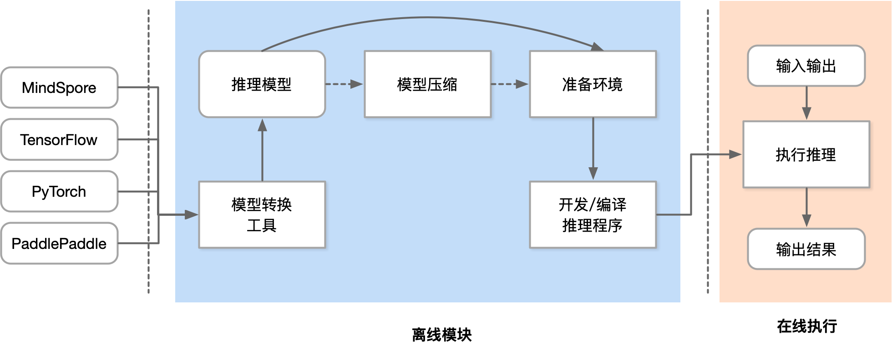

### 推理与训练的区别与挑战
- 训练过程通过设计合适 AI 模型结构以及损失函数和优化算法，将数据集以 mini-batch 反复进行前向计算并计算损失，反向计算梯度利用优化函数来更新模型，使得损失函数最小。训练过程最重要是梯度计算和反向传播。
- 推理在训练好的模型结构和参数基础上，一次前向传播得到模型输出过程。相对于训练，推理不涉及梯度和损失优化。最终目标是将训练好的模型部署生产环境中
1. 模型被部署为长期运行的服务
2. 推理有更苛刻的资源约束
3. 推理不需要反向传播梯度下降
4. 部署的设备型号更加多样
- 模型训练后会保存在文件系统中，随着训练处的模型效果不断提升，可能会产生新版本的模型，并存储在文件系统中并由一定的模型版本管理协议进行管理。之后模型会通过服务系统部署上线，推理系统首先会加载模型到内存，同时会对模型进行一定的版本管理，支持新版本上线和旧版本回滚，对输入数据进行批尺寸（Batch Size）动态优化，并提供服务接口（例如，HTTP，gRPC等），供客户端调用。用户不断向推理服务系统发起请求并接受响应。除了被用户直接访问，推理系统也可以作为一个微服务，被数据中心中其他微服务所调用，完成整个请求处理中一个环节的功能与职责。
- 推理系统中，以数据中心的服务端推理系统为主，兼顾边缘侧移动端推理的场景，但是这些策略本身大部分是数据中心与边缘侧都适用。
### 优化目标与约束
- **约束内容**
	- 低延迟(Latency)：满足服务等级协议的延迟
	- 吞吐量(Throughputs)：暴增负载的吞吐量需求
	- 高效率(Efficiency)：高效率，低功耗使用GPU, CPU
	- 灵活性(Flexibility)：支持多种框架, 提供构建不同应用的灵活性
	- 扩展性(Scalability)：扩展支持不断增长的用户或设备
- **Latency 延迟**
	推理延迟：
	- 延迟是用户给出查询后呈现推理结果消耗的时间
	- 必须既快速同时满足有限的尾部延迟 Tail Latency
	需要低延迟：
	- 服务水平协议(SLA)：Sub-second 级别延迟
	低延迟挑战：
	- 交互式APP 低延迟需求与训练 AI 框架目标不一致
	- 大模型更准确，但浮点运算量更大
	- Sub-second 级别延迟约束制数据 Batch Size
	- 模型融合容易引起长尾延迟 Long Tail Latency
- **Throughputs 吞吐量**
	需要高吞吐的目的：
	- 突发的请求数量暴增
	- 不断扩展的用户和设备
	达到高吞吐的策略：
	- 充分利用AI芯片能力1）批处理请求；2）指令级运算
	- 支持动态 Shape 和自适应批尺寸 Batch Size
	- 多模型装箱使用加速器
	- 容器扩展副本部署
- **Efficiency 效率**
	需要高效的原因：
	- 内存、ALU数量等资源约束
	- 移动端有极高的功耗约束
	- 云端有预算的约束
	高效率策略：
	- 模型压缩
	- 高效使用 AI 推理芯片
	- 装箱（bin-packing）使用加速器
- **灵活性 Flexibility**
	AI 服务的部署，优化和维护困难且容易出错
	框架多样：
	- 大多数框架都是为训练设计和优化
	- 开发人员需要将必要的软件组件拼凑在一起
	- 跨多个不断发展的框架集成和推理需求
	硬件多样：
	- 多种部署硬件的支持
	服务系统需要灵活性：
	- 支持加载不同 AI 框架的模型
	- AI 框架推陈出新和版本不断迭代
	- 与不同语言接口和不同逻辑的应用结合
	解决方法：
	- 深度学习模型开放协议：跨框架模型转换
	- 接口抽象：提供不同框架的通用抽象
	- 容器：运行时环境依赖与资源隔离
	- RPC：跨语言，跨进程通信
- **Scalability 扩展性**
	扩展性原因：
	- 应对用户与请求的增长
	- 提升推理系统吞吐量
	随着请求负载增加自动部署更多的解决方案 ，进而才可以应对更大负载，提供更高的推理吞吐和让推理系统更加可靠。
### 部署态
推理系统一般可以部署在云或者边缘。云端部署的推理系统更像传统 Web 服务，在边缘侧部署的模型更像手机应用和IOT应用系统。

|          | 云端部署                                               | 端侧部署                                       |
| -------- | ------------------------------------------------------ | ---------------------------------------------- |
| 算力     | 算力强大（TFLOPS，并行可扩展），适合训练和推理阶段计算 | 算力有限，水平扩展性差，更适合推理阶段前向计算 |
| 时延     | 网络时延+计算开销                                      | 本地计算无网络开销或开销低，实时响应要求高     |
| 网络依赖 | 强依赖                                                 | 弱依赖，隐私包括，联邦学习                     |
| 能耗     | 百瓦+                                                  | 十瓦，能耗比高                                 |
| 系统架构 | 开放，高度集中                                         | 封闭，架构分散                                 |
| 多样性   | 标准化程度高，CPU/GPU/NPU                              | 多样性芯片架构，SOC多                          |
| 研发成本 | 配套完善，可移植性高                                   | 配套不完善，可移植性受限                       |

**推理系统流程全景**

**推理系统流程全景：请求与响应处理**
- 系统需要序列化与反序列化请求，并通过后端高效执行，满足一定的响应延迟。
- 相比传统的 Web 服务，推理系统常常需要接受图像，文本，音频等非结构化数据，单请求或响应数据量一般更大，这就需要对这类数据有高效的传输，序列化，压缩与解压缩机制。
**推理系统流程全景：请求调度**
- 系统可以根据后端资源利用率，动态调整批尺寸，模型的资源分配，进而提升资源利用率，吞吐量。
- 如果是通过加速器进行的加速推理，还要考虑主存与加速器内存之间的数据拷贝，通过调度或预取等策略在计算的间歇做好数据的准备
**推理系统流程全景：推理引擎执行**
- 推理引擎将请求映射到模型作为输入，并在运行时调度深度学习模型的内核进行多阶段的处理。
- 如果是部署在异构硬件或多样化的环境，还可以利用编译器进行代码生成与内核算子优化，让模型自动化转换为高效的特定平台的可执行的机器码。
**推理系统流程全景：模型版本管理**
- 在云端算法工程师不断验证和开发新的版本模型，需要有一定的协议保证版本更新与回滚。
- 定期或满足一定条件的新模型不断上线替换线上模型，以提升推理服务的效果，但是由于有些指标只能线上测试，有可能线上测试效果较差还需要支持回滚机制，让模型能回滚到稳定的旧版本模型。
**推理系统流程全景：健康监控**
- 云端的服务系统应该是可观测的，才能让服务端工程师监控，报警和修复服务，保证服务的稳定性和 SLA。
- 例如，一段时间内响应变慢，通过可观测的日志，运维工程师能诊断是哪个环节成为瓶颈，进而可以快速定位，应用策略，防止整个服务突发性无法响应（例如，OOM 造成服务程序崩溃）。
**推理系统流程全景：推理硬件**
- 在边缘端等场景会面对更多样的硬件，驱动和开发库，需要通过编译器进行一定代码生成让模型可以跨设备高效运行，并通过编译器实现性能优化。
##### 云测部署和推理方式
- 云端有更大的算力，内存，且电更加充足满足模型的功耗需求，同时与训练平台连接更加紧密，更容易使用最新版本模型，同时安全和隐私更容易保证。相比边缘侧可以达到更高的推理吞吐量。但是用户的请求需要经过网络传输到数据中心并进行返回，同时使用的是服务提供商的软硬件资源。
**Cloud云端特点：**
- 对功耗、温度、 Model Size 没有严格限制
- 有用于训练和推理的强大硬件支持
- 集中的数据管理有利于模型训练
- 模型更容易在云端得到保护
- 深度学习模型的执行平台和AI 框架统一
**Cloud 云端问题：**
- 云上提供所有人工智能服务成本高昂
- 推理服务对网络依赖度高
- 数据隐私问题
- 数据传输成本
- 很难定制化模型
##### 边缘部署和推理方式
 边缘侧设备资源更紧张（例如，手机和 IOT 设备），且功耗受电池约束，需要更加在意资源的使用和执行的效率。用户的响应只需要在自身设备完成，且不需消耗服务提供商的资源。
- Edge 端侧挑战:
	- 严格约束功耗、热量、模型尺寸小于设备内存
	- 硬件算力对推理服务来说不足
	- 数据分散且难以训练
	- 模型在边缘更容易受到攻击
	- DNN平台多样，无通用解决方案
- Edge 端侧优化方法：
	- 应用层算法优化：考虑到移动端部署的苛刻资源约束条件下，提供针对移动端部署的 AI 模型
	- 高效率模型设计：- 通过模型压缩的量化、剪枝、蒸馏、神经网络结构搜索（NAS）等技术，减少模型尺寸
	- 移动端框架——推理引擎：- TensorFlow Lite，MNN、TensorRT，ONNX Runtime、MindSpore Lite等推理引擎推出
	- 移动端芯片： 提供高效低功耗芯片支持，如 Google Edge TPU，NVIDIA Jetson 、Huawei Ascend 310系列
- 部署难点
	- 部署维护成本高，难落地
	- 模型适配、迁移难，重复开发
	- 预测性能差，硬件成本高
	- 高精度模型体积大，性能差
**方式1：边缘设备计算**
	将模型部署在设备端，聚焦如何优化模型执行降低延迟：
		1. 端侧模型结构设计
		2. 通过模型量化、剪枝等压缩手段
		3. 针对神经网络的专用芯片 ASIC 设计
	
**方式2：安全计算 + 卸载到云端**
将模型部署于数据中心，边缘侧通过安全通信协议将请求发送到云端，云端推理返回结果，相当于将计算卸载到云端：
	1. 利用云端运行提升模型安全性
	2. 适合部署端侧无法部署的大模型
	3. 完全卸载到云端有可能违背实时性的需求
	

**方式3：边缘设备 + 云端服务器**
	利用 AI 模型结构特点，将一部分层切（或者其 Student 模型）分放置在设备端进行计算，其他放置在云端。这种方式一定程度上能够比方式 2 降低延迟，由于其利用了边缘设备的算力，但是与云端通信和计算还是会带来额外开销。
	
**方式4：分布式计算**
	从分布式系统角度抽象问题，AI 计算在多个辅助边缘设备上切片：
	- 切片策略根据设备计算能力，内存约束
	- 通过细粒度的切片策略，将模型切片部署其他边缘设备
	- 运行对计算模型进行调度， 并通过输入数据通过负载均衡策略进行调度
	
**方式5：跨设备 Offloading**
	- 决策基于经验性的权衡功耗，准确度，延迟和输入尺寸等度量和参数，不同的模型可以从当前流行的模型中选择，或者通过知识蒸馏，或者通过混合和匹配的方式从多个模型中组合层。如较强的模型放在边缘服务器，较弱模型放置在设备。
	
### 推理系统架构
#### 推理、部署、服务化概念
推理（Inference）
- 对于训练（Training）而言的推理，即模型前向计算，也就是对于给出的输入数据计算得到模型的输出结果；相对预测（Prediction）的推理，是统计学领域的范畴。
部署（Deployment）
- 训练得到的模型主要目的还是为了更有效地解决实际中的问题，因此部署是一个非常重要的阶段。模型部署的课题也非常多，包括但不仅限于：移植、压缩、加速等。
服务化（Serving）
- 模型的部署方式是多样的：封装成一个SDK，集成到APP或者服务中；封装成一个web服务，对外暴露接口（HTTP(S)，RPC等协议）。
#### 服务化推理系统框架
**常见的服务化框架：**

| 框架名称         | 支持的模型         | 开源仓库地址                                        | 开源时间 |
| ---------------- | ----------------- | --------------------------------------------------- | -------- |
| TensorFlow Serving | TensorFlow       | https://github.com/tensorflow/serving               | 2016     |
| TorchServe        | PyTorch           | https://github.com/pytorch/serve                    | 2020     |
| Triton            | TensorFlow/PyTorch等 | https://github.com/triton-inference-server/server | 2018     |
| BentoML           | TensorFlow/PyTorch等 | https://github.com/bentoml/BentoML                  | 2019     |
| Kubeflow          | TensorFlow/PyTorch等 | https://github.com/kubeflow/kfserving               | 2019     |
| Seldon Core       | TensorFlow/PyTorch等 | https://github.com/SeldonIO/seldon-core             | 2018     |
这些框架提供了将机器学习/深度学习模型部署为服务的功能，并且都是开源的。您可以通过上述链接访问它们的开源仓库，获取更多详细信息和使用示例。
其中Triton推理服务器 (NVIDIA Triton Inference Server) 是英伟达等公司推出的开源推理框架，为用户提供部署在云和边缘推理上的解决方案。

- Triton 支持 HTTP/REST 和 GRPC 协议。其实除此之外，Triton 还支持共享内存（Shared Memory）的 IPC（Inter-ProcessCommunication）通信机制。模型仓库可以是本地的持久化存储介质（磁盘），也可以接入 Google CloudPlatform 或者 AWS S3 模型仓库。Triton的模型仓库支持多模型、也支持模型编排。
- **Triton 模型预编排**
	- Pre-Model Scheduler Queues，核心工作是模型编排：通过解析请求的URL，从模型仓库查询到编排信息，执行模型编排。
- **Triton 推理引擎**
	- Triton 支持 TensorFlow, TensorRT, PyTorch,ONNX Runtime 推理引擎，Triton统一称为“Backend”。在 Triton 开始启动时，模型仓库中的模型就已经被加载到内存或者显存上了，然后服务调起推理引擎执行实际的计算
- **Triton 返回与监控**
	- Inference Response 为结果返回，即把最终结果返回给客户端。
	- Status/Health Metrics Export 是 Triton 支持接入 Prometheus 监控的接口。
- **基于 Triton 集成推理引擎**
	- 网络请求和模型编排等相关的功能，Triton服务已经集成好了，Backend只需要关心模型的加载（Load）、前向推理计算（Forward）和卸载（Unload），以及配置文件校验。
#### **模型的生命周期**
- 训练任务：数据中心中更像是传统的批处理任务，需要执行数小时，数天才能完成，其一般配置较大的批尺寸追求较大的吞吐，将模型训练达到指定的准确度或错误率。
- 推理任务：执行 7 X 24 的服务，其常常受到响应延迟的约束，配置的批尺寸更小，模型已经稳定一般不再被训练。
- 需要模型版本管理的原因
	- 每隔一段时间训练出的新版本模型替换线上模型，但是可能存在缺陷
	- 如果新版本模型发现缺陷需要回滚
- 模型生命周期管理
	- **金丝雀策略**
		- 当获得一个新模型版本，当前服务模型成为 second-newest，用户可以选择同时保持这两个版本
		- 将所有推理请求流量发送到当前两个版本，比较它们的效果
		- 一旦对最新版本达标，用户就可以切换到仅该版本
		- 方法需要更多的高峰资源，避免将用户暴露于缺陷模
	- **回滚 Rollback 策略**
		- 如果在当前的主要服务版本上检测到缺陷，则用户可以请求切换到特定的较旧版本
		- 卸载和装载的顺序应该是可配置的
		- 当问题解决并且获取到新的安全版本模型时，从而结束回滚
### 推理引擎特点与技术挑战
#### 特点
- High performance
	1. 需要对 iOS / Android / PC 不同硬件架构和操作系统进行适配，单线程下运行深度学习模型达到设备算力峰值。
	2. 针对主流加速芯片进行深度调优，如 OpenCL 侧重于推理性能极致优化，Vulkan 方案注重较少初始化时间。
	3. 编写SIMD代码或手写汇编以实现核心运算，充分发挥芯片算力，针对不同kernel算法提升性能。
	4. 支持不同精度计算以提升推理性能，并对 ARMv8.2 和 AVX512 架构的相关指令进行了适配。
- Lightness
	1. 主体功能无任何依赖，代码精简，可以方便地部署到移动设备和各种嵌入式设备中。
	2. 支持 Mini 编辑选项进一步降低包大小，大约能在原库体积基础上进一步降低体积。
	3. 支持模型更新精度 FP16/Int8 压缩与量化，可减少模型50% - 75% 的体积。
- Versatility
	1. 支持 Tensorflow、PyTorch、MindSpore、ONNX 等主流模型文件格式。
	2. 支持 CNN / RNN / GAN / Transformer 等主流网络结构。
	3. 支持多输入多输出，任意维度输入输出，支持动态输入，支持带控制流的模型。
	4. 支持 服务器 / 个人电脑 / 手机 及具有POSIX接口的嵌入式设备。
	5. 支持 Windows / iOS 8.0+ / Android 4.3+ / Linux / ROS 等操作系统。
 - Accessibility
	6. 支持使用算子进行常用数值计算，覆盖 numpy 常用功能
	7. 提供 CV/NLP 等任务的常用模块
	8. 支持各平台下的模型训练
	9. 支持丰富的 API 接口

#### 技术挑战
- **需求复杂 vs 程序大小**
	- AI 模型本身包含众多算子，如 PyTorch有1200+ 算子、Tensorflow 接近 2000+ 算子，推理引擎需要用有限算子去实现不同框架训练出来 AI 模型所需要的算子。
	- AI 应用除去模型推理之外，也包含数据前后处理所需要的数值计算与图像处理，不能引入大量的三方依赖库，因此需要进行有限支持。
- **算力需求 vs 资源碎片化**
	- AI 模型往往计算量很大，需要推理引擎对设备上的计算资源深入适配，持续进行性能优化，以充分发挥设备的算力。
	- 计算资源包括 CPU , GPU , DSP 和 NPU ，其各自编程方式是碎片化，需要逐个适配，开发成本高，也会使程序体积膨胀。
- **执行效率 vs 模型精度**
	- 高效的执行效率需要网络模型变小，但是模型的精度希望尽可能的高；
	- 云测训练的网络模型精度尽可能的高，转移到端侧期望模型变小但是保持相同的精度；

### 推理流程
**推理引擎架构**

-  **优化阶段
	模型转换工具，由转换和图优化构成；模型压缩工具、端侧学习和其他组件组成。
	- 模型转换工具：
		- 模型格式转换
		- 计算图优化
	- **对模型进行压缩
		- 减少模型大小
		- 加快训练速度
		- 保持相同精度
	- **端侧学习
		- 增量学习
		- 联邦学习
	- **其他模块
		- 性能对比
		- 集成模块
- **运行阶段
	即推理引擎，负责AI模型的加载与执行，可分为调度与执行两层
	- **中间表达
		- Schema
		- 统一表达
	- **引擎架构Runtime
		- 模型加载
		- 模型执行
	- **高性能算子层
		- 算子优化
		- 算子执行
		- 算子调度
**推理引擎工作流程**

开发推理程序
1. 配置推理选项 ::Config，包括设置模型路径、运行设备、开启/关闭计算图优化等
2. 创建推理引擎对象 ::Predictor(Config)，其中 Config 为配置推理选项
3. 准备输入数据
	- 将原始输入数据根据模型需要做相应的预处理（比如减均值等标准化操作）
	- 先通过 auto input_names = predictor->GetInputNames() 获取模型所有输入 Tensor 名称
	- 通过 auto tensor = predictor->GetInputTensor(input_names[i]) 获取输入 Tensor 的指针
	- 通过 tensor->copy(data)，将预处理之后的数据 data 拷贝/转换到 tensor 中
4. 执行推理，运行 predictor->Run() 完成推理执行
5. 获得推理结果并进行后处理
	- 通过 auto out_names = predictor->GetOutputNames() 获取模型所有输出 Tensor 名称
	- 通过 auto tensor = predictor->GetOutputTensor(out_names[i]) 获取输出 Tensor 指针
	- 通过 tensor->copy(data)，将 tensor 数据拷贝/转换到 data 指针上
	- 批量推理验证数据集并计算模型精度判断推理结果的正确性
	- 将模型推理输出数据进行后处理（根据检测框位置裁剪图像等

**开发推理程序**