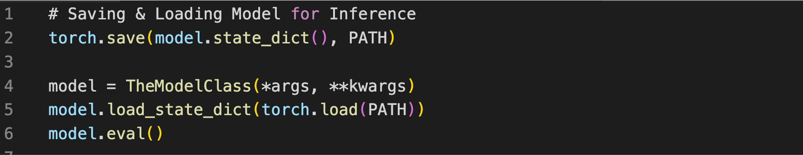
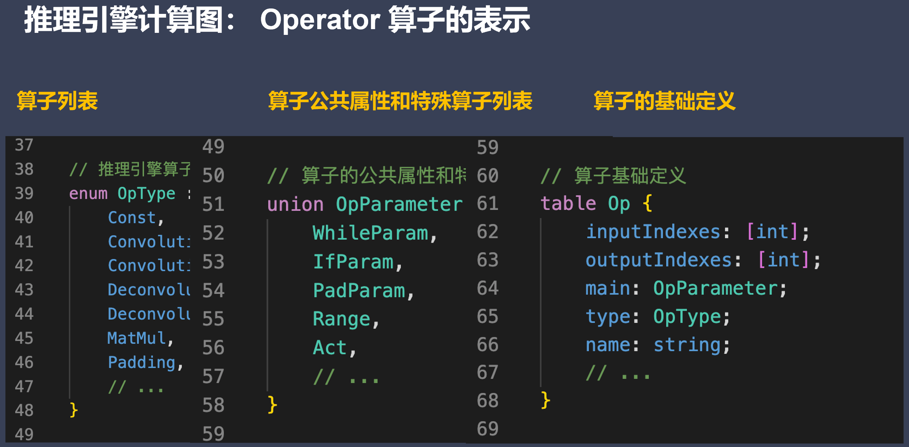

### 模型转换介绍
#### 模型转换架构与流程
- 模型转换技术
	•Principle and architecture - 转换模块挑战与架构
	•Model serialization - 模型序列化/反序列化
	•protobuffer / flatbuffer 目标文件格式
	•IR define - 自定义计算图 IR/Schema
	•Technical details -转换流程和技术细节
	•ONNX Introduction - ONNX 转换介绍
- 模型格式转换
	•转换模块挑战与架构
	•模型序列化/反序列化
	•protobuffer / flatbuffer 格式
	•自定义计算图 IR
	•转换流程和技术细节
	•ONNX 转换介绍
##### 转换模块挑战与架构
- Converter Challenge 转换模块挑战
	1. AI 模型本身包含众多算子，推理引擎需要用有限算子实现不同框架 AI 模型所需要的算子。
		- 拥有自己的算子定义和格式对接不同AI框架的算子层
	2. 支持不同框架 Tensorflow、PyTorch、MindSpore、ONNX 等主流模型文件格式。
		- 自定义计算图IR对接不同AI框架及其版本
	3. 支持 CNN / RNN / GAN / Transformer 等主流网络结构。
		- 丰富Demo和Benchmark提供主流模型性能和功能基准
	4. 支持多输入多输出，任意维度输入输出，支持动态输入，支持带控制流的模型
		- 支持可扩展性和AI特性对不同任务、大量集成测试验证
- ptimizer Challenge 优化模块挑战**
	• 结构冗余：深度学习网络模型结构中的无效计算节点、重复的计算子图、相同的结构模块，可以在保留相同计算图语义情况下无损去除的冗余类型；
		计算图优化算子融合、算子替换、常量折叠
	• 精度冗余：推理引擎数据单元是张量，一般为FP32浮点数，FP32表示的特征范围在某些场景存在冗余，可压缩到 FP16/INT8 甚至更低；数据中可能存大量0或者重复数据。
		模型压缩低比特量化、剪枝、蒸馏等
	• 算法冗余：算子或者Kernel层面的实现算法本身存在计算冗余，比如均值模糊的滑窗与拉普拉斯的滑窗实现方式相同。
		统一算子/计算图表达Kernel提升泛化性
	• 读写冗余：在一些计算场景重复读写内存，或者内存访问不连续导致不能充分利用硬件缓存，产生多余的内存传输。
		数据排布优化内存分配优化
- **转换模块架构**
	• Converter由Frontends和Graph Optimize构成。前者负责支持不同的AI 训练框架；后者通过算子融合、算子替代、布局调整等方式优化计算图：
	
- **转换模块的工作流程**
	

#### 模型序列化
•模型序列化：模型序列化是模型部署的第一步，如何把训练好的模型存储起来，以供后续的模型预测使用，是模型部署的首先要考虑的问题。
•模型反序列化：将硬盘当中的二进制数据反序列化的存储到内存中，得到网络模型对应的内存对象。无论是序列化与反序列的目的是将数据、模型长久的保存。

•序列化分类：跨平台跨语言通用序列化方法，主要优四种格式：XML，JSON，Protobuffer 和 flatbuffer。而使用最广泛为 Protobuffer，Protobuffer为一种是二进制格式。

- **PyTorch 模型序列化 I**
	•PyTorch 内部格式只存储已训练模型的状态，主要是对网络模型的权重等信息加载。
	•PyTorch 内部格式类似于 Python 语言级通用序列化方法 [pickle](https://link.zhihu.com/?target=https%3A//docs.python.org/3/library/pickle.html)
	•（包括 weights、biases、Optimizer）
（这段代码太原始了，只存储了网络参数信息，而网络模型计算图和网络结构都没有保存）
- **PyTorch 模型序列化 II**
	ONNX：内部支持 torch：

（这里保存的信息比pytorch好很多）
#### 目标文件格式protobuffer / flatbuffer
- **Protocol Buffers (a.k.a., protobuf)**
	•protocol buffers 是一种语言无关、平台无关、可扩展的序列化结构数据的方法，它可用于数据通信协议、数据存储等。特点为：语言无关、平台无关； 比 XML 更小更快更为简单；扩展性、兼容性好。
	•protocol buffers 中可以定义数据的结构，然后使用特殊生成的源代码轻松的在各种数据流中使用各种语言进行编写和读取结构数据。甚至可以更新数据结构，而不破坏由旧数据结构编译的已部署程序。
- Protobuffer 编码模式
	计算机里一般常用的是二进制编码，如int类型由32位组成，每位代表数值2的n次方，n的范围是0-31。Protobuffer 采用 TLV 编码模式，即把一个信息按照 tag-length-value 的模式进行编码。tag 和 value 部分类似于字典的 key 和 value，length 表示 value 的长度，此外 Protobuffer 用 message 来作为描述对象的结构体
- Protobuffer 遍解码过程
	1.根 message 由多个 TLV 形式的 field 组成，解析 message 的时候逐个去解析 field。
	2.由于 field 是 TLV 形式，因此可以知道每个 field 的长度，然后通过偏移上一个 field 长度找到下一个 field 的起始地址。其中 field 的 value 也可以是一个嵌套 message。
	3.对于 field 先解析 tag 得到 field_num 和 type。field_num 是属性 ID，type 帮助确定后面的 value 一种编码算法对数据进行解码。
- FlatBuffers
	•FlatBuffers 主要针对部署和对性能有要求的应用。相对于 Protocol Buffers，FlatBuffers 不需要解析，只通过序列化后的二进制buffer即可完成数据访问。FlatBuffers 的主要特点有：
- 1.数据访问不需要解析  2.内存高效、速度快  3.生成的代码量小  4.可扩展性强  5.强类型检测6.易于使用

- **proto bufers与flatbuffers对比**

|   |   |   |
|---|---|---|
||Proto Bufers|Flatbuffers|
|支持语言|C/C++, C#, Go, Java, Python, Ruby, Objective-C, Dart|C/C++, C#, Go, Java, JavaScript, TypeScript, Lua, PHP, Python, Rust, Lobster|
|版本|2.x/3.x，不相互兼容|1.x|
|协议文件|.proto，需指定协议文件版本|.fbs|
|代码生成工具|有（生成代码量较多）|有（生成代码量较少）|
|协议字段类型|bool, bytes, int32, int64, uint32, uint64, sint32, sint64, fixed32, fixed64, sfixed32, sfixed64, float, double, string|bool, int8, uint8, int16, uint16, int32, uint32, int64, uint64, float, double, string, vector|

### 模型转换IR表示
- **AI框架计算图 vs 推理引擎计算图**

|   |   |   |
|---|---|---|
||AI框架计算图|推理引擎计算图|
|计算图组成|算子 + 张量 + 控制流|算子 + 张量 + 控制流|
|正反向|Forward + Backward|Forward|
|动静态|动态图 + 静态图 部分 AI 框架实现动静统一可以互相转换|以静态图为主|
|分布式并行|依托 AI 集群计算中心，计算图支持数据并行、张量并行、流水线并行等并行切分策略|以单卡推理服务为主，很少考虑分布式推理|
|使用场景|训练场景，以支持科研创新，模型训练和微调，提升算法精度|推理场景，以支持模型工业级部署应用，对外提供服务|

#### 推理引擎自定义计算图
- **自定义计算图**
	1.构建计算图 IR：根据自身推理引擎的特殊性和竞争力点，构建自定义的计算图
	2.解析训练模型：通过解析 AI 框架导出的模型文件，使用 Protobuffer / flatbuffer 提供的API定义对接到自定义 IR 的对象
	3.生成自定义计算图：通过使用 Protobuffer / flatbuffer 的API导出自定义计算图

### 模型转换流程
- **模型转换技术的技术细节**
	1.直接转换：直接将网络模型从 AI 框架转换为适合目标框架使用的格式；
	2.规范式转换：设计一种开放式的文件规范，使得主流 AI 框架都能实现对该规范标准的支持；
- **直接转换**
	1.内容读取：读取 A 框架生成的模型文件，并识别模型网络中的张量数据的类型/格式、算子的类型和参数、计算图的结构和命名规范，以及它们之间的其他关联信息。
	2.格式转换：将 step1 识别得到的模型结构、模型参数信息，直接代码层面翻译成推理引擎支持的格式。当然，算子较为复杂时，可在 Converter 中封装对应的算子转换函数来实现对推理引擎的算子转换。
	3.模型保存：在推理引擎下保存模型，可得到推理引擎支持的模型文件，即对应的计算图的显示表示。
- 规范式转换—— 以 ONNX 为代表
	•ONNX是一种针对机器学习所设计的开放式文件格式，用于存储训练好的网络模型。它使得不同的 AI 框架 (如Pytorch, MindSpore) 可以采用相同格式存储模型数据并交互。
	•ONNX 定义了一种可扩展的计算图模型、一系列内置的运算单元(OP)和标准数据类型。每一个计算流图都定义为由节点组成的列表，并构建有向无环图。其中每一个节点都有一个或多个输入与输出，每一个节点称之为一个 OP。
- 模型转换通用流程
	1.AI框架生成计算图（以静态图表示），常用基于源码 AST 转换和基于 Trace 的方式；
	2.对接主流通用算子，并重点处理计算图中的自定义算子；
	3.目标格式转换，将模型转换到一种中间格式，即推理引擎的自定义 IR；
	4.根据推理引擎的中间格式 IR，导出并保存模型文件，用于后续真正推理执行使用。
### 计算图优化
#### 离线优化模块挑战与架构
- Optimizer Challenge 优化模块挑战
	•结构冗余：深度学习网络模型结构中的无效计算节点、重复的计算子图、相同的结构模块，可以在保留相同计算图语义情况下无损去除的冗余类型；（计算图优化算子融合、算子替换、常量折叠）
	•精度冗余：推理引擎数据单元是张量，一般为FP32浮点数，FP32表示的特征范围在某些场景存在冗余，可压缩到FP16/INT8 甚至更低；数据中可能存大量0或者重复数据。
	•算法冗余：算子或者Kernel层面的实现算法本身存在计算冗余，比如均值模糊的滑窗与拉普拉斯的滑窗实现方式相同。（统一算子/计算图表达、Kernel提升泛化性）
	•读写冗余：在一些计算场景重复读写内存，或者内存访问不连续导致不能充分利用硬件缓存，产生多余的内存传输。（数据排布优化内存分配优化）
- 离线优化模块计算图优化
•图优化：基于一系列预先写好的模板，减少转换模块生成的计算图中的冗余计算，比如 Convolution 与 Batch Normal / Scale 的合并，Dropout 去除等。图优化能在特定场景下，带来相当大的计算收益，但相当依赖根据先验知识编写的模板，相比于模型本身的复杂度而言注定是稀疏的，无法完全去除结构冗余。
- 图优化方式
	1.Basic: 基础优化涵盖了所有保留计算图语义的修改，如：O1常量折叠、O2冗余节点消除和O3有限数量的算子融合。
	2.Extended: 扩展优化仅在运行特定后端，如 CPU、CUDA、NPU  后端执行提供程序时适用。其针对硬件进行特殊且复杂的 Kernel 融合策略和方法。
	3.Layout & Memory: 布局转换优化，主要是不同 AI 框架，在不同的硬件后端训练又在不同的硬件后端执行，数据的存储和排布格式不同。
- ONNXRuntime图优化
	- ONNX Runtime defines the GraphOptimizationLevel enum to determine which of the aforementioned optimization levels will be enabled. Choosing a level enables the optimizations of that level, as well as the optimizations of all preceding levels. For example, enabling Extended optimizations, also enables Basic optimizations. 
