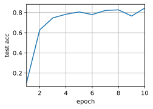
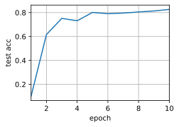

下面我们将使用一个简单网络来演示多GPU训练。
```python
%matplotlib inline
import torch
from torch import nn
from torch.nn import functional as F
from d2l import torch as d2l
```
## **简单网络**
我们使用 :numref:`sec_lenet`中介绍的（稍加修改的）LeNet，从零开始定义它，从而详细说明参数交换和同步。
```python
# 初始化模型参数
scale = 0.01
W1 = torch.randn(size=(20, 1, 3, 3)) * scale
b1 = torch.zeros(20)
W2 = torch.randn(size=(50, 20, 5, 5)) * scale
b2 = torch.zeros(50)
W3 = torch.randn(size=(800, 128)) * scale
b3 = torch.zeros(128)
W4 = torch.randn(size=(128, 10)) * scale
b4 = torch.zeros(10)
params = [W1, b1, W2, b2, W3, b3, W4, b4]
# 定义模型
def lenet(X, params):
    h1_conv = F.conv2d(input=X, weight=params[0], bias=params[1])
    h1_activation = F.relu(h1_conv)
    h1 = F.avg_pool2d(input=h1_activation, kernel_size=(2, 2), stride=(2, 2))
    h2_conv = F.conv2d(input=h1, weight=params[2], bias=params[3])
    h2_activation = F.relu(h2_conv)
    h2 = F.avg_pool2d(input=h2_activation, kernel_size=(2, 2), stride=(2, 2))
    h2 = h2.reshape(h2.shape[0], -1)
    h3_linear = torch.mm(h2, params[4]) + params[5]
    h3 = F.relu(h3_linear)
    y_hat = torch.mm(h3, params[6]) + params[7]
    return y_hat
# 交叉熵损失函数
loss = nn.CrossEntropyLoss(reduction='none')
```
## 数据同步
对于高效的多GPU训练，我们需要两个基本操作。
首先，我们需要**向多个设备分发参数**并附加梯度（`get_params`）。
如果没有参数，就不可能在GPU上评估网络。
第二，需要跨多个设备对参数求和，也就是说，需要一个`allreduce`函数。
```python
def get_params(params, device):
    new_params = [p.to(device) for p in params]
    for p in new_params:
        p.requires_grad_()
    return new_params
```
通过将模型参数复制到一个GPU。
```python
new_params = get_params(params, d2l.try_gpu(0))
print('b1 权重:', new_params[1])
print('b1 梯度:', new_params[1].grad)
```
    b1 权重: tensor([0., 0., 0., 0., 0., 0., 0., 0., 0., 0., 0., 0., 0., 0., 0., 0., 0., 0., 0., 0.],
           device='cuda:0', requires_grad=True)
    b1 梯度: None
由于还没有进行任何计算，因此权重参数的梯度仍然为零。
假设现在有一个向量分布在多个GPU上，下面的**`allreduce`函数将所有向量相加，并将结果广播给所有GPU**。
请注意，我们需要将数据复制到累积结果的设备，才能使函数正常工作。
```python
def allreduce(data):
    for i in range(1, len(data)):
        data[0][:] += data[i].to(data[0].device)
    for i in range(1, len(data)):
        data[i][:] = data[0].to(data[i].device)
```
通过在不同设备上创建具有不同值的向量并聚合它们。
```python
data = [torch.ones((1, 2), device=d2l.try_gpu(i)) * (i + 1) for i in range(2)]
print('allreduce之前：\n', data[0], '\n', data[1])
allreduce(data)
print('allreduce之后：\n', data[0], '\n', data[1])
```
    allreduce之前：
     tensor([[1., 1.]], device='cuda:0') 
     tensor([[2., 2.]], device='cuda:1')
    allreduce之后：
     tensor([[3., 3.]], device='cuda:0') 
     tensor([[3., 3.]], device='cuda:1')
## 数据分发
我们需要一个简单的工具函数，**将一个小批量数据均匀地分布在多个GPU上**。
例如，有两个GPU时，我们希望每个GPU可以复制一半的数据。
因为深度学习框架的内置函数编写代码更方便、更简洁，所以在$4 \times 5$矩阵上使用它进行尝试。
```python
data = torch.arange(20).reshape(4, 5)
devices = [torch.device('cuda:0'), torch.device('cuda:1')]
split = nn.parallel.scatter(data, devices)
print('input :', data)
print('load into', devices)
print('output:', split)
```
    input : tensor([[ 0,  1,  2,  3,  4],
            [ 5,  6,  7,  8,  9],
            [10, 11, 12, 13, 14],
            [15, 16, 17, 18, 19]])
    load into [device(type='cuda', index=0), device(type='cuda', index=1)]
    output: (tensor([[0, 1, 2, 3, 4],
            [5, 6, 7, 8, 9]], device='cuda:0'), tensor([[10, 11, 12, 13, 14],
            [15, 16, 17, 18, 19]], device='cuda:1'))
为了方便以后复用，我们定义了可以同时拆分数据和标签的`split_batch`函数。
```python
#@save
def split_batch(X, y, devices):
    """将X和y拆分到多个设备上"""
    assert X.shape[0] == y.shape[0]
    return (nn.parallel.scatter(X, devices),
            nn.parallel.scatter(y, devices))
```
## 训练
现在我们可以**在一个小批量上实现多GPU训练**。
在多个GPU之间同步数据将使用刚才讨论的辅助函数`allreduce`和`split_and_load`。
我们不需要编写任何特定的代码来实现并行性。
因为计算图在小批量内的设备之间没有任何依赖关系，因此它是“自动地”并行执行。
```python
def train_batch(X, y, device_params, devices, lr):
    X_shards, y_shards = split_batch(X, y, devices)
    # 在每个GPU上分别计算损失
    ls = [loss(lenet(X_shard, device_W), y_shard).sum()
          for X_shard, y_shard, device_W in zip(
              X_shards, y_shards, device_params)]
    for l in ls:  # 反向传播在每个GPU上分别执行
        l.backward()
    # 将每个GPU的所有梯度相加，并将其广播到所有GPU
    with torch.no_grad():
        for i in range(len(device_params[0])):
            allreduce(
                [device_params[c][i].grad for c in range(len(devices))])
    # 在每个GPU上分别更新模型参数
    for param in device_params:
        d2l.sgd(param, lr, X.shape[0]) # 在这里，我们使用全尺寸的小批量
```
现在，我们可以**定义训练函数**。
与前几章中略有不同：训练函数需要分配GPU并将所有模型参数复制到所有设备。
显然，每个小批量都是使用`train_batch`函数来处理多个GPU。
我们只在一个GPU上计算模型的精确度，而让其他GPU保持空闲，尽管这是相对低效的，但是使用方便且代码简洁。
```python
def train(num_gpus, batch_size, lr):
    train_iter, test_iter = d2l.load_data_fashion_mnist(batch_size)
    devices = [d2l.try_gpu(i) for i in range(num_gpus)]
    # 将模型参数复制到num_gpus个GPU
    device_params = [get_params(params, d) for d in devices]
    num_epochs = 10
    animator = d2l.Animator('epoch', 'test acc', xlim=[1, num_epochs])
    timer = d2l.Timer()
    for epoch in range(num_epochs):
        timer.start()
        for X, y in train_iter:
            # 为单个小批量执行多GPU训练
            train_batch(X, y, device_params, devices, lr)
            torch.cuda.synchronize()
        timer.stop()
        # 在GPU0上评估模型
        animator.add(epoch + 1, (d2l.evaluate_accuracy_gpu(
            lambda x: lenet(x, device_params[0]), test_iter, devices[0]),))
    print(f'测试精度：{animator.Y[0][-1]:.2f}，{timer.avg():.1f}秒/轮，'
          f'在{str(devices)}')
```
让我们看看**在单个GPU上运行**效果得有多好。
首先使用的批量大小是$256$，学习率是$0.2$。
```python
train(num_gpus=1, batch_size=256, lr=0.2)
```
    测试精度：0.84，2.7秒/轮，在[device(type='cuda', index=0)]

保持批量大小和学习率不变，并**增加为2个GPU**，我们可以看到测试精度与之前的实验基本相同。
不同的GPU个数在算法寻优方面是相同的。
不幸的是，这里没有任何有意义的加速：模型实在太小了；而且数据集也太小了。在这个数据集中，我们实现的多GPU训练的简单方法受到了巨大的Python开销的影响。
在未来，我们将遇到更复杂的模型和更复杂的并行化方法。
尽管如此，让我们看看Fashion-MNIST数据集上会发生什么。
```python
train(num_gpus=2, batch_size=256, lr=0.2)
```
    测试精度：0.83，3.6秒/轮，在[device(type='cuda', index=0), device(type='cuda', index=1)]

## 小结
* 有多种方法可以在多个GPU上拆分深度网络的训练。拆分可以在层之间、跨层或跨数据上实现。前两者需要对数据传输过程进行严格编排，而最后一种则是最简单的策略。
* 数据并行训练本身是不复杂的，它通过增加有效的小批量数据量的大小提高了训练效率。
* 在数据并行中，数据需要跨多个GPU拆分，其中每个GPU执行自己的前向传播和反向传播，随后所有的梯度被聚合为一，之后聚合结果向所有的GPU广播。
* 小批量数据量更大时，学习率也需要稍微提高一些。
## 练习
1. 在$k$个GPU上进行训练时，将批量大小从$b$更改为$k \cdot b$，即按GPU的数量进行扩展。
1. 比较不同学习率时模型的精确度，随着GPU数量的增加学习率应该如何扩展？
1. 实现一个更高效的`allreduce`函数用于在不同的GPU上聚合不同的参数？为什么这样的效率更高？
1. 实现模型在多GPU下测试精度的计算。
[Discussions](https://discuss.d2l.ai/t/2800)