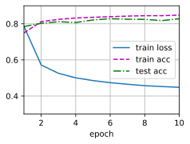

# softmax回归的简洁实现
:label:`sec_softmax_concise`
在 :numref:`sec_linear_concise`中，我们发现(**通过深度学习框架的高级API能够使实现**)
(~~softmax~~)
线性(**回归变得更加容易**)。
同样，通过深度学习框架的高级API也能更方便地实现softmax回归模型。
本节如在 :numref:`sec_softmax_scratch`中一样，继续使用Fashion-MNIST数据集，并保持批量大小为256。
```python
import torch
from torch import nn
from d2l import torch as d2l
```
```python
batch_size = 256
train_iter, test_iter = d2l.load_data_fashion_mnist(batch_size)
```
## 初始化模型参数
如我们在 :numref:`sec_softmax`所述，**softmax回归的输出层是一个全连接层**。
因此，为了实现我们的模型，我们只需在`Sequential`中添加一个带有10个输出的全连接层。
同样，在这里`Sequential`并不是必要的，但它是实现深度模型的基础。
我们仍然以均值0和标准差0.01随机初始化权重。
```python
# PyTorch不会隐式地调整输入的形状。因此，# 我们在线性层前定义了展平层（flatten），来调整网络输入的形状
net = nn.Sequential(nn.Flatten(), nn.Linear(784, 10))
def init_weights(m):
    if type(m) == nn.Linear:
        nn.init.normal_(m.weight, std=0.01)
net.apply(init_weights);
```

```python
loss = nn.CrossEntropyLoss(reduction='none')
```
## 优化算法
在这里，我们(**使用学习率为0.1的小批量随机梯度下降作为优化算法**)。
这与我们在线性回归例子中的相同，这说明了优化器的普适性。
```python
trainer = torch.optim.SGD(net.parameters(), lr=0.1)
```
## 训练
接下来我们**调用** :numref:`sec_softmax_scratch`中(~~之前~~)
(**定义的训练函数来训练模型**)。
```python
num_epochs = 10
d2l.train_ch3(net, train_iter, test_iter, loss, num_epochs, trainer)
```

和以前一样，这个算法使结果收敛到一个相当高的精度，而且这次的代码比之前更精简了。
## 小结
* 使用深度学习框架的高级API，我们可以更简洁地实现softmax回归。
* 从计算的角度来看，实现softmax回归比较复杂。在许多情况下，深度学习框架在这些著名的技巧之外采取了额外的预防措施，来确保数值的稳定性。这使我们避免了在实践中从零开始编写模型时可能遇到的陷阱。
## 练习
1. 尝试调整超参数，例如批量大小、迭代周期数和学习率，并查看结果。
1. 增加迭代周期的数量。为什么测试精度会在一段时间后降低？我们怎么解决这个问题？
[Discussions](https://discuss.d2l.ai/t/1793)