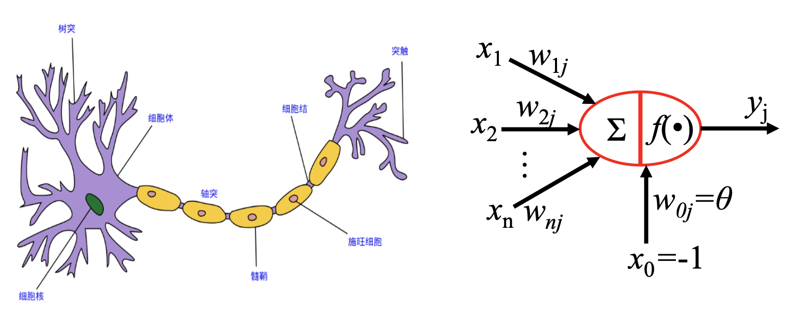

前馈神经网络 
1. 神经元模型
2. 感知器、多层感知器
3. BP算法
4. 前馈神经网络
神经网络是最早作为一种连接主义为主的模型。
# 神经元模型
### 神经元(M-P)
1943 年，美国神经生理学家沃伦·麦卡洛克( Warren McCulloch ) 和数学家沃尔特 ·皮茨(Walter Pitts )对生物神经元进行建模，首次提出了一种形式神经元模型，并命名为McCulloch-Pitts模型，即后 来广为人知的M-P模型。

在M-P模型中，神经元接受其他n个神经元的输入信号(0或1)，这些输入信号经过权重加权并求和，将求和结果与阈值(threshold) *θ* 比较，然后经过激活函数处理，得到神经元的输出。
$$
y=f\left(\sum_{i=1}^{n} \omega_{i j} x_{i}-\theta\right)
$$
M-P 模型可以表示多种逻辑运算，如取反运算、逻辑或、逻辑与。
- 取反运算可以用单输入单输出模型表示，即如果输入为0则输出1，如果输入为1则输出0。由M-P模型的运算规则可得 $w = -2， θ = -1$.
- 逻辑或与逻辑与运算可以用双输入单输出模型表示。以逻辑与运算为例， $w_1=1，w_2=1, θ =1.5$.
### 网络结构
人工神经网络由神经元模型构成，这种由许多神经元组成的信息处理网络具有并行分布结构。

其中圆形节点表示一个神经元，方形节点表示一组神经元。
# 感知器：[10-多层感知机](10-多层感知机.md)
# BP算法
多层感知器的训练使用误差反向传播算法(Error Back Propagation)，即BP算法。BP算法最早有沃博斯于1974年提出，鲁梅尔哈特等人进一步发展了该理论。
### BP算法的基本过程
- 前向传播计算：由输入层经过隐含层向输出层的计算网络输出
- 误差反向逐层传递:网络的期望输出与实际输出之差的误差信号由输出层经过隐含层逐层向输入层传递
- 由“前向传播计算”与“误差反向逐层传递”的反复进行的网络训练 过程
BP算法就是通过比较实际输出和期望输出得到误差信号，把误差信 号从输出层逐层向前传播得到各层的误差信号，再通过调整各层的连接权重以减小误差。权重的调整主要使用梯度下降法：
$$
\Delta w = -\alpha \frac{\partial E}{\partial w}
$$
### 激活函数：[18.激活函数](18.激活函数.md)
### BP算法示例
以包含一个中间层和一个输出单元 $y$ 的多层感知器为例：$w_{1ij}$ 表示输 入层与中间层之间的连接权重，$w_{2j1}$ 表示中间层与输出层之间的连接权重， $i$ 表示输入层单元，$j$ 表示中间层单元。

- 首先调整中间层与输出层之间的连接权重，其中 $y=f(u)$， $f$ 是激活函数，$u_{21} = \sum_{j = 1}^{m}w_{2j1}z_j$，把误差函数 E 对连接权重$w_{2j1}$ 的求导展开成复合函数求导：
$$
\begin{array}{c}\frac{\partial E}{\partial w_{2 j 1}}     =\frac{\partial E}{\partial y} \frac{\partial y}{\partial u_{21}} \frac{\partial u_{21}}{\partial w_{2 j 1}} \\ =-(r-y) y(1-y) z_{j}\end{array}
$$
这里 $z_j$ 表示的是中间层的值。
- 第二，中间层到输出层的连接权重调整值如下所示：
$$
\Delta w_{2 j 1}=\alpha(r-y) y(1-y) z_{j}
$$
- 第三，调整输入层与中间层之间的连接权重
$$
\begin{aligned} \frac{\partial E}{\partial w_{1 i j}} &=\frac{\partial E}{\partial y} \frac{\partial y}{\partial u_{21}} \frac{\partial u_{21}}{\partial w_{1 i j}} \\ &=-(r-y) y(1-y) \frac{\partial u_{21}}{\partial w_{1 i j}} \end{aligned}
$$
**中间层到输出层**

**输入层到中间层**

# 优化问题
**难点**
- 参数过多，影响训练
- 非凸优化问题：即存在局部最优而非全局最优解，影响迭代
- 梯度消失问题，下层参数比较难调
- 参数解释起来比较困难
**需求**
- 计算资源要大
- 数据要多
- 算法效率要好：即收敛快
**非凸优化问题**
**梯度消失问题**

