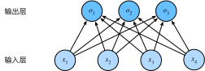

[image-classification-dataset](../../代码/linear-networks/image-classification-dataset.md)
[softmax-regression-concise](../../代码/linear-networks/softmax-regression-concise.md)
[softmax-regression-scratch](../../代码/linear-networks/softmax-regression-scratch.md)
## 1.1 从回归到多类分类：
- 回归估计一个连续值
- 分类预测一个离散类别
### 回归：
通常，机器学习实践者用*分类*这个词来描述两个有微妙差别的问题：
1. 我们只对样本的“硬性”类别感兴趣，即属于哪个类别；
2. 我们希望得到“软性”类别，即得到属于每个类别的概率。这两者的界限往往很模糊。其中的一个原因是：即使我们只关心硬类别，我们仍然使用软类别的模型。
## 对数似然
softmax函数给出了一个向量$\hat{\mathbf{y}}$，我们可以将其视为“对给定任意输入$\mathbf{x}$的每个类的条件概率”。例如，$\hat{y}_1$=$P(y=\text{猫} \mid \mathbf{x})$。假设整个数据集$\{\mathbf{X}, \mathbf{Y}\}$具有$n$个样本，其中索引$i$的样本由特征向量$\mathbf{x}^{(i)}$和独热标签向量$\mathbf{y}^{(i)}$组成。我们可以将估计值与实际值进行比较：
$$
P(\mathbf{Y} \mid \mathbf{X}) = \prod_{i=1}^n P(\mathbf{y}^{(i)} \mid \mathbf{x}^{(i)}).
$$
根据最大似然估计，我们最大化$P(\mathbf{Y} \mid \mathbf{X})$，相当于最小化负对数似然：
$$
-\log P(\mathbf{Y} \mid \mathbf{X}) = \sum_{i=1}^n -\log P(\mathbf{y}^{(i)} \mid \mathbf{x}^{(i)})
= \sum_{i=1}^n l(\mathbf{y}^{(i)}, \hat{\mathbf{y}}^{(i)}),
$$
其中，对于任何标签$\mathbf{y}$和模型预测$\hat{\mathbf{y}}$，损失函数为：
$$ l(\mathbf{y}, \hat{\mathbf{y}}) = - \sum_{j=1}^q y_j \log \hat{y}_j. $$
:eqlabel:`eq_l_cross_entropy`
在本节稍后的内容会讲到， :eqref:`eq_l_cross_entropy`中的损失函数
通常被称为*交叉熵损失*（cross-entropy loss）。由于$\mathbf{y}$是一个长度为$q$的独热编码向量，所以除了一个项以外的所有项$j$都消失了。由于所有$\hat{y}_j$都是预测的概率，所以它们的对数永远不会大于$0$。因此，如果正确地预测实际标签，即如果实际标签$P(\mathbf{y} \mid \mathbf{x})=1$，则损失函数不能进一步最小化。注意，这往往是不可能的。例如，数据集中可能存在标签噪声（比如某些样本可能被误标），或输入特征没有足够的信息来完美地对每一个样本分类。
## softmax及其导数
:label:`subsec_softmax_and_derivatives`
由于softmax和相关的损失函数很常见，因此我们需要更好地理解它的计算方式。将 :eqref:`eq_softmax_y_and_o`代入损失 :eqref:`eq_l_cross_entropy`中。利用softmax的定义，我们得到：
$$
\begin{aligned}
l(\mathbf{y}, \hat{\mathbf{y}}) &=  - \sum_{j=1}^q y_j \log \frac{\exp(o_j)}{\sum_{k=1}^q \exp(o_k)} \\
&= \sum_{j=1}^q y_j \log \sum_{k=1}^q \exp(o_k) - \sum_{j=1}^q y_j o_j\\
&= \log \sum_{k=1}^q \exp(o_k) - \sum_{j=1}^q y_j o_j.
\end{aligned}
$$
考虑相对于任何未规范化的预测$o_j$的导数，我们得到：
$$
\partial_{o_j} l(\mathbf{y}, \hat{\mathbf{y}}) = \frac{\exp(o_j)}{\sum_{k=1}^q \exp(o_k)} - y_j = \mathrm{softmax}(\mathbf{o})_j - y_j.
$$
换句话说，导数是我们softmax模型分配的概率与实际发生的情况（由独热标签向量表示）之间的差异。从这个意义上讲，这与我们在回归中看到的非常相似，其中梯度是观测值$y$和估计值$\hat{y}$之间的差异。这不是巧合，在任何指数族分布模型中（参见[本书附录中关于数学分布的一节](https://d2l.ai/chapter_appendix-mathematics-for-deep-learning/distributions.html)），对数似然的梯度正是由此得出的。这使梯度计算在实践中变得容易很多。
## 全连接层的参数开销
:label:`subsec_parameterization-cost-fc-layers`
正如我们将在后续章节中看到的，在深度学习中，全连接层无处不在。然而，顾名思义，全连接层是“完全”连接的，可能有很多可学习的参数。具体来说，对于任何具有$d$个输入和$q$个输出的全连接层，参数开销为$\mathcal{O}(dq)$，这个数字在实践中可能高得令人望而却步。幸运的是，将$d$个输入转换为$q$个输出的成本可以减少到$\mathcal{O}(\frac{dq}{n})$，其中超参数$n$可以由我们灵活指定，以在实际应用中平衡参数节约和模型有效性
 :cite:`Zhang.Tay.Zhang.ea.2021`。
## 分类问题
:label:`subsec_classification-problem`
我们从一个图像分类问题开始。假设每次输入是一个$2\times2$的灰度图像。我们可以用一个标量表示每个像素值，每个图像对应四个特征$x_1, x_2, x_3, x_4$。此外，假设每个图像属于类别“猫”“鸡”和“狗”中的一个。接下来，我们要选择如何表示标签。我们有两个明显的选择：最直接的想法是选择$y \in \{1, 2, 3\}$，其中整数分别代表$\{\text{狗}, \text{猫}, \text{鸡}\}$。这是在计算机上存储此类信息的有效方法。如果类别间有一些自然顺序，比如说我们试图预测$\{\text{婴儿}, \text{儿童}, \text{青少年}, \text{青年人}, \text{中年人}, \text{老年人}\}$，那么将这个问题转变为回归问题，并且保留这种格式是有意义的。但是一般的分类问题并不与类别之间的自然顺序有关。幸运的是，统计学家很早以前就发明了一种表示分类数据的简单方法：*独热编码*（one-hot encoding）。独热编码是一个向量，它的分量和类别一样多。类别对应的分量设置为1，其他所有分量设置为0。在我们的例子中，标签$y$将是一个三维向量，其中$(1, 0, 0)$对应于“猫”、$(0, 1, 0)$对应于“鸡”、$(0, 0, 1)$对应于“狗”：
$$y \in \{(1, 0, 0), (0, 1, 0), (0, 0, 1)\}.$$
## 网络架构
为了估计所有可能类别的条件概率，我们需要一个有多个输出的模型，每个类别对应一个输出。为了解决线性模型的分类问题，我们需要和输出一样多的*仿射函数*（affine function）。每个输出对应于它自己的仿射函数。在我们的例子中，由于我们有4个特征和3个可能的输出类别，我们将需要12个标量来表示权重（带下标的$w$），3个标量来表示偏置（带下标的$b$）。下面我们为每个输入计算三个*未规范化的预测*（logit）：$o_1$、$o_2$和$o_3$。$$
\begin{aligned}
o_1 &= x_1 w_{11} + x_2 w_{12} + x_3 w_{13} + x_4 w_{14} + b_1,\\
o_2 &= x_1 w_{21} + x_2 w_{22} + x_3 w_{23} + x_4 w_{24} + b_2,\\
o_3 &= x_1 w_{31} + x_2 w_{32} + x_3 w_{33} + x_4 w_{34} + b_3.
\end{aligned}
$$
我们可以用神经网络图 :numref:`fig_softmaxreg`来描述这个计算过程。与线性回归一样，softmax回归也是一个单层神经网络。由于计算每个输出$o_1$、$o_2$和$o_3$取决于所有输入$x_1$、$x_2$、$x_3$和$x_4$，所以softmax回归的输出层也是全连接层。

:label:`fig_softmaxreg`
为了更简洁地表达模型，我们仍然使用线性代数符号。通过向量形式表达为$\mathbf{o} = \mathbf{W} \mathbf{x} + \mathbf{b}$，这是一种更适合数学和编写代码的形式。由此，我们已经将所有权重放到一个$3 \times 4$矩阵中。对于给定数据样本的特征$\mathbf{x}$，我们的输出是由权重与输入特征进行矩阵-向量乘法再加上偏置$\mathbf{b}$得到的。
##### 均方损失：
- 对类别进行一位有效编码
$$y=[y_{1},y_{2},...,y_{n}]^{T}\quad其中\quad y_{i}=\begin{cases}1&i=y\\0&otherwise\end{cases}$$
- 使用均方损失训练、最大值为预测：$\hat{y}=\underset {i}{argmax}\quad o^{i}$
#### 1.2 Softmax和交叉熵损失
softmax函数能够将未规范化的预测变换为非负数并且总和为1，同时让模型保持可导的性质。$$\hat{y}=softmax(o)\quad其中\quad \hat{y_i}=\frac{exp(o_i)}{\sum_{k} exp(o_k)}$$
这里，对于所有的j总有0 ≤ yˆj ≤ 1。因此，yˆ可以视为一个正确的概率分布。softmax运算不会改变未规范化的预测o之间的大小次序，只会确定分配给每个类别的概率。因此，在预测过程中，我们仍然可以用下式来选择最有可能的类别。$$\underset {i}{argmax}\quad \hat y_{i}=\underset {i}{argmax}\quad o_{i}$$
尽管softmax是一个非线性函数，但softmax回归的输出仍然由输入特征的仿射变换决定。因此，softmax回 归是一个线性模型（linear model）。**对数似然损失**
- 交叉熵用来衡量两个概率的区别$$H(p,q)=-\sum_{i} p_{i}log(q_i)$$
- 将它作为损失
$$\begin{array}{l}
l(y,\hat{y})=-\sum_{i}y_{i}log\hat{y_{i}}\\
=-\sum_{i}y_{i}\frac{exp(o_i)}{\sum_{k} exp(o_k)}\\
=\sum_{i}y_{i}\sum_{k} exp(o_k)-\sum_{j} y_jo_j\\

\end{array}$$
- 其梯度是真实概率和预测概率的区别,对$o_j$求导得：
$$\partial_{o_{i}}l(y,\hat{y})=\frac{exp(o_i)}{\sum_{k} exp(o_k)}-y_j=softmax(o)_{i}-y_{i}$$
> Softmax回归是一个多类分类模型
> 使用Softmax操作子得到每个类的预测置信度
> 使用交叉熵来衡量和预测标号的区别
## 小批量样本的矢量化
:label:`subsec_softmax_vectorization`
为了提高计算效率并且充分利用GPU，我们通常会对小批量样本的数据执行矢量计算。假设我们读取了一个批量的样本$\mathbf{X}$，其中特征维度（输入数量）为$d$，批量大小为$n$。此外，假设我们在输出中有$q$个类别。那么小批量样本的特征为$\mathbf{X} \in \mathbb{R}^{n \times d}$，权重为$\mathbf{W} \in \mathbb{R}^{d \times q}$，偏置为$\mathbf{b} \in \mathbb{R}^{1\times q}$。softmax回归的矢量计算表达式为：
$$ \begin{aligned} \mathbf{O} &= \mathbf{X} \mathbf{W} + \mathbf{b}, \\ \hat{\mathbf{Y}} & = \mathrm{softmax}(\mathbf{O}). \end{aligned} $$
:eqlabel:`eq_minibatch_softmax_reg`
相对于一次处理一个样本，小批量样本的矢量化加快了$\mathbf{X}和\mathbf{W}$的矩阵-向量乘法。由于$\mathbf{X}$中的每一行代表一个数据样本，那么softmax运算可以*按行*（rowwise）执行：
对于$\mathbf{O}$的每一行，我们先对所有项进行幂运算，然后通过求和对它们进行标准化。在 :eqref:`eq_minibatch_softmax_reg`中，$\mathbf{X} \mathbf{W} + \mathbf{b}$的求和会使用广播机制，小批量的未规范化预测$\mathbf{O}$和输出概率$\hat{\mathbf{Y}}$
都是形状为$n \times q$的矩阵。
## 重新审视Softmax的实现
:label:`subsec_softmax-implementation-revisited`
在前面 :numref:`sec_softmax_scratch`的例子中，我们计算了模型的输出，然后将此输出送入交叉熵损失。从数学上讲，这是一件完全合理的事情。然而，从计算角度来看，指数可能会造成数值稳定性问题。回想一下，softmax函数$\hat y_j = \frac{\exp(o_j)}{\sum_k \exp(o_k)}$，其中$\hat y_j$是预测的概率分布。$o_j$是未规范化的预测$\mathbf{o}$的第$j$个元素。如果$o_k$中的一些数值非常大，那么$\exp(o_k)$可能大于数据类型容许的最大数字，即*上溢*（overflow）。这将使分母或分子变为`inf`（无穷大），最后得到的是0、`inf`或`nan`（不是数字）的$\hat y_j$。在这些情况下，我们无法得到一个明确定义的交叉熵值。解决这个问题的一个技巧是：
在继续softmax计算之前，先从所有$o_k$中减去$\max(o_k)$。这里可以看到每个$o_k$按常数进行的移动不会改变softmax的返回值：
$$
\begin{aligned}
\hat y_j & =  \frac{\exp(o_j - \max(o_k))\exp(\max(o_k))}{\sum_k \exp(o_k - \max(o_k))\exp(\max(o_k))} \\
& = \frac{\exp(o_j - \max(o_k))}{\sum_k \exp(o_k - \max(o_k))}.
\end{aligned}
$$
在减法和规范化步骤之后，可能有些$o_j - \max(o_k)$具有较大的负值。由于精度受限，$\exp(o_j - \max(o_k))$将有接近零的值，即*下溢*（underflow）。这些值可能会四舍五入为零，使$\hat y_j$为零，并且使得$\log(\hat y_j)$的值为`-inf`。反向传播几步后，我们可能会发现自己面对一屏幕可怕的`nan`结果。尽管我们要计算指数函数，但我们最终在计算交叉熵损失时会取它们的对数。通过将softmax和交叉熵结合在一起，可以避免反向传播过程中可能会困扰我们的数值稳定性问题。如下面的等式所示，我们避免计算$\exp(o_j - \max(o_k))$，而可以直接使用$o_j - \max(o_k)$，因为$\log(\exp(\cdot))$被抵消了。$$
\begin{aligned}
\log{(\hat y_j)} & = \log\left( \frac{\exp(o_j - \max(o_k))}{\sum_k \exp(o_k - \max(o_k))}\right) \\
& = \log{(\exp(o_j - \max(o_k)))}-\log{\left( \sum_k \exp(o_k - \max(o_k)) \right)} \\
& = o_j - \max(o_k) -\log{\left( \sum_k \exp(o_k - \max(o_k)) \right)}.
\end{aligned}
$$
我们也希望保留传统的softmax函数，以备我们需要评估通过模型输出的概率。但是，我们没有将softmax概率传递到损失函数中，而是**在交叉熵损失函数中传递未规范化的预测，并同时计算softmax及其对数**，这是一种类似["LogSumExp技巧"](https://en.wikipedia.org/wiki/LogSumExp)的聪明方式。
```
### 6.softmax回归Q&A
**Q1:softlabel训练策略以及为什么有效？**
> softmax用指数很难逼近1，softlabel将正例和负例分别标记为0.9和0.1使结果逼近变得可能，这是一个常用的小技巧。
##### Q2:softmax回归和logistic回归？
> logistic回归为二分类问题，是softmax回归的特例
##### Q3:为什么使用交叉熵，而不用相对熵，互信息熵等其他基于信息量的度量？
> 实际上使用哪一种熵的效果区别不大，所以哪种简单就用哪种
##### Q4:$y*log\hat{y}$ 为什么我们只关心正确类，而不关心不正确的类呢？
> 并不是不关心，而是不正确的的类标号为零，所以算式中不体现，如果使用softlabel策略，就会体现出不正确的类。
##### Q5:似然函数曲线是怎么得出来的？有什么参考意义？
> 最小化损失函数也意味着最大化似然函数，似然函数表示统计概率和模型的拟合程度。
##### Q6:在多次迭代之后欧如果测试精度出现上升后再下降是过拟合了吗？可以提前终止吗？
> 很有可能是过拟合，可以继续训练来观察是否持续下降
##### Q7:cnn网络主要学习到的是纹理还是轮廓还是所有内容的综合？
> 目前认为主要学习到的是纹理信息
##### Q8:softmax可解释吗？
> 单纯softmax是可解释的，可以在统计书籍中找到相关的解释。