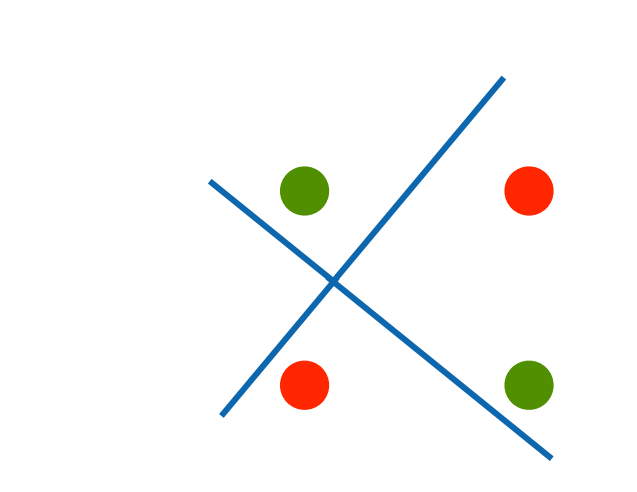

[mlp-concise](../../代码/multilayer-perceptrons/mlp-concise.md)
[mlp-scratch](../../代码/multilayer-perceptrons/mlp-scratch.md)

# 多层感知机
:label:`sec_mlp`
## 隐藏层
我们在 :numref:`subsec_linear_model`中描述了仿射变换，它是一种带有偏置项的线性变换。首先，回想一下如 :numref:`fig_softmaxreg`中所示的softmax回归的模型架构。
该模型通过单个仿射变换将我们的输入直接映射到输出，然后进行softmax操作。
如果我们的标签通过仿射变换后确实与我们的输入数据相关，那么这种方法确实足够了。但是，仿射变换中的*线性*是一个很强的假设。
### 线性模型可能会出错
线性模型无法解决非线性问题，比如XOR问题。

但是可以通过多个线性模型来解决，这就是多层感知机的原理：

### 在网络中加入隐藏层
我们可以通过在网络中加入一个或多个隐藏层来克服线性模型的限制，使其能处理更普遍的函数关系类型。要做到这一点，最简单的方法是将许多全连接层堆叠在一起。
每一层都输出到上面的层，直到生成最后的输出。我们可以把前$L-1$层看作表示，把最后一层看作线性预测器。这种架构通常称为*多层感知机*（multilayer perceptron），通常缩写为*MLP*。下面，我们以图的方式描述了多层感知机（ :numref:`fig_mlp`）。

:label:`fig_mlp`
这个多层感知机有4个输入，3个输出，其隐藏层包含5个隐藏单元。输入层不涉及任何计算，因此使用此网络产生输出只需要实现隐藏层和输出层的计算。因此，这个多层感知机中的层数为2。注意，这两个层都是全连接的。每个输入都会影响隐藏层中的每个神经元，而隐藏层中的每个神经元又会影响输出层中的每个神经元。然而，正如 :numref:`subsec_parameterization-cost-fc-layers`所说，具有全连接层的多层感知机的参数开销可能会高得令人望而却步。即使在不改变输入或输出大小的情况下，可能在参数节约和模型有效性之间进行权衡 :cite:`Zhang.Tay.Zhang.ea.2021`。
### 从线性到非线性
同之前的章节一样，我们通过矩阵$\mathbf{X} \in \mathbb{R}^{n \times d}$来表示$n$个样本的小批量，其中每个样本具有$d$个输入特征。对于具有$h$个隐藏单元的单隐藏层多层感知机，用$\mathbf{H} \in \mathbb{R}^{n \times h}$表示隐藏层的输出，称为*隐藏表示*（hidden representations）。在数学或代码中，$\mathbf{H}$也被称为*隐藏层变量*（hidden-layer variable）或*隐藏变量*（hidden variable）。因为隐藏层和输出层都是全连接的，所以我们有隐藏层权重$\mathbf{W}^{(1)} \in \mathbb{R}^{d \times h}$和隐藏层偏置$\mathbf{b}^{(1)} \in \mathbb{R}^{1 \times h}$以及输出层权重$\mathbf{W}^{(2)} \in \mathbb{R}^{h \times q}$和输出层偏置$\mathbf{b}^{(2)} \in \mathbb{R}^{1 \times q}$。形式上，我们按如下方式计算单隐藏层多层感知机的输出$\mathbf{O} \in \mathbb{R}^{n \times q}$：
$$
\begin{aligned}
    \mathbf{H} & = \mathbf{X} \mathbf{W}^{(1)} + \mathbf{b}^{(1)}, \\
    \mathbf{O} & = \mathbf{H}\mathbf{W}^{(2)} + \mathbf{b}^{(2)}.
\end{aligned}
$$
注意在添加隐藏层之后，模型现在需要跟踪和更新额外的参数。可我们能从中得到什么好处呢？在上面定义的模型里，我们没有好处！原因很简单：上面的隐藏单元由输入的仿射函数给出，而输出（softmax操作前）只是隐藏单元的仿射函数。仿射函数的仿射函数本身就是仿射函数，但是我们之前的线性模型已经能够表示任何仿射函数。我们可以证明这一等价性，即对于任意权重值，我们只需合并隐藏层，便可产生具有参数
$\mathbf{W} = \mathbf{W}^{(1)}\mathbf{W}^{(2)}$
和$\mathbf{b} = \mathbf{b}^{(1)} \mathbf{W}^{(2)} + \mathbf{b}^{(2)}$
的等价单层模型：
$$
\mathbf{O} = (\mathbf{X} \mathbf{W}^{(1)} + \mathbf{b}^{(1)})\mathbf{W}^{(2)} + \mathbf{b}^{(2)} = \mathbf{X} \mathbf{W}^{(1)}\mathbf{W}^{(2)} + \mathbf{b}^{(1)} \mathbf{W}^{(2)} + \mathbf{b}^{(2)} = \mathbf{X} \mathbf{W} + \mathbf{b}.
$$
为了发挥多层架构的潜力，我们还需要一个额外的关键要素：
在仿射变换之后对每个隐藏单元应用非线性的*激活函数*（activation function）$\sigma$。
激活函数的输出（例如，$\sigma(\cdot)$）被称为*活性值*（activations）。
一般来说，有了激活函数，就不可能再将我们的多层感知机退化成线性模型：
$$
\begin{aligned}
    \mathbf{H} & = \sigma(\mathbf{X} \mathbf{W}^{(1)} + \mathbf{b}^{(1)}), \\
    \mathbf{O} & = \mathbf{H}\mathbf{W}^{(2)} + \mathbf{b}^{(2)}.\\
\end{aligned}
$$
由于$\mathbf{X}$中的每一行对应于小批量中的一个样本，出于记号习惯的考量，我们定义非线性函数$\sigma$也以按行的方式作用于其输入，即一次计算一个样本。
我们在 :numref:`subsec_softmax_vectorization`中
以相同的方式使用了softmax符号来表示按行操作。
但是本节应用于隐藏层的激活函数通常不仅按行操作，也按元素操作。
这意味着在计算每一层的线性部分之后，我们可以计算每个活性值，而不需要查看其他隐藏单元所取的值。对于大多数激活函数都是这样。
为了构建更通用的多层感知机，我们可以继续堆叠这样的隐藏层，例如$\mathbf{H}^{(1)} = \sigma_1(\mathbf{X} \mathbf{W}^{(1)} + \mathbf{b}^{(1)})$和$\mathbf{H}^{(2)} = \sigma_2(\mathbf{H}^{(1)} \mathbf{W}^{(2)} + \mathbf{b}^{(2)})$，一层叠一层，从而产生更有表达能力的模型。
### 总结
-   多层感知机使用隐藏层和激活函数来得到非线性模型
-   常用激活函数：Sigmoid，Tanh，ReLU
-   使用softmax进行多分类
-   隐藏层数、大小为超参数
