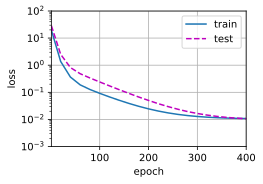
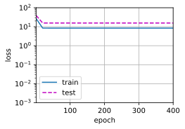
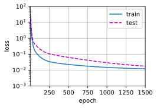

## 模型选择+过拟合和欠拟合

### 1. 模型选择
本小节主要介绍了评估模型的一些指标和方法
#### 1.1 实例分析：预测谁会偿还贷款
- 银行雇你来调查谁会偿还贷款，你得到了100个申请人的信息，其中五个人在3年内违约了。然后你惊讶的发现，**所有的五个人在面试时都穿了蓝色衬衫**。显然，你的模型也发现了这个强信号，这会有什么问题？
**答案是，你的模型很有可能会认为所有来面试的人都会穿蓝色衬衫，而这当然是不对的。**
#### 1.2 训练误差和泛化误差
训练误差（training error）是指，模型在训 练数据集上计算得到的误差。泛化误差（generalization error）是指，模型应用在同样从原始样本的分布中 抽取的无限多数据样本时，模型误差的期望。
- 例子：根据模考成绩来预测未来考试分数
  - 在过去的考试中表现很好（**训练误差**）不代表未来会好（**泛化误差**）
  - 学生A通过背书在模考中拿到很好成绩
  - 学生B知道答案后面的原因
- **其中，泛化误差是我们所最关心的**
#### 1.3 验证数据集和测试数据集
- 验证数据集：一个用来评估模型好坏的数据集
  - 例如拿出50%的训练数据
  - 不要跟训练数据混在一起（常犯错误）
- 测试数据集：只用一次的数据集。例如：
  - 未来的考试
  - 我出价的房子的实际成交价
  - 用在kaggle私有排行榜中的数据集
- **二者最大的区别就是，验证数据集可以那来用很多次，相当于平时的模拟考，而测试数据集则只能用一次来评估模型的性能，相当于最终的考试。**
#### 1.4 K-则交叉验证
- 在没有足够多数据时使用（这是常态）
- 算法：
  - 将训练数据分割k块
  - For i = 1，……，k
    - 使用第i块作为验证数据集，其余的作为训练数据集
  - 报告k个验证集误差的平均
- 常用：k = 5或10
- K-则交叉验证的目的是在没有足够多数据使用时评估模型和超参数的性能，也就是说，**K次训练和验证使用的是相同的超参数和模型**
#### 1.5 总结
- 训练数据集：训练模型参数
- 验证数据集：选择模型超参数
- 非大数据集上通常使用k-则交叉验证
### 2. 过拟合和欠拟合
#### 2.1 什么是过拟合和欠拟合？
| 模型容量\数据 | 简单   |  复杂  |
| ------------- | ------ | :----: |
| 低            | 正常   | 欠拟合 |
| 高            | 过拟合 |  正常  |
- tips：模型容量即模型的复杂度，也代表了模型拟合各种函数的能力
### 3. 多项式回归
我们现在可以(**通过多项式拟合来探索这些概念**)。
```python
import math
import numpy as np
import torch
from torch import nn
from d2l import torch as d2l
```
### 生成数据集
给定$x$，我们将**使用以下三阶多项式来生成训练和测试数据的标签：**
(**$$y = 5 + 1.2x - 3.4\frac{x^2}{2!} + 5.6 \frac{x^3}{3!} + \epsilon \text{ where }
\epsilon \sim \mathcal{N}(0, 0.1^2).$$**)
噪声项$\epsilon$服从均值为0且标准差为0.1的正态分布。在优化的过程中，我们通常希望避免非常大的梯度值或损失值。
这就是我们将特征从$x^i$调整为$\frac{x^i}{i!}$的原因，这样可以避免很大的$i$带来的特别大的指数值。我们将为训练集和测试集各生成100个样本。
```python
max_degree = 20  # 多项式的最大阶数
n_train, n_test = 100, 100  # 训练和测试数据集大小
true_w = np.zeros(max_degree)  # 分配大量的空间
true_w[0:4] = np.array([5, 1.2, -3.4, 5.6])
features = np.random.normal(size=(n_train + n_test, 1))
np.random.shuffle(features)
poly_features = np.power(features, np.arange(max_degree).reshape(1, -1))
for i in range(max_degree):
    poly_features[:, i] /= math.gamma(i + 1)  # gamma(n)=(n-1)!
# labels的维度:(n_train+n_test,)
labels = np.dot(poly_features, true_w)
labels += np.random.normal(scale=0.1, size=labels.shape)
```
同样，存储在`poly_features`中的单项式由gamma函数重新缩放，其中$\Gamma(n)=(n-1)!$。
从生成的数据集中**查看一下前2个样本**，第一个值是与偏置相对应的常量特征。
```python
# NumPy ndarray转换为tensor
true_w, features, poly_features, labels = [torch.tensor(x, dtype=
    torch.float32) for x in [true_w, features, poly_features, labels]]
```
```python
features[:2], poly_features[:2, :], labels[:2]
```
    (tensor([[ 1.6580],
             [-1.6392]]),
     tensor([[ 1.0000e+00,  1.6580e+00,  1.3745e+00,  7.5967e-01,  3.1489e-01,
               1.0442e-01,  2.8855e-02,  6.8346e-03,  1.4165e-03,  2.6096e-04,
               4.3267e-05,  6.5217e-06,  9.0110e-07,  1.1493e-07,  1.3611e-08,
               1.5045e-09,  1.5590e-10,  1.5206e-11,  1.4006e-12,  1.2223e-13],
             [ 1.0000e+00, -1.6392e+00,  1.3435e+00, -7.3408e-01,  3.0082e-01,
              -9.8622e-02,  2.6944e-02, -6.3094e-03,  1.2928e-03, -2.3546e-04,
               3.8597e-05, -5.7516e-06,  7.8567e-07, -9.9066e-08,  1.1599e-08,
              -1.2676e-09,  1.2986e-10, -1.2522e-11,  1.1403e-12, -9.8378e-14]]),
     tensor([ 6.6262, -5.4505]))
### 对模型进行训练和测试
首先让我们**实现一个函数来评估模型在给定数据集上的损失**。
```python
def evaluate_loss(net, data_iter, loss):  #@save
    """评估给定数据集上模型的损失"""
    metric = d2l.Accumulator(2)  # 损失的总和,样本数量
    for X, y in data_iter:
        out = net(X)
        y = y.reshape(out.shape)
        l = loss(out, y)
        metric.add(l.sum(), l.numel())
    return metric[0] / metric[1]
```
现在**定义训练函数**。
```python
def train(train_features, test_features, train_labels, test_labels,
          num_epochs=400):
    loss = nn.MSELoss(reduction='none')
    input_shape = train_features.shape[-1]
    # 不设置偏置，因为我们已经在多项式中实现了它
    net = nn.Sequential(nn.Linear(input_shape, 1, bias=False))
    batch_size = min(10, train_labels.shape[0])
    train_iter = d2l.load_array((train_features, train_labels.reshape(-1,1)),
                                batch_size)
    test_iter = d2l.load_array((test_features, test_labels.reshape(-1,1)),
                               batch_size, is_train=False)
    trainer = torch.optim.SGD(net.parameters(), lr=0.01)
    animator = d2l.Animator(xlabel='epoch', ylabel='loss', yscale='log',
                            xlim=[1, num_epochs], ylim=[1e-3, 1e2],
                            legend=['train', 'test'])
    for epoch in range(num_epochs):
        d2l.train_epoch_ch3(net, train_iter, loss, trainer)
        if epoch == 0 or (epoch + 1) % 20 == 0:
            animator.add(epoch + 1, (evaluate_loss(net, train_iter, loss),
                                     evaluate_loss(net, test_iter, loss)))
    print('weight:', net[0].weight.data.numpy())
```
### **三阶多项式函数拟合(正常)**
我们将首先使用三阶多项式函数，它与数据生成函数的阶数相同。
结果表明，该模型能有效降低训练损失和测试损失。
学习到的模型参数也接近真实值$w = [5, 1.2, -3.4, 5.6]$。
```python
# 从多项式特征中选择前4个维度，即1,x,x^2/2!,x^3/3!
train(poly_features[:n_train, :4], poly_features[n_train:, :4],
      labels[:n_train], labels[n_train:])
```
    weight: [[ 5.010476   1.2354498 -3.4229028  5.503297 ]]

### **线性函数拟合(欠拟合)**
让我们再看看线性函数拟合，减少该模型的训练损失相对困难。
在最后一个迭代周期完成后，训练损失仍然很高。
当用来拟合非线性模式（如这里的三阶多项式函数）时，线性模型容易欠拟合。
```python
# 从多项式特征中选择前2个维度，即1和x
train(poly_features[:n_train, :2], poly_features[n_train:, :2],
      labels[:n_train], labels[n_train:])
```
    weight: [[3.4049764 3.9939284]]

### **高阶多项式函数拟合(过拟合)**
现在，让我们尝试使用一个阶数过高的多项式来训练模型。
在这种情况下，没有足够的数据用于学到高阶系数应该具有接近于零的值。
因此，这个过于复杂的模型会轻易受到训练数据中噪声的影响。
虽然训练损失可以有效地降低，但测试损失仍然很高。
结果表明，复杂模型对数据造成了过拟合。
```python
# 从多项式特征中选取所有维度
train(poly_features[:n_train, :], poly_features[n_train:, :],
      labels[:n_train], labels[n_train:], num_epochs=1500)
```
    weight: [[ 4.9849787   1.2896876  -3.2996354   5.145749   -0.34205326  1.2237961
       0.20393135  0.3027379  -0.20079008 -0.16337848  0.11026663  0.21135856
      -0.00940325  0.11873583 -0.15114897 -0.05347819  0.17096086  0.1863975
      -0.09107699 -0.02123026]]

在接下来的章节中，我们将继续讨论过拟合问题和处理这些问题的方法，例如权重衰减和dropout。
## 小结
* 欠拟合是指模型无法继续减少训练误差。过拟合是指训练误差远小于验证误差。
* 由于不能基于训练误差来估计泛化误差，因此简单地最小化训练误差并不一定意味着泛化误差的减小。机器学习模型需要注意防止过拟合，即防止泛化误差过大。
* 验证集可以用于模型选择，但不能过于随意地使用它。
* 我们应该选择一个复杂度适当的模型，避免使用数量不足的训练样本。
## 练习
1. 这个多项式回归问题可以准确地解出吗？提示：使用线性代数。
1. 考虑多项式的模型选择。
    1. 绘制训练损失与模型复杂度（多项式的阶数）的关系图。观察到了什么？需要多少阶的多项式才能将训练损失减少到0?
    1. 在这种情况下绘制测试的损失图。
    1. 生成同样的图，作为数据量的函数。
1. 如果不对多项式特征$x^i$进行标准化($1/i!$)，会发生什么事情？能用其他方法解决这个问题吗？
1. 泛化误差可能为零吗？
[Discussions](https://discuss.d2l.ai/t/1806)