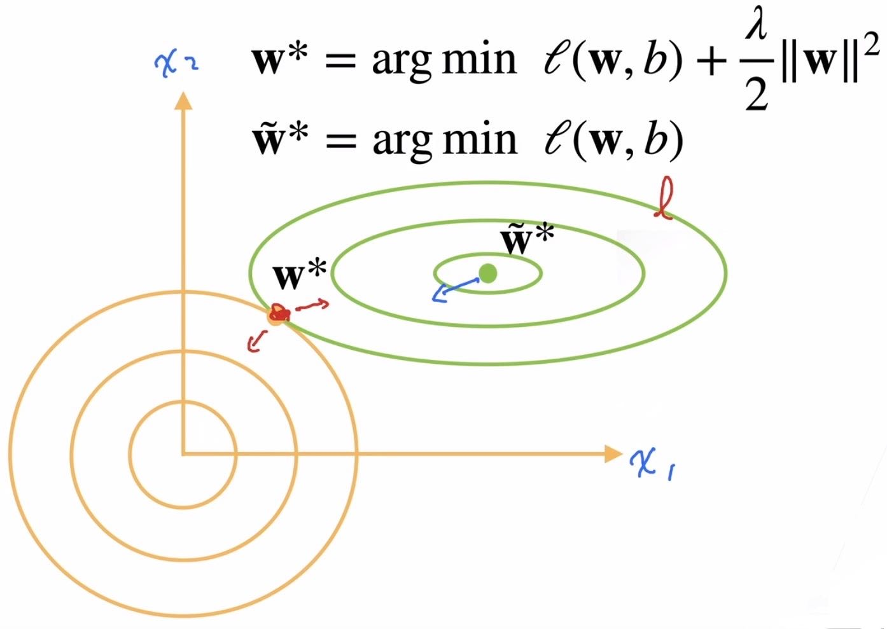

## 12 权重衰退 [weight-decay](../../代码/multilayer-perceptrons/weight-decay.md)

本节我们将介绍一些正则化模型的技术。我们总是可以通过去收集更多的训练数据来缓解过拟合。但这可能成本很高，耗时颇多，或者完全超出我们的控制，因而在短期内不可能做到。假设我们已经拥有尽可能多的高质量数据，我们便可以将重点放在正则化技术上。回想一下，在多项式回归的例子（ :numref:`sec_model_selection`）中，我们可以通过调整拟合多项式的阶数来限制模型的容量。实际上，限制特征的数量是缓解过拟合的一种常用技术。然而，简单地丢弃特征对这项工作来说可能过于生硬。我们继续思考多项式回归的例子，考虑高维输入可能发生的情况。多项式对多变量数据的自然扩展称为*单项式*（monomials），也可以说是变量幂的乘积。单项式的阶数是幂的和。例如，$x_1^2 x_2$和$x_3 x_5^2$都是3次单项式。注意，随着阶数$d$的增长，带有阶数$d$的项数迅速增加。 给定$k$个变量，阶数为$d$的项的个数为${k - 1 + d} \choose {k - 1}$，即$C^{k-1}_{k-1+d} = \frac{(k-1+d)!}{(d)!(k-1)!}$。因此即使是阶数上的微小变化，比如从$2$到$3$，也会显著增加我们模型的复杂性。仅仅通过简单的限制特征数量（在多项式回归中体现为限制阶数），可能仍然使模型在过简单和过复杂中徘徊，我们需要一个更细粒度的工具来调整函数的复杂性，使其达到一个合适的平衡位置。
#### 复习：控制模型容量
> 1. 使用更少参数
> 2. 控制每个参数（取值/可选择的值）范围较小
		其中权重衰退属于第二种方法。
### 1. 硬性限制/直观理解
我们的优化目标仍然是$min\space\ell(\mathbf{w},b)$，只是额外对$\mathbf{w}$添加一个限制条件$||\mathbf{w}||^2\leqslant\theta$，即权重的各项平方和小于一个特定的常数$\theta$。那么设定一个较小的$\theta$就会使得$\mathbf{w}$中每个元素的值都不会太大。
通常不会限制偏移b，理论上讲b表示整个数据在零点上的偏移，因此是不应该限制的，但实践中限制与否对结果都没什么影响。
**吴恩达课程中对这一现象的解释是w是高维向量，已经包含了绝大多数参数足以表达高方差问题，b作为单个数字对结果的影响就会很小.**
小的$\theta$意味着更强的正则项，对于相同的$\theta$，$\mathbf{w}$中元素越多则单个元素的值会越小。
### 2. 柔性限制/实际应用
上文说的硬性限制在实际使用时比较麻烦，实际上常用的函数是
$min\space\ell(\mathbf{w},b)+\frac{\lambda}{2}||\mathbf{w}||^2$
可以通过拉格朗日乘子证明对于每个$\theta$都可以找到$\lambda$使得硬性限制的目标函数等价于上式。
其中$\frac{\lambda}{2}||\mathbf{w}||^2$这一项被称为罚(penalty)，$\lambda$是超参数，控制了正则项的重要程度。
当$\lambda=0$时无作用，$\lambda\rightarrow\infty$时最优解$\mathbf{w}^*\rightarrow0$，也就是说$\lambda$越大模型复杂度就被控制的越低。
下面是老师给出的演示图

以$\mathbf{w}$中只有两个参数为例，其中绿色的部分是原本损失函数函数值的“等高线”，黄色部分可以看作是正则项对应函数值的“等高线” ，使用权重衰减后需要优化的损失函数相当于图中两组等高线叠加。原本最优解位于绿色中心，现在这一位置在对于正则项有很高的损失，而正则项最小值位于原点，因此现在的最终优化解会更靠近原点，而当所有参数都更靠近原点时模型的规模也就更小。
### 3. 参数更新
#### 3.1 计算梯度
$\frac{\partial{}}{\partial{\mathbf{w}}}(\ell(\mathbf{w},b)+\frac{\lambda}{2}||\mathbf{w}||^2)=\frac{\partial{\ell(\mathbf{w},b)}}{{\partial{\mathbf{w}}}}+\lambda\mathbf{w}$
   
#### 3.2 更新参数
$L_2$正则化回归的小批量随机梯度下降更新如下式：
$$
\begin{aligned}
\mathbf{w} & \leftarrow \left(1- \eta\lambda \right) \mathbf{w} - \frac{\eta}{|\mathcal{B}|} \sum_{i \in \mathcal{B}} \mathbf{x}^{(i)} \left(\mathbf{w}^\top \mathbf{x}^{(i)} + b - y^{(i)}\right).
\end{aligned}
$$
根据之前章节所讲的，我们根据估计值与观测值之间的差异来更新$\mathbf{w}$。注意到这个公式中后一项与原来更新参数的公式没有区别，仅仅是在前一项$\mathbf{w}_{t}$ 上加了一个系数$(1-\eta\lambda)$。通常$\eta\lambda<1$ ，也就是说由于引入了$\lambda$，每次更新参数前先给待更新参数乘上一个小于1的权重再更新，权重衰退由此得名。
### 4. 总结
- 权重衰退通过L2正则项使得模型参数不会过大，从而控制模型复杂度
- 正则项权重（$\lambda$是控制模型复杂度的超参数    
### 5. Q&A
- Q：Pytorch是否支持复数神经网络？
- A：应该不支持，但复数可以看作是二维的数，可以尝试将对应结构变成二维来实现需要的效果。
- Q：为什么参数不过大复杂度就低呢？
- A：确切的说是限制模型优化时只能在很小范围内取参数会使模型复杂度降低。
参数选择范围大时可拟合出很复杂的曲线，限制后只能学到更平滑的曲线/选择更简单的模型，那么模型复杂度就变低了。
- Q：如果使用L1范数如何更新权重？
- A：编写代码时只需把罚项改成如
```python
def l1_penalty(w):
  return torch.sum(torch.abs(w))
```
老师解答就到这里，但实操不应该只改罚项函数，还需重新定义带正则项的损失函数并求导化简。
   
$\frac{\partial{}}{\partial{\mathbf{w}}}(\ell(\mathbf{w},b)+\lambda||\mathbf{w}||_1)=\frac{\partial{\ell(\mathbf{w},b)}}{{\partial{\mathbf{w}}}}+I'\lambda$
其中$I'=(a_1,...,a_n)$,当$\mathbf{w}$中第i个元素为正时$a_i=1$，反之$a_i=-1$.（=0时随意）
代入公式化简得
$\mathbf{w}_{t+1}=\mathbf{w}_{t}-\eta\frac{\partial{\ell(\mathbf{w}_t,b_t)}}{{\partial{\mathbf{w}_{t}}}}-I'\eta\lambda$
   
从这个式子可以看出使用L1正则化时只能对所有同号的参数施加一个相同大小的正则项（增减一个定值），而反观L2正则化对参数的影响是与参数本身的值有关的（乘上一个系数）似乎是更好的选择。不过L1正则化在特征提取上会有用处。
- Q：实践中权重衰减的值设置为多少好？跑代码时感觉效果不明显。
- A：一般取1e-2,1e-3,1e-4，权重衰退的效果确实有限，之后还会讲解更多方法。如果模型真的很复杂那么权重衰退一般不会带来特别好的效果。
- Q：关于L2范数的记法
- A：完整的写法是$||\mathbf{w}||^2_2$，上标的2表示平方，下标的2表示是L2范数，下标有时省略。
- Q：为什么要把$\mathbf{w}$往小拉？如果最优解的$\mathbf{w}$本来就较大权重衰减是否会起反作用？/正则项使得$\mathbf{w}$变得更平均没有突出的值为什么可以拟合的更好呢？
- A：实际训练的数据都是有噪音的，而这些噪音可能会被拟合进去使得我们实际求解时得不到数学上的最优解，正则化起到将结果拉向最优解的作用。当然如果$\lambda$选取过大可能会拉小的过多，如果没有过拟合那权重衰减就不起作用。
  **笔者注：这部分老师花了较长时间解释，建议大家自己去看视频。我的个人理解是重点不在于w大小/是否平均，而是由于数据有噪声，而噪声引起过拟合使得求出的w比数学上的最优解更大/更不平均，这时就需要正则化起到一个将结果拉向更小/平均/接近最优解的作用。**
- Q：噪音大会使得$\mathbf{w}$较大是经验所得还是可以证明？
- A：可以证明，但本课程中不讲，可以自己尝试。
- Q：怎样调整$\lambda$？
- A：不能确定什么时候是最优，但可以用前面讲的验证集/k折交叉验证，先取$\lambda=0$看训练结果，再改变$\lambda$看是否有改善。
**代码和部分课后题参考答案见本讲的ipynb文件。**
