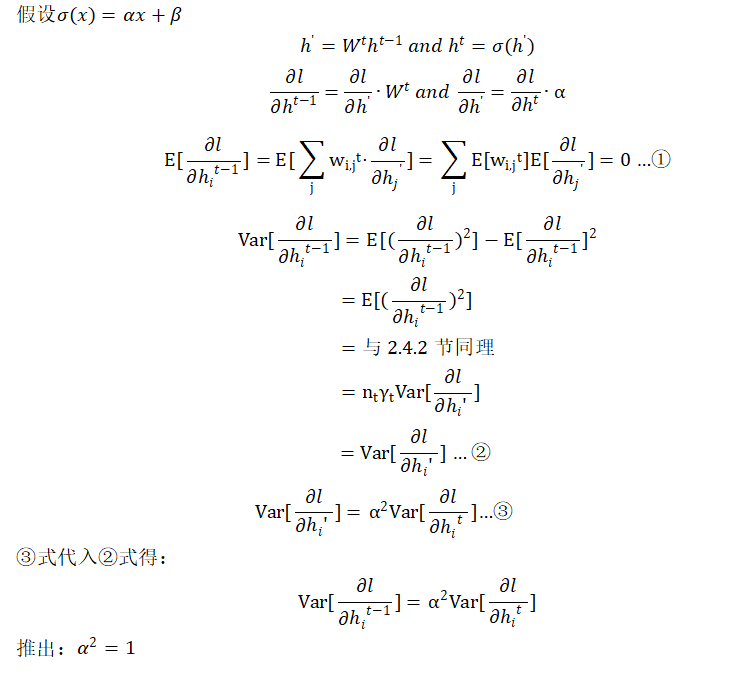

## 14-数值稳定性+模型初始化和激活函数

### 1. 数值稳定性
数值稳定性是深度学习中比较重要的点，特别是当神经网络变得很深的时候，数值通常很容易变得不稳定。
# 数值稳定性和模型初始化
:label:`sec_numerical_stability`
到目前为止，我们实现的每个模型都是根据某个预先指定的分布来初始化模型的参数。有人会认为初始化方案是理所当然的，忽略了如何做出这些选择的细节。甚至有人可能会觉得，初始化方案的选择并不是特别重要。相反，初始化方案的选择在神经网络学习中起着举足轻重的作用，它对保持数值稳定性至关重要。此外，这些初始化方案的选择可以与非线性激活函数的选择有趣的结合在一起。我们选择哪个函数以及如何初始化参数可以决定优化算法收敛的速度有多快。糟糕选择可能会导致我们在训练时遇到梯度爆炸或梯度消失。本节将更详细地探讨这些主题，并讨论一些有用的启发式方法。这些启发式方法在整个深度学习生涯中都很有用。
## 梯度消失和梯度爆炸
考虑一个具有$L$层、输入$\mathbf{x}$和输出$\mathbf{o}$的深层网络。
每一层$l$由变换$f_l$定义，该变换的参数为权重$\mathbf{W}^{(l)}$，其隐藏变量是$\mathbf{h}^{(l)}$（令 $\mathbf{h}^{(0)} = \mathbf{x}$）。
我们的网络可以表示为：
$$\mathbf{h}^{(l)} = f_l (\mathbf{h}^{(l-1)}) \text{ 因此 } \mathbf{o} = f_L \circ \ldots \circ f_1(\mathbf{x}).$$
如果所有隐藏变量和输入都是向量，我们可以将$\mathbf{o}$关于任何一组参数$\mathbf{W}^{(l)}$的梯度写为下式：
$$\partial_{\mathbf{W}^{(l)}} \mathbf{o} = \underbrace{\partial_{\mathbf{h}^{(L-1)}} \mathbf{h}^{(L)}}_{ \mathbf{M}^{(L)} \stackrel{\mathrm{def}}{=}} \cdot \ldots \cdot \underbrace{\partial_{\mathbf{h}^{(l)}} \mathbf{h}^{(l+1)}}_{ \mathbf{M}^{(l+1)} \stackrel{\mathrm{def}}{=}} \underbrace{\partial_{\mathbf{W}^{(l)}} \mathbf{h}^{(l)}}_{ \mathbf{v}^{(l)} \stackrel{\mathrm{def}}{=}}.$$
换言之，该梯度是$L-l$个矩阵$\mathbf{M}^{(L)} \cdot \ldots \cdot \mathbf{M}^{(l+1)}$与梯度向量 $\mathbf{v}^{(l)}$的乘积。因此，我们容易受到数值下溢问题的影响.当将太多的概率乘在一起时，这些问题经常会出现。在处理概率时，一个常见的技巧是切换到对数空间，即将数值表示的压力从尾数转移到指数。不幸的是，上面的问题更为严重：最初，矩阵 $\mathbf{M}^{(l)}$ 可能具有各种各样的特征值。他们可能很小，也可能很大；他们的乘积可能非常大，也可能非常小。不稳定梯度带来的风险不止在于数值表示；我们可能面临一些问题。要么是*梯度爆炸*（gradient exploding）问题：参数更新过大，破坏了模型的稳定收敛；要么是*梯度消失*（gradient vanishing）问题：参数更新过小，在每次更新时几乎不会移动，导致模型无法学习。
### (**梯度消失**)
曾经sigmoid函数$1/(1 + \exp(-x))$（ :numref:`sec_mlp`提到过）很流行，因为它类似于阈值函数。由于早期的人工神经网络受到生物神经网络的启发，神经元要么完全激活要么完全不激活（就像生物神经元）的想法很有吸引力。然而，它却是导致梯度消失问题的一个常见的原因，让我们仔细看看sigmoid函数为什么会导致梯度消失。
```python
%matplotlib inline
import torch
from d2l import torch as d2l
x = torch.arange(-8.0, 8.0, 0.1, requires_grad=True)
y = torch.sigmoid(x)
y.backward(torch.ones_like(x))
d2l.plot(x.detach().numpy(), [y.detach().numpy(), x.grad.numpy()],
         legend=['sigmoid', 'gradient'], figsize=(4.5, 2.5))
```

正如上图，当sigmoid函数的输入很大或是很小时，它的梯度都会消失。
此外，当反向传播通过许多层时，除非我们在刚刚好的地方，这些地方sigmoid函数的输入接近于零，否则整个乘积的梯度可能会消失。
当我们的网络有很多层时，除非我们很小心，否则在某一层可能会切断梯度。
事实上，这个问题曾经困扰着深度网络的训练。
因此，更稳定的ReLU系列函数已经成为从业者的默认选择（虽然在神经科学的角度看起来不太合理）。
### **梯度爆炸**
相反，梯度爆炸可能同样令人烦恼。
为了更好地说明这一点，我们生成100个高斯随机矩阵，并将它们与某个初始矩阵相乘。
对于我们选择的尺度（方差$\sigma^2=1$），矩阵乘积发生爆炸。
当这种情况是由于深度网络的初始化所导致时，我们没有机会让梯度下降优化器收敛。
```python
M = torch.normal(0, 1, size=(4,4))
print('一个矩阵 \n',M)
for i in range(100):
    M = torch.mm(M,torch.normal(0, 1, size=(4, 4)))
print('乘以100个矩阵后\n', M)
```
    一个矩阵 
     tensor([[-0.7872,  2.7090,  0.5996, -1.3191],
            [-1.8260, -0.7130, -0.5521,  0.1051],
            [ 1.1213,  1.0472, -0.3991, -0.3802],
            [ 0.5552,  0.4517, -0.3218,  0.5214]])
    乘以100个矩阵后
     tensor([[-2.1897e+26,  8.8308e+26,  1.9813e+26,  1.7019e+26],
            [ 1.3110e+26, -5.2870e+26, -1.1862e+26, -1.0189e+26],
            [-1.6008e+26,  6.4559e+26,  1.4485e+26,  1.2442e+26],
            [ 3.0943e+25, -1.2479e+26, -2.7998e+25, -2.4050e+25]])
### 打破对称性
神经网络设计中的另一个问题是其参数化所固有的对称性。假设我们有一个简单的多层感知机，它有一个隐藏层和两个隐藏单元。在这种情况下，我们可以对第一层的权重$\mathbf{W}^{(1)}$进行重排列，并且同样对输出层的权重进行重排列，可以获得相同的函数。第一个隐藏单元与第二个隐藏单元没有什么特别的区别。换句话说，我们在每一层的隐藏单元之间具有排列对称性。假设输出层将上述两个隐藏单元的多层感知机转换为仅一个输出单元。
想象一下，如果我们将隐藏层的所有参数初始化为$\mathbf{W}^{(1)} = c$，$c$为常量，会发生什么？在这种情况下，在前向传播期间，两个隐藏单元采用相同的输入和参数，产生相同的激活，该激活被送到输出单元。在反向传播期间，根据参数$\mathbf{W}^{(1)}$对输出单元进行微分，得到一个梯度，其元素都取相同的值。因此，在基于梯度的迭代（例如，小批量随机梯度下降）之后，$\mathbf{W}^{(1)}$的所有元素仍然采用相同的值。这样的迭代永远不会打破对称性，我们可能永远也无法实现网络的表达能力。隐藏层的行为就好像只有一个单元。请注意，虽然小批量随机梯度下降不会打破这种对称性，但暂退法正则化可以。
## 参数初始化
解决（或至少减轻）上述问题的一种方法是进行参数初始化，优化期间的注意和适当的正则化也可以进一步提高稳定性。
### 默认初始化
在前面的部分中，例如在 :numref:`sec_linear_concise`中，我们使用正态分布来初始化权重值。如果我们不指定初始化方法，框架将使用默认的随机初始化方法，对于中等难度的问题，这种方法通常很有效。


### 2. 模型初始化和激活函数
#### 2.1 让训练更加稳定
我们的一个核心目标是如何让训练更稳定，梯度值不要太大也不要太小
- 目标：让梯度值在合理的范围内
  - 例如 [1e-6, 1e3]
- 常用方法：
  - 将乘法变加法：
    - ResNet（跳跃连接，如果很多层，加入加法进去）
    -  LSTM（引入记忆细胞，更新门，遗忘门，通过门权重求和，控制下一步是否更新）
  - 归一化：
  
    - 梯度归一化（归一化均值，方差）
  
    - 梯度裁剪(clipping)：比如大于/小于一个固定的阈值，就让梯度等于这个阈值，将梯度限制在一个范围中。（可以缓解梯度爆炸）
  - 合理的权重初始和激活函数：本节课讲述重点
**下面我们重点探讨最后一种方法：合理的权重初始和激活函数**
#### 2.2 基本假设：让每层的均值/方差是一个常数
- **将每层的输出和梯度都看做随机变量**
  比如第i层有100维，就将输出和梯度分别看成100个随机变量
- **让它们的均值和方差都保持一致**
  我们的目标，这样不管神经网络多深，最后一层总与第一层差不多，从而不会梯度爆炸和消失
根据我们的假设，可以列出如下方程式：

#### 2.3 权重初始化
- 在合理值区间里随机初始参数
- 训练**开始**的时候更容易有数值不稳定
  - 远离最优解的地方损失函数表面可能很复杂
  - 最优解附近表面会比较平
- 使用N(0, 0.01)分布来初始可能对小网络没问题，但不能保证深度神经网络
#### 2.4 例子：MLP
下面我们以MLP为例，考虑需要什么条件，才能满足[2.2节](#22-基本假设：让每层的均值/方差是一个常数)的假设。
##### 2.4.1 模型假设
- 每一层**权重**中的变量均为**独立同分布**，并设出均值、方差。
- 每一层**输入**的变量**独立于**该层**权重**变量。同时**输入变量**之间**独立同分布**。
- 假设没有激活函数(先简化分析，之后会考虑有激活函数的情况)，可以求得该层输出的期望为0。

此处用到了一个重要性质：

更多均值、方差运算可以参考[期望、方差、协方差及相关系数的基本运算](https://blog.csdn.net/MissXy_/article/details/80705828)
##### 2.4.2 正向方差

- 第二行的计算中仍然用到了[2.4.1节](241模型假设)的期望的重要性质：如果两个变量独立，它们乘积的均值=均值的乘积，再结合w的期望为0(注意w和h独立，w之间独立同分布)，即有第二行末项期望为0。
- 最后一行由于wi,j独立同分布，方差相同，加上做了hj独立同分布的假设，所以可以写成 **[t-1层输出维度] x [t层权重方差] x [t-1层输出方差]** 的形式
- 此时，我们回过头来看我们的终极目标[2.2节](#22-基本假设：让每层的均值/方差是一个常数)的假设，每层输出期望为0我们已经可以满足(2.4.1节已经推导出)，而方差相同这一目标，通过上图的推导，我们发现需要$n_{t-1}\gamma_{t}=1$。
##### 2.4.3 反向均值和方差

反向的情况和正向的类似，不过此时我们需要满足的式子变为$n_{t}\gamma_{t}=1$。
##### 2.4.4 Xavier初始
### Xavier初始化
:label:`subsec_xavier`
让我们看看某些*没有非线性*的全连接层输出（例如，隐藏变量）$o_{i}$的尺度分布。
对于该层$n_\mathrm{in}$输入$x_j$及其相关权重$w_{ij}$，输出由下式给出
$$o_{i} = \sum_{j=1}^{n_\mathrm{in}} w_{ij} x_j.$$
权重$w_{ij}$都是从同一分布中独立抽取的。
此外，让我们假设该分布具有零均值和方差$\sigma^2$。
请注意，这并不意味着分布必须是高斯的，只是均值和方差需要存在。
现在，让我们假设层$x_j$的输入也具有零均值和方差$\gamma^2$，并且它们独立于$w_{ij}$并且彼此独立。
在这种情况下，我们可以按如下方式计算$o_i$的平均值和方差：
$$
\begin{aligned}
    E[o_i] & = \sum_{j=1}^{n_\mathrm{in}} E[w_{ij} x_j] \\&= \sum_{j=1}^{n_\mathrm{in}} E[w_{ij}] E[x_j] \\&= 0, \\
    \mathrm{Var}[o_i] & = E[o_i^2] - (E[o_i])^2 \\
        & = \sum_{j=1}^{n_\mathrm{in}} E[w^2_{ij} x^2_j] - 0 \\
        & = \sum_{j=1}^{n_\mathrm{in}} E[w^2_{ij}] E[x^2_j] \\
        & = n_\mathrm{in} \sigma^2 \gamma^2.
\end{aligned}
$$
保持方差不变的一种方法是设置$n_\mathrm{in} \sigma^2 = 1$。
现在考虑反向传播过程，我们面临着类似的问题，尽管梯度是从更靠近输出的层传播的。
使用与前向传播相同的推断，我们可以看到，除非$n_\mathrm{out} \sigma^2 = 1$，否则梯度的方差可能会增大，其中$n_\mathrm{out}$是该层的输出的数量。
这使得我们进退两难：我们不可能同时满足这两个条件。
相反，我们只需满足：
$$
\begin{aligned}
\frac{1}{2} (n_\mathrm{in} + n_\mathrm{out}) \sigma^2 = 1 \text{ 或等价于 }
\sigma = \sqrt{\frac{2}{n_\mathrm{in} + n_\mathrm{out}}}.
\end{aligned}
$$
这就是现在标准且实用的*Xavier初始化*的基础，它以其提出者 :cite:`Glorot.Bengio.2010` 第一作者的名字命名。
通常，Xavier初始化从均值为零，方差
$\sigma^2 = \frac{2}{n_\mathrm{in} + n_\mathrm{out}}$
的高斯分布中采样权重。我们也可以将其改为选择从均匀分布中抽取权重时的方差。注意均匀分布$U(-a, a)$的方差为$\frac{a^2}{3}$。将$\frac{a^2}{3}$代入到$\sigma^2$的条件中，将得到初始化值域：
$$U\left(-\sqrt{\frac{6}{n_\mathrm{in} + n_\mathrm{out}}}, \sqrt{\frac{6}{n_\mathrm{in} + n_\mathrm{out}}}\right).$$
尽管在上述数学推理中，“不存在非线性”的假设在神经网络中很容易被违反，但Xavier初始化方法在实践中被证明是有效的。
##### 2.4.5 假设线性的激活函数
真实情况下，我们并不会用线性的激活函数（这样相当于没有进行激活），这里为了简化问题，假设激活函数是线性的。
- **正向**

上述推导表明，为了使得前向传播的均值为0，方差固定的话，激活函数必须f(x)=x，这种恒等映射。
- **反向**

PPT上的推导似乎有点问题（上图中第二行方程），笔者重新进行了下述推导，读者也可自行推导验证：

**通过正向和反向的推导，我们可以得出的【结论】是：当激活函数为f(x)=x，这种恒等映射更有利于维持神经网络的稳定性。**
##### 2.4.6 检查常用激活函数

对于常用激活函数：tanh，relu满足在零点附近有f(x)=x，而sigmoid函数在零点附近不满足要求，可以对sigmoid函数进行调整（根据Taylor展开式，调整其过原点）
### 3. 总结
- 当数值过大或者过小时，会导致数值问题。
- 常发生在深度模型中，因为其会对n个数累乘。
- 合理的权重初始值(如Xavier)和激活函数的选取(如relu, tanh, 调整后的sigmoid)可以提升数值稳定性。
### 4.Q&A
**问题：nan, inf是怎么产生的以及怎么解决的？**
> NaN和Inf怎么产生的：参考[出现nan、inf原因](https://blog.csdn.net/qq_16334327/article/details/86526854)
> 如何解决：参考[深度学习中nan和inf的解决](https://blog.csdn.net/u011119817/article/details/103908065)以及[训练网络loss出现Nan解决办法 ](https://zhuanlan.zhihu.com/p/89588946#:~:text=一般来说，出现NaN有以下几种情况： 1.,如果在迭代的100轮以内，出现NaN，一般情况下的原因是因为你的学习率过高，需要降低学习率。 可以不断降低学习率直至不出现NaN为止，一般来说低于现有学习率1-10倍即可。)
**问题：训练过程中，如果网络层的输出的中间层特征元素的值突然变成nan了，是发生梯度爆炸了吗？**
> 参考[训练网络loss出现Nan解决办法 ](https://zhuanlan.zhihu.com/p/89588946#:~:text=一般来说，出现NaN有以下几种情况： 1.,如果在迭代的100轮以内，出现NaN，一般情况下的原因是因为你的学习率过高，需要降低学习率。 可以不断降低学习率直至不出现NaN为止，一般来说低于现有学习率1-10倍即可。)
**问题：老师，让每层方差是一个常数的方法，您指的是batch normalization吗？想问一下bn层为什么要有伽马和贝塔？去掉可以吗**
> 让每层方差是一个常数，和batch norm没有太多关系，(本节课介绍的方法是合理地初始化权重和设置激活函数)。batch norm可以让你的输出变成一个均值为0，方差差不多是一个固定值的东西，但它不一定能保证你的梯度。
(此处节选几个重要的Q&A，建议观看完整Q&A，获得更深的理解)
