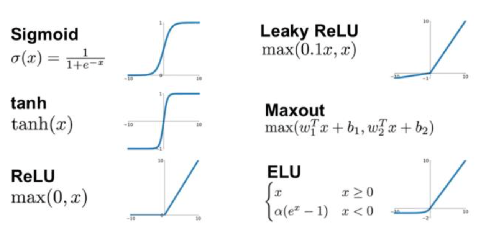

### 激活函数
激活函数是用来加入非线性因素，提高网络表达能力，卷积神经网络中最常用的是ReLU，Sigmoid使用较少。**神经网络中常用的激活函数有以下几种：**


#### Sigmoid函数（Logistic函数）：
   ```
   f(x) = 1 / (1 + exp(-x))
   ```

Sigmoid函数将输入映射到0到1之间的连续值，常用于二分类问题或者在某些情况下作为输出层的激活函数。但是，Sigmoid函数存在梯度饱和和输出不是以0为中心的问题。
#### 双曲正切函数（Tanh函数）：
   ```
   f(x) = (exp(x) - exp(-x)) / (exp(x) + exp(-x))
   ```
   Tanh函数将输入映射到-1到1之间的连续值，与Sigmoid函数类似。它在中心点0上是对称的，并且提供了比Sigmoid函数更强的非线性特性。然而，与Sigmoid函数一样，Tanh函数也存在梯度饱和的问题。
#### ReLU函数（Rectified Linear Unit）：   
   ```
   f(x) = max(0, x)
   ```
   ReLU函数将输入映射为大于等于0的值，在实践中被广泛使用。它具有良好的计算效率和非线性特性，但存在一个问题，即在负值区域梯度为0，可能导致“神经元死亡”。$$
f(x)=\left\{\begin{array}{l}0, x<0 \\ x, x \geq 0\end{array}\right.
$$ReLU**函数的优点：
- 计算速度快，ReLU函数只有线性关系，比Sigmoid和Tanh要快很多
- 输入为正数的时候，不存在梯度消失问题
**ReLU**函数的缺点：
- 强制性把负值置为0，可能丢掉一些特征
- 当输入为负数时，权重无法更新，导致“神经元死亡”(学习率不 要太大)
相对于 Sigmoid 和 Tanh 激活函数，ReLU 和 GeLU 更为准确和高效，因为它们在神经网络中的梯度消失问题上表现更好。梯度消失通常发生在深层神经网络中，意味着梯度的值在反向传播过程中逐渐变小，导致网络梯度无法更新，从而影响网络的训练效果。而 ReLU 和 GeLU 几乎没有梯度消失的现象，可以更好地支持深层神经网络的训练和优化。
#### Leaky ReLU函数：
   ```
   f(x) = max(αx, x)
   ```
   Leaky ReLU函数是ReLU函数的一种变体，通过在负值区域引入一个小的斜率α，解决了ReLU函数的“神经元死亡”问题。
#### PReLU函数（Parametric ReLU）：
   ```
   f(x) = max(αx, x)
   ```
   PReLU函数是ReLU函数的另一种变体，不同的是斜率α是可学习的参数，允许网络自动学习适应数据的非线性形式。
$$
f(x)=\left\{\begin{array}{l}\alpha x, x<0 \\ x, x \geq 0\end{array}\right.
$$- 当 𝛼=0.01 时，称作Leaky ReLU
- 当 𝛼 从高斯分布中随机产生时，称为Randomized ReLU(RReLU)
**PReLU**函数的优点：
- 比sigmoid/tanh收敛快
- 解决了ReLU的“神经元死亡”问题
- **2. Parametric ReLU**
$$
f(x)=\left\{\begin{array}{l}\alpha x, x<0 \\ x, x \geq 0\end{array}\right.
$$

**PReLU**函数的缺点：需要再学习一个参数，工作量变大
**3. 
- CNN在卷积层尽量不要使用Sigmoid和Tanh，将导致梯度消失。
- 首先选用ReLU，使用较小的学习率，以免造成神经元死亡的情况。
- 如果ReLU失效，考虑使用Leaky ReLU、PReLU、ELU或者Maxout，此时一般情况都可以解决

#### Softmax函数：
   ```
   f(x_i) = exp(x_i) / sum(exp(x_j))
   ```
   Softmax函数被广泛用于多分类问题的输出层。它将输入映射到0到1之间的概率分布，使得所有类别的概率之和为1。$$\hat{y}=softmax(o)\quad其中\quad \hat{y_i}=\frac{exp(o_i)}{\sum_{k} exp(o_k)}$$

####  ELU函数
$$
f(x)=\left\{\begin{array}{l}\alpha (e^x-1), x<0 \\ x, x \geq 0\end{array}\right.
$$
**ELU**函数的优点：
- 处理含有噪声的数据有优势
- 更容易收敛
**ELU**函数的缺点：计算量较大，收敛速度较慢

#### 正常单元和衰减单元
正常单元（vanilla unit）和衰减单元（decay unit）是神经网络中常用的两种激活函数单元。
1. 正常单元（Vanilla Unit）：正常单元是指常见的激活函数单元，如Sigmoid、ReLU（Rectified Linear Unit）和Tanh等。这些函数在神经网络中广泛使用，用于引入非线性性质，增加网络的表达能力。例如，Sigmoid函数将输入映射到0到1之间的连续值，ReLU函数在正数输入上输出与输入相等，而在负数输入上输出0。正常单元能够处理一般的非线性关系，但在一些情况下，可能存在梯度消失或激活值过大等问题。
2. 衰减单元（Decay Unit）：衰减单元是一种特殊的激活函数单元，它通过引入衰减参数来缓解激活值的增长。衰减单元可以防止激活值过大，从而避免梯度爆炸的问题。在训练深度神经网络时，梯度爆炸可能导致训练不稳定或无法收敛。常见的衰减单元包括ReLU的变种（如Leaky ReLU、Parametric ReLU）和ELU（Exponential Linear Unit）等。这些函数通过引入衰减参数或指数函数，使得激活值在一定范围内保持较小的增长。


### ReLU函数
最受欢迎的激活函数是*修正线性单元*（Rectified linear unit，*ReLU*），因为它实现简单，同时在各种预测任务中表现良好。
**ReLU提供了一种非常简单的非线性变换**。
给定元素$x$，ReLU函数被定义为该元素与$0$的最大值：
(**$$\operatorname{ReLU}(x) = \max(x, 0).$$**)
通俗地说，ReLU函数通过将相应的活性值设为0，仅保留正元素并丢弃所有负元素。
为了直观感受一下，我们可以画出函数的曲线图。
正如从图中所看到，激活函数是分段线性的。
```python
x = torch.arange(-8.0, 8.0, 0.1, requires_grad=True)
y = torch.relu(x)
d2l.plot(x.detach(), y.detach(), 'x', 'relu(x)', figsize=(5, 2.5))
```

当输入为负时，ReLU函数的导数为0，而当输入为正时，ReLU函数的导数为1。
注意，当输入值精确等于0时，ReLU函数不可导。
在此时，我们默认使用左侧的导数，即当输入为0时导数为0。
我们可以忽略这种情况，因为输入可能永远都不会是0。
这里引用一句古老的谚语，“如果微妙的边界条件很重要，我们很可能是在研究数学而非工程”，这个观点正好适用于这里。
下面我们绘制ReLU函数的导数。
```python
y.backward(torch.ones_like(x), retain_graph=True)
d2l.plot(x.detach(), x.grad, 'x', 'grad of relu', figsize=(5, 2.5))
```

使用ReLU的原因是，它求导表现得特别好：要么让参数消失，要么让参数通过。
这使得优化表现得更好，并且ReLU减轻了困扰以往神经网络的梯度消失问题（稍后将详细介绍）。
注意，ReLU函数有许多变体，包括*参数化ReLU*（Parameterized ReLU，*pReLU*）
函数 :cite:`He.Zhang.Ren.ea.2015`。
该变体为ReLU添加了一个线性项，因此即使参数是负的，某些信息仍然可以通过：
$$\operatorname{pReLU}(x) = \max(0, x) + \alpha \min(0, x).$$
### sigmoid函数
**对于一个定义域在$\mathbb{R}$中的输入，*sigmoid函数*将输入变换为区间(0, 1)上的输出**。
因此，sigmoid通常称为*挤压函数*（squashing function）：
它将范围（-inf, inf）中的任意输入压缩到区间（0, 1）中的某个值：
(**$$\operatorname{sigmoid}(x) = \frac{1}{1 + \exp(-x)}.$$**)
在最早的神经网络中，科学家们感兴趣的是对“激发”或“不激发”的生物神经元进行建模。
因此，这一领域的先驱可以一直追溯到人工神经元的发明者麦卡洛克和皮茨，他们专注于阈值单元。阈值单元在其输入低于某个阈值时取值0，当输入超过阈值时取值1。
当人们逐渐关注到到基于梯度的学习时，sigmoid函数是一个自然的选择，因为它是一个平滑的、可微的阈值单元近似。当我们想要将输出视作二元分类问题的概率时，sigmoid仍然被广泛用作输出单元上的激活函数（sigmoid可以视为softmax的特例）。
然而，sigmoid在隐藏层中已经较少使用，它在大部分时候被更简单、更容易训练的ReLU所取代。在后面关于循环神经网络的章节中，我们将描述利用sigmoid单元来控制时序信息流的架构。下面，我们绘制sigmoid函数。注意，当输入接近0时，sigmoid函数接近线性变换。
```python
y = torch.sigmoid(x)
d2l.plot(x.detach(), y.detach(), 'x', 'sigmoid(x)', figsize=(5, 2.5))
```

sigmoid函数的导数为下面的公式：
$$\frac{d}{dx} \operatorname{sigmoid}(x) = \frac{\exp(-x)}{(1 + \exp(-x))^2} = \operatorname{sigmoid}(x)\left(1-\operatorname{sigmoid}(x)\right).$$
sigmoid函数的导数图像如下所示。注意，当输入为0时，sigmoid函数的导数达到最大值0.25；而输入在任一方向上越远离0点时，导数越接近0。
```python
# 清除以前的梯度
x.grad.data.zero_()
y.backward(torch.ones_like(x),retain_graph=True)
d2l.plot(x.detach(), x.grad, 'x', 'grad of sigmoid', figsize=(5, 2.5))
```

### tanh函数
与sigmoid函数类似，**tanh(双曲正切)函数也能将其输入压缩转换到区间(-1, 1)上**。
tanh函数的公式如下：
(**$$\operatorname{tanh}(x) = \frac{1 - \exp(-2x)}{1 + \exp(-2x)}.$$**)
下面我们绘制tanh函数。
注意，当输入在0附近时，tanh函数接近线性变换。
函数的形状类似于sigmoid函数，不同的是tanh函数关于坐标系原点中心对称。
```python
y = torch.tanh(x)
d2l.plot(x.detach(), y.detach(), 'x', 'tanh(x)', figsize=(5, 2.5))
```

tanh函数的导数是：
$$\frac{d}{dx} \operatorname{tanh}(x) = 1 - \operatorname{tanh}^2(x).$$
tanh函数的导数图像如下所示。
当输入接近0时，tanh函数的导数接近最大值1。
与我们在sigmoid函数图像中看到的类似，输入在任一方向上越远离0点，导数越接近0。
```python
# 清除以前的梯度
x.grad.data.zero_()
y.backward(torch.ones_like(x),retain_graph=True)
d2l.plot(x.detach(), x.grad, 'x', 'grad of tanh', figsize=(5, 2.5))
```

总结一下，我们现在了解了如何结合非线性函数来构建具有更强表达能力的多层神经网络架构。
顺便说一句，这些知识已经让你掌握了一个类似于1990年左右深度学习从业者的工具。
在某些方面，你比在20世纪90年代工作的任何人都有优势，因为你可以利用功能强大的开源深度学习框架，只需几行代码就可以快速构建模型，而以前训练这些网络需要研究人员编写数千行的C或Fortran代码。