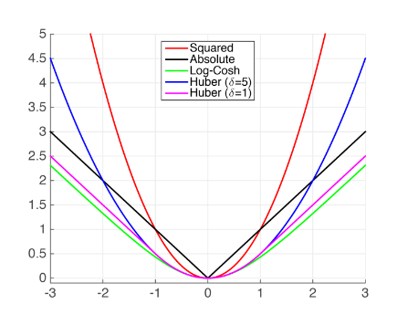
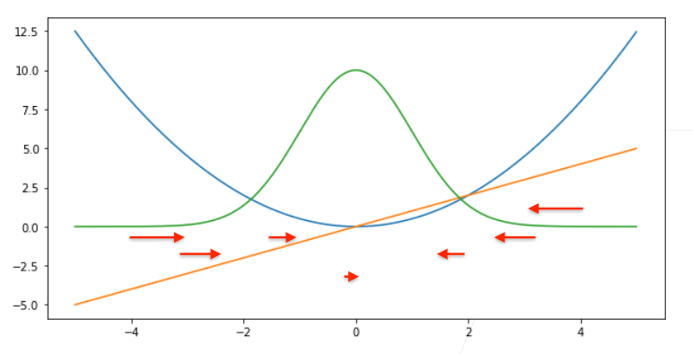
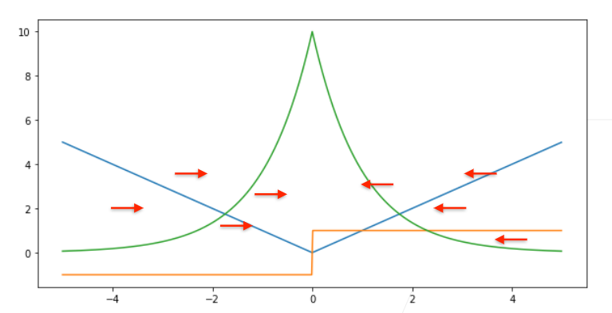
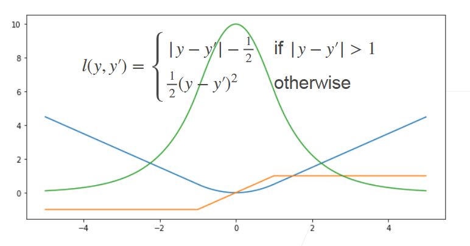

## 损失函数
接下来，我们需要一个损失函数来度量预测的效果。我们将使用最大似然估计，这与在线性回归
（ :numref:`subsec_normal_distribution_and_squared_loss`）
中的方法相同。

#### 2.1 L2 Loss
$l(y,y^{'})=\frac{1}{2}(y-y^{'})^2)$

> 梯度会随着结果逼近而下降
#### 2.2 L1 Loss
$l(y,y^{'})=\lvert y-y^{'}\rvert)$

> 梯度保持不变，但在0处梯度随机
#### 2.3Huber's Robust Loss

> 结合L1 Loss和L2 Loss的优点