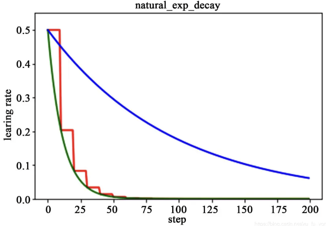

### 学习率的作用
​ 在机器学习中，监督式学习通过定义一个模型，并根据训练集上的数据估计最优参数。梯度下降法是一个广泛被用来最小化模型误差的参数优化算法。梯度下降法通过多次迭代，并在每一步中最小化成本函数（cost 来估计模型的参数。学习率 (learning rate)，在迭代过程中会控制模型的学习进度。
​ 在梯度下降法中，都是给定的统一的学习率，整个优化过程中都以确定的步长进行更新， 在迭代优化的前期中，学习率较大，则前进的步长就会较长，这时便能以较快的速度进行梯度下降，而在迭代优化的后期，逐步减小学习率的值，减小步长，这样将有助于算法的收敛，更容易接近最优解。故而如何对学习率的更新成为了研究者的关注点。  
​ 在模型优化中，常用到的几种学习率衰减方法有：分段常数衰减、多项式衰减、指数衰减、自然指数衰减、余弦衰减、线性余弦衰减、噪声线性余弦衰减
### 学习率的影响（重要性）
学习率需要在收敛和过火之间权衡\[^25\]。学习率太小，则收敛得慢。学习率太大，则损失会震荡甚至变大。
不同学习率的影响如下:

学习率可能是最重要的参数了。如果你只有时间调整一个参数，那么就是学习率。学习率还会跟优化过程的其他方面相互作用，这个相互作用可能是非线性的。小的batch size最好搭配小的学习率，因为batch size越小也可能有噪音，这时候就需要小心翼翼地调整参数。
### 如何设置和调整学习率
调整学习率的套路通常是：
- 先设置一个初始学习率。这个初始学习率应该让损失尽可能快地降低。
- 然后训练过程中按照一定的schedule降低学习率；或用算法根据实际训练情况，自适应地调整学习率。
另外，在正式开始训练之前， 还应该有一小段热身的过程。热身的原因是一开始模型参数是完全随机的，需要谨慎地更新参数，不能一上来就用初始学习率。
#### 设置初始学习率
初始学习率的范围一般在$10^{-6}$到$1.0$之间。可以根据经验或直觉，拍脑袋设定一个初始学习率。不过，还有更科学的方法来寻找初始学习率。
大致思想是，观察损失或准确率随学习率变化的曲线，然后根据一定策略选择最好的学习率作为初始学习率。
基本步骤如下：
1. 以学习率为自变量，在定义域内，随着训练步数增加，学习率从小到大增加；
2. 画出损失或准确率随学习率变化的曲线。
3. 如果是损失变化曲线，选择损失下降最快的学习率作为初始学习率。如果是准确率变化曲线，当精确度增长开始变平或者锯齿状抖动时，就是最大的学习率。
#### 训练前热身
Warmup是在ResNet论文中提到的一种学习率预热的方法，它在训练开始前先选择使用一个较小的学习率，训练了一些步，再修改为预先设置的学习率正式开始训练。
为什么使用Warmup？因为刚开始训练时，模型的权重是随机初始化的，此时若选择一个较大的学习率，可能带来模型的不稳定(振荡)。、
Warmup有两种。一种是常量warmup，它的不足之处在于从一个很小的学习率一下变为比较大的学习率可能会导致训练误差突然增大。另一种是渐进warmup，即从最初的小学习率开始，每个step增大一点点，直到达到最初设置的比较大的学习率。
#### 训练过程中调整学习率
训练过程中调整学习率的意思是，在训练过程中，根据训练的火候，适当增加或减小学习率。调整学习率的目的是尽快收敛到较优值（同时满足快和优）。一般来说，调整学习率实际上都是减少学习率，因此有的地方也叫学习率衰减(decay)或学习率退火(annealling)。调整学习率主要有两类方法：学习率schedule和自适应学习率。学习率schedule根据一定的公式调整学习率，公式中学习率是训练步数的函数；自适应学习率是算法自动根据训练中的实际情况，调整学习率。
### 学习率衰减常用参数有哪些
| 参数名称 | 参数说明 |
| --- | --- |
| learning\_rate | 初始学习率 |
| global\_step | 用于衰减计算的全局步数，非负，用于逐步计算衰减指数 |
| decay\_steps | 衰减步数，必须是正值，决定衰减周期 |
| decay\_rate | 衰减率 |
| end\_learning\_rate | 最低的最终学习率 |
| cycle | 学习率下降后是否重新上升 |
| alpha | 最小学习率 |
| num\_periods | 衰减余弦部分的周期数 |
| initial\_variance | 噪声的初始方差 |
| variance\_decay | 衰减噪声的方差 |
#### 分段常数衰减
​ 分段常数衰减需要事先定义好的训练次数区间，在对应区间置不同的学习率的常数值，一般情况刚开始的学习率要大一些，之后要越来越小，要根据样本量的大小设置区间的间隔大小，样本量越大，区间间隔要小一点。下图即为分段常数衰减的学习率变化图，横坐标代表训练次数，纵坐标代表学习率。

#### 指数衰减
​ 以指数衰减方式进行学习率的更新，学习率的大小和训练次数指数相关，其更新规则为：  
$decayed{\_}learning{\_}rate =learning{\_}rate*decay{\_}rate^{\frac{global{\_step}}{decay{\_}steps}}$
​ 这种衰减方式简单直接，收敛速度快，是最常用的学习率衰减方式，如下图所示，绿色的为学习率随  
训练次数的指数衰减方式，红色的即为分段常数衰减，它在一定的训练区间内保持学习率不变。

#### 自然指数衰减
​ 它与指数衰减方式相似，不同的在于它的衰减底数是，故而其收敛的速度更快，一般用于相对比较  
容易训练的网络，便于较快的收敛，其更新规则如下  
$decayed{\_}learning{\_}rate =learning{\_}rate*e^{\frac{-decay{\_rate}}{global{\_}step}}$
​ 下图为为分段常数衰减、指数衰减、自然指数衰减三种方式的对比图，红色的即为分段常数衰减图，阶梯型曲线。蓝色线为指数衰减图，绿色即为自然指数衰减图，很明可以看到自然指数衰减方式下的学习率衰减程度要大于一般指数衰减方式，有助于更快的收敛。

#### 多项式衰减
​ 应用多项式衰减的方式进行更新学习率，这里会给定初始学习率和最低学习率取值，然后将会按照  
给定的衰减方式将学习率从初始值衰减到最低值,其更新规则如下式所示。  
$$ 
global{\_}step=min(global{\_}step,decay{\_}steps) 
$$
$decayed{\_}learning{\_}rate =(learning{\_}rate-end{\_}learning{\_}rate)* \left( 1-\frac{global{\_step}}{decay{\_}steps}\right)^{power} +end{\_}learning{\_}rate$
需要注意的是，有两个机制，降到最低学习率后，到训练结束可以一直使用最低学习率进行更新，另一个是再次将学习率调高，使用 decay\_steps 的倍数，取第一个大于 global\_steps 的结果，如下式所示.它是用来防止神经网络在训练的后期由于学习率过小而导致的网络一直在某个局部最小值附近震荡，这样可以通过在后期增大学习率跳出局部极小值。  
$decay{\_}steps = decay{\_}steps*ceil \left( \frac{global{\_}step}{decay{\_}steps}\right)$
​ 如下图所示，红色线代表学习率降低至最低后，一直保持学习率不变进行更新，绿色线代表学习率衰减到最低后，又会再次循环往复的升高降低。

#### 余弦衰减
​ 余弦衰减就是采用余弦的相关方式进行学习率的衰减，衰减图和余弦函数相似。其更新机制如下式所示：  
$$global{\_}step=min(global{\_}step,decay{\_}steps)$$
$$cosine{\_}decay=0.5*\left( 1+cos\left( \pi* \frac{global{\_}step}{decay{\_}steps}\right)\right)$$
$$decayed=(1-\alpha)*cosine{\_}decay+\alpha$$
$$decayed{\_}learning{\_}rate=learning{\_}rate*decayed$$
​ 如下图所示，红色即为标准的余弦衰减曲线，学习率从初始值下降到最低学习率后保持不变。蓝色的线是线性余弦衰减方式曲线，它是学习率从初始学习率以线性的方式下降到最低学习率值。绿色噪声线性余弦衰减方式。
