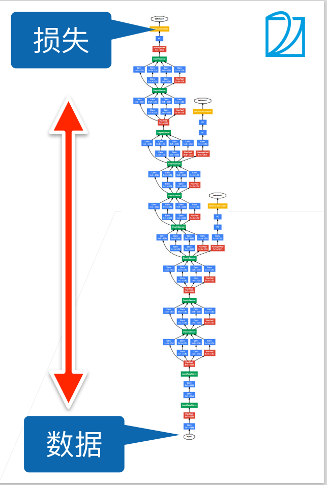

## 批量归一化[batch-norm](../../代码/convolutional-modern/batch-norm.md)
深层神经网络的训练，尤其是使网络在较短时间内收敛是十分困难的，**批量归一化[batch normalization]**是一种流行且有效的技术，能加速深层网络的收敛速度，目前仍被广泛使用。
### 训练深层网络时的问题

深度神经网络在训练时会遇到一些问题：
* 收敛速度慢：
  * 由于训练时先正向传播后反向传播，且每层的梯度一般较小，若网络较深，则反向传播时会出现类似于梯度消失的现象，导致距离数据更近的层梯度较小，收敛慢，而距离输出更近的层梯度较大，收敛快。然而底部的层一般都用于提取较基础的特征信息，上方的层收敛后，由于底部提取基础特征的层仍在变化，上方的层一直在不停的重新训练，导致整个网络难以收敛，训练较慢。
* 内部协变量转移：
  * 分布偏移：偏移在视频课程中并未出现，但在《动手学深度学习》这本书中有提到过，在[4.9. 环境和分布偏移](https://zh-v2.d2l.ai/chapter_multilayer-perceptrons/environment.html)部分。偏移指的是训练数据可能和测试数据的分布不同，比如利用来自真实的猫和狗的照片的训练数据训练模型，然后让模型去预测动画中的猫和狗的图片。
  * 这显然会降低正确率也会对模型的进一步优化带来干扰。一般情况下对于分布偏移我们毫无办法，然而，在一些特定场景中，如果假定一些训练数据和测试数据分布的前提条件，就能对分布偏移进行处理，其中之一就是协变量偏移。
  * 协变量偏移：协变量偏移假设输入的分布可能随时间变化，但标签函数（条件分布$P(y|\mathbf x)$）没有改变。统计学家称这为*协变量偏移*（covariate shift）并给出了一些解决方案
  * **内部协变量偏移(Internal Covariate Shift)**：每一层的参数在更新过程中，会改变下一层输入的分布，导致网络参数变幻莫测，难以收敛，神经网络层数越多，表现得越明显。
  * 注意：
    * 1：内部协变量偏移这个词与标准的协变量偏移所有区别。
    * 2：能缓解内部协变量偏移仅仅是批量归一化的作者提出的假想，后续论文证实批量归一化实际对内部协变量偏移的缓解帮助不大
    * 3：批量归一化一般只影响模型的收敛速度，不影响精度
* 过拟合：
  * 由于网络深度加深，变得更为复杂，使得网络容易过拟合。
### 批量归一化
批量归一化(batch normalization)在 [[Ioffe & Szegedy, 2015\]](https://zh-v2.d2l.ai/chapter_references/zreferences.html#ioffe-szegedy-2015)中被提出，用于解决上述训练深度网络时的这些问题，然而这只是人们的感性理解，关于批量归一化具体是怎样帮助训练这个问题目前仍待进一步研究。
批量归一化尝试将每个训练中的mini-batch小批量数据（即会导致参数更新的数据）在每一层的结果进行归一化，使其更稳定，归一化指的是对于当前小批量中的所有样本，求出期望和方差，然后将每个样本减去期望再除以标准差。
### 形式化表达
下面的运算均为向量运算，向量中的每个维度代表一个特征，对于每个特征分别进行计算再拼接在一起即为向量运算。
设$ \mathbf x \in \mathcal{B}$为来自一个小批量$\mathcal{B}$的输入，批量归一化BN根据下式进行转换
$$
\mathrm{BN}(\mathbf{x}) = \mathbf{\gamma} \odot \frac{\mathbf{x} - \hat{\mathbf{\mu}}_\mathcal{B}}{\hat{\mathbf{\sigma}}_\mathcal{B}} + \mathbf{\beta}.
$$
式中$\hat{\mathbf{\mu}}_\mathcal{B}$为小批量$\mathcal{B}$样本均值，$\hat{\mathbf{\sigma}}_\mathcal{B}$为样本标准差：
$$
\begin{split}\begin{aligned} \hat{\mathbf{\mu}}_\mathcal{B} &= \frac{1}{|\mathcal{B}|} \sum_{\mathbf{x} \in \mathcal{B}} \mathbf{x},\\
\hat{\mathbf{\sigma}}_\mathcal{B}^2 &= \frac{1}{|\mathcal{B}|} \sum_{\mathbf{x} \in \mathcal{B}} (\mathbf{x} - \hat{\mathbf{\mu}}_{\mathcal{B}})^2 + \epsilon\end{aligned}\end{split}
$$
其中$\epsilon$用于防止分母为0，经过减期望与除以标准差后得到期望为1方差为0的小批量数据。然而，期望和方差为了使小批量有更自由的选择，再将其乘拉伸参数$\mathbf {\gamma}$，加偏移参数$\mathbf \beta$，这两个参数与$\mathbf x$同样大小，是模型中的可学习参数，与其他参数一同更新。
由于$\hat{\mathbf{\mu}}_\mathcal{B}$和$\hat{\mathbf{\sigma}}_\mathcal{B}$为由当前小批量计算的值，实际上是整个分布对应的期望与标准差的估计值，由于小批量的随机选择，**$\hat{\mathbf{\mu}}_\mathcal{B}$和$\hat{\mathbf{\sigma}}_\mathcal{B}$会给模型带来一定的与输入数据有关的噪音，而这些噪音也能对模型进行正则化**，防止过拟合。为何这种噪音能加快训练并带来正则化还有待研究，不过已有理论说明了为什么批量归一化最适应$50∼100$范围中的中等批量大小的问题。
训练时不能使用整个数据集，只能一步步的训练和更新；而预测时模型已然固定，可以根据整个数据集精确计算均值和方差。因此，批量归一化对于训练和预测时有两种不同模式。
### 批量归一化层
批量归一化不再单独的考虑单个样本，需要对整个mini-batch进行，因此需要考虑多种情况。
### 全连接层
通常，我们将批量归一化层置于全连接层中的仿射变换和激活函数之间。
设全连接层的输入为x，权重参数和偏置参数分别为$\mathbf{W}$和$\mathbf{b}$，激活函数为$\phi$，批量归一化的运算符为$\mathrm{BN}$。那么，使用批量归一化的全连接层的输出的计算详情如下：
$$\mathbf{h} = \phi(\mathrm{BN}(\mathbf{W}\mathbf{x} + \mathbf{b}) ).$$
回想一下，均值和方差是在应用变换的"相同"小批量上计算的。
#### 卷积层
在卷积层中，我们将通道视作每个位置的特征，将每个样本中的每个位置视作一个样本进行计算。每个通道都有着自己的拉伸参数${\gamma}$和偏移参数$\beta$，所有通道加在一起组成了拉伸参数向量$\mathbf {\gamma}$和偏移参数向量$\mathbf \beta$，若样本数为m，卷积输出为p\*q，计算时对m\*p\*q个向量进行批量归一化运算（即视作有m\*p\*q个样本）
#### 预测过程中的批量归一化
在训练过程中，我们需要不断地更新模型，方差和均值也就在不断地变化，就必须计算当前小批量数据对应的方差和均值，然而预测时我们的模型已经确定下来，可以用在整个训练数据集上得到的均值和方差来对预测时的结果进行归一化。
正如我们前面提到的，批量归一化在训练模式和预测模式下的行为通常不同。首先，将训练好的模型用于预测时，我们不再需要样本均值中的噪声以及在微批次上估计每个小批次产生的样本方差了。其次，例如，我们可能需要使用我们的模型对逐个样本进行预测。一种常用的方法是通过移动平均估算整个训练数据集的样本均值和方差，并在预测时使用它们得到确定的输出。可见，和暂退法一样，批量归一化层在训练模式和预测模式下的计算结果也是不一样的。
#### 实现细节
* 在实际实现时，一般使用指数加权平均来更新小批量的均值和方差，指数加权平均将旧值和当前计算结果不断进行加权平均，最终做到平滑的向更新值靠拢，公式如下：
* $$
  S_t = 
  \begin{cases} 
  Y_1, &t = 1 \\\\ 
  \beta S_{t-1} + (1-\beta)Y_t, &t > 1 
  \end{cases}
  $$
* 批量归一化的参数可以通过动量梯度下降，RMSProp，Adam等多种优化方法进行训练。
### 吴恩达老师深度学习课程中的批量归一化
吴恩达老师深度学习课程中的批量归一化中的部分内容与本课程有所出入，考虑到批量归一化这部分内容还没有精确的理论解释，目前的认识仅限于直觉，故将两课程中的区别即补充罗列在此作为参考：
* 关于dropout：
  * 本课中提到批量归一化有正则化效果，无需再进行dropout
  * 吴恩达老师课程中提到批量归一化正则化效果较差，不能作为正则化的手段，必要时需要dropout
* 对于线性层（包括其他带有偏置项的层）后的批量归一化，由于归一化时减去了均值，偏置项被消掉，可以省略归一化层之前的偏置项
* 标准化的输入能使梯度下降加快，批归一化能使得每层的输入都被归一化，这也是训练更快的原因之一
* 批量归一化可以使得不同层之间互相的影响减少，从而应对数据偏移，增强鲁棒性。
## 争议
直观地说，批量规范化被认为可以使优化更加平滑。
然而，我们必须小心区分直觉和对我们观察到的现象的真实解释。
回想一下，我们甚至不知道简单的神经网络（多层感知机和传统的卷积神经网络）为什么如此有效。
即使在暂退法和权重衰减的情况下，它们仍然非常灵活，因此无法通过常规的学习理论泛化保证来解释它们是否能够泛化到看不见的数据。
在提出批量规范化的论文中，作者除了介绍了其应用，还解释了其原理：通过减少*内部协变量偏移*（internal covariate shift）。
据推测，作者所说的*内部协变量转移*类似于上述的投机直觉，即变量值的分布在训练过程中会发生变化。
然而，这种解释有两个问题：
1、这种偏移与严格定义的*协变量偏移*（covariate shift）非常不同，所以这个名字用词不当；
2、这种解释只提供了一种不明确的直觉，但留下了一个有待后续挖掘的问题：为什么这项技术如此有效？
本书旨在传达实践者用来发展深层神经网络的直觉。
然而，重要的是将这些指导性直觉与既定的科学事实区分开来。
最终，当你掌握了这些方法，并开始撰写自己的研究论文时，你会希望清楚地区分技术和直觉。
随着批量规范化的普及，*内部协变量偏移*的解释反复出现在技术文献的辩论，特别是关于“如何展示机器学习研究”的更广泛的讨论中。
Ali Rahimi在接受2017年NeurIPS大会的“接受时间考验奖”（Test of Time Award）时发表了一篇令人难忘的演讲。他将“内部协变量转移”作为焦点，将现代深度学习的实践比作炼金术。
他对该示例进行了详细回顾 :cite:`Lipton.Steinhardt.2018`，概述了机器学习中令人不安的趋势。
此外，一些作者对批量规范化的成功提出了另一种解释：在某些方面，批量规范化的表现出与原始论文 :cite:`Santurkar.Tsipras.Ilyas.ea.2018`中声称的行为是相反的。
然而，与机器学习文献中成千上万类似模糊的说法相比，内部协变量偏移没有更值得批评。
很可能，它作为这些辩论的焦点而产生共鸣，要归功于目标受众对它的广泛认可。
批量规范化已经被证明是一种不可或缺的方法。它适用于几乎所有图像分类器，并在学术界获得了数万引用。

## 小结
* 在模型训练过程中，批量规范化利用小批量的均值和标准差，不断调整神经网络的中间输出，使整个神经网络各层的中间输出值更加稳定。
* 批量规范化在全连接层和卷积层的使用略有不同。
* 批量规范化层和暂退层一样，在训练模式和预测模式下计算不同。
* 批量规范化有许多有益的副作用，主要是正则化。另一方面，”减少内部协变量偏移“的原始动机似乎不是一个有效的解释。