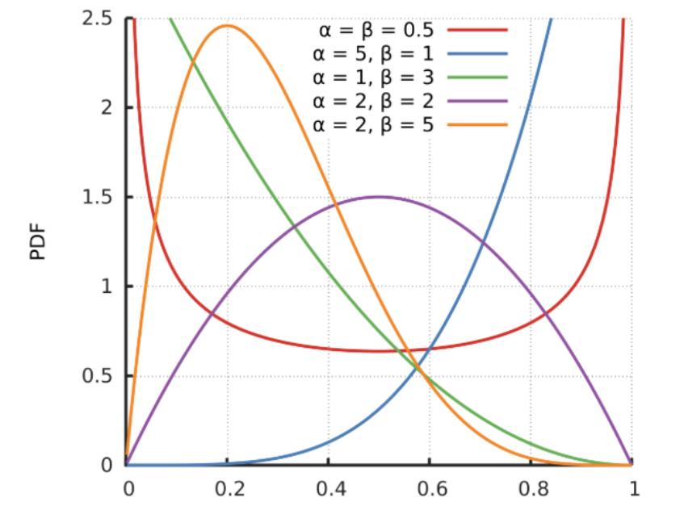

# 图像增强
:label:`sec_image_augmentation`
 :numref:`sec_alexnet`提到过大型数据集是成功应用深度神经网络的先决条件。
图像增强在对训练图像进行一系列的随机变化之后，生成相似但不同的训练样本，从而扩大了训练集的规模。
此外，应用图像增强的原因是，随机改变训练样本可以减少模型对某些属性的依赖，从而提高模型的泛化能力。 
例如，我们可以以不同的方式裁剪图像，使感兴趣的对象出现在不同的位置，减少模型对于对象出现位置的依赖。
我们还可以调整亮度、颜色等因素来降低模型对颜色的敏感度。
可以说，图像增强技术对于AlexNet的成功是必不可少的。本节将讨论这项广泛应用于计算机视觉的技术。
```python
%matplotlib inline
import torch
import torchvision
from torch import nn
from d2l import torch as d2l
```
## 常用的图像增强方法
在对常用图像增强方法的探索时，我们将使用下面这个尺寸为$400\times 500$的图像作为示例。
```python
d2l.set_figsize()
img = d2l.Image.open('../img/cat1.jpg')
d2l.plt.imshow(img);
```

大多数图像增强方法都具有一定的随机性。为了便于观察图像增强的效果，我们下面定义辅助函数`apply`。此函数在输入图像`img`上多次运行图像增强方法`aug`并显示所有结果。
```python
def apply(img, aug, num_rows=2, num_cols=4, scale=1.5):
    Y = [aug(img) for _ in range(num_rows * num_cols)]
    d2l.show_images(Y, num_rows, num_cols, scale=scale)
```
### 翻转和裁剪
**左右翻转图像**通常不会改变对象的类别。这是最早且最广泛使用的图像增强方法之一。
接下来，我们使用`transforms`模块来创建`RandomFlipLeftRight`实例，这样就各有50%的几率使图像向左或向右翻转。
```python
apply(img, torchvision.transforms.RandomHorizontalFlip())
```

**上下翻转图像**不如左右图像翻转那样常用。但是，至少对于这个示例图像，上下翻转不会妨碍识别。接下来，我们创建一个`RandomFlipTopBottom`实例，使图像各有50%的几率向上或向下翻转。
```python
apply(img, torchvision.transforms.RandomVerticalFlip())
```

在我们使用的示例图像中，猫位于图像的中间，但并非所有图像都是这样。
在 :numref:`sec_pooling`中，我们解释了汇聚层可以降低卷积层对目标位置的敏感性。
另外，我们可以通过对图像进行随机裁剪，使物体以不同的比例出现在图像的不同位置。
这也可以降低模型对目标位置的敏感性。
下面的代码将**随机裁剪**一个面积为原始面积10%到100%的区域，该区域的宽高比从0.5～2之间随机取值。
然后，区域的宽度和高度都被缩放到200像素。
在本节中（除非另有说明），$a$和$b$之间的随机数指的是在区间$[a, b]$中通过均匀采样获得的连续值。
```python
shape_aug = torchvision.transforms.RandomResizedCrop(
    (200, 200), scale=(0.1, 1), ratio=(0.5, 2))
apply(img, shape_aug)
```

### 改变颜色
另一种增强方法是改变颜色。
我们可以改变图像颜色的四个方面：亮度、对比度、饱和度和色调。
在下面的示例中，我们**随机更改图像的亮度**，随机值为原始图像的50%（$1-0.5$）到150%（$1+0.5$）之间。
```python
apply(img, torchvision.transforms.ColorJitter(
    brightness=0.5, contrast=0, saturation=0, hue=0))
```

同样，我们可以**随机更改图像的色调**。
```python
apply(img, torchvision.transforms.ColorJitter(
    brightness=0, contrast=0, saturation=0, hue=0.5))
```

我们还可以创建一个`RandomColorJitter`实例，并设置如何同时**随机更改图像的亮度（`brightness`）、对比度（`contrast`）、饱和度（`saturation`）和色调（`hue`）**。
```python
color_aug = torchvision.transforms.ColorJitter(
    brightness=0.5, contrast=0.5, saturation=0.5, hue=0.5)
apply(img, color_aug)
```

### **结合多种图像增强方法**
在实践中，我们将结合多种图像增强方法。比如，我们可以通过使用一个`Compose`实例来综合上面定义的不同的图像增强方法，并将它们应用到每个图像。
```python
augs = torchvision.transforms.Compose([
    torchvision.transforms.RandomHorizontalFlip(), color_aug, shape_aug])
apply(img, augs)
```

## **使用图像增强进行训练**
让我们使用图像增强来训练模型。
这里，我们使用CIFAR-10数据集，而不是我们之前使用的Fashion-MNIST数据集。
这是因为Fashion-MNIST数据集中对象的位置和大小已被规范化，而CIFAR-10数据集中对象的颜色和大小差异更明显。
CIFAR-10数据集中的前32个训练图像如下所示。
```python
all_images = torchvision.datasets.CIFAR10(train=True, root="../data",
                                          download=True)
d2l.show_images([all_images[i][0] for i in range(32)], 4, 8, scale=0.8);
```
    Downloading https://www.cs.toronto.edu/~kriz/cifar-10-python.tar.gz to ../data/cifar-10-python.tar.gz
      0%|          | 0/170498071 [00:00<?, ?it/s]
    Extracting ../data/cifar-10-python.tar.gz to ../data

为了在预测过程中得到确切的结果，我们通常对训练样本只进行图像增强，且在预测过程中不使用随机操作的图像增强。
在这里，我们**只使用最简单的随机左右翻转**。
此外，我们使用`ToTensor`实例将一批图像转换为深度学习框架所要求的格式，即形状为（批量大小，通道数，高度，宽度）的32位浮点数，取值范围为0～1。
```python
train_augs = torchvision.transforms.Compose([
     torchvision.transforms.RandomHorizontalFlip(),
     torchvision.transforms.ToTensor()])
test_augs = torchvision.transforms.Compose([
     torchvision.transforms.ToTensor()])
```
接下来，我们**定义一个辅助函数，以便于读取图像和应用图像增强**。PyTorch数据集提供的`transform`参数应用图像增强来转化图像。有关`DataLoader`的详细介绍，请参阅 :numref:`sec_fashion_mnist`。
```python
def load_cifar10(is_train, augs, batch_size):
    dataset = torchvision.datasets.CIFAR10(root="../data", train=is_train,
                                           transform=augs, download=True)
    dataloader = torch.utils.data.DataLoader(dataset, batch_size=batch_size,
                    shuffle=is_train, num_workers=d2l.get_dataloader_workers())
    return dataloader
```
### 多GPU训练
我们在CIFAR-10数据集上训练 :numref:`sec_resnet`中的ResNet-18模型。
回想一下 :numref:`sec_multi_gpu_concise`中对多GPU训练的介绍。
接下来，我们**定义一个函数，使用多GPU对模型进行训练和评估**。
```python
#@save
def train_batch_ch13(net, X, y, loss, trainer, devices):
    """用多GPU进行小批量训练"""
    if isinstance(X, list):
        # 微调BERT中所需
        X = [x.to(devices[0]) for x in X]
    else:
        X = X.to(devices[0])
    y = y.to(devices[0])
    net.train()
    trainer.zero_grad()
    pred = net(X)
    l = loss(pred, y)
    l.sum().backward()
    trainer.step()
    train_loss_sum = l.sum()
    train_acc_sum = d2l.accuracy(pred, y)
    return train_loss_sum, train_acc_sum
```
```python
#@save
def train_ch13(net, train_iter, test_iter, loss, trainer, num_epochs,
               devices=d2l.try_all_gpus()):
    """用多GPU进行模型训练"""
    timer, num_batches = d2l.Timer(), len(train_iter)
    animator = d2l.Animator(xlabel='epoch', xlim=[1, num_epochs], ylim=[0, 1],
                            legend=['train loss', 'train acc', 'test acc'])
    net = nn.DataParallel(net, device_ids=devices).to(devices[0])
    for epoch in range(num_epochs):
        # 4个维度：储存训练损失，训练准确度，实例数，特点数
        metric = d2l.Accumulator(4)
        for i, (features, labels) in enumerate(train_iter):
            timer.start()
            l, acc = train_batch_ch13(
                net, features, labels, loss, trainer, devices)
            metric.add(l, acc, labels.shape[0], labels.numel())
            timer.stop()
            if (i + 1) % (num_batches // 5) == 0 or i == num_batches - 1:
                animator.add(epoch + (i + 1) / num_batches,
                             (metric[0] / metric[2], metric[1] / metric[3],
                              None))
        test_acc = d2l.evaluate_accuracy_gpu(net, test_iter)
        animator.add(epoch + 1, (None, None, test_acc))
    print(f'loss {metric[0] / metric[2]:.3f}, train acc '
          f'{metric[1] / metric[3]:.3f}, test acc {test_acc:.3f}')
    print(f'{metric[2] * num_epochs / timer.sum():.1f} examples/sec on '
          f'{str(devices)}')
```
现在，我们可以**定义`train_with_data_aug`函数，使用图像增强来训练模型**。该函数获取所有的GPU，并使用Adam作为训练的优化算法，将图像增强应用于训练集，最后调用刚刚定义的用于训练和评估模型的`train_ch13`函数。
```python
batch_size, devices, net = 256, d2l.try_all_gpus(), d2l.resnet18(10, 3)
def init_weights(m):
    if type(m) in [nn.Linear, nn.Conv2d]:
        nn.init.xavier_uniform_(m.weight)
net.apply(init_weights)
def train_with_data_aug(train_augs, test_augs, net, lr=0.001):
    train_iter = load_cifar10(True, train_augs, batch_size)
    test_iter = load_cifar10(False, test_augs, batch_size)
    loss = nn.CrossEntropyLoss(reduction="none")
    trainer = torch.optim.Adam(net.parameters(), lr=lr)
    train_ch13(net, train_iter, test_iter, loss, trainer, 10, devices)
```
让我们使用基于随机左右翻转的图像增强来**训练模型**。
```python
train_with_data_aug(train_augs, test_augs, net)
```
    loss 0.173, train acc 0.941, test acc 0.854
    4183.9 examples/sec on [device(type='cuda', index=0), device(type='cuda', index=1)]

## 小结
* 图像增强基于现有的训练数据生成随机图像，来提高模型的泛化能力。
* 为了在预测过程中得到确切的结果，我们通常对训练样本只进行图像增强，而在预测过程中不使用带随机操作的图像增强。
* 深度学习框架提供了许多不同的图像增强方法，这些方法可以被同时应用。
## 练习
1. 在不使用图像增强的情况下训练模型：`train_with_data_aug(no_aug, no_aug)`。比较使用和不使用图像增强的训练结果和测试精度。这个对比实验能支持图像增强可以减轻过拟合的论点吗？为什么？
2. 在基于CIFAR-10数据集的模型训练中结合多种不同的图像增强方法。它能提高测试准确性吗？
3. 参阅深度学习框架的在线文档。它还提供了哪些其他的图像增强方法？
[Discussions](https://discuss.d2l.ai/t/2829)
### 4. QA
Q1: 理论上是不是原始样本足够多就不需要做增强？
> 是的，但实际情况中很难有足够多样性的图片能覆盖测试的所有情况。
>
> 数据量大也不一定意味着足够多样，可能简单情况已经很充分，但对于很难的情况覆盖率不够。
Q2: （代码实现中的）num_worker值是不是根据GPU性能而定？
> 是。
>
> 这里老师还提到虽然深度学习主要用GPU，但CPU也不能太差，否则可能数据预处理跟不上，CPU的内存带宽和到显卡的带宽不够。具体决定num_worker可以自己定一个值然后跑一个epoch看看耗时。
Q3: 金融风控领域经常面临极度偏斜数据（欺诈样本极少），是否可对正样本做数据增强？
> 可以，类似地震预测等等正样本少的情况都可以尝试对正样本做增强，负样本可以不用。
Q4: 测试一般做什么样的增强？如何理解对测试集增强能提高精度？
> 一般不对测试集做增强。也可以对一张测试图像做增强，将每个增强出的图片都做一次预测最后取平均，会一定程度改善精度。但这样会使得对每张图片预测计算量成倍增长，所以使用较少。
Q5: 课件里提到的对比实验固定了所有随机种子吗？昨晚增强后训练精度下降是不是意味着还可以继续训练减少gap？
> 没有。
>
> 是的，课堂演示时往往跑的epoch较少，另外训练到后期gap一般不会减少。
Q6: 图片增强后需要人工一张张确认效果吗？
> 不用全看，大概看看效果即可。
Q7: 图片增强后训练数据与测试数据分布可能不同，会对模型最终精度有影响吗？
> 首先多数图片增强手段不改变数据分布，因为亮度变化等是随机的，数据的均值不变，翻转不影响分布，crop可能会有改变但影响不大。
>
> 后面还有问题提到对增强不改变数据分布的理解，可理解成增强不改变均值但稍微增大方差。很多时候讨论训练集和测试集分布是否相同不是看原始的像素分布而是看各label比例或图片色调等是否差不多。
Q8: 关于图神经网络
> 图神经网络很强大但不好训练，目前落地还太早了
Q9: 关于mosaic和crop
> 把多张图片拼起来训练。这里老师理解错了问题，提到了加马赛克和本节代码中一次展示八张图片只是一起显示而不是使用了crop方法。
Q10: 用对一个事物的视频描述做数据集是不是会比增强更有效？
> 可以这么认为，但拍视频是很贵的事情，获取视频往往划不来。
Q11: 多张图片叠加是否也是有效的增强方式？
> 是的，这种方法叫mix-up，非常有用。
>
> 后面有问到为什么mix-up有用，老师也不清楚。
>
> lable的叠加是对两张图片label按特定分布随机取权重加权求和
Q12: 做车辆位置识别如果实际应用场景摄像头高度角度清晰度都和训练集不一样，是不是只能针对场景单独采集数据重新打标训练？
> 是，可以考虑将实际部署时识别错误的数据加入训练集使得训练集测试集分布趋同
Q13: 是否会出现图像增强减小类间差异，混淆不同类别的情况？
> 那倒不会。可以考虑不要crop太小的区域。
Q14: 实际操作用torchvision还是albumentation?
> 都差不多

#### **mixup混类数据增强方式**  
(1). mixup介绍  
mixup是一种运用在计算机视觉中的对图像进行混类增强的算法，它可以将不同类之间的图像进行混合，从而扩充训练数据集。
(2). mixup原理  
假设 $batch_{x1}$是一个batch样本，$batch_{y1}$​是该batch样本对应的标签；$batch_{x2}$是另一个 batch样本，$batch_{y2}$​是该batch样本对应的标签，$\lambda$是由参数为 α, β的贝塔分布计算出来的混合系数，由此我们可以得到mixup原理公式为：$${\lambda=Beta(\alpha,\beta)\tag{3.1}}$$$$mixed\_ batch_x=\lambda*batch_{x1}+(1-\lambda)*batch_{x2}\tag{3.2}$$
$${mixed\_batch_y=\lambda*batch_{y1}+(1-\lambda)*batch_{y_2}}\tag{3.3} $$
其中β指的是贝塔分布，mixed_batchx​是混合后的batch样本$,mixed_batch_{y}$​是混合后的 batch样本对应的标签。
需要说明几点：  

1. 在论文作者多组实验中，无论如何设置 α，β的值，期望  $\frac{\alpha}{\alpha+\beta}$​始终近似为0.5。这可能是由于权重 λ在每个batch样本都会随机产生，在整个训练过程中会有N个batch，权重在N个batch中期望近似为0.5。所以作者认为产生 $batch_{x1}$与  $batch_{x2}$​样本混合权重  λ的Beta分布参数  α=β=0.5时，算法效果相对较好。Beta分布如下图：  
2. $batch_{x1}$​与 $batch_{x2}$没有太多的限制, batch size=1时，就是两张图片样本混合；当 batch size>1时，便是两个 batch图片样本两两对应混合。此外， $batch_{x1}$与  $batch_{x2}$​可以是同一批样本，也可以是不同批样本。一般在代码实现过程中，两个 batch图片是同一批样本，唯一不同的是， $batch_{x1}$是原始 batch图片样本，而  $batch_{x2}$​是对 $batch_{x1}$在 batch size维度进行shuffle后得到的。
3. mixup原理大致如上，在实际代码实现过程中可能略有不同，需要灵活处理。
mixup代码实现部分如下：
```python
###############################author：qiu#################################
########################修改位置1:config.configurations#########################
#在代码配置config中添加以下键值信息:
USE_MIXUP=True,  #是否使用mixup方法增强数据集
MIXUP_ALPHA = 0.5,#add mixup alpha ,用于beta分布
##########################################################################
#######################修改位置2:添加mixup.py文件############################
import numpy as np
import torch
import torch.nn as nn
from loss.focal import FocalLoss
LOSS=FocalLoss()
def criterion(batch_x, batch_y, alpha=1.0, use_cuda=True):
    '''
    batch_x：批样本数，shape=[batch_size,channels,width,height]
    batch_y：批样本标签，shape=[batch_size]
    alpha：生成lam的beta分布参数，一般取0.5效果较好
    use_cuda：是否使用cuda
    
    returns：
    	mixed inputs, pairs of targets, and lam
    '''
    
    if alpha > 0:
    	#alpha=0.5使得lam有较大概率取0或1附近
        lam = np.random.beta(alpha, alpha)
    else:
        lam = 1
    batch_size = batch_x.size()[0]
    if use_cuda:
        index = torch.randperm(batch_size).cuda()
    else:
        index = torch.randperm(batch_size) #生成打乱的batch_size索引
	
	#获得混合的mixed_batchx数据，可以是同类（同张图片）混合，也可以是异类（不同图片）混合
	mixed_batchx = lam * batch_x + (1 - lam) * batch_x[index, :]
	
	"""
	Example：
	假设batch_x.shape=[2,3,112,112]，batch_size=2时，
	如果index=[0,1]的话，则可看成mixed_batchx=lam*[[0,1],3,112,112]+(1-lam)*[[0,1],3,112,112]=[[0,1],3,112,112]，即为同类混合
	如果index=[1,0]的话，则可看成mixed_batchx=lam*[[0,1],3,112,112]+(1-lam)*[[1,0],3,112,112]=[batch_size,3,112,112]，即为异类混合
	"""
    batch_ya, batch_yb = batch_y, batch_y[index]
    return mixed_batchx, batch_ya, batch_yb, lam
def mixup_criterion(criterion, inputs, batch_ya, batch_yb, lam):
    return lam * criterion(inputs, batch_ya) + (1 - lam) * criterion(inputs, batch_yb)
##########################################################################
#####################修改位置3：train.py文件修改代码如下######################
if torch.cuda.is_available() and DEVICE.type=="cuda":  #add
	inputs, targets = inputs.cuda(), targets.cuda()   
else:
	inputs = inputs.to(DEVICE)
	targets = targets.to(DEVICE).long()                   
	
if cfg['USE_MIXUP']:
	inputs, targets_a, targets_b, lam = mixup.mixup_data(
		inputs,targets,cfg["MIXUP_ALPHA"], torch.cuda.is_available())  
	
	#映射为Variable
	inputs, targets_a, targets_b = map(Variable, (inputs,targets_a,targets_b))
	#抽取特征，BACKBONE为粗特征抽取网络
	features = BACKBONE(inputs)   
	#抽取特征，HEAD为精细的特征抽取网络
	outputs = mixup.mixup_criterion(HEAD, features, targets_a, targets_b, lam)
	loss = mixup.mixup_criterion(LOSS, outputs, targets_a, targets_b, lam)             
else:
	features = BACKBONE(inputs)  
	outputs = HEAD(features, targets)                     
	loss = FocalLoss(outputs, labels)     
##########################################################################
```