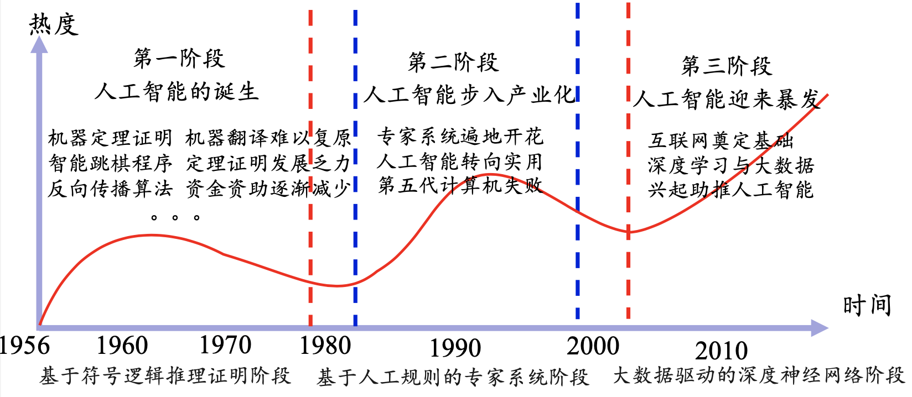
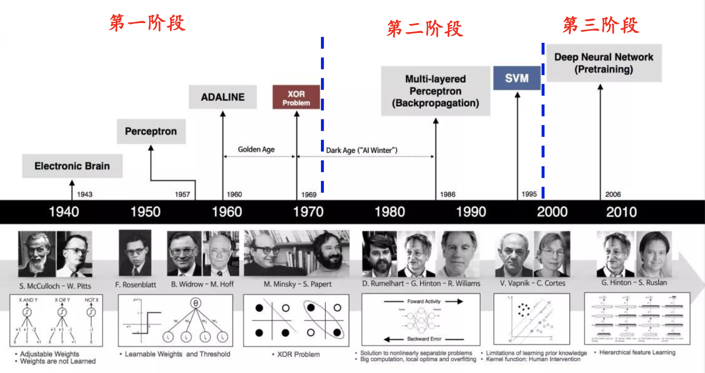

绪论与深度学习概述
1. 人工智能、机器学习与深度学习
2. 起源与发展
3. 重要的研究机构和著名科学家
4. 定义、理论和方法
5. 主要应用
# 人工智能、机器学习与深度学习
### 人工智能
人工智能是一门新兴学科，关于人工智能的定义，有很多人给出过，比如
- 约翰·麦卡锡(2007)：It is the science and engineering of making intelligent machines, especially intelligent computer programs. It is related to the similar task of using computers to understand human intelligence, but AI does not have to confine itself to methods that are biologically observable.
- Andreas Kaplan：A system’s ability to correctly interpret external data, to learn from such data, and to use those learnings to achieve specific goals and tasks through flexible adaptation.
- 全国信息安全标准化技术委员会：人工智能，是利用数字计算机或者数字计算机控制的机器模拟、延伸 和扩展人的智能，感知环境、获取知识并使用知识获得最佳结果的理 论、方法、技术及应用系统。
人工智能可以分成以下三类：
- 强人工智能：认为有可能制造出真正能推理和解决问题的智能机器，这样的机器被认为是有自主意识的
- 弱人工智能：认为不可能制造出能真正进行推理和解决问题的智能 机器，这些机器只不过看起来像是智能的，但是并不真正拥有智能， 也不会有自主意识
- 超级人工智能：机器的智能彻底超过了人类，“奇点”2050年到来？
**人工智能的三次浪潮**

### 机器学习
**机器学习定义**   让计算机具有像人一样的学习和思考能力的技术的总称。具体来说是从已知数据中获得规律，并利用规律对未知数据进行预测的技术
**机器学习分类**
- 有监督学习(SupervisedLearning)：有老师(环境)的情况下， 学生(计算机)从老师(环境)那里获得对错指示、最终答案的学
  习方法。跟学师评
- 无监督学习(UnsupervisedLearning)：没有老师(环境)的情
  况下，学生(计算机)自学的过程，一般使用一些既定标准进行评价。自学标评
- 强化学习(ReinforcementLearning)：没有老师(环境)的情况 下，学生(计算机)对问题答案进行自我评价的方法。自学自评
# 起源与发展

- 第一阶段(1943 -1969)
  - 1943年：Warren McCulloch和Walter Pitts提出了MP神经元模型
  - 1958年：Frank Rosenblatt提出了感知器(Perceptron)
  - 1960年：Bernard Widrow和Ted Hoff提出了ADLINE神经网络
  - 1969年：Marvin Minsky和Seymour Papert指出感知器只能做简单的线性分类任务，无法解决XOR这种简单分类问题
- 第二阶段(1980 -1989)
  - 1982年：John Hopfield提出了Hopfield神经网络
  - 1986年：David Rumelhart、Geoffrey Hinton和Ronald Williams提 出了误差反向传播算法(Error Back Propagation, BP)
  - 1989年:YannLeCun等人提出了卷积神经网络(Convolutional Neural Networks，CNN)
- 第三阶段(2006 - )
  - 2006年:Hinton和他的学生正式提出了深度学习的概念，通过无监督学习方法逐层训练算法，再使用有监督的反向传播算法进行调优
  - 2011年:Frank Seide在语音识别基准测试数据集上获得压倒性优势
  - 2012年:AlexKrizhevsky在CNN中引入ReLU激活函数，在图像识别基准测试中获得压倒性优势。
  - 2012年：吴恩达(Andrew Ng)教授和谷歌首席架构师Jeff Dean共 同主导著名的GoogleBrain项目，采用16万个CPU来构建一个深层 神经网络——DNN，将其应用于图像和语音的识别，大获成功
  - 2014年：Facebook的DeepFace项目，在人脸识别方面的准确率已 经能够达到97%以上，跟人类识别的准确率几乎没有差别
  - 2016年：谷歌DeepMind开发的AlphaGo以4:1的比分战胜国际顶尖 围棋高手李世石，证明在围棋领域，基于深度学习技术的机器人已
    经超越了人类
# 重要的研究机构和著名科学家
### 深度学习研究机构
- **Machine Learning at University of Toronto** 
代表人物：GeoffreyHinton
- **Deepmind at Google**
- **AI research at Facebook**
- **清华大学AI研究院** 
- **中国科学院自动化所**
- **中国科学院数学与系统科学研究院**
- **Tencent AI Lab**
- **华为诺亚方舟实验室**
- **阿里达摩院**
- ...
### 深度学习知名科学家
- **Geoffrey Hinton**
深度学习之父；多伦多大学杰出教授；Google副总裁及首席科学顾问；英国皇家科学院院士，美国国家工 程院外籍院士，美国艺术与科学院 外籍院士。
在BP算法，Boltzmannmachines, Time-delay neural nets, Variational learning and Deep learning做出杰出文献。
- **Yann LeCun**
卷积神经网络之父；纽约大学杰出教授；Facebook人工智能实验室负责人；纽约大学数据科学实验室创始人。
在学习理论与学习算法、卷积神经 网络领域做出杰出文献。
- **Yoshua Bengio**
蒙特利尔大学全职教授；加拿大统计学习算法研究主席；加拿大皇家科学院院士；CIFAR Senior Fellow；创办了ICLR国际会议。
在MachineLearning，Deeplearning 领域做出杰出文献。
- **吴恩达(Andrew Ng)**
斯坦福大学计算机科学系和电子工程系副教授；在线教育平台Coursera的联合创始人(with Daphne Koller)；2014年5月16日，吴恩达加入百度，担任百度公司首席科学家；2017年10月，吴恩达出任Woebot公司新任董事长。

# 深度学习的定义和主要应用
### 定义
**深度学习定义**：一般是指通过训练多层网络结构对未知数据进行分类或回归
**深度学习分类**：有监督学习方法——深度前馈网络、卷积神经网络、循环神经网络等；无监督学习方法——深度信念网、深度玻尔兹曼机，深度自编码器等。
### 主要应用
**图像处理领域主要应用**
- 图像分类(物体识别)：整幅图像的分类或识别
- 物体检测：检测图像中物体的位置进而识别物体
- 图像分割：对图像中的特定物体按边缘进行分割
- 图像回归：预测图像中物体组成部分的坐标
**语音识别领域主要应用**
- 语音识别：将语音识别为文字
- 声纹识别：识别是哪个人的声音
- 语音合成：根据文字合成特定人的语音
**自然语言处理领域主要应用**
- 语言模型：根据之前词预测下一个单词。
- 情感分析：分析文本体现的情感(正负向、正负中或多态度类型)。
- 神经机器翻译：基于统计语言模型的多语种互译。
- 神经自动摘要：根据文本自动生成摘要。
- 机器阅读理解：通过阅读文本回答问题、完成选择题或完型填空。
- 自然语言推理：根据一句话(前提)推理出另一句话(结论)。
**综合应用**
- 图像描述：根据图像给出图像的描述句子
- 可视问答：根据图像或视频回答问题
- 图像生成：根据文本描述生成图像
- 视频生成：根据故事自动生成视频

深度学习介绍 Q&A
◆ **Q1：机器学习的可解释性？机器学习在图片分割为什么有效，目前有没有定论？**
> A1：模型的可解释性不管是深度学习还是机器学习都是非常受人关注的点，因为这像是一个黑盒，训练了一个模型，也不知道为什么work或者为什么不work。对于深度学习来说，模型的**可解释性**是做得不够好的；对于机器学习来说，我们对简单的模型可以理解，但当模型变得很深的时候，几乎只能放弃理解的过程。
>
> 特别地，**为什么有效**和**可解释性**是两个不同的概念，所有提出的新模型都会解释一下为什么有效，可解释性是说人是不是能理解这个模型，理解模型为什么工作是一个方面，还需要知道它什么时候不工作以及在什么地方会出现偏差。
>
> 目前来说，一个模型在一个应用/领域上为什么可以工作，会有一些解释，我们会在解释不同的模型的时候给大家进行讲解。
◆ **Q2：领域专家是什么意思？**
> A2：举个例子，比如我要做农业上的物体识别，我种了一棵树，想要看今年的收成怎么样，我有很多很多土地，用人去一个个查看很费力，于是我用一个无人机，将农作物的情况拍下来，假设得到了树的一些图片，而数据科学家不知道农作物什么样的情况是好，什么样是坏，于是**领域专家进行解释**，比如多少叶子算是好，什么样不好。同时**数据科学家**将领域专家的**问题翻译**成机器学习能做的任务。所以可以认为**领域专家**是**提需求**的人**甲方**，而**数据科学家**是**乙方**。
◆ **Q3：MXNet的GPU版本的安装必须要卸载CPU版本的吗？**
> A3：是的，但我们的课程是**基于Pytorch**，Pytorch会不一样一些。
◆ **Q4：深度学习无法用数学规范表述，只能用直觉理解是吗？**
> A4：不一定，深度学习模型可以用**数学形式表示**，接下来也会讲到很多数学的东西，但是说具体用数学解释它**为什么工作**，**为什么不工作**，这个是目前我们做的不好的地方。
◆ **Q5：符号学可以和机器学习融合起来吗？**
> A5：确实是可以的。目前来说，**符号学**在**深度学习**有一些新的进展，以前说符号学就是做一些符号上的推理，目前**深度学习如图神经网络**，可以做一些比较复杂的推理。
◆ **Q6：数据科学家和AI专家的主要区别在哪里？**
> A6：我觉得没有太多区别。数据科学家很多时候关注的是给一个数据，赶紧出一个模型，能工作就好了，**关注**的是如何把领域专家的一个实际的业务问题，变成一个机器学习能做的任务，训练成一个还不错的模型。**AI专家也可能是数据科学家**，也就是说其不仅要训练出来一个模型能用，而且会**关心**如何把模型精度做得很高，或者可以说，**资深数据科学家可以认为是AI专家**。
>
> 数据科学家可以有**两条路线**，一个是**不断开拓新领域**，比如机器学习在农业上的应用，在医疗上的应用等，这个是**往广的走**，**往深的走**的话可以称为是AI专家，在某一块方面了解得很深。
◆ **Q7：MAC是不是可以支持Pytorch？**
> A7：可以。
◆ **Q8：说自然语言处理仅仅停留在感知层面似乎不太合适？因为语言的理解和产出不仅仅是感知，也涉及到语言知识和世界知识，也涉及到规划，比如机器规划下一步要做什么。**
> A8：确实是这样，语言当然是一个很复杂的过程，我只是想说，自然语言处理我们做得还很一般，虽然能做一些感知以外的东西，但是我感觉是说，**不如**深度学习特别机器学习，在图片上的应用做得好一些。当然AI地图上也只是一个**大致的分类**，大家不用特别纠结。
◆ **Q9：请问老师有考虑后面讲一讲如何寻找自己领域的paper的经验吗？**
> A9：这是一个很好的问题，因为大家如果现在去读paper的话，可能每天都有一百篇paper出来，你怎么样去找到你想要的paper，总不能天天看朋友圈推文，这样只能知道别人读过的paper，不会有自己**独特的见解**，怎么样找到自己感兴趣和有启发性的论文，后面有机会和大家分享一下我的做法。
◆ **Q10：以无人驾驶为例，误判率在不断下降，但误判的影响还是很严重的，有可能从已有的判断case(样例)得到修正，从而完全避免这样的错误吗？**
> A10：**无人驾驶**中，任何一次出现的错误，都可能带来毁灭性的灾难。大家可能看到，特斯拉今天撞了，明天又撞了。所以说，无人驾驶对于**错误率**确实是非常注重的。
>
> 机器学习在学术界现在有很多关于**uncertainty**或者**robustness**的研究，就是说模型在数据偏移或者极端情况下会不会给出很不好的答案，我们不会特别深入去讲这个事情，但是无人驾驶这一块确实会通过大量的技术，比如说把不同的模型融合在一起，不是仅仅train一个模型，用多个模型来做投票。汽车有很多雷达、摄像头，它会通过不同的传感器来进行模型的融合，从而降低误差。
>
> 我们这个课程不会特别地讲，因为涉及到评价无人驾驶的特别技术，但在竞赛中我们会给大家看到如何通过**融合多个模型提升精度**的做法。
