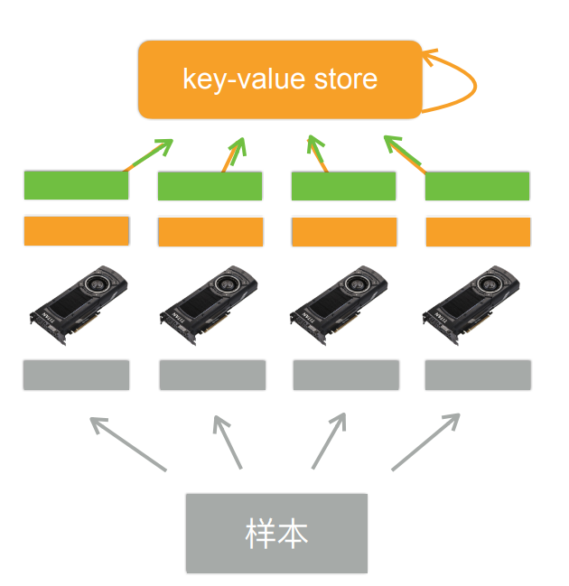

# 单机多卡并行
一台机器可以安装多个GPU（一般为1-16个），在训练和预测时可以将一个小批量计算切分到多个GPU上来达到加速目的，常用的切分方案有数据并行，模型并行，通道并行。
## 数据并行
将小批量的数据分为n块，每个GPU拿到完整的参数，对这一块的数据进行前向传播与反向传播，计算梯度。
数据并行通常性能比模型并行更好，因为对数据进行划分使得各个GPU的计算内容更加均匀。
### 数据并行的大致流程

主要分为五部
* 1：每个GPU读取一个数据块（灰色部分）
* 2：每个GPU读取当前模型的参数（橙色部分）
* 3：每个GPU计算自己拿到数据块的梯度（绿色部分）
* 4：GPU将计算得到的梯度传给内存（CPU）（绿色箭头）
* 5：利用梯度对模型参数进行更新（橙色箭头）
数据并行并行性较好，主要因为当每个GPU拿到的数据量相同时计算量也相似，各个GPU的运算时间相近，幸能较好
## 模型并行
将整个模型分为n个部分，每个GPU拿到这个部分的参数和负责上一个部分的GPU的输出作为输入来进行计算，反向传播同理。
模型并行通常用于模型十分巨大，参数众多，即使在每个mini-batch只有一个样本的情况下单个GPU的显存仍然不够的情况，但并行性较差，可能有时会有GPU处于等待状态。
## 通道并行
通道并行是数据并行和模型并行同时进行

# 自动并行
:label:`sec_auto_para`
深度学习框架（例如，MxNet、飞桨和PyTorch）会在后端自动构建计算图。利用计算图，系统可以了解所有依赖关系，并且可以选择性地并行执行多个不相互依赖的任务以提高速度。例如， :numref:`sec_async`中的 :numref:`fig_asyncgraph`独立初始化两个变量。因此，系统可以选择并行执行它们。
通常情况下单个操作符将使用所有CPU或单个GPU上的所有计算资源。例如，即使在一台机器上有多个CPU处理器，`dot`操作符也将使用所有CPU上的所有核心（和线程）。这样的行为同样适用于单个GPU。因此，并行化对单设备计算机来说并不是很有用，而并行化对于多个设备就很重要了。虽然并行化通常应用在多个GPU之间，但增加本地CPU以后还将提高少许性能。例如， :cite:`Hadjis.Zhang.Mitliagkas.ea.2016`则把结合GPU和CPU的训练应用到计算机视觉模型中。借助自动并行化框架的便利性，我们可以依靠几行Python代码实现相同的目标。对自动并行计算的讨论主要集中在使用CPU和GPU的并行计算上，以及计算和通信的并行化内容。
请注意，本节中的实验至少需要两个GPU来运行。
```python
import torch
from d2l import torch as d2l
```
## 基于GPU的并行计算
从定义一个具有参考性的用于测试的工作负载开始：下面的`run`函数将执行$10$次*矩阵－矩阵*乘法时需要使用的数据分配到两个变量（`x_gpu1`和`x_gpu2`）中，这两个变量分别位于选择的不同设备上。
```python
devices = d2l.try_all_gpus()
def run(x):
    return [x.mm(x) for _ in range(50)]
x_gpu1 = torch.rand(size=(4000, 4000), device=devices[0])
x_gpu2 = torch.rand(size=(4000, 4000), device=devices[1])
```
现在使用函数来处理数据。通过在测量之前需要预热设备（对设备执行一次传递）来确保缓存的作用不影响最终的结果。`torch.cuda.synchronize()`函数将会等待一个CUDA设备上的所有流中的所有核心的计算完成。函数接受一个`device`参数，代表是哪个设备需要同步。如果device参数是`None`（默认值），它将使用`current_device()`找出的当前设备。
```python
run(x_gpu1)
run(x_gpu2)  # 预热设备
torch.cuda.synchronize(devices[0])
torch.cuda.synchronize(devices[1])
with d2l.Benchmark('GPU1 time'):
    run(x_gpu1)
    torch.cuda.synchronize(devices[0])
with d2l.Benchmark('GPU2 time'):
    run(x_gpu2)
    torch.cuda.synchronize(devices[1])
```
    GPU1 time: 0.4600 sec
    GPU2 time: 0.4706 sec
如果删除两个任务之间的`synchronize`语句，系统就可以在两个设备上自动实现并行计算。
```python
with d2l.Benchmark('GPU1 & GPU2'):
    run(x_gpu1)
    run(x_gpu2)
    torch.cuda.synchronize()
```
    GPU1 & GPU2: 0.4580 sec
在上述情况下，总执行时间小于两个部分执行时间的总和，因为深度学习框架自动调度两个GPU设备上的计算，而不需要用户编写复杂的代码。
## 并行计算与通信
在许多情况下，我们需要在不同的设备之间移动数据，比如在CPU和GPU之间，或者在不同的GPU之间。例如，当执行分布式优化时，就需要移动数据来聚合多个加速卡上的梯度。让我们通过在GPU上计算，然后将结果复制回CPU来模拟这个过程。
```python
def copy_to_cpu(x, non_blocking=False):
    return [y.to('cpu', non_blocking=non_blocking) for y in x]
with d2l.Benchmark('在GPU1上运行'):
    y = run(x_gpu1)
    torch.cuda.synchronize()
with d2l.Benchmark('复制到CPU'):
    y_cpu = copy_to_cpu(y)
    torch.cuda.synchronize()
```
    在GPU1上运行: 0.4608 sec
    复制到CPU: 2.3504 sec
这种方式效率不高。注意到当列表中的其余部分还在计算时，我们可能就已经开始将`y`的部分复制到CPU了。例如，当计算一个小批量的（反传）梯度时。某些参数的梯度将比其他参数的梯度更早可用。因此，在GPU仍在运行时就开始使用PCI-Express总线带宽来移动数据是有利的。在PyTorch中，`to()`和`copy_()`等函数都允许显式的`non_blocking`参数，这允许在不需要同步时调用方可以绕过同步。设置`non_blocking=True`以模拟这个场景。
```python
with d2l.Benchmark('在GPU1上运行并复制到CPU'):
    y = run(x_gpu1)
    y_cpu = copy_to_cpu(y, True)
    torch.cuda.synchronize()
```
    在GPU1上运行并复制到CPU: 1.7703 sec
两个操作所需的总时间少于它们各部分操作所需时间的总和。请注意，与并行计算的区别是通信操作使用的资源：CPU和GPU之间的总线。事实上，我们可以在两个设备上同时进行计算和通信。如上所述，计算和通信之间存在的依赖关系是必须先计算`y[i]`，然后才能将其复制到CPU。幸运的是，系统可以在计算`y[i]`的同时复制`y[i-1]`，以减少总的运行时间。
最后，本节给出了一个简单的两层多层感知机在CPU和两个GPU上训练时的计算图及其依赖关系的例子，如 :numref:`fig_twogpu`所示。手动调度由此产生的并行程序将是相当痛苦的。这就是基于图的计算后端进行优化的优势所在。

:label:`fig_twogpu`
## 小结
* 现代系统拥有多种设备，如多个GPU和多个CPU，还可以并行地、异步地使用它们。
* 现代系统还拥有各种通信资源，如PCI Express、存储（通常是固态硬盘或网络存储）和网络带宽，为了达到最高效率可以并行使用它们。
* 后端可以通过自动化地并行计算和通信来提高性能。

# Q&A（部分有价值的）
* 问1：若有4块GPU，两块显存大两块显存小怎么办？
* 答1：
  若GPU运算性能相同，则训练取决于小显存的GPU的显存大小，更大的显存相当于浪费掉
  若GPU运算性能不同，一般即为显存大的GPU性能更好，可以在分配数据时多分配一点
* 
* 问2：数据拆分后，需存储的数据量会变大吗？会降低性能吗？
* 答2：每个GPU都单独存储了一份模型，这部分的数据量变大了，但如果只考虑运算时的中间变量，则中间变量的大小与数据量呈线性关系，每个GPU的数据小了，中间变量也会变小，所有GPU的中间变量加起来大小是不变的。
  数据拆分后性能会变低，在下节课讲解（数据通讯的开销，每个GPU的batch-size变小可能无法跑满GPU，总batch-size变大则相同计算量下训练次数变少）
##### Q1:  如果要提高泛化性，就要增加数据？调参的意思是不是最大？
> 提高泛化性的有效手段是增加数据，但是数据的质量很重要，少量高质量数据和大量低质量数据可能有1:10或者1:100的换算关系。实际应用场景对调参要求不高，因为有不断增加的数据。
>
##### Q2:alexnet模型比resnet要大，为什么计算上resnet比alexnet运算量大？
> alexnet后面用到的几个连续的全连接层使模型变大，但是resnet使用的卷积层在少量参数下更消耗计算资源。模型大小和计算复杂度不能直接换算。
>
##### Q3:训练时为什么使用w-=lr\*w.grad,而不写做w=w-lr\*w.grad?
> 因为第二种写法定义了一个新的tensor，梯度参数会成为false
>
##### Q4:llc是显存还是缓存，是l1,l2,还是l3?
> llc是缓存，last level cash,是最后一层缓存，具体是ln取决于一共有几层缓存。
>
##### Q5:做计算时把for_lopps运算尽可能向量化？
> 是的，尽量不要用python写for-loop
>
##### Q6:可视化时，需要把数据在cpu和GPU之间切换，如何避免频繁传输？常见的错误操作有哪些？怎么看到和排查这种错误？
> 可视化操作不需要太担心，只要不是计算中来回传递就好。深度学习框架会有限制，只能在一个设备上做。框架没报错一般不会有太多问题
>
##### Q7:go怎么样？
> go分布式系统做的很好，和深度学习的分布式不太一样
>
##### Q8:怎样复现论文？
> 80%的论文无法复现，要读懂每一句话，和明白作者实现的细节。
##### Q9：分布式和高性能的区别？
> 没有本质区别，分布式更多考虑容错。高性能是分布式的一个应用
>
##### Q10:自动驾驶烧钱，短时间难以落地是不是和nas一样？
> 不是，自动驾驶有很好的商业前景。nas没有太多意义。
>
