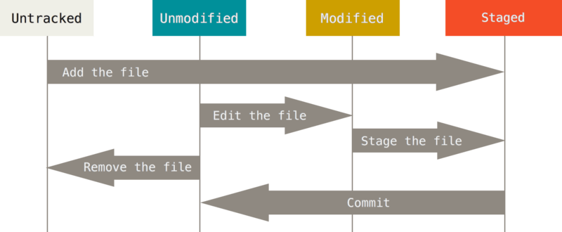

#### 常用命令
Git作为一个版本控制系统，提供了许多常见的操作，以下是一些常见的Git操作：
1. 初始化仓库：`git init` - 在当前目录初始化一个新的Git仓库。
2. 克隆仓库：`git clone <仓库URL>` - 从远程仓库克隆一个本地副本。
3. 添加文件：`git add <文件名>` - 将文件添加到Git的暂存区。
4. 提交更改：`git commit -m "提交信息"` - 将暂存区的文件提交到本地仓库，并创建一个新的提交记录。
5. 查看状态：`git status` - 查看当前仓库的文件状态，包括已修改、已暂存和未跟踪的文件。
6. 查看提交历史：`git log` - 查看当前分支的提交历史，包括提交作者、时间和提交信息。
7. 推送到远程仓库：`git push <远程仓库名> <分支名>` - 将本地仓库的提交推送到远程仓库。
8. 拉取远程更改：`git pull <远程仓库名> <分支名>` - 从远程仓库拉取最新的更改到本地仓库。
9. 创建分支：`git branch <分支名>` - 创建一个新的分支。
10. 切换分支：`git checkout <分支名>` - 切换到指定的分支。
11. 合并分支：`git merge <分支名>` - 将指定分支的更改合并到当前分支。
12. 解决冲突：当合并分支时，如果出现冲突，需要手动解决冲突并提交更改。
以上是一些常见的Git操作，还有许多其他的Git命令和操作可以用于管理代码版本和协作开发。
#### 推送步骤
要将文件推送到GitHub仓库中，可以按照以下步骤进行操作：
1. 首先，确保你已经在本地的Git仓库中初始化了一个仓库，并且与GitHub远程仓库建立了连接。如果没有，请先使用以下命令进行初始化和远程仓库连接：
```
git init
git remote add origin <远程仓库URL>
```
其中，`<远程仓库URL>` 是你要推送到的GitHub仓库的URL。
2. 将你要推送的文件添加到暂存区中，可以使用以下命令：
```
git add <文件名>
```
如果要添加多个文件，可以使用通配符 `*`。
3. 提交你的更改到本地仓库，使用以下命令：
```
git commit -m "提交信息"
```
在 `<提交信息>` 中，你可以输入一条有意义的提交信息，描述你的更改。
然后使用推荐的命令设置远程追踪分支:
```
git push --set-upstream origin main
```
或者手动设置远程追踪分支:
```
git branch --set-upstream-to=origin/main main
```
4. 最后，使用以下命令将本地更改推送到GitHub远程仓库：
```
git push origin <分支名称>
```
其中，`<分支名称>` 是你要推送到的分支的名称。通常，使用 `main` 或 `master` 作为默认的主分支名称。
如果你是第一次推送到GitHub仓库，可能需要提供GitHub账号的用户名和密码进行身份验证。
完成以上步骤后，Git就会将你的文件推送到GitHub仓库中。你可以在GitHub网站上查看文件是否已经成功推送。
连接到GitHub远程仓库后，您可以设置本地分支与远程分支的跟踪关系，以便更容易地进行推送和拉取操作。以下是设置跟踪关系的步骤：
1. 查看远程分支列表：执行以下命令，查看可用的远程分支列表：
```
git branch -r
```
您将看到形如`origin/<branch>`的远程分支。
2. 创建并切换到本地分支：执行以下命令，创建并切换到您想要跟踪的本地分支（如果该分支尚不存在）：
```
git checkout -b <本地分支名> origin/<远程分支名>
```
请将`<本地分支名>`替换为您想要创建和切换的本地分支的名称，将`<远程分支名>`替换为您想要跟踪的远程分支的名称。
3. 设置跟踪关系：执行以下命令，将本地分支与远程分支建立跟踪关系：
```
git branch --set-upstream-to=origin/<远程分支名> <本地分支名>
```
请将`<远程分支名>`替换为您想要跟踪的远程分支的名称，将`<本地分支名>`替换为您已经创建的本地分支的名称。
4. 验证跟踪关系：执行以下命令，确认本地分支与远程分支的跟踪关系是否成功设置：
```
git branch -vv
```
您将看到类似下面的输出，表示本地分支与远程分支成功建立了跟踪关系：
```
<本地分支名>  1234567 [origin/<远程分支名>] Commit message
```
现在，您的本地分支将跟踪远程分支，可以使用`git pull`命令获取远程分支的更新，使用`git push`命令将本地更改推送到远程分支。
请注意，以上步骤中的`<本地分支名>`和`<远程分支名>`分别是指您自己选择的本地分支和要跟踪的远程分支的名称。确保根据实际情况进行替换。
如果您遇到任何问题或需要进一步的帮助，请参考Git文档或咨询相关支持。
#### 设置用户名及密码
在Git中设置用户名和邮箱账号是为了将您的身份信息与提交的代码关联起来。以下是设置用户名和邮箱账号的步骤：
1. 打开终端或命令提示符。
2. 输入以下命令，配置您的用户名：
```
git config --global user.name "Your Name"
```
将 `"Your Name"` 替换为您希望显示在提交记录中的用户名。
3. 输入以下命令，配置您的邮箱账号：
```
git config --global user.email "your_email@example.com"
```
将 `"your_email@example.com"` 替换为您在GitHub或其他Git托管服务上使用的邮箱账号。
4. 验证配置是否成功，可以输入以下命令查看已配置的用户名和邮箱账号：
```
git config --global user.name
git config --global user.email
```
如果返回了您配置的用户名和邮箱账号，则说明配置成功。
请注意，`--global` 标记表示这些配置将应用于您的全局Git设置，这意味着它们将适用于您在计算机上的所有Git仓库。如果您只想为特定仓库设置用户名和邮箱账号，可以去掉 `--global` 标记，并在特定仓库目录中执行相同的命令。
正确地设置用户名和邮箱账号对于确保您的代码贡献被正确归属非常重要。确保使用您在Git托管服务上注册的真实姓名和邮箱账号。
#### 远程删除文件
在Git中删除远程==文件==，可以按照以下步骤进行操作：
1. 打开命令行终端，进入与本地Git仓库关联的目录。
2. 使用以下命令将删除操作同步到本地Git仓库：
```
git rm <文件名>
```
其中，`<文件名>` 是你要删除的文件名。这将从本地Git仓库中删除该文件，并将这个删除操作添加到Git的暂存区。
3. 提交删除操作到本地Git仓库，使用以下命令：
```
git commit -m "删除文件"
```
在 `<删除文件>` 中，你可以输入一条有意义的提交信息，描述你的删除操作。
4. 使用以下命令将本地删除操作推送到远程仓库：
```
git push origin <分支名称>
```
其中，`<分支名称>` 是你要推送到的分支的名称。通常，使用 `main` 或 `master` 作为默认的主分支名称。
完成以上步骤后，Git会将你的删除操作同步到远程仓库，并删除对应的文件。你可以在远程仓库（例如GitHub）的网站上查看删除后的结果。请注意，这个操作是不可逆的，所以在删除文件之前请确保你的操作是正确的。
在Git中删除远程==文件夹==需要采取以下步骤：
1. 打开命令行终端，进入与本地Git仓库关联的目录。
2. 使用以下命令将删除操作同步到本地Git仓库：
```
git rm -r --cached <文件夹路径>
```
其中，`<文件夹路径>` 是你要删除的文件夹的路径。使用 `-r` 参数指定要递归地删除文件夹及其内容，并使用 `--cached` 参数将删除操作限制在Git缓存中，而不会删除实际的物理文件。
3. 提交删除操作到本地Git仓库，使用以下命令：
```
git commit -m "删除文件夹"
```
在 `<删除文件夹>` 中，你可以输入一条有意义的提交信息，描述你的删除操作。
4. 使用以下命令将本地删除操作推送到远程仓库：
```
git push origin <分支名称>
```
其中，`<分支名称>` 是你要推送到的分支的名称。通常，使用 `main` 或 `master` 作为默认的主分支名称。
通过以上步骤，Git会将你的删除操作同步到远程仓库，并删除对应的文件夹及其内容。请确保在删除文件夹之前，先备份好重要的文件，并且确认你的操作是正确的，因为这个操作是不可逆的。
#### ssh密钥
要使用GitHub密钥进行Git操作，您可以按照以下步骤进行设置：
1. 生成SSH密钥对。
   - 打开命令行终端（或Git Bash）。
   - 运行以下命令生成SSH密钥对：
     ```
     ssh-keygen -t rsa -b 4096 -C "352778601@qq.com"
     ```
     请将"your.email@example.com"替换为您在GitHub上注册的电子邮件地址。
   - 您将被提示选择密钥文件的保存位置和设置密码。如果您不想设置密码，请直接按Enter键。
   - 这将生成一个公钥文件（例如`id_rsa.pub`）和一个私钥文件（例如`id_rsa`）。
2. 将公钥添加到您的GitHub帐户。
   - 登录到GitHub帐户。
   - 点击右上角的头像，然后选择"Settings"。
   - 在左侧导航栏中选择"SSH and GPG keys"（或仅选择"SSH keys"）。
   - 点击"New SSH key"。
   - 在"Title"字段中，为您的密钥提供一个描述性的名称（例如，"My SSH Key"）。
   - 打开刚才生成的公钥文件（`.pub`文件），复制其中的内容。
   - 将公钥粘贴到"Key"字段中。
   - 点击"Add SSH key"保存。
3. 配置本地Git仓库以使用SSH协议。
   - 在命令行中导航到您的本地Git仓库目录。
   - 运行以下命令将远程仓库的URL更改为SSH协议的格式：
     ```
     git remote set-url origin git@github.com:<用户名>/<仓库名>.git
     ```
     请将`<用户名>`替换为您的GitHub用户名，`<仓库名>`替换为您的仓库名称。
现在，您已经成功地设置了GitHub密钥，并可以使用SSH协议连接和进行Git操作。当您执行Git操作时，Git将使用您的私钥进行身份验证，以便与GitHub进行安全的通信。
要查看已生成的SSH公钥，请按照以下步骤操作：
1. 在命令行终端（或Git Bash）中，输入以下命令：
   ```
   cat ~/.ssh/id_rsa.pub
   ```
   如果您选择了不同的密钥文件名或位置，请将上述命令中的路径和文件名进行相应的更改。
2. 按Enter键执行命令后，将显示您生成的SSH公钥的内容。
   公钥的内容将以一长串字符的形式显示
   公钥以"ssh-rsa"开头，并以您的电子邮件地址结尾。
现在，您已经成功地查看了您的SSH公钥。您可以将此公钥复制并添加到GitHub或其他Git托管平台上，以进行身份验证和授权访问。
#### 未找到origin错误
```
git remote set-url origin git@github.com:tongxinzai/my_note.git
fatal: No such remote 'origin'
```
这个错误通常表示您的本地Git仓库中没有名为"origin"的远程仓库。
请确保您已经将正确的远程仓库URL添加到您的本地Git仓库中。您可以使用以下命令添加一个名为"origin"的远程仓库：
```
git remote add origin git@github.com:tongxinzai/my_note.git
```
这将把远程仓库URL设置为"git@github.com:tongxinzai/my_note.git" 并将其命名为"origin"。
如果您已经添加了名为"origin"的远程仓库，但仍然收到该错误消息，请确保您在正确的Git仓库目录中执行该命令。您可以通过运行`git remote -v`命令来检查您的本地Git仓库中存在的远程仓库。
如果问题仍然存在，请提供更多详细信息，以便我们更好地帮助您解决问题。
#### gitignore相关
.gitignore 文件用于告诉 Git 忽略某些文件或文件夹的变动，不纳入版本控制。以下是一些常见的 .gitignore 文件的用法和示例：
1. 忽略特定文件：
   ```
   file.txt            # 忽略特定文件
   folder/             # 忽略特定文件夹
   ```
2. 通配符：
   ```
   *.txt               # 忽略所有 .txt 文件
   build/              # 忽略所有名为 build 的文件夹及其内容
   ```
3. 排除特定类型文件：
   ```
   !important.txt      # 不忽略 important.txt 文件
   !/path/to/important.txt # 不忽略具体路径下的 important.txt 文件
   ```
4. 忽略规则：
   ```
   # 注释，以 '#' 开头
   /logs/              # 忽略根目录下的 logs 文件夹
   *.log               # 忽略所有 .log 文件
   /temp/*.tmp         # 忽略 temp 文件夹下的所有 .tmp 文件
   ```
5. 文件夹通配符：
   ```
   **/node_modules/    # 忽略任意层级下的 node_modules 文件夹
   ```
请注意，当你在 .gitignore 文件中添加规则后，Git 将忽略与规则匹配的文件或文件夹，但已经纳入版本控制的文件仍会保留在仓库中。
你可以根据你的项目需求，编辑和调整 .gitignore 文件中的规则，以忽略不需要纳入版本控制的文件和文件夹。
#### 更新gitignore
当`.gitignore`文件不起作用时，可以考虑以下几种原因和解决方法：
1. `.gitignore`文件位置：确保`.gitignore`文件位于项目的根目录下，并且文件名是正确的（注意大小写）。
2. 缓存问题：如果`.gitignore`文件最初没有被正确地添加到Git的版本控制中，或者之前已经缓存了需要忽略的文件，那么`.gitignore`的更改可能不会生效。可以尝试执行以下命令来清除缓存并重新将`.gitignore`添加到版本控制中：
   ```
   git rm -r --cached .
   git add .
   git commit -m "Updated .gitignore"
   ```
   这将删除缓存的文件，并将`.gitignore`的更改重新添加到版本控制中。
3. 模式匹配问题：查看`.gitignore`文件中的模式是否正确。确保使用正确的模式匹配语法，并且文件路径或模式与要忽略的文件或文件夹完全匹配。可以使用通配符（如`*`和`?`）来匹配文件名和文件夹。
4. 其他配置问题：检查是否有其他配置或规则覆盖了`.gitignore`文件的设置。例如，可能存在全局的`.gitignore`规则或其他Git钩子或配置文件。
如果仍然无法生效，建议检查一下Git的配置和项目的设置，确保没有其他因素影响`.gitignore`文件的工作。
#### 连接重置错误
```
$ git push
fatal: unable to access 'https://github.com/tongxinzai/my_note.git/': Recv failure: Connection was reset
```
这个错误通常表示在执行`git push`命令时，与GitHub服务器的连接被重置。这可能是由于网络问题、防火墙设置、代理配置或其他网络限制引起的。以下是一些可能的解决方法：
```
git remote rm origin  //之前git上传地址报错，删除一下
git config --global -l //查看git当前设置
git config --global --unset http.proxy //取消代理
git remote add origin git@github.com:tongxinzai/my_note.git
git push origin master //没有分支，直接上传master
```
####  未找到仓库错误
```
$git push
fatal: 'origin' does not appear to be a git repository
fatal: Could not read from remote repository.
Please make sure you have the correct access rights
and the repository exists.
```
这个错误通常表示在执行`git push`命令时，Git无法找到名为"origin"的远程仓库。这可能是由于以下原因引起的：
1. 未正确设置远程仓库：在执行`git push`之前，您需要先设置一个远程仓库。您可以使用以下命令添加一个名为"origin"的远程仓库：
   ```
   git remote add origin <repository_url>
   ```
   这里的`<repository_url>`是您要推送到的仓库的URL。确保提供了正确的URL。
2. 修改远程仓库名称：如果您已经使用了其他名称作为远程仓库的别名，您需要相应地更改`git push`命令中的"origin"为正确的远程仓库别名。
3. 远程仓库不存在：请确保您要推送到的远程仓库存在。您可以在执行`git remote -v`命令时查看已配置的远程仓库列表。
4. 访问权限问题：如果您没有足够的权限访问远程仓库
#### push冲突错误
To github.com:tongxinzai/my_note.git
! [rejected]        main -> main (fetch first)
error: failed to push some refs to 'github.com:tongxinzai/my_note.git'
hint: Updates were rejected because the remote contains work that you do
hint: not have locally. This is usually caused by another repository pushing
hint: to the same ref. You may want to first integrate the remote changes
hint: (e.g., 'git pull ...') before pushing again.
hint: See the 'Note about fast-forwards' in 'git push --help' for details.
这个错误通常表示您在尝试将本地更改推送到GitHub仓库时，发生了冲突。这可能是由于其他人已经对相同的分支进行了更改并已经推送到了远程仓库，或者您在其他地方进行了更改并在此之前没有更新本地仓库。
根据错误提示，您可以尝试执行以下操作来解决这个问题：
1. 首先，使用`git pull`命令从远程仓库获取最新的更改并合并到本地仓库。执行以下命令：
```
git pull origin main
```
请确保将`origin`替换为您的远程仓库名称（如果不是`origin`）。
2. 如果`git pull`命令成功合并了远程更改，并且没有冲突，然后您可以尝试再次执行`git push`命令将本地更改推送到远程仓库。
3. 如果`git pull`命令报告冲突，请手动解决冲突。打开相关的文件，查找标记为`<<<<<<<`和`>>>>>>>`之间的冲突部分，并根据您的需求进行编辑。解决冲突后，保存文件并执行`git add`命令将其标记为已解决。
4. 最后，执行`git commit`命令提交解决冲突后的更改，然后再次执行`git push`命令将更改推送到远程仓库。
请注意，如果您对Git操作不太熟悉或遇到复杂的冲突情况，可以考虑查阅更多的Git文档或寻求相关支持来帮助解决问题。
#### 未跟踪分支错误
$ git pull
There is no tracking information for the current branch.
Please specify which branch you want to merge with.
See git-pull(1) for details.
git pull <remote> <branch>
If you wish to set tracking information for this branch you can do so with:
git branch --set-upstream-to=origin/<branch> main
这个错误通常表示当前分支没有设置追踪信息，因此Git不知道应该从哪个远程分支获取更新。您可以按照错误提示的建议执行以下操作：
1. 使用`git branch -r`命令查看可用的远程分支列表。您应该能够看到形如`origin/<branch>`的远程分支。
2. 选择您想要与当前分支合并的远程分支。假设您想要与`origin/main`合并，则可以使用以下命令进行设置追踪信息：
```
git branch --set-upstream-to=origin/main main
```
请确保将`origin/main`替换为您想要追踪的特定远程分支。
3. 执行`git pull`命令来获取并合并远程分支的更新：
```
git pull
```
Git将从指定的远程分支获取更新并尝试将其合并到当前分支中。
这样，您就为当前分支设置了追踪信息，并且可以使用`git pull`命令从该远程分支获取更新。如果您希望与其他远程分支合并，只需更改相应的远程分支名称即可。
如果您对Git操作不太熟悉或遇到其他问题，请查阅Git文档或寻求相关支持以获得更多帮助。

#### 从master切换成 main
将本地仓库从`master`分支改为`main`分支，你可以按照以下步骤进行操作：
1. 切换到`master`分支：在命令行中，使用`git checkout master`命令切换到`master`分支。
2. 创建新的`main`分支：使用`git branch main`命令创建一个名为`main`的新分支。
3. 将代码切换到`main`分支：使用`git checkout main`命令将代码切换到`main`分支。
4. 推送新分支到远程仓库：使用`git push -u origin main`命令将新的`main`分支推送到远程仓库。
5. 删除`master`分支（可选）：如果你不再需要`master`分支，可以使用`git branch -d master`命令删除本地的`master`分支。请注意，删除分支前请确保已经备份好相关代码。
6. 重命名远程分支（可选）：如果你的远程仓库中仍然存在`master`分支，你可以使用以下命令将其重命名为`main`分支：
   - `git branch -m master main`：将本地的`master`分支重命名为`main`。
   - `git push origin -u main`：将重命名后的`main`分支推送到远程仓库。
   - `git push origin --delete master`：删除远程的`master`分支。
请注意，在执行这些操作之前，请确保你的代码库没有其他重要的分支或未提交的更改。此外，如果你与其他人共享仓库，请确保与他们进行沟通并建立好一致的分支命名规范。

#### 转换符警告
```
warning: in the working copy of '.obsidian/plugins/table-editor-obsidian/main.js', CRLF will be replaced by LF the next time Git touches it error: 'main/' does not have a commit checked out fatal: adding files failed
```
这个错误提示表明在你的文件中存在换行符的问题。Git 提示将 CRLF（回车换行）换行符替换为 LF（换行）换行符。此外，还出现了一个错误，即当前分支（`main/`）没有检出任何提交。
为了解决这个问题，你可以按照以下步骤进行操作：
1. 首先，确保你已经在正确的分支上工作。使用以下命令切换到正确的分支（比如 `main` 分支）：
```
git checkout main
```
2. 接下来，你需要解决换行符的问题。可以使用以下命令将 CRLF 换行符替换为 LF 换行符：
```
git config --global core.autocrlf input
```
这个命令会将 Git 的全局设置中的 `core.autocrlf` 配置设置为 `input`，这样在提交时将 CRLF 换行符转换为 LF 换行符。
3. 然后，重新添加文件并提交更改。使用以下命令：
```
git add .
git commit -m "Fix line endings"
```
确保将 `"Fix line endings"` 替换为适当的提交信息。
4. 最后，尝试将更改推送到远程仓库。使用以下命令：
```
git push origin main
```
这将把更改推送到名为 `main` 的远程分支。
如果问题仍然存在，请确保你的文件夹中的文件没有其他问题，并确保你有足够的权限将更改推送到远程仓库。

#### 远程分支不存在错误

```
$ git branch --set-upstream-to=origin/main main
fatal: the requested upstream branch 'origin/main' does not exist
hint:
hint: If you are planning on basing your work on an upstream
hint: branch that already exists at the remote, you may need to
hint: run "git fetch" to retrieve it.
hint:
hint: If you are planning to push out a new local branch that
hint: will track its remote counterpart, you may want to use
hint: "git push -u" to set the upstream config as you push.
hint: Disable this message with "git config advice.setUpstreamFailure false"
```

这个错误提示表明请求的远程分支 'origin/main' 不存在。可能是因为你的远程仓库中没有名为 'main' 的分支。
要解决这个问题，你可以按照以下步骤进行操作：
1. 首先，确保你的远程仓库存在名为 'main' 的分支。可以使用以下命令查看远程仓库的分支列表：
```
git branch -r
```
这将列出所有远程分支，你可以检查是否存在名为 'origin/main' 的分支。
2. 如果 'origin/main' 分支确实不存在，你可以尝试运行以下命令来获取最新的远程分支信息：
```
git fetch
```
这将从远程仓库拉取最新的分支信息。
3. 然后，你可以使用以下命令将本地分支与远程分支关联起来：
```
git branch --set-upstream-to=origin/<remote-branch-name> <local-branch-name>
```
将 `<remote-branch-name>` 替换为正确的远程分支名称，将 `<local-branch-name>` 替换为你的本地分支名称。
例如，如果你想将本地分支 'main' 与远程分支 'origin/main' 关联起来，可以运行以下命令：
```
git branch --set-upstream-to=origin/main main
```
4. 最后，你可以尝试再次进行推送操作：
```
git push -u origin main
```
这将将本地 'main' 分支推送到远程仓库。
如果问题仍然存在，请确保你输入的分支名称正确，并且你有足够的权限推送更改到远程仓库。

#### 本地分支落后远程分支错误
```
$ git push
To github.com:tongxinzai/my_note.git
! [rejected]        main -> main (non-fast-forward)
error: failed to push some refs to 'github.com:tongxinzai/my_note.git'
hint: Updates were rejected because the tip of your current branch is behind
hint: its remote counterpart. Integrate the remote changes (e.g.
hint: 'git pull ...') before pushing again.
hint: See the 'Note about fast-forwards' in 'git push --help' for details.
```
这个错误提示表明你的本地分支 'main' 落后于远程分支 'main'，因此 Git 拒绝了推送操作。提示建议你在推送之前先合并远程更改（比如使用 'git pull'）。
要解决这个问题，你可以按照以下步骤进行操作：
1. 首先，运行以下命令获取远程分支的最新更改：
```
git pull origin main
```
这将从远程 'main' 分支拉取最新的更改并合并到你的本地分支。
2. 如果有冲突发生，你需要解决冲突并提交更改。Git 会自动将冲突标记在文件中，你可以手动编辑文件解决冲突，然后使用以下命令标记冲突已解决：
```
git add <file1> <file2> ...
```
将 `<file1> <file2> ...` 替换为发生冲突的文件路径。
3. 接下来，你可以使用以下命令再次尝试推送更改：
```
git push origin main
```
这将把你的本地 'main' 分支的更改推送到远程仓库。
如果问题仍然存在，请确保你有足够的权限推送更改到远程仓库，并检查你的网络连接是否正常。另外，还可以尝试使用 'git fetch' 命令更新远程分支信息后再次进行推送。

#### 不相关历史分支错误
```
$ git pull
fatal: refusing to merge unrelated histories
```
这个错误提示表明 Git 拒绝合并不相关的历史记录。这通常发生在两个不同的仓库或分支之间，它们的历史记录没有共同的祖先。

要解决这个问题，你可以使用以下命令进行操作：

复制代码

```
git pull origin main --allow-unrelated-histories
```

这个命令将允许合并不相关的历史记录。它会尝试将远程分支 'origin/main' 的更改合并到你的本地分支。
（这样会出问题，新的旧的会混在一起，非常不好）


## 1.介绍

git是我们代码管理必不可少的工具，平常我们使用时可能用遇到下面的问题，有时候我们提交代码后，发现提交错了，比如本地修改了不想提交的文件提交了上去，或者误提交了不完整的代码，这时候怎么把提交的回退呢？  
一种不那么上高大上的办法是把代码文件再进行修改，再提交一次，有没有很low（手动笑哭）  
今天就来和大家分享下在git下如何快速高大上进行版本的回退，不管你的代码是已提交到了本地，还是提交到了远程，都可以进行完美的回退，且别人看不到提交记录。

## 2.git的4个区

在介绍如何进行git版本回退前，我们需要先了解下git中的4个区：

- 工作区（Working Area）
    
    > 就相当于我们的工作空间的目录，我们代码本地存放的地方。
    
- 暂存区（Stage）
    
    > 也称作Index，用来跟踪已暂存的文件，一般是存在`.git`下的index文件，所以有时也称暂存区为索引。
    
- 本地仓库（Local Repository）
    
- 远程仓库（Remote Repository）
    

## 3.git文件的5种状态

我们还需要了解下git文件的5种状态

- 未修改（Origin）
- 已修改（Modified）
- 已暂存（Staged）
- 已提交（Committed）
- 已推送（Pushed）

**他们之间的关系如下图：**


> - 工作区中的文件初始的状态是`未修改`，当我们修改文件后，其状态改变为`已修改`，`git diff`可以查看已经修改但未暂存的文件。(`git diff`后输入`q`可以退出)
> - 通过`git add`命令可以把已修改的文件添加到`暂存区`，`git diff --cached`可以查看已暂存，但未提交的文件。
> - 通过`git commit`进行代码提交到`本地仓库`，`git diff {本地分支} {远程分支}`可以查看已提交本地，但未推送到远程的分支。
> - 通过`git push`命令将本地分支推送到远程分支。
> 
> _PS：在我们的IDEA_

## 4.回退命令

通过前面对git的4个区5种状态的介绍，我们已经准备的差不多了,其实git的版本回退就是在这4区5状态之间进行的操作。下面开始划重点了(<sub>_</sub>)  
首先我们来介绍用到的命令

#### git [reset](https://so.csdn.net/so/search?q=reset&spm=1001.2101.3001.7020)命令

`git reset` 这个就是进行回退的具体命令，这里先介绍他的几个参数

> `--soft` 、`--mixed`以及`--hard`是三个恢复等级。
> 
> - 使用`--soft`就仅仅将头指针恢复，已经add的暂存区以及工作空间的所有东西都不变。
> - 如果使用`--mixed`，就将头恢复掉，已经add的暂存区也会丢失掉，工作空间的代码什么的是不变的。
> - 如果使用`--hard`，那么一切就全都恢复了，头变，aad的暂存区消失，代码什么的也恢复到以前状态。

#### git log命令

`git log` 用来查看git的提交记录，但不能查看已经删除的记录。

#### git reflog命令

`git reflog`命令可以查看看所有分支的所有操作记录（包括（包括commit和reset的操作），包括已经被删除的commit记录。

#### 进行回退操作

下面我们开始进行具体的回退操作命令：

- `git reset --hard` ：进行已修改或者暂存，但未提交文件的回退
- `git reset --hard origin/master` ”进行已提交，但未推送的版本回退
- 1: `git reset --hard HEAD^` 2:`git push -f` 这两条命令是进行已提交且推送的回退，`git reset --hard HEAD^`为先回退到上一个版本，`git push -f`是进行强制推送，覆盖远程分支。

> 上面的`--hard`可以替换成其它的恢复等级，一般用`--soft`，这样一些修改的内容不会丢失。

#### 各种版本回退举例

```
git reset --hard head #当前版本
git reset --hard HEAD^ #回退到上一个版本
git reset --hard HEAD^^ #回退到上上一个版本
git reset --hard HEAD~3 #回退到往上3个版本
git reset --hard HEAD~10 #回退到往上10个版本
```

我们还可以用`git log`或者`git reflog` 查看版本的记录，用版本号来恢复到指定的版本。如  
`git reset --hard 710ae83` 其中`710ae83`是版本号；  
回退后，可以再用log和relog查看下版本的记录，对比下他们的区别。

#### git远程覆盖本地

当然，我们也可以直接用远程仓库的代码直接覆盖本地的仓库，这里我就不多哆嗦了，直接给大家奉上命令：

```
git fetch —all
git reset —hard orgin/master  #(master可以修改成其它要覆盖的分支)
git pull
```

`git fetch` 只是下载远程库的内容，不做任务的合并  
`git reset` 把HEAD指向刚刚下载的最新版本