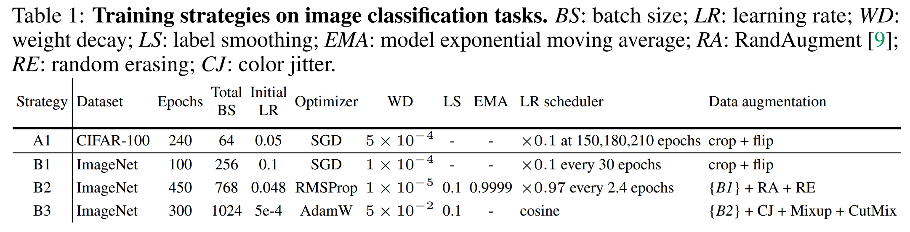
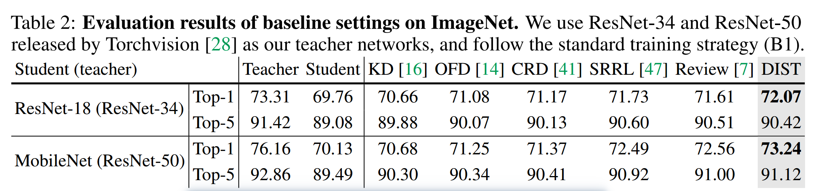
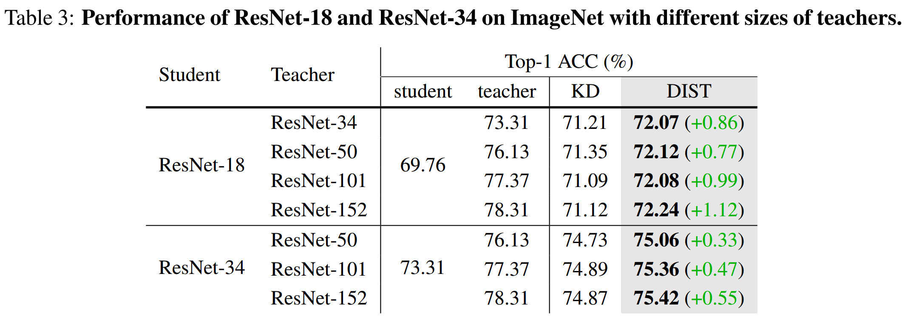
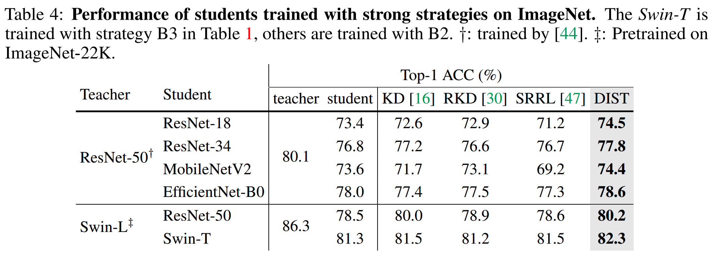
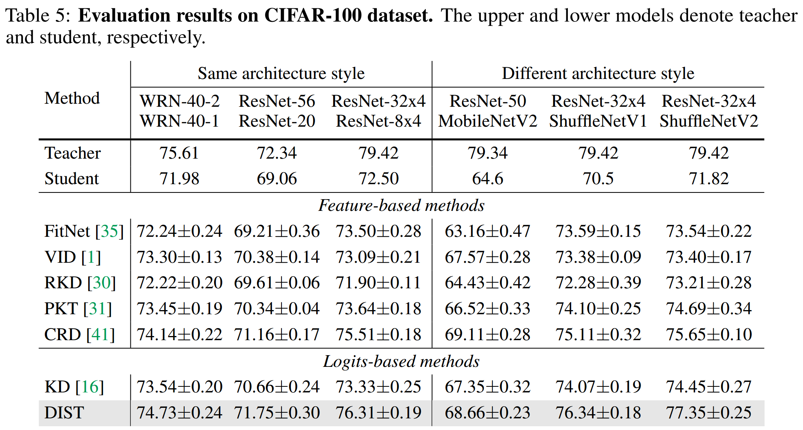
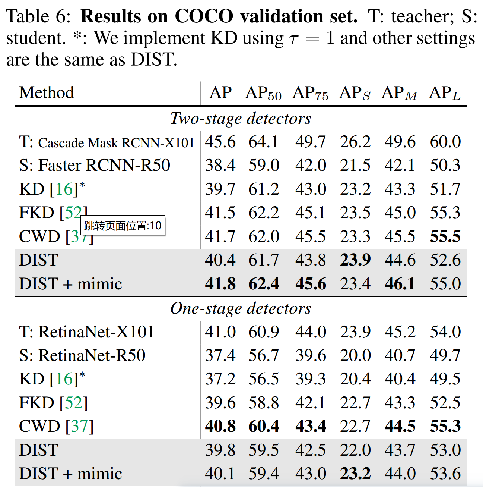
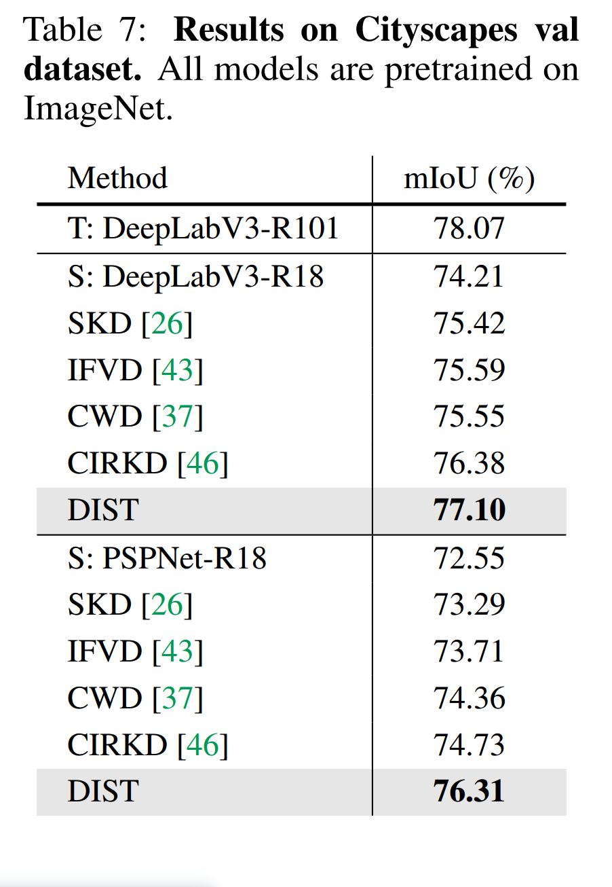
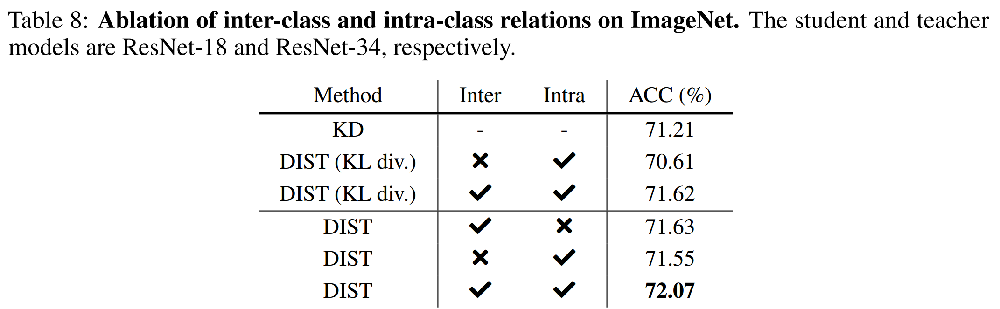
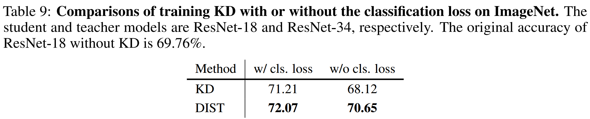

- - **Knowledge Distillation from A Stronger Teacher.** *Tao Huang, Shan You, Fei Wang, Chen Qian, Chang Xu.* **Neural Information Processing Systems, 2022** [(PDF)](<../../NoteTool/papers/Knowledge Distillation from A Stronger Teacher.pdf>)  [(arxiv)](http://arxiv.org/abs/2205.10536)
## 3 DIST: Distillation from A Stronger Teacher
### 3.1 Relaxed match with relations
预测分数表明教师对所有课程的confidence(或preference)。对于老师和学生之间Relaxed match真正关心的是老师的output。实际上，在推理过程中，我们只关心它们之间的**关系**，即教师预测的相对等级，而不是确切的概率值。
这样，对于一些度量$d(·,·)$与$\mathbb{R}^C×\mathbb{R}^C\to \mathbb{R}^+$，精确匹配可以公式化为d(a,b)＝0，如果任意两个预测向量的a＝b为$Y^{(s)}_{i,:}$；：和Y(t)i在等式(1)的KL发散中。然后作为一个松弛匹配，我们可以引入额外的映射$\phi (·)$和$\psi (·)$与$\mathbb{R}^C\to\mathbb{R}^C$使得
$$d ( \phi ( a ) , \phi ( b ) ) = d ( a , b ) , \forall a , b$$
在这方面，一个简单而有效的选择是保序映射(isotone mapping)，即正线性变换，将一个变量通过一个正的线性函数转换为另一个变量。
$$d ( m _ { 1 } \textbf a + n _ { 1 } , m _ { 2 } \textbf b + n _ { 2 } ) = d ( \textbf a ,\textbf b )$$
其中 m1、m2、n1 和 n2 是常数，并且满足 m1 × m2 > 0。因此，这种匹配在预测的尺度和偏移分别发生变化时是不变的。实际上，为了满足上式，我们可以采用广泛使用的皮尔逊距离作为度量标准，即
$$d _ { p } ( u , v ) : = 1 - p _ { p } ( u , v )$$
下面给出了两个随机变量 u 和 v 的皮尔逊相关系数的计算方法。具体而言，皮尔逊相关系数$ρ_p​(u;v)$等于随机变量 u 和 v 的协方差除以它们各自的标准差的乘积。公式中的符号和定义如下：
$$\rho_p(u; v) := \frac{{\text{Cov}(u; v)}}{{\text{Std}(u)\text{Std}(v)}} = \frac{{\sum_{i=1}^{n}(u_i - \bar{u})(v_i - \bar{v})}}{{\sqrt{\sum_{i=1}^{n}(u_i - \bar{u})^2}\sqrt{\sum_{i=1}^{n}(v_i - \bar{v})^2}}}$$
其中，Cov(u; v) 是变量 u 和 v 的协方差，$\bar{u}$ 和 Std(u) 分别表示变量 u 的均值和标准差。
通过这种方式，我们可以将关系定义为相关性。更具体地说，在传统的知识蒸馏方法中，原始的精确匹配可以被放宽和替代，通过最大化线性相关性来保留教师和学生之间在每个实例的概率分布上的关系，我们称之为类间关系。具体地，对于每对预测向量 $Y^{(s)}_{i,:}$和$Y^{(t)}_{i,:}$ ，类间关系损失可以被定义为
$$L_{inter} := \frac {1}{B} \sum_{i=1}^B d_p(Y^{(s)}_{i,:} , Y^{(s)}_{i,:})$$
一些保序映射(isotone mapping)或度量方法也可以用来宽松匹配，如余弦相似度（cosine similarity）。其他更高级和精细的选择可以作为未来的工作留待研究。
### 3.2 Better distillation with intra-relations
我们也鼓励在蒸馏过程中考虑内部关系以获得更好的性能。实际上，定义预测矩阵 Y (s) 和 Y (t)，其中每一行作为 Y (s) i;: 和 Y (t) i;:，那么上述的类间关系是为了逐行最大化相关性（参见图3）。相反，对于内部关系，相应的损失函数是逐列最大化相关性，即：
$$L_{intra} := \frac {1}{C} \sum_{i=1}^C d_p(Y^{(s)}_{:,j} , Y^{(s)}_{:,j})$$
因此，整体的训练损失函数 Ltr 可以由分类损失、类间知识蒸馏损失和类内知识蒸馏损失组成，即
$$L_{tr} = αL_{cls} + βL_{iner} + γL_{intra}$$
其中，α、β 和 γ 是用于平衡各个损失项的因子。通过关系损失，我们赋予了学生网络一定的自由度，可以自适应地匹配教师网络的输出，从而极大地提升了蒸馏性能。
## 4 Experiments
### 4.1 Experimental settings
- **Training strategies**. 

- **Loss weights**.
在CIFAR-100和ImageNet上，我们在等式中设置α=1、β=2和γ=2。（10）。在对象检测和语义分割上，这三个因素都等于1。对于KD，我们在等式中设置α=0:9，β=1。（3），并使用默认温度τ=4。具体来说，我们在CIFAR-100上选择了更大的温度τ=4，而不是在ImageNet上使用τ=1，因为它很容易得到过拟合，并且在CIFAR100上学习到的概率分布很尖锐。
### 4.2 Image Classification
- **Baseline results on ImageNet.**

- **Distillation from stronger teacher models.**

- **Distillation from stronger training strategies.** 

- **CIFAR-100.** 

### 4.3 Object Detection

### 4.4 Semantic Segmentation

### 4.5 Ablation studies
- **Effect of intra-class relation in vanilla KD**

- **Effect of training students with KD loss only**

