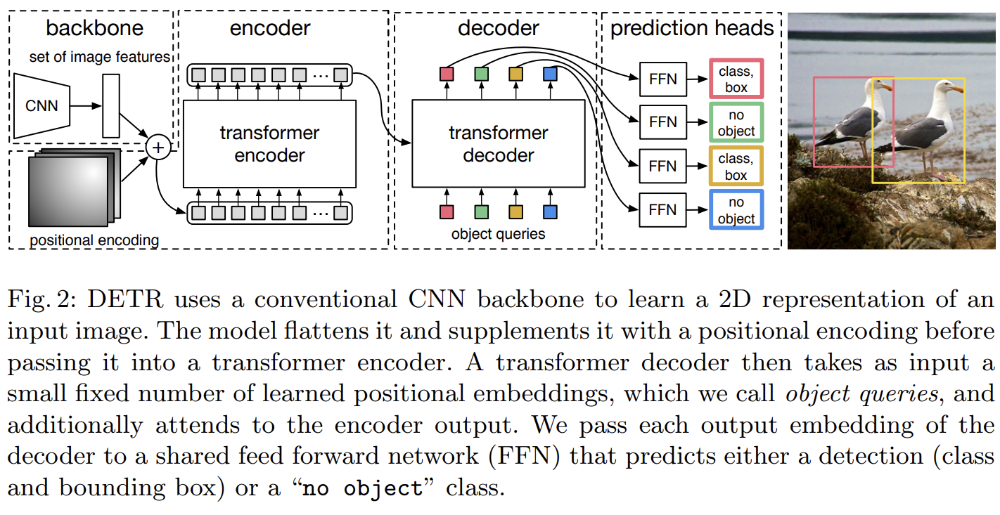

- **End-to-End Object Detection with Transformers.** *Nicolas Carion, Francisco Massa, Gabriel Synnaeve, Nicolas Usunier, Alexander Kirillov, Sergey Zagoruyko.* **European Conference on Computer Vision, 2020** [(PDF)](<../NoteTool/papers/End-to-End Object Detection with Transformers.pdf>)  [(arxiv)](https://arxiv.org/abs/2005.12872)
## **Abstract**
DETR消除了目标检任务中的**手工设计痕迹**，但是存在**收敛慢**以及Transformer的自注意力造成的**特征图分辨率不能太高**的问题，这就导致了**小目标检测性能很差**。我们的Deformable DETR只在参考点附近采样**少量的key**来计算注意力，因此我们的方法收敛快并且可以用到多尺度特征。
## 1、Introduction
传统目标检测任务有很多手工设计痕迹，所以**不是端到端**的网络。DETR运用到了Transformer强大的功能以及全局关系建模能力来取代目标检测中人工设计痕迹来达到端到端的目的。
DETR的**两大缺点**：
(1)**收敛速度慢**：因为全局像素之间计算注意力要收敛到几个稀疏的像素点需要消耗很长的时间。
(2)**小目标检测差**：目标检测基本都是在大分辨率的特征图上进行小目标的检测，但是Transformer中的Self Attention的计算复杂度是平方级别的，所以只能利用到最后一层特征图。
可变形卷积**DCN**是一种注意稀疏空间位置很好的机制，但是其**缺乏元素之间关系的建模能力**。
综上所述，**Deformable Attention**模块结合了DCN稀疏采样能力和Transformer的全局关系建模能力。这个模块可以**聚合多尺度特征**，不需要FPN了，我们用这个模块替换了Transformer Encoder中的**Multi-Head Self- Attention**模块和Transformer Decoder中的**Cross Attention**模块。
Deformable DETR的提出可以帮助探索更多端到端目标检测的探索。提出了bbox迭代微调策略和两阶段方法，其中**iterative bounding box refinement**类似**Cascade R-CNN**方法，**two stage**类似**RPN**。
## 2、Related work
Transformer中包含了多头自注意力和交叉注意力机制，其中多头自注意力机制**对key的数量很敏感**，平方级别的复杂度导致不能有太多的key，解决方法主要可以分为三类。
（1）第一类解决方法为在key上使用预定义稀疏注意力模式，例如将注意力限制在一个固定的局部窗口上，这将导致失去了全局信息。
（2）第二类是通过数据学习到相关的稀疏注意力。
（3）第三类是寻找自注意力中低等级的属性，类似限制关键元素的尺寸大小。
图像领域的注意力方法大多数都局限于第一种设计方法，但是因为内存模式原因速度要比传统卷积慢3倍（相同的FLOPs下）。DCN可以看作是一种自注意力机制，它比自注意力机制更加高效有效，但是其缺少元素关系建模的机制。我们的可变形注意力模块**来源于DCN**，并且属于第二类注意力方法。它只关注从**q特征预测**得到的一**小部分固定数量的采样点**。
目标检测任务一个难点就是高效的表征不同尺度下的物体。现在有的方法比如FPN，PA-FPN，NAS-FPN，Auto-FPN，BiFPN等。我们的多尺度可变形注意力模块可以自然的融合基于注意力机制的多尺度特征图，**不需要FPN了**。
## 3、Revisiting Transformers And DETR
### 3.1、Transformer中的Multi-Head Self-Attention
该模块计算复杂度为：$O(N\_{q}C^{2}+N\_{k}C^{2}+N\_{q}N\_{k}C)$，其中 C 代表特征图维度， $N_{q}$ 和$N_{k}$均为图片中的像素(pixel)，因此有$N_{q}=N_{k}\gg C$。所以计算复杂度可以简化为 $O(N_{q}N_{k}C)$ ，可以得出其与图片像素的数量成**平方级别**的计算复杂度。
### 3.2、DETR
DETR在目标检测领域中引入了Transformer结构并且取得了不错的效果。这套范式摒弃了传统目标检测中的`anchor`和`post processing` 机制，而是先预先设定100个object queries然后进行**二分图匹配**计算loss。其具体流程图(pipeline)如下

1、输入图片`3×800×1066`的一张图片，经过卷积神经网络提取特征，长宽`32倍下采样`后得到`2048×25×34`，然后通过一个`1×1 Conv`进行降维最终得到输出shape为`256×25×34`.
2、`positional encoding`为绝对位置编码，为了和特征完全匹配形状也为`256×25×34`，然后和特征进行元素级别的相加后输入到Transformer Encoder中。
3、输入到`Encoder`的尺寸为`(25×34)×256=850×256`，代表有850个token每个token的维度为256，Encoder不改变输入的Shape。
4、`Encoder`的输出和`object queries`输入到`Decoder`中形成`cross attention`，`object queries`的维度设置为`anchor数量×token数量`。
5、`Decoder`输出到`FFN`进行分类和框定位，其中`FFN`是共享参数的。
tips: 虽然DETR没有anchor，但是object queries其实就是起到了anchor的作用。
**DETR缺点在于：**
（1）计算复杂度的限制导致不能利用大分辨率特征图，导致**小目标性能差**。
（2）注意力权重矩阵往往都很稀疏，DETR计算全部像素的注意力**导致收敛速率慢**。