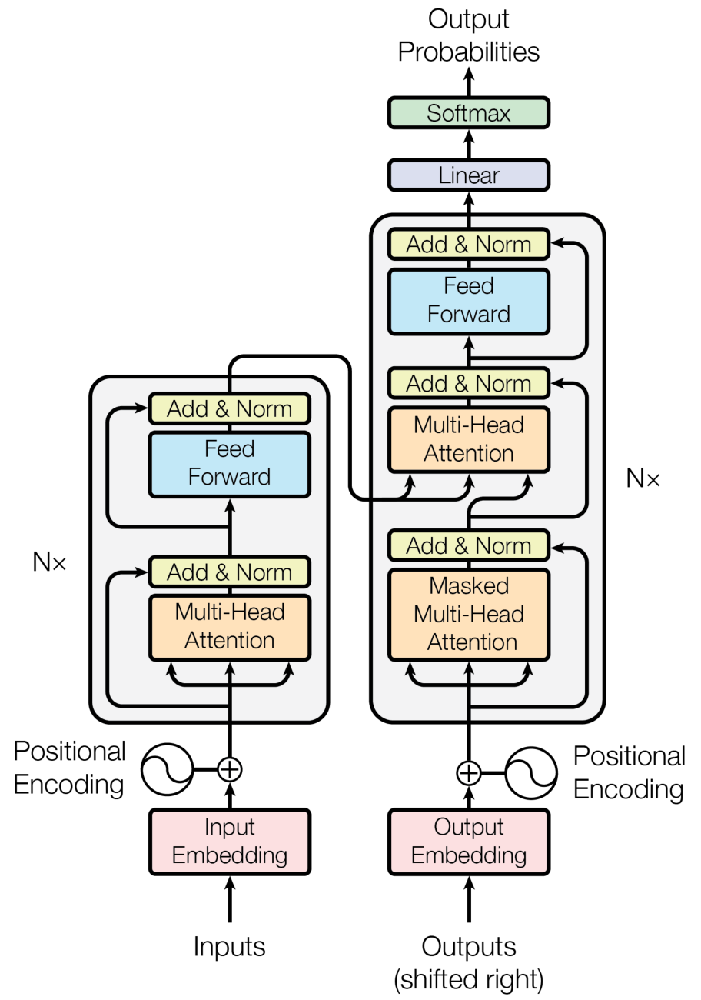
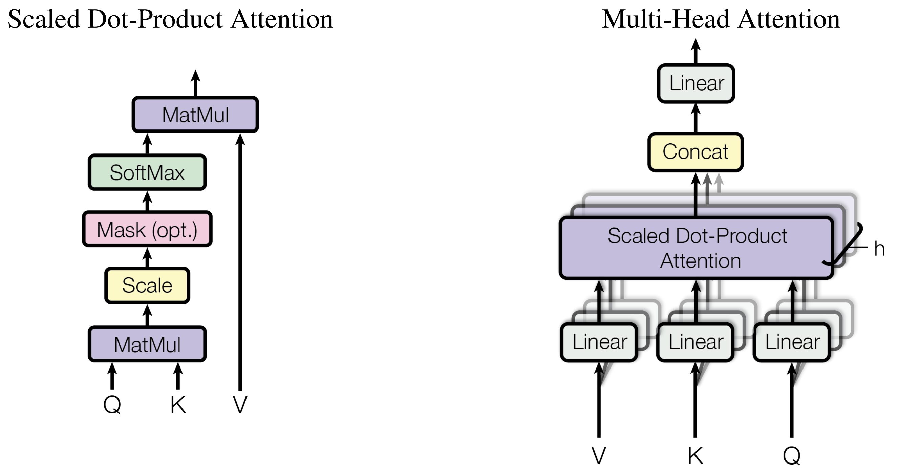

- **An Image is Worth 16x16 Words  Transformers for Image Recognition at Scale.** *A. Dosovitskiy, L. Beyer, Alexander Kolesnikov, Dirk Weissenborn, Xiaohua Zhai, Thomas Unterthiner, M. Dehghani, Matthias Minderer, G. Heigold, S. Gelly, Jakob Uszkoreit, N. Houlsby.* **International Conference on Learning Representations, 2020** [(PDF)](<../NoteTool/papers/An Image is Worth 16x16 Words  Transformers for Image Recognition at Scale.pdf>)  [(arxiv)](https://arxiv.org/abs/2010.11929)
Google于 2017 年提出了《Attention is all you need》，抛弃了传统的 RNN 结构，**设计了一种 Attention 机制，通过堆叠 Encoder-Decoder 结构**，得到了一个 Transformer 模型，在机器翻译任务中**取得了 BLEU 值的新高**。在后续很多模型也基于 Transformer 进行改进。
#### 引入问题
常见的时间序列任务采用的模型通常都是 RNN 系列，然而 RNN 系列模型的顺序计算方式带来了两个问题
1. 某个时间状态$h\_t$，依赖于上一时间步状态$h_{t-1}$，导致模型**不能通过并行计算来加速**
2. RNN 系列的魔改模型比如 GRU, LSTM，虽然**引入了门机制** (gate)，但是对**长时间依赖的问题缓解能力有限**，不能彻底解决
因此我们设计了一个全新的结构 Transformer，通过 Attention 注意力机制，来对时间序列更好的建模。同时我们不需要像 RNN 那样顺序计算，从而能让模型更能充分发挥并行计算性能。
### 模型架构

$$
Attention(Q,K,V)=softmax(\frac{QK^T}{√d_k})V
$$
- $d_k$ 是一个缩放因子 ,$d_k=d_model/h$
#### Feed Forward Neural Network
这个 FFN 模块比较简单，本质上全是两层全连接层加一个 Relu 激活
	

	    X=Dense1(X) 
	    X=Relu(X) 
	    Out=Dense2(X)
	

#### Positional Encoding
摒弃了 CNN 和 RNN 结构，我们无法很好的利用序列的顺序信息，因此我们采用了额外的一个位置编码来进行缓解
$$PE(pos,2i)=sin(\frac{pos}{1000\frac{2i}{d_{model}}})$$
$$PE(pos,2i+1)=cos(\frac{pos}{1000\frac{2i}{d_{model}}})$$
然后与输入相加，通过引入位置编码，给词向量中赋予了单词的位置信息

