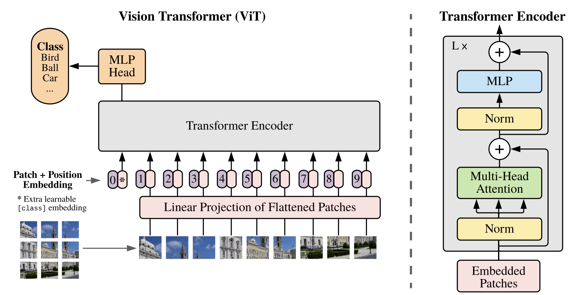
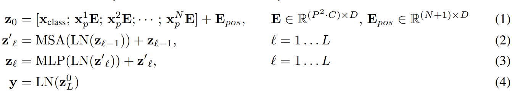
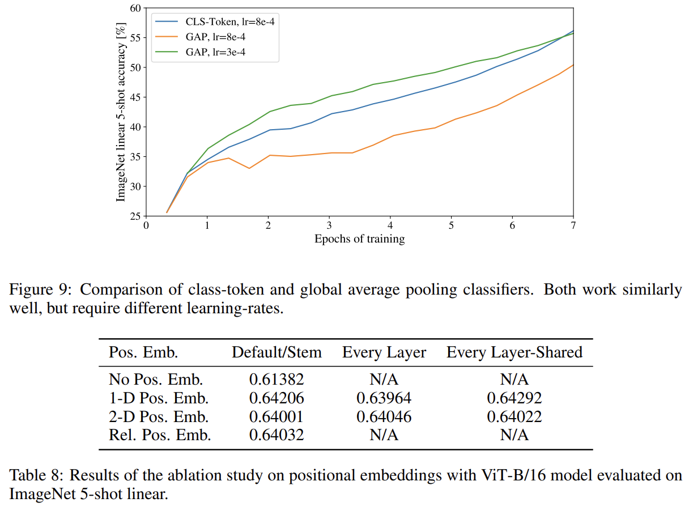
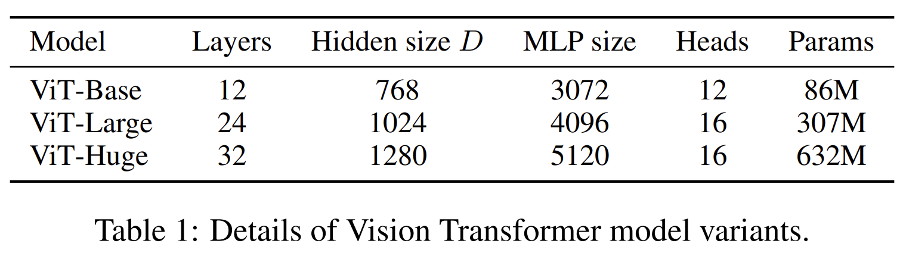
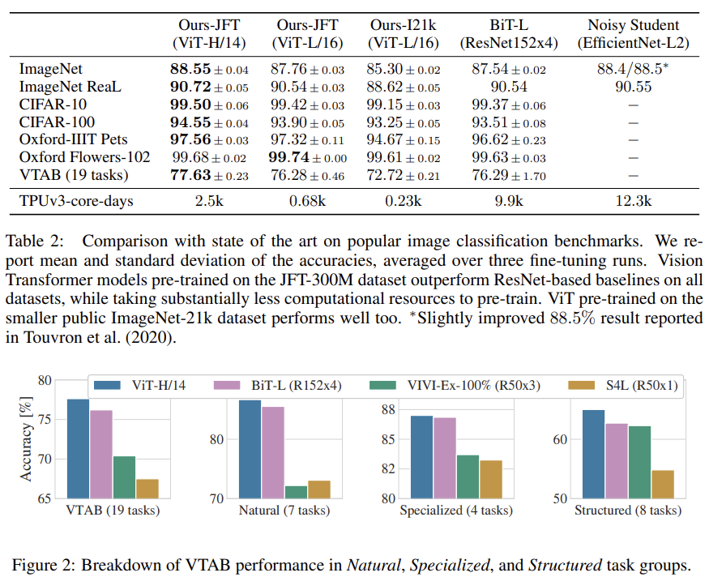
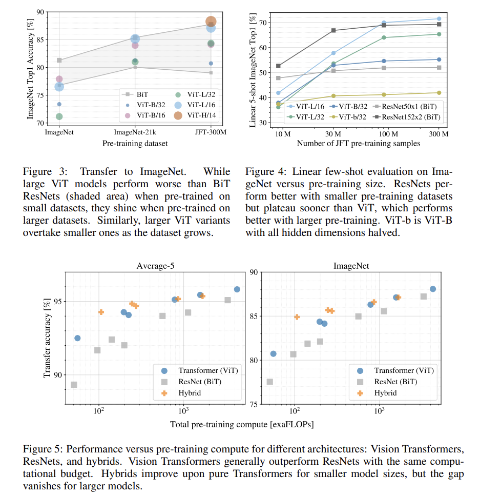
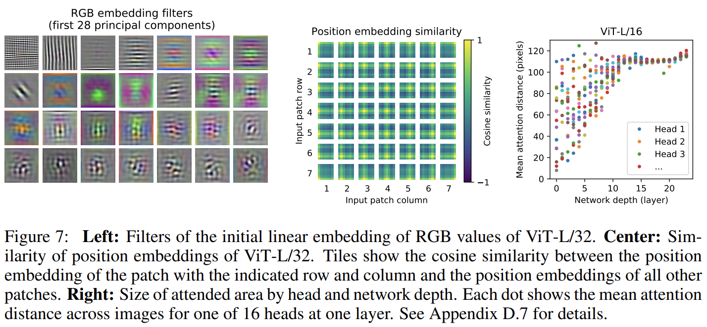

- **An Image is Worth 16x16 Words  Transformers for Image Recognition at Scale.** *A. Dosovitskiy, L. Beyer, Alexander Kolesnikov, Dirk Weissenborn, Xiaohua Zhai, Thomas Unterthiner, M. Dehghani, Matthias Minderer, G. Heigold, S. Gelly, Jakob Uszkoreit, N. Houlsby.* **International Conference on Learning Representations, 2020** [(PDF)](<../NoteTool/papers/An Image is Worth 16x16 Words  Transformers for Image Recognition at Scale.pdf>) 
#### ViT的结构
ViT将输入图片分为多个patch（16x16），再将每个patch投影为固定长度的向量送入Transformer，后续encoder的操作和原始Transformer中完全相同。但是因为对图片分类，因此在输入序列中加入一个特殊的token，该token对应的输出即为最后的类别预测：

按照上面的流程图，一个ViT block可以分为以下几个步骤
(1) patch embedding：例如输入图片大小为224x224，将图片分为固定大小的patch，patch大小为16x16，则每张图像会生成224x224/16x16=196个patch，即输入序列长度为**196**，每个patch维度16x16x3=**768**，线性投射层的维度为768xN (N=768)，因此输入通过线性投射层之后的维度依然为196x768，即一共有196个token，每个token的维度是768。这里还需要加上一个特殊字符cls，因此最终的维度是**197x768**。到目前为止，已经通过patch embedding将一个视觉问题转化为了一个seq2seq问题
(2) positional encoding（standard learnable 1D position embeddings）：ViT同样需要加入位置编码，位置编码可以理解为一张表，表一共有N行，N的大小和输入序列长度相同，每一行代表一个向量，向量的维度和输入序列embedding的维度相同（768）。注意位置编码的操作是sum，而不是concat。加入位置编码信息之后，维度依然是**197x768**
(3) LN/multi-head attention/LN：LN输出维度依然是197x768。多头自注意力时，先将输入映射到q，k，v，如果只有一个头，qkv的维度都是197x768，如果有12个头（768/12=64），则qkv的维度是197x64，一共有12组qkv，最后再将12组qkv的输出拼接起来，输出维度是197x768，然后在过一层LN，维度依然是**197x768**
(4) MLP：将维度放大再缩小回去，197x768放大为197x3072，再缩小变为**197x768**
一个block之后维度依然和输入相同，都是197x768，因此可以堆叠多个block。最后会将特殊字符cls对应的输出 ${z}_L^0$ 作为encoder的最终输出 ，代表最终的image presentation（另一种做法是不加cls字符，对所有的tokens的输出做一个平均），如下图公式(4)，后面接一个MLP进行图片分类

其中输入image $\mathbf{x}\in\mathbb{R}^{H×W×C}$ ，2D patches $\mathbf{x}_p\in\mathbb{R}^{N\times (P^2\cdot C)}$ ， C 是通道数， P 是patch大小，一共有 N 个patches， $N=HW/P^2$

**关于image presentation**
直接使用average pooling得到最终的image presentation，而不加特殊字符cls，通过实验表明，同样可以使用average pooling，原文ViT是为了尽可能是模型结构接近原始的Transformer，所以采用了类似于BERT的做法，加入特殊字符
**关于positional encoding**
1-D 位置编码：例如3x3共9个patch，patch编码为1到9
2-D 位置编码：patch编码为11,12,13,21,22,23,31,32,33，即同时考虑X和Y轴的信息，每个轴的编码维度是D/2
实际实验结果表明，不管使用哪种位置编码方式，模型的精度都很接近，甚至不适用位置编码，模型的性能损失也没有特别大。原因可能是ViT是作用在image patch上的，而不是image pixel，对网络来说这些patch之间的相对位置信息很容易理解，所以使用什么方式的位置编码影像都不大
**关于CNN+Transformer**
既然CNN具有归纳偏置的特性，Transformer又具有很强全局归纳建模能力，使用CNN+Transformer的混合模型是不是可以得到更好的效果呢？将224x224图片送入CNN得到16x16的特征图，拉成一个向量，长度为196，后续操作和ViT相同
**关于输入图片大小**
通常在一个很大的数据集上预训练ViT，然后在下游任务相对小的数据集上微调，已有研究表明在分辨率更高的图片上微调比在在分辨率更低的图片上预训练效果更好（It is often beneficial to fine-tune at higher resolution than pre-training）（参考_2019-NIPS-Fixing the train test resolution discrepancy_）
当输入图片分辨率发生变化，输入序列的长度也发生变化，虽然ViT可以处理任意长度的序列，但是预训练好的位置编码无法再使用（例如原来是3x3，一种9个patch，每个patch的位置编码都是有明确意义的，如果patch数量变多，位置信息就会发生变化），一种做法是使用插值算法，扩大位置编码表。但是如果序列长度变化过大，插值操作会损失模型性能，这是ViT在微调时的一种局限性
#### 实验部分
**数据集**
为了探究模型的可扩展性（to explore model scalability），预训练阶段使用了ImageNet-1K（1.3million）、ImageNet-21K（14million），JFT-18K（303million）三个数据集。同时参考BiT，删除预训练数据集中和下游任务测试集中重复的数据（de-duplicate the pre-training datasets w.r.t. the test sets of the downstream）
下游数据集包括：ImageNet（on the original validation labels），ImageNet （on the cleaned-up ReaL labels ），CIFAR-10/100，Oxford-IIIT Pets，Oxford Flowers-102，VTAB (19 tasks)
ImageNet ReaL参考_2020-Are we done with imagenet?_ VTAB参考_2019-A large-scale study of representation learning with the visual task adaptation benchmark_，所有数据集的预处理参考BiT
**模型及变体**
 
 
（1）ViT：参考BERT，共设置了三种模型变体（增加了Huge变体）如下图所示。例如ViT-L/16，代表Large变体，输入patch size为16x16。
（2）CNN：baseline CNNs选择ResNet，同时用Group Normalization替代Batch Normalization，使用standardized convolutions，以提升模型迁移性能。
（3）Hybrid：混合模型就是使用ResNet50输出的特征图，不同stage会得到不同大小的特征图，即生成不同长度序列
所有模型的训练均使用Adam$（ \beta_1=0.9 , \beta_2=0.999 ）$，batch_size设为4096，权重衰减（apply a high weight decay of 0.1），同时使用了学习率warmup策略（use a linear learning rate warmup and decay）；微调阶段，使用SGD with momentum，batch_size设为512
**实验结果**
ViT和其它SOTA模型性能对比，展示了准确率accuraces的均值和标准差，所有结果都是取三轮微调均值的结果（averaged over three fine-tunning runs）。有关ImageNet的实验，在更高分辨率图片上微调(512 for ViT-L/16 and 518 for ViT-H/14)，同时使用了Polyak averaging(0.9999)
可以看到在JFT数据集上预训练的ViT模型，迁移到下游任务后，表现要好于基于ResNet的BiT和基于EfficientNet的Noisy Student，且需要更少的预训练时间

上面的实验显示，当在很大的数据集上预训练时，ViT性能超越CNN，后面探究不同大小预训练数据集对模型性能的影响（不能只看超大数据集）

这里当在更小的数据集上预训练时（ImageNet），优化三个超参数以提升模型性能，分别是weight decay, dropout 和 label smoothing。可以看到当在小数据集上预训练时（ImageNet-1k，1.3million），ViT微调后的效果远远比不上ResNet；在中等数据集上预训练时（ImageNet-21K，14million），两者效果相当；当在很大的数据集上（JFT-300M, 300million）预训练时，ViT的效果要更好。所以当我们只有较小的数据集时，更适合使用ResNet（并不是所有数据集都适合硬套transformer）
在同一个数据集（JFT），分别抽取不同数量的数据（10M，30M，100M，300M），避免不同数据集之间的gap，同时不适用额外的regularization，超参数保证相同。linear evaluation是指直接把预训练模型当做特征提取器，不fine-tune，拿提取到的特征直接做logistic regression。few-shot是指在evaluation的时候，每一类只sample五张图片。
可以看到当数据集很小时，CNN预训练模型表现更好，证明了CNN归纳偏置的有效性，但是当数据集足够大时，归纳偏置和Transformer比较就失去了优势，甚至没有归纳偏置，直接从数据learn patterns会更有效。同时细心观察会发现即使预训练的数据集很大，最后ViT的性能提升也不是很明显，因此如何使用ViT来做这种小样本学习任务，是一个有待继续研究的方向
实验证明了ViT的预训练比ResNet要更便宜，即在相同的预训练计算复杂度下，ViT的效果要比ResNet更好。可以看到，当模型较小时，混合模型的表现要更好，但是随着模型的增大，ViT的表现超过了混合模型（为什么混合模型这个时候不如ViT，直觉上混合模型吸收了双方的优点，应该表现更好）。
#### 模型可视化

为了理解self-attention是如何聚合信息的（To understand how ViT uses self-attention to integrate information across the image），基于attention weight计算不同layer不同head的average attention distance
average attention distance，是基于attention weight计算，具体做法是用attention weight乘以query pixel和所有其它pixels的距离，再求平均。原文中是这么表述的——Attention distance was computed for 128 example images by averaging the distance between the query pixel and all other pixels, weighted by the attention weight. Each dot shows the mean attention distance across images for one of 16 heads at one layer. Image width is 224 pixels