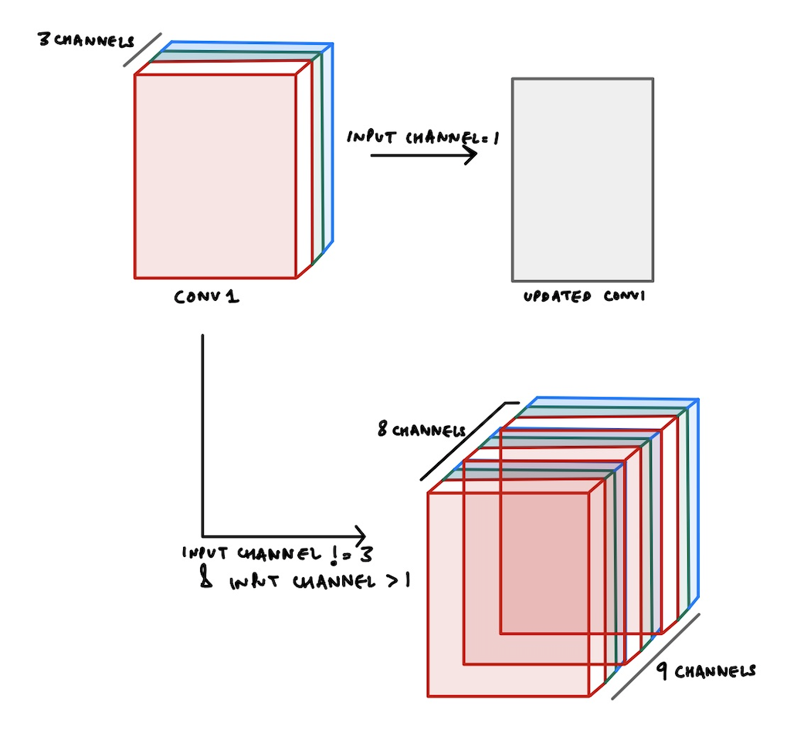

i# Models API and Pretrained weights
## List of models supported by `timm`
`timm` supports a wide variety of pretrained and non-pretrained models for number of Image based tasks. 
To get a complete list of models, use the `list_models` function from `timm` as below. The `list_models` function returns a list of models ordered alphabetically that are supported by `timm`. We just look at the top-5 models below.
```python
import timm 
timm.list_models()[:5]
```
    ['adv_inception_v3',
     'cspdarknet53',
     'cspdarknet53_iabn',
     'cspresnet50',
     'cspresnet50d']
In general, you always want to use factory functions inside `timm`. Particularly, you want to use `create_model` function from `timm` to create any model. It is possible to create any of the models listed in `timm.list_models()` using the `create_model` function. There are also some wonderful extra features that we will look at later. But, let's see a quick example. 
```python
import random
import torch
random_model_to_create = random.choice(timm.list_models())
random_model_to_create
```
    'resnet50d'
```python
model = timm.create_model(random_model_to_create)
x     = torch.randn(1, 3, 224, 224)
model(x).shape
```
    torch.Size([1, 1000])
In the example above, we randomly select a model name in `timm.list_models()`, create it and pass some dummy input data through the model to get some output. In general, you never want to create random models like this, and it's only an example to showcase that all models in `timm.list_models()` are supported by `timm.create_model()` function. It's really that easy to create a model using `timm`. 
## Does `timm` have pretrained weights for these models?
Of course! `timm` wants to make it super easy for researchers and practioners to experiment and supports a whole lot of models with pretrained weights. These pretrained weights are either:
1. Directly used from their original sources
2. Ported by Ross from their original implementation in a different framework (e.g. Tensorflow models)
3. Trained from scratch using the included training script (`train.py`). The exact commands with hyperparameters to train these individual models are mentioned under `Training Scripts`.
To list all the models that have pretrained weights, `timm` provides a convenience parameter `pretrained` that could be passed in `list_models` function as below. We only list the top-5 returned models.
```python
timm.list_models(pretrained=True)[:5]
```
    ['adv_inception_v3',
     'cspdarknet53',
     'cspresnet50',
     'cspresnext50',
     'densenet121']
> NOTE: Just by listing the top-5 pretrained models, we can see that `timm` does not currently have pretrained weights for models such as `cspdarknet53_iabn` or `cspresnet50d`. This is a great opportunity for new contributors with hardware availability to pretrain the models on Imagenet dataset using the training script and share these weights. 
## My dataset doesn't consist of 3-channel images - what now?
As you might already know, ImageNet data consists of 3-chanenl RGB images. Therefore, to be able to use pretrained weights in most libraries, the model expects a 3-channel input image. 
### `torchvision` raises `Exception`
```python
import torchvision
m = torchvision.models.resnet34(pretrained=True)
# single-channel image (maybe x-ray)
x = torch.randn(1, 1, 224, 224)
# `torchvision` raises error
try: m(x).shape
except Exception as e: print(e)
```
    Given groups=1, weight of size [64, 3, 7, 7], expected input[1, 1, 224, 224] to have 3 channels, but got 1 channels instead
    
As can be seen above, these pretrained weights from `torchvision` won't work with single channel input images. As a work around most practitioners convert their single channel input images to 3-channel images by copying the single channel pixels accross to create a 3-channel image. 
Basically, `torchvision` above is complaining that it expects the input to have 3 channels, but got 1 channel instead. 
```python
# 25-channel image (maybe satellite image)
x = torch.randn(1, 25, 224, 224)
# `torchvision` raises error
try: m(x).shape
except Exception as e: print(e)
```
    Given groups=1, weight of size [64, 3, 7, 7], expected input[1, 25, 224, 224] to have 3 channels, but got 25 channels instead
    
Again, `torchvision` raises an error and this time there is no workaround to get past this error apart from just not using pretrained weights and starting with randomly initialized weights. 
### `timm` has a way to handle these `exceptions`
```python
m = timm.create_model('resnet34', pretrained=True, in_chans=1)
# single channel image
x = torch.randn(1, 1, 224, 224)
m(x).shape
```
    torch.Size([1, 1000])
We pass in a parameter `in_chans` to the `timm.create_model` function and this somehow just magically works! Let's see what happens with the 25-channel image?
```python
m = timm.create_model('resnet34', pretrained=True, in_chans=25)
# 25-channel image
x = torch.randn(1, 25, 224, 224)
m(x).shape
```
    torch.Size([1, 1000])
This works again! :) 
### How is `timm` able to use pretrained weights and handle images that are not 3-channel RGB images? 
`timm` does all this magic inside the `load_pretrained` function that get's called to load the pretrained weights of a model. Let's see how `timm` achieves loading of pretrained weights. 
```python
from timm.models.resnet import ResNet, BasicBlock, default_cfgs
from timm.models.helpers import load_pretrained
from copy import deepcopy
```
Below, we create a simple `resnet34` model that can take single channel images as input. We make this happen by passing in `in_chans=1` to the `ResNet` constructor class when creating the model.
```python
# create resnet34 model with single channel input
resnet34_default_cfg = default_cfgs['resnet34']
resnet34 = ResNet(BasicBlock, layers=[3, 4, 6, 3], in_chans=1)
resnet34.default_cfg = deepcopy(resnet34_default_cfg)
resnet34.conv1
```
    Conv2d(1, 64, kernel_size=(7, 7), stride=(2, 2), padding=(3, 3), bias=False)
```python
resnet34.conv1.weight.shape
```
    torch.Size([64, 1, 7, 7])
As we can see from the first convolution of `resnet34` above, the number of input channels is set to 1. And the `conv1` weights are of shape `[64, 1, 7, 7]`. This means that the number of input channels is 1, output channels is 64 and kernel size is `7x7`.
But what about the pretrained weights? Because ImageNet consists of 3-channel input images, the pretrained for this `conv1` layer would be `[64, 3, 7, 7]`.Let's confirm that below: 
```python
resnet34_default_cfg
```
    {'url': 'https://github.com/rwightman/pytorch-image-models/releases/download/v0.1-weights/resnet34-43635321.pth',
     'num_classes': 1000,
     'input_size': (3, 224, 224),
     'pool_size': (7, 7),
     'crop_pct': 0.875,
     'interpolation': 'bilinear',
     'mean': (0.485, 0.456, 0.406),
     'std': (0.229, 0.224, 0.225),
     'first_conv': 'conv1',
     'classifier': 'fc'}
Let's load the pretrained weights from the model and check the number of input channels that `conv1` expects.
```python
import torch
state_dict = torch.hub.load_state_dict_from_url(resnet34_default_cfg['url'])
```
Great, so we have loaded the pretrained weights of resnet-34 from `'https://github.com/rwightman/pytorch-image-models/releases/download/v0.1-weights/resnet34-43635321.pth'` URL, let's now check the shape of the weights for `conv1` below:
```python
# check `conv1` weight shape
state_dict['conv1.weight'].shape
```
    torch.Size([64, 3, 7, 7])
So this layer expects the number of input channels to be 3!
> NOTE: We know this because the shape of `conv1.weight` is `[64, 3, 7, 7]`, this means that the number of input channels is `3`, output channels is `64` and the kernel size is `7x7`. 
> NOTE: This is why when we try to load pretrained weights, torchvision gives an error because our model's `conv1` layer weights would be of shape `[64, 1, 7, 7]` because we set the number of input channels to be 1. I hope that this exception we saw above now makes more sense: `Given groups=1, weight of size [64, 3, 7, 7], expected input[1, 1, 224, 224] to have 3 channels, but got 1 channels instead.`
### So how is `timm` able to load these weights?
Something very clever happens inside the `load_pretrained` function inside `timm`. Basically, there's two main cases to consider when the expected number of input channels is not equal to 3. Either the input channels are 1 or not. Let's what happens in either case.
When the number of input channels is not equal to 3, then `timm` updates the `conv1.weight` of the pretrained weights accordingly to be able to load the pretrained weights. 
#### Case-1: When the number of input channels is 1
If the number of input channels is 1, `timm` simply sums the 3 channel weights into a single channel to update the shape of `conv1.weight` to be `[64, 1, 7, 7]`. This can be achieved like so:
```python 
conv1_weight = state_dict['conv1.weight']
conv1_weight.sum(dim=1, keepdim=True).shape
>> torch.Size([64, 1, 7, 7])
```
And thus by updating the shape of the first `conv1` layer, we can now safely load these pretrained weights.
#### Case-2: When the number of input channels is not 1
In this case, we simply repeat the `conv1_weight` as many times as required and then select the required number of input channels weights. 
As can be seen in the image above, let's say our input images have 8 channels. Therefore, number of input channels is equal to 8. 
But, as we know our pretrained weights only have 3 channels. So how could we still make use of the pretrained weights? 
Well, what happens in `timm` has been shown in the image above. We copy the weights 3 times such that now the total number of channels becomes 9 and then we select the first 8 channels as our weights for `conv1` layer.
This is all done inside `load_pretrained` function like so: 
```python
conv1_name = cfg['first_conv']
conv1_weight = state_dict[conv1_name + '.weight']
conv1_type = conv1_weight.dtype
conv1_weight = conv1_weight.float()
repeat = int(math.ceil(in_chans / 3))
conv1_weight = conv1_weight.repeat(1, repeat, 1, 1)[:, :in_chans, :, :]
conv1_weight *= (3 / float(in_chans))
conv1_weight = conv1_weight.to(conv1_type)
state_dict[conv1_name + '.weight'] = conv1_weight
```
Thus, as can be seen above, we first repeat the `conv1_weight` and then select required number of `in_chans` from these copied weights. 
