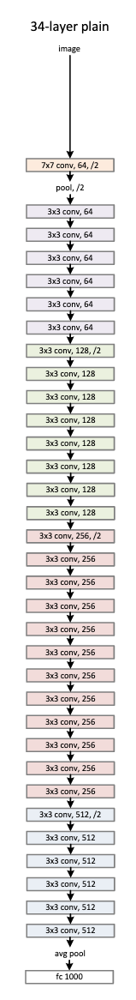

# TIMM's `create_model` function with all it's \*\*kwargs
As you might have guessed from the title, in this tutorial we are going to look at the `create_model` function inside `timm` and also look at all the `**kwargs` that can be passed to this function. 
## What does `create_model` function do?
In `timm`, the `create_model` function is responsible for creating the architecture of more than 300 deep learning models! To create a model, simply pass in the `model_name` to `create_model`. 
```python
import timm 
# creates resnet-34 architecture
model = timm.create_model('resnet34')
# creates efficientnet-b0 architecture
model = timm.create_model('efficientnet_b0')
# creates densenet architecture
model = timm.create_model('densenet121')
```
And so on.. A complete list of available models can be found using `timm.list_models()` function. 
## Create a pretrained model
To create a pretrained model, simply pass in `pretrained=True` keyword argument to the `timm.create_model` function along with the model name. 
```python
import timm 
# creates pretrained resnet-34 architecture
model = timm.create_model('resnet34', pretrained=True)
# creates pretrained efficientnet-b0 architecture
model = timm.create_model('efficientnet_b0', pretrained=True)
# creates pretrained densenet architecture
model = timm.create_model('densenet121', pretrained=True)
```
To get a complete list of pretrained models available in `timm`, pass `pretrained=True` to `timm.list_models()` function.
```python
all_pretrained_models_available = timm.list_models(pretrained=True)
```
> NOTE: Internally, when we set `pretrained=True`, `timm` get's the model weights from a URL and set's these weights as the pretrained weights. For example, for `resnet34`, `timm` loads the model weights from `https://github.com/rwightman/pytorch-image-models/releases/download/v0.1-weights/resnet34-43635321.pth`. '
## Turn any model into a feature extractor
All models support the `features_only=True` argument for `create_model` call to return a network that extracts feature maps from the deepest layer at each stride. It is also possible to specify the indices of the layers to extract the features from using `out_indices=[...]` argument.
```python
import timm 
import torch 
# input batch with batch size of 1 and 3-channel image of size 224x224
x = torch.randn(1,3,224,224)
```
```python
# classification model
model = timm.create_model('resnet34')
model(x).shape
```
    torch.Size([1, 1000])
```python
# feature extractor
feature_extractor = timm.create_model('resnet34', features_only=True, out_indices=[2,3,4])
out = feature_extractor(x)
```
**Can you guess the length of `out` if I tell you that out is a list of Tensors?**

We know that the `resnet-34` architecture looks like above. If the `7x7` Convolution Layer at the beginning is considered as Layer-0, can you guess the shapes of features coming out from Layer-1, Layer-2, Layer-3 and Layer-4 where each layer is represented by a different color? 
> NOTE: This might be a great time to open up a Jupyter notebook and do something like this: 
```python
import torch.nn as nn
import torch 
# input batch
x = torch.randn(1, 3, 224, 224)
pool  = nn.MaxPool2d(3, 2, 1, 1)
conv1 = nn.Conv2d(3, 64, 7, stride=2, padding=3)
conv2 = nn.Conv2d(64, 64, 3, 1, 1)
conv3 = nn.Conv2d(64, 128, 3, 2, 1)
# feature map from Layer-0
conv1(x).shape
# feature map from Layer-1
conv2(pool(conv1(x))).shape
# and so on.. 
```
> NOTE: If you're looking for resources to read about ResNet architecture, [here](https://github.com/fastai/fastbook/blob/master/14_resnet.ipynb) is an excellent resource in FastBook by [Jeremy Howard](https://twitter.com/jeremyphoward) and [Sylvain Gugger](https://twitter.com/GuggerSylvain).
As you might have guessed by now, the output shape of the Feature Map from Layer-2, Layer-3 and Layer-4 should be `[1, 128, 28, 28], [[1, 256, 14, 14], [1, 512, 7, 7]` respectively. 
Let's see if the results match our expectation. 
```python
# check feature map shapes for Layer-2, Layer-3 and Layer-4
[x.shape for x in out]
```
    [torch.Size([1, 128, 28, 28]),
     torch.Size([1, 256, 14, 14]),
     torch.Size([1, 512, 7, 7])]
The output shapes of the Feature Maps match our expectation. This way, we can convert any model into a feature extractor in `timm`.
