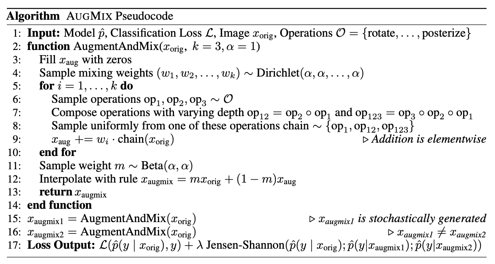

# Dataset
There are three main Dataset classes in the `timm` library: 
1. `ImageDataset`
2. `IterableImageDataset`
3. `AugMixDataset`
In this piece of documentation, we will be looking at each one of them individually and also looking at various use cases for these Dataset classes. 
## ImageDataset
```python
class ImageDataset(root: str, parser: Union[ParserImageInTar, ParserImageFolder, str] = None, class_map: Dict[str, str] = '', load_bytes: bool = False, transform: List = None) -> Tuple[Any, Any]:
```
The `ImageDataset` can be used to create both training and validation datasets is very similar to [torchvision.datasets.ImageFolder](https://pytorch.org/docs/stable/torchvision/datasets.html#imagefolder) in it's functionality with some nice addons. 
### Parser
The `parser` is set automatically using a `create_parser` factory method. The `parser` finds all images and targets in `root` where the `root` folder is structured like so: 
```markdown
root/dog/xxx.png
root/dog/xxy.png
root/dog/xxz.png
root/cat/123.png
root/cat/nsdf3.png
root/cat/asd932_.png
```
The `parser` sets a `class_to_idx` dictionary mapping from the classes to integers which looks something like: 
```python
{'dog': 0, 'cat': 1, ..}
```
And also has an attribute called `samples` which is a List of Tuples that looks something like: 
```python 
[('root/dog/xxx.png', 0), ('root/dog/xxy.png', 0), ..., ('root/cat/123.png', 1), ('root/cat/nsdf3.png', 1), ...]
```
This `parser` object is subscriptable and on doing something like `parser[index]` it returns a sample at that particular index in `self.samples`. Therefore, doing something like `parser[0]` would return `('root/dog/xxx.png', 0)`.
### `__getitem__(index: int) → Tuple[Any, Any]`
Once the `parser` is set, then the `ImageDataset` get's an image, target from this `parser` based on the `index`. 
```python 
img, target = self.parser[index]
```
It then reads the image either as a `PIL.Image` and converts to `RGB` or reads the image as bytes depending on the `load_bytes` argument. 
Finally, it transforms the image and returns the target. A dummy target `torch.tensor(-1)` is returned in case target is None. 
### Usage
This `ImageDataset` can also be used as a replacement for `torchvision.datasets.ImageFolder`. Considering we have the `imagenette2-320` dataset present whose structure looks like: 
```
imagenette2-320
├── train
│   ├── n01440764
│   ├── n02102040
│   ├── n02979186
│   ├── n03000684
│   ├── n03028079
│   ├── n03394916
│   ├── n03417042
│   ├── n03425413
│   ├── n03445777
│   └── n03888257
└── val
    ├── n01440764
    ├── n02102040
    ├── n02979186
    ├── n03000684
    ├── n03028079
    ├── n03394916
    ├── n03417042
    ├── n03425413
    ├── n03445777
    └── n03888257
```
And each subfolder contains a set of `.JPEG` files belonging to that class. 
```bash
# run only once
wget https://s3.amazonaws.com/fast-ai-imageclas/imagenette2-320.tgz
gunzip imagenette2-320.tgz
tar -xvf imagenette2-320.tar
```
Then, it is possible to create an `ImageDataset` like so: 
```python
from timm.data.dataset import ImageDataset
dataset = ImageDataset('./imagenette2-320')
dataset[0]
(<PIL.Image.Image image mode=RGB size=426x320 at 0x7FF7F4880460>, 0)
```
We can also see the `dataset.parser` is an instance of `ParserImageFolder`:
```python
dataset.parser
<timm.data.parsers.parser_image_folder.ParserImageFolder at 0x7ff7f4880d90>
```
Finally, let's have a look at the `class_to_idx` Dictionary mapping in parser: 
```python
dataset.parser.class_to_idx
{'n01440764': 0,
 'n02102040': 1,
 'n02979186': 2,
 'n03000684': 3,
 'n03028079': 4,
 'n03394916': 5,
 'n03417042': 6,
 'n03425413': 7,
 'n03445777': 8,
 'n03888257': 9}
```
And, also, the first five samples like so: 
```python
dataset.parser.samples[:5]
[('./imagenette2-320/train/n01440764/ILSVRC2012_val_00000293.JPEG', 0),
 ('./imagenette2-320/train/n01440764/ILSVRC2012_val_00002138.JPEG', 0),
 ('./imagenette2-320/train/n01440764/ILSVRC2012_val_00003014.JPEG', 0),
 ('./imagenette2-320/train/n01440764/ILSVRC2012_val_00006697.JPEG', 0),
 ('./imagenette2-320/train/n01440764/ILSVRC2012_val_00007197.JPEG', 0)]
```
## IterableImageDataset
`timm` also provides an `IterableImageDataset` similar to PyTorch's [IterableDataset](https://pytorch.org/docs/stable/data.html#torch.utils.data.IterableDataset) but, with a key difference - the `IterableImageDataset` applies the transforms to `image` before it yields an image and a target. 
>  Such form of datasets are particularly useful when data come from a stream or when the length of the data is unknown. 
`timm` applies the transforms lazily to the `image` and also sets the target to a dummy target `torch.tensor(-1, dtype=torch.long)` in case the target is `None`. 
Similar to the `ImageDataset` above, the `IterableImageDataset` first creates a parser which gets a tuple of samples based on the `root` directory. 
As explained before, the parser returns an image and the target is the corresponding folder in which the image exists. 
>NOTE: The `IterableImageDataset` does not have a `__getitem__` method defined therefore it is not subscriptable. Doing something like `dataset[0]` where the `dataset` is an instance of `IterableImageDataset` would return an error. 
### `__iter__`
The `__iter__` method inside `IterableImageDataset` first gets an image and a target from `self.parser` and then lazily applies the transforms to the image. Also, sets the target as a dummy value before both are returned. 
### Usage
```python
from timm.data import IterableImageDataset
from timm.data.parsers.parser_image_folder import ParserImageFolder
from timm.data.transforms_factory import create_transform 
root = '../../imagenette2-320/'
parser = ParserImageFolder(root)
iterable_dataset = IterableImageDataset(root=root, parser=parser)
parser[0], next(iter(iterable_dataset))
```
    ((<_io.BufferedReader name='../../imagenette2-320/train/n01440764/ILSVRC2012_val_00000293.JPEG'>,
      0),
     (<_io.BufferedReader name='../../imagenette2-320/train/n01440764/ILSVRC2012_val_00000293.JPEG'>,
      0))
The `iterable_dataset` is not Subscriptable.
```python
iterable_dataset[0]
>> 
---------------------------------------------------------------------------
NotImplementedError                       Traceback (most recent call last)
<ipython-input-14-9085b17eda0c> in <module>
----> 1 iterable_dataset[0]
~/opt/anaconda3/lib/python3.8/site-packages/torch/utils/data/dataset.py in __getitem__(self, index)
     30 
     31     def __getitem__(self, index) -> T_co:
---> 32         raise NotImplementedError
     33 
     34     def __add__(self, other: 'Dataset[T_co]') -> 'ConcatDataset[T_co]':
NotImplementedError: 
```
## AugmixDataset
```python
class AugmixDataset(dataset: ImageDataset, num_splits: int = 2):
```
The `AugmixDataset` accepts an `ImageDataset` and converts it to an Augmix Dataset. 
**What's an Augmix Dataset and when would we need to do this?**
Let's answer that with the help of the Augmix paper.

As can be seen in the image above, the final `Loss Output` is actually the sum of classificaiton loss and `λ` times Jensen-Shannon loss between labels and model predictions on X<sub>orig</sub>, X<sub>augmix1</sub> and X<sub>augmix2</sub>.
Thus, for such a case, we would require three versions of the batch - original, augmix1 and augmix2. So how we do achieve this? Using `AugmixDataset` ofcourse! 
> NOTE: `augmix1` and `augmix2` are the augmented versions of the original batch where the augmentations are chosen randomly from a list of Operations. 
### `__getitem__(index: int) -> Tuple[Any, Any]`
First, we get an `X` and corresponding label `y` from the `self.dataset` which is the dataset passed into the `AugmixDataset` constructor. Next, we normalize this image `X` and add it to a variable called `x_list`. 
Next, based on the `num_splits` argument which defaults to 0, we apply `augmentations` to `X`, normalize the augmented output and append it to `x_list`. 
> NOTE: If `num_splits=2`, then `x_list` has two items - `original + augmented`. If `num_splits=3`, then `x_list` has three items - `original + augmented1 + augmented2`. And so on..
### Usage
```python
from timm.data import ImageDataset, IterableImageDataset, AugMixDataset, create_loader
dataset = ImageDataset('../../imagenette2-320/')
dataset = AugMixDataset(dataset, num_splits=2)
```
```python
loader_train = create_loader(
    dataset, 
    input_size=(3, 224, 224), 
    batch_size=8, 
    is_training=True, 
    scale=[0.08, 1.], 
    ratio=[0.75, 1.33], 
    num_aug_splits=2
)
```
```python
# Requires GPU to work
next(iter(loader_train))[0].shape
>> torch.Size([16, 3, 224, 224])
```
> NOTE: Now at this stage, you might ask - we passed in `batch_size=8`, but the batch size returned by `loader_train` is 16? Why would that be?
Because we passed in `num_aug_splits=2`. In this case, the `loader_train` has the first 8 original images and next 8 images that represent `augmix1`. 
Had we passed in `num_aug_splits=3`, then the effective `batch_size` would have been 24, where the first 8 images would have been the original images, next 8 representing `augmix1` and the last 8 representing `augmix2`.
