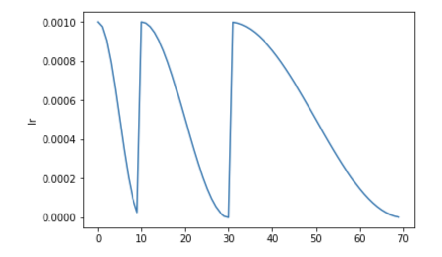

# Schedulers
In `timm`, essentially we have a total of four different schedulers: 
1. [SGDR: Stochastic Gradient Descent with Warm Restarts](https://arxiv.org/abs/1608.03983)
2. [Stochastic Gradient Descent with Hyperbolic-Tangent Decay on Classification](https://arxiv.org/abs/1806.01593)
3. [StepLR](https://github.com/rwightman/pytorch-image-models/blob/master/timm/scheduler/step_lr.py#L13)
4. [PlateauLRScheduler](https://github.com/rwightman/pytorch-image-models/blob/master/timm/scheduler/plateau_lr.py#L12)
In this tutorial we are going to look at each one of them in detail and also look at how we can train our models using these schedulers using the `timm` training script or use them as standalone schedulers for custom PyTorch training scripts.
## Available Schedulers
In this section we will look at the various available schedulers in `timm`.
### SGDR
First, let's look at the `SGDR` scheduler also referred to as the `cosine` scheduler in `timm`. 
The `SGDR` scheduler, or the `Stochastic Gradient Descent with Warm Restarts` scheduler schedules the learning rate using a cosine schedule but with a tweak. It resets the learning rate to the initial value after some number of epochs. 

> NOTE:  Unlike the builtin PyTorch schedulers, this is intended to be consistently called at the END of each epoch, before incrementing the epoch count, to calculate next epoch's value & at the END of each optimizer update, after incrementing the update count, to calculate next update's value.
### StepLR
The `StepLR` is a basic step LR schedule with warmup, noise. 
> NOTE: PyTorch's implementation does not support warmup or noise. 
The schedule for `StepLR` annealing looks something like: 

After a certain number `decay_epochs`, the learning rate is updated to be `lr * decay_rate`. In the above `StepLR` schedule, `decay_epochs` is set to 30 and `decay_rate` is set to 0.5 with an initial `lr` of 1e-4.
### Stochastic Gradient Descent with Hyperbolic-Tangent Decay on Classification 
This is also referred to as the `tanh` annealing. `tanh` stands for hyperbolic tangent decay. The annealing using this scheduler looks something like: 

It is similar to the `SGDR` in the sense that the learning rate is set to the initial `lr` after a certain number of epochs but the annealing is done using the `tanh` function. 
### PlateauLRScheduler
This scheduler is very similar to PyTorch's [ReduceLROnPlateau](https://pytorch.org/docs/stable/_modules/torch/optim/lr_scheduler.html#ReduceLROnPlateau) scheduler. The basic idea is to track an eval metric and based on the evaluation metric's value, the `lr` is reduced using `StepLR` if the eval metric is stagnant for a certain number of epochs. 
## Using the various schedulers in the `timm` training script
It is very easy to train our models using the `timm`'s training script. Essentially, we simply pass in a parameter using the `--sched` flag to specify which scheduler to use and the various hyperparameters alongside. 
- For `SGDR`, we pass in `--sched cosine`. 
- For `PlatueLRScheduler` we pass in `--sched plateau`. 
- For `TanhLRScheduler`, we pass in `--sched tanh`.
- For `StepLR`, we pass in `--sched step`.
Thus the call to the training script looks something like: 
```python 
python train.py --sched cosine --epochs 200 --min-lr 1e-5 --lr-cycle-mul 2 --lr-cycle-limit 2 
```
