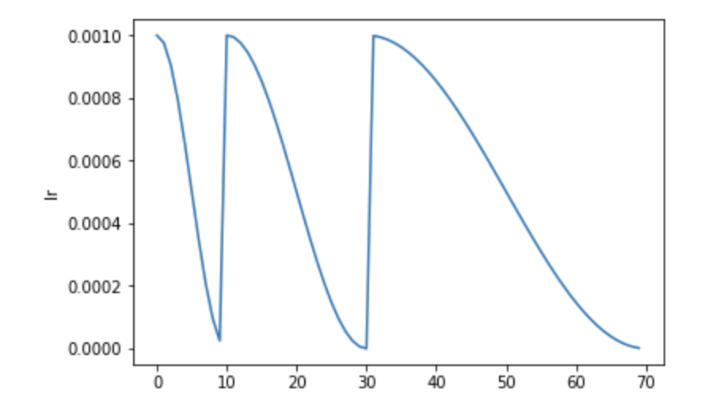
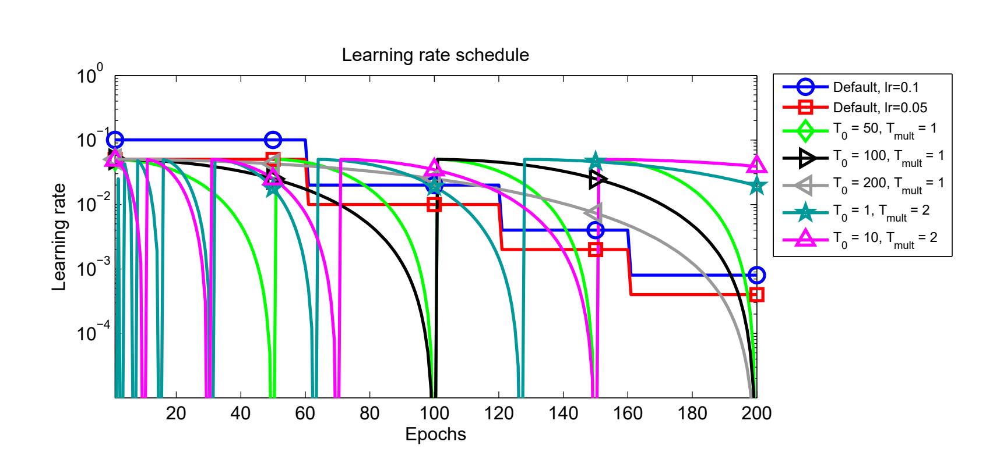

# SGDR - Stochastic Gradient Descent with Warm Restarts
In this tutorial we are going to be looking at the `SGDR` or as referred to in the `timm` library - the `cosine` scheduler in little more detail with all the supporting hyperparams. 
The SGDR schedule as mentioned in the [paper](https://arxiv.org/abs/1608.03983) looks like: 

```python
#hide
%load_ext autoreload
%autoreload 2
```
```python
from timm.scheduler.cosine_lr import CosineLRScheduler
from nbdev.showdoc import show_doc
```
```python
show_doc(CosineLRScheduler)
```
<h2 id="CosineLRScheduler" class="doc_header"><code>class</code> <code>CosineLRScheduler</code><a href="https://github.com/rwightman/pytorch-image-models/tree/master/timm/scheduler/cosine_lr.py#L18" class="source_link" style="float:right">[source]</a></h2>
> <code>CosineLRScheduler</code>(**`optimizer`**:`Optimizer`, **`t_initial`**:`int`, **`t_mul`**:`float`=*`1.0`*, **`lr_min`**:`float`=*`0.0`*, **`decay_rate`**:`float`=*`1.0`*, **`warmup_t`**=*`0`*, **`warmup_lr_init`**=*`0`*, **`warmup_prefix`**=*`False`*, **`cycle_limit`**=*`0`*, **`t_in_epochs`**=*`True`*, **`noise_range_t`**=*`None`*, **`noise_pct`**=*`0.67`*, **`noise_std`**=*`1.0`*, **`noise_seed`**=*`42`*, **`initialize`**=*`True`*) :: `Scheduler`
Cosine decay with restarts.
This is described in the paper https://arxiv.org/abs/1608.03983.
Inspiration from
https://github.com/allenai/allennlp/blob/master/allennlp/training/learning_rate_schedulers/cosine.py
The `CosineLRScheduler` as shown above accepts an `optimizer` and also some hyperparams which we will look into in detail below. We will first see how we can train models using the `cosine` LR scheduler by first using `timm` training docs and then look at how we can use this scheduler as standalone scheduler for our custom training scripts. 
## Using `cosine` scheduler with `timm` training script
To train models using the `cosine` scheduler we simply update the training script args passed by passing in `--sched cosine` parameter alongside the necessary hyperparams. In this section we will also look at how each of the hyperparams update the `cosine` scheduler. 
> NOTE: In the paper this scheduler is referred to as `SGDR` but in `timm` this is referred to as `cosine` scheduler. They are both one and the same with minor implementation difference. 
The training command to use `cosine` scheduler looks something like: 
```python 
python train.py ../imagenette2-320/ --sched cosine
```
## Args
This way we start to use the `cosine` scheduler with all the defaults. Let's now look at the associated hyperparams and how that updates the annealing schedule. 
### `optimizer`
This is the `optimizer` that will be used for the training process. 
```python
from timm import create_model 
from timm.optim import create_optimizer
from types import SimpleNamespace
```
```python
model = create_model('resnet34')
args = SimpleNamespace()
args.weight_decay = 0
args.lr = 1e-4
args.opt = 'adam' 
args.momentum = 0.9
optimizer = create_optimizer(args, model)
```
This `optimizer` object created using `create_optimizer` is what get's passed to the `optimizer` argument. 
### `t_initial` 
The initial number of epochs. Example, 50, 100 etc. 
### `t_mul`
Defaults to 1.0. Updates the `SGDR` schedule annealing. 

As shown in the image below, here **T<sub>0</sub>** is the `t_initial` hyperparameter and **T<sub>mult</sub>** is the `t_mul` hyperparameter. One can see how updating these parameters updates the scheduler. 
### `lr_min` 
Defaults to `1e-5`. The minimum learning rate to use during the scheduling. The learning rate does not ever go below this value. 
### `decay_rate`
When `decay_rate` > 0 and <1., at every restart the learning rate is decayed by new learning rate which equals `lr * decay_rate`. So if `decay_rate=0.5`, then in that case, the new learning rate becomes half the initial `lr`. 
```python
from matplotlib import pyplot as plt
def get_lr_per_epoch(scheduler, num_epoch):
    lr_per_epoch = []
    for epoch in range(num_epoch):
        lr_per_epoch.append(scheduler.get_epoch_values(epoch))
    return lr_per_epoch
```
#### `decay_rate=1.` or no decay
```python
num_epoch = 50
scheduler = CosineLRScheduler(optimizer, t_initial=num_epoch, decay_rate=1., lr_min=1e-5)
lr_per_epoch = get_lr_per_epoch(scheduler, num_epoch*2)
plt.plot([i for i in range(num_epoch*2)], lr_per_epoch);
```
    

    
#### `decay_rate=0.5` 
```python
num_epoch = 50
scheduler = CosineLRScheduler(optimizer, t_initial=num_epoch, decay_rate=0.5, lr_min=1e-5)
lr_per_epoch = get_lr_per_epoch(scheduler, num_epoch*2)
plt.plot([i for i in range(num_epoch*2)], lr_per_epoch);
```
    

    
### `warmup_t` 
Defines the number of warmup epochs. 
### `warmup_lr_init` 
The initial learning rate during warmup. 
```python
num_epoch = 50
scheduler = CosineLRScheduler(optimizer, t_initial=num_epoch, warmup_t=5, warmup_lr_init=1e-5)
lr_per_epoch = get_lr_per_epoch(scheduler, num_epoch)
plt.plot([i for i in range(num_epoch)], lr_per_epoch, label="With warmup");
num_epoch = 50
scheduler = CosineLRScheduler(optimizer, t_initial=num_epoch)
lr_per_epoch = get_lr_per_epoch(scheduler, num_epoch)
plt.plot([i for i in range(num_epoch)], lr_per_epoch, label="Without warmup", alpha=0.8);
plt.legend();
```
    

    
As we can see by setting up `warmup_t` and `warmup_lr_init`, the `cosine` scheduler first starts with a value of `warmup_lr_init`, then gradually progresses up to the `initial_lr` set in the optimizer which is 1e-4. It takes `warmup_t` number of epochs to go from `warmup_lr_init` to `initial_lr`. 
### `warmup_prefix`
Defaults to `False`. If set to `True`, then every new epoch number equals `epoch = epoch - warmup_t`.
```python
num_epoch = 50
scheduler = CosineLRScheduler(optimizer, t_initial=num_epoch, warmup_t=5, warmup_lr_init=1e-5)
lr_per_epoch = get_lr_per_epoch(scheduler, num_epoch)
plt.plot([i for i in range(num_epoch)], lr_per_epoch, label="Without warmup_prefix");
num_epoch = 50
scheduler = CosineLRScheduler(optimizer, t_initial=num_epoch, warmup_t=5, warmup_lr_init=1e-5, warmup_prefix=True)
lr_per_epoch = get_lr_per_epoch(scheduler, num_epoch)
plt.plot([i for i in range(num_epoch)], lr_per_epoch, label="With warmup_prefix");
plt.legend();
```
    

    
In the example above we can see how the `warmup_prefix` updates the LR annealing schedule. 
### `cycle_limit`
The number of maximum restarts in SGDR. 
#### `cycle_limit=1`
```python
num_epoch = 50
scheduler = CosineLRScheduler(optimizer, t_initial=num_epoch, cycle_limit=1)
lr_per_epoch = get_lr_per_epoch(scheduler, num_epoch*2)
plt.plot([i for i in range(num_epoch*2)], lr_per_epoch);
```
    

    
#### `cycle_limit=2`
```python
num_epoch = 50
scheduler = CosineLRScheduler(optimizer, t_initial=num_epoch, cycle_limit=2)
lr_per_epoch = get_lr_per_epoch(scheduler, num_epoch*2)
plt.plot([i for i in range(num_epoch*2)], lr_per_epoch);
```
    

    
### `t_in_epochs`
If set to False, the learning rates returned for epoch `t` are `None`.
```python
num_epoch = 50
scheduler = CosineLRScheduler(optimizer, t_initial=num_epoch, t_in_epochs=False)
lr_per_epoch = get_lr_per_epoch(scheduler, num_epoch)
lr_per_epoch[:5]
```
    [None, None, None, None, None]
### `noise_range_t`
Add noise to learning rate scheduler. 
### `noise_pct`
The amount of noise to be added. Defaults to 0.67.
### `noise_std`
Noise standard deviation. Defaults to 1.0.
### `noise_seed`
 Noise seed to use. Defaults to 42.
### `initialize`
If set to True, then, the an attributes `initial_lr` is set to each param group. Defaults to `True`.
> NOTE: we leave it up to the reader to try and experiment how the LR annealing scheduling get's updated by adding in noise hyperparams. 
