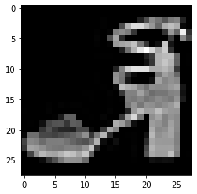

# 基础实战——FashionMNIST时装分类

  
经过前面三章内容的学习，我们完成了以下的内容：  
- 对PyTorch有了初步的认识
- 学会了如何安装PyTorch以及对应的编程环境
- 学习了PyTorch最核心的理论基础（张量&自动求导）
- 梳理了利用PyTorch完成深度学习的主要步骤和对应实现方式  
  
现在，我们通过一个基础实战案例，将第一部分所涉及的PyTorch入门知识串起来，便于大家加深理解。同时为后续的进阶学习打好基础。 
经过本节的学习，你将收获：
- 一个完整的深度学习流程
- 各个组件的实际使用方法
  
我们这里的任务是对10个类别的“时装”图像进行分类，使用[FashionMNIST数据集](https://github.com/zalandoresearch/fashion-mnist/tree/master/data/fashion )。
上图给出了FashionMNIST中数据的若干样例图，其中每个小图对应一个样本。  
FashionMNIST数据集中包含已经预先划分好的训练集和测试集，其中训练集共60,000张图像，测试集共10,000张图像。每张图像均为单通道黑白图像，大小为28\*28pixel，分属10个类别。  
  
下面让我们一起将第三章各部分内容逐步实现，来跑完整个深度学习流程。
**首先导入必要的包**  
```python
import os
import numpy as np
import pandas as pd
import torch
import torch.nn as nn
import torch.optim as optim
from torch.utils.data import Dataset, DataLoader
```
**配置训练环境和超参数**  
```python
# 配置GPU，这里有两种方式
## 方案一：使用os.environ
os.environ['CUDA_VISIBLE_DEVICES'] = '0'
# 方案二：使用“device”，后续对要使用GPU的变量用.to(device)即可
device = torch.device("cuda:1" if torch.cuda.is_available() else "cpu")
## 配置其他超参数，如batch_size, num_workers, learning rate, 以及总的epochs
batch_size = 256
num_workers = 4   # 对于Windows用户，这里应设置为0，否则会出现多线程错误
lr = 1e-4
epochs = 20
```
**数据读入和加载**  
这里同时展示两种方式:  
- 下载并使用PyTorch提供的内置数据集  
- 从网站下载以csv格式存储的数据，读入并转成预期的格式    
第一种数据读入方式只适用于常见的数据集，如MNIST，CIFAR10等，PyTorch官方提供了数据下载。这种方式往往适用于快速测试方法（比如测试下某个idea在MNIST数据集上是否有效）  
第二种数据读入方式需要自己构建Dataset，这对于PyTorch应用于自己的工作中十分重要  
  
同时，还需要对数据进行必要的变换，比如说需要将图片统一为一致的大小，以便后续能够输入网络训练；需要将数据格式转为Tensor类，等等。
  
这些变换可以很方便地借助torchvision包来完成，这是PyTorch官方用于图像处理的工具库，上面提到的使用内置数据集的方式也要用到。PyTorch的一大方便之处就在于它是一整套“生态”，有着官方和第三方各个领域的支持。这些内容我们会在后续课程中详细介绍。
```python
# 首先设置数据变换
from torchvision import transforms
image_size = 28
data_transform = transforms.Compose([
    transforms.ToPILImage(),  
     # 这一步取决于后续的数据读取方式，如果使用内置数据集读取方式则不需要
    transforms.Resize(image_size),
    transforms.ToTensor()
])
```

```python
## 读取方式一：使用torchvision自带数据集，下载可能需要一段时间
from torchvision import datasets
train_data = datasets.FashionMNIST(root='./', train=True, download=True, transform=data_transform)
test_data = datasets.FashionMNIST(root='./', train=False, download=True, transform=data_transform)
```
    /data1/ljq/anaconda3/envs/smp/lib/python3.8/site-packages/torchvision/datasets/mnist.py:498: UserWarning: The given NumPy array is not writeable, and PyTorch does not support non-writeable tensors. This means you can write to the underlying (supposedly non-writeable) NumPy array using the tensor. You may want to copy the array to protect its data or make it writeable before converting it to a tensor. This type of warning will be suppressed for the rest of this program. (Triggered internally at  /opt/conda/conda-bld/pytorch_1623448234945/work/torch/csrc/utils/tensor_numpy.cpp:180.)
      return torch.from_numpy(parsed.astype(m[2], copy=False)).view(*s)
    
```python
## 读取方式二：读入csv格式的数据，自行构建Dataset类
# csv数据下载链接：https://www.kaggle.com/zalando-research/fashionmnist
class FMDataset(Dataset):
    def __init__(self, df, transform=None):
        self.df = df
        self.transform = transform
        self.images = df.iloc[:,1:].values.astype(np.uint8)
        self.labels = df.iloc[:, 0].values
        
    def __len__(self):
        return len(self.images)
    
    def __getitem__(self, idx):
        image = self.images[idx].reshape(28,28,1)
        label = int(self.labels[idx])
        if self.transform is not None:
            image = self.transform(image)
        else:
            image = torch.tensor(image/255., dtype=torch.float)
        label = torch.tensor(label, dtype=torch.long)
        return image, label
train_df = pd.read_csv("./FashionMNIST/fashion-mnist_train.csv")
test_df = pd.read_csv("./FashionMNIST/fashion-mnist_test.csv")
train_data = FMDataset(train_df, data_transform)
test_data = FMDataset(test_df, data_transform)
```
在构建训练和测试数据集完成后，需要定义DataLoader类，以便在训练和测试时加载数据  
```python
train_loader = DataLoader(train_data, batch_size=batch_size, shuffle=True, num_workers=num_workers, drop_last=True)
test_loader = DataLoader(test_data, batch_size=batch_size, shuffle=False, num_workers=num_workers)
```
读入后，我们可以做一些数据可视化操作，主要是验证我们读入的数据是否正确
```python
import matplotlib.pyplot as plt
image, label = next(iter(train_loader))
print(image.shape, label.shape)
plt.imshow(image[0][0], cmap="gray")
```
    torch.Size([256, 1, 28, 28]) 
    torch.Size([256])   
    <matplotlib.image.AxesImage at 0x7f19a043cc10>

    

    
**模型设计**  
由于任务较为简单，这里我们手搭一个CNN，而不考虑当下各种模型的复杂结构，模型构建完成后，将模型放到GPU上用于训练。  
```python
class Net(nn.Module):
    def __init__(self):
        super(Net, self).__init__()
        self.conv = nn.Sequential(
            nn.Conv2d(1, 32, 5),
            nn.ReLU(),
            nn.MaxPool2d(2, stride=2),
            nn.Dropout(0.3),
            nn.Conv2d(32, 64, 5),
            nn.ReLU(),
            nn.MaxPool2d(2, stride=2),
            nn.Dropout(0.3)
        )
        self.fc = nn.Sequential(
            nn.Linear(64*4*4, 512),
            nn.ReLU(),
            nn.Linear(512, 10)
        )
        
    def forward(self, x):
        x = self.conv(x)
        x = x.view(-1, 64*4*4)
        x = self.fc(x)
        # x = nn.functional.normalize(x)
        return x
model = Net()
model = model.cuda()
# model = nn.DataParallel(model).cuda()   # 多卡训练时的写法，之后的课程中会进一步讲解
```
**设定损失函数**  
使用torch.nn模块自带的CrossEntropy损失  
PyTorch会自动把整数型的label转为one-hot型，用于计算CE loss  
这里需要确保label是从0开始的，同时模型不加softmax层（使用logits计算）,这也说明了PyTorch训练中各个部分不是独立的，需要通盘考虑
```python
criterion = nn.CrossEntropyLoss()
# criterion = nn.CrossEntropyLoss(weight=[1,1,1,1,3,1,1,1,1,1])
```

```python
?nn.CrossEntropyLoss # 这里方便看一下weighting等策略
```
**设定优化器**  
这里我们使用Adam优化器  
```python
optimizer = optim.Adam(model.parameters(), lr=0.001)
```
**训练和测试（验证）**  
各自封装成函数，方便后续调用  
关注两者的主要区别：  
- 模型状态设置  
- 是否需要初始化优化器
- 是否需要将loss传回到网络
- 是否需要每步更新optimizer  
  
此外，对于测试或验证过程，可以计算分类准确率
```python
def train(epoch):
    model.train()
    train_loss = 0
    for data, label in train_loader:
        data, label = data.cuda(), label.cuda()
        optimizer.zero_grad()
        output = model(data)
        loss = criterion(output, label)
        loss.backward()
        optimizer.step()
        train_loss += loss.item()*data.size(0)
    train_loss = train_loss/len(train_loader.dataset)
    print('Epoch: {} \tTraining Loss: {:.6f}'.format(epoch, train_loss))
```

```python
def val(epoch):       
    model.eval()
    val_loss = 0
    gt_labels = []
    pred_labels = []
    with torch.no_grad():
        for data, label in test_loader:
            data, label = data.cuda(), label.cuda()
            output = model(data)
            preds = torch.argmax(output, 1)
            gt_labels.append(label.cpu().data.numpy())
            pred_labels.append(preds.cpu().data.numpy())
            loss = criterion(output, label)
            val_loss += loss.item()*data.size(0)
    val_loss = val_loss/len(test_loader.dataset)
    gt_labels, pred_labels = np.concatenate(gt_labels), np.concatenate(pred_labels)
    acc = np.sum(gt_labels==pred_labels)/len(pred_labels)
    print('Epoch: {} \tValidation Loss: {:.6f}, Accuracy: {:6f}'.format(epoch, val_loss, acc))
```

```python
for epoch in range(1, epochs+1):
    train(epoch)
    val(epoch)
```
    /data1/ljq/anaconda3/envs/smp/lib/python3.8/site-packages/torch/nn/functional.py:718: UserWarning: Named tensors and all their associated APIs are an experimental feature and subject to change. Please do not use them for anything important until they are released as stable. (Triggered internally at  /opt/conda/conda-bld/pytorch_1623448234945/work/c10/core/TensorImpl.h:1156.)
      return torch.max_pool2d(input, kernel_size, stride, padding, dilation, ceil_mode)
    
    Epoch: 1 	Training Loss: 0.659050
    Epoch: 1 	Validation Loss: 0.420328, Accuracy: 0.852000
    Epoch: 2 	Training Loss: 0.403703
    Epoch: 2 	Validation Loss: 0.350373, Accuracy: 0.872300
    Epoch: 3 	Training Loss: 0.350197
    Epoch: 3 	Validation Loss: 0.293053, Accuracy: 0.893200
    Epoch: 4 	Training Loss: 0.322463
    Epoch: 4 	Validation Loss: 0.283335, Accuracy: 0.892300
    Epoch: 5 	Training Loss: 0.300117
    Epoch: 5 	Validation Loss: 0.268653, Accuracy: 0.903500
    Epoch: 6 	Training Loss: 0.282179
    Epoch: 6 	Validation Loss: 0.247219, Accuracy: 0.907200
    Epoch: 7 	Training Loss: 0.268283
    Epoch: 7 	Validation Loss: 0.242937, Accuracy: 0.907800
    Epoch: 8 	Training Loss: 0.257615
    Epoch: 8 	Validation Loss: 0.234324, Accuracy: 0.912200
    Epoch: 9 	Training Loss: 0.245795
    Epoch: 9 	Validation Loss: 0.231515, Accuracy: 0.914100
    Epoch: 10 	Training Loss: 0.238739
    Epoch: 10 	Validation Loss: 0.229616, Accuracy: 0.914400
    Epoch: 11 	Training Loss: 0.230499
    Epoch: 11 	Validation Loss: 0.228124, Accuracy: 0.915200
    Epoch: 12 	Training Loss: 0.221574
    Epoch: 12 	Validation Loss: 0.211928, Accuracy: 0.921200
    Epoch: 13 	Training Loss: 0.217924
    Epoch: 13 	Validation Loss: 0.209744, Accuracy: 0.921700
    Epoch: 14 	Training Loss: 0.206033
    Epoch: 14 	Validation Loss: 0.215477, Accuracy: 0.921400
    Epoch: 15 	Training Loss: 0.203349
    Epoch: 15 	Validation Loss: 0.215550, Accuracy: 0.919400
    Epoch: 16 	Training Loss: 0.196319
    Epoch: 16 	Validation Loss: 0.210800, Accuracy: 0.923700
    Epoch: 17 	Training Loss: 0.191969
    Epoch: 17 	Validation Loss: 0.207266, Accuracy: 0.923700
    Epoch: 18 	Training Loss: 0.185466
    Epoch: 18 	Validation Loss: 0.207138, Accuracy: 0.924200
    Epoch: 19 	Training Loss: 0.178241
    Epoch: 19 	Validation Loss: 0.204093, Accuracy: 0.924900
    Epoch: 20 	Training Loss: 0.176674
    Epoch: 20 	Validation Loss: 0.197495, Accuracy: 0.928300
    
**模型保存**  
训练完成后，可以使用torch.save保存模型参数或者整个模型，也可以在训练过程中保存模型  
这部分会在后面的课程中详细介绍
```python
save_path = "./FahionModel.pkl"
torch.save(model, save_path)
```
**作业**
- 模型训练
1. 在学习完6.2 动态调整学习率后尝试使用动态调整学习率的方法训练模型。
2. 在学习完6.3 模型微调后，尝试使用预训练模型进行模型微调，观察模型的训练效果。
3. 在学习完6.5 数据增强后，尝试使用imgaug库进行数据增强，观察模型的训练效果。
4. 在学习完7.3 使用TensorBoard可视化训练过程后，尝试使用TensorBoard可视化训练过程，观察模型的训练效果。
5. 使用多卡训练模型，观察模型的训练效果。
- 模型推理
1. 在学习完5.4 PyTorh模型保存与读取后，加载已经训练好的模型，进行模型推理。
2. 使用sklearn.metrics中的classification_report函数，输出模型的分类报告。
3. 学习完9.1 使用ONNX进行部署并推理后，将模型转换为ONNX格式，使用ONNXRuntime进行推理。