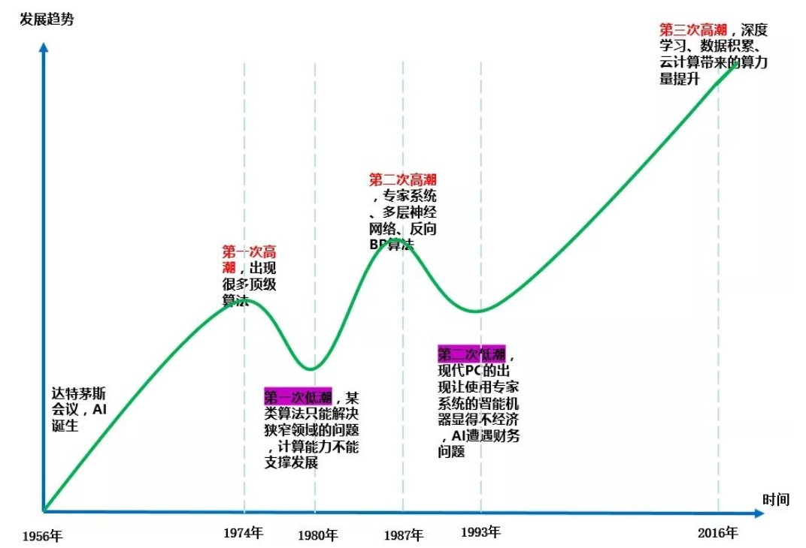
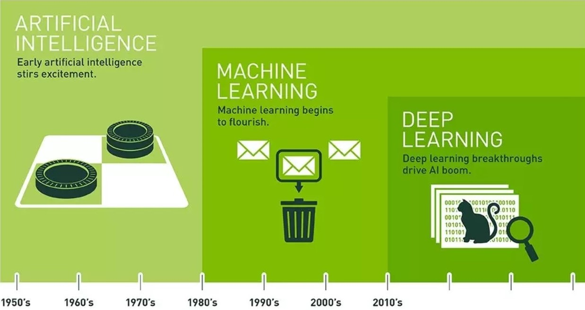

# 人工智能简史
自从图灵在1950年第一次提出“机器智能（Machine Intelligence）”这个概念以来，人工智能已经经历了七十余年的发展。在这七十多年中，人工智能的发展先后经历了三次浪潮，每一次浪潮对人工智能的发展来说，都是具有里程碑意义的。接下来我们将以这三次浪潮为主线，为大家介绍人工智能的发展历程。除此之外，我们也将会给大家介绍现在常说的Deep learning，Machine Learning和AI之间的关系。
- [*] 通过本章学习，你将收获：
* 了解人工智能的三次浪潮
* 了解Deep learning，Machine learning和AI之间的关系

## 1.1 人工智能的三次浪潮
### 1.1.1 第一次浪潮
1950年，阿兰·图灵发表著名论文《计算机器与智能》，在这篇论文中，他提出了机器思维的概念和图灵测试，标志着“机器的智能化”正式进入人类的科技树。在此之后的数年间，机器智能有了进一步的发展。两年后的1952年，计算机科学家阿瑟·萨缪尔开发出一款跳棋程序，并提出了“机器学习”这个概念。在此之后的4年里，机器智能化也取得了一定的进步，直到1956年的达特茅斯会议上，约翰·麦卡锡正式提出了“人工智能”这个词语，1956年，也就成为了实际意义上的人工智能元年。
达特茅斯会议之后，人工智能进入了一个高速发展的时期，也就是所谓的“第一次浪潮”。这次浪潮一直持续到二十世纪六十年代中期。在这近10年的时间里，计算机本身的“智能”并没有得到发展，快速进步的是人工智能的一些理论与算法方面。很多对后来人工智能发展起到奠基作用的算法——如罗森布拉特在1957年发明感知机——就是在这个时间段诞生的。感知机是机器学习人工神经网络理论中神经元的最早模型，这一模型也使得人工神经网络理论得到了巨大的突破。除此之外，强化学习的雏形也是在那段时间提出的。彼时的科学界都弥漫着快乐的气氛，大家都认为，只要坚持走下去，人工智能就一定会得到跨越式的发展。但事与愿违，不久后人工智能的第一次寒冬（AI Winter）就到来了。
1966年前后，AI遭遇了瓶颈。人们发现逻辑证明器、感知器、强化学习等等只能做很简单、非常专门且很窄的任务，稍微超出范围就无法应对。当时的计算机有限的内存和处理速度不足以解决任何实际的AI问题。研究者们很快就意识到，要求程序对这个世界具有儿童水平的认识这个要求都太高了——那时没人能够做出人工智能需要的巨大数据库，也没人知道一个程序怎样才能学到如此丰富的信息。另一方面，有很多计算复杂度以指数程度增加，这成为了不可能完成的计算任务。
可以说，人工智能的第一次浪潮在发展到“非智能对话机器”的智能化初级阶段时，就因为当时的技术限制不得不停摆。人工智能的发展似乎陷入了一个无解的“死胡同”里，并被计算机科学家们逐渐冷落。
### 1.1.2 第二次浪潮
时间来到了20世纪80年代。经过了数十年的研究，科学家们逐渐放弃了初代的符号学派思路，改用统计学的思路来研究人工智能。研究思路的改变再加上硬件技术的升级，人工智能的发展又一次迎来的新的契机。在那个时代，基于人工智能的“专家系统”受到了绝对的热捧。特定领域的“专家系统”程序被更广泛的采纳，该系统能够根据领域内的专业知识，推理出专业问题的答案，人工智能也由此变得更加“实用”，专家系统所依赖的知识库系统和知识工程成为了当时主要的研究方向。
但由于专家系统仅适用于某些特定场景，很快人们就对这一系统由狂热的追捧逐渐走向巨大的失望。与此同时，现代电子计算机的出现让“知识查询”的费用进一步降低，人们更加深刻的意识到专家系统是如此的古老陈旧。因此，政府部门下调了专家系统的研发资金。缺少了资金的支持，由专家系统再次兴起的人工智能研究又一次陷入了低谷之中。
虽然第二次浪潮持续的时间比较短，但它在整个人工智能发展历史中仍然起到了举足轻重的作用。它彻底改变了人工智能研究的大思路，将统计学思想引入研究之中，为人工智能在未来几十年的发展打下了基础。除此之外，在这次浪潮中提出的BP神经网络，为之后机器感知、交互的能力奠定了基础。
### 1.1.3 第三次浪潮
1993年后，新的数学工具，理论和摩尔定律的出现，使得计算机的算力进一步提高，以深度学习为核心的机器学习算法获得发展，新的芯片和云计算的发展使得可用的计算能力获得飞跃式提高，大数据的发展使得海量数据的储存和分析成为可能。在这样的技术背景下，人工智能的第三次浪潮即将到来。
人工智能的第三次浪潮有两个重要的时间节点：2006年和2016年。2006年是深度学习发展史的分水岭。杰弗里辛顿在这一年发表了《一种深度置信网络的快速学习算法》，其他重要的深度学习学术文章也在这一年被发布，在基本理论层面取得了若干重大突破。而2016年3月，谷歌DeepMind研发的AlphaGo在围棋人机大战中击败韩国职业九段棋手李世乭，“人工智能”一词正式进入普通民众的视野并被逐渐熟知。至此，人工智能正式迈向了从“科研领域的应用型工具”到“实用性，功能性工具”的转变，人工智能有了新的研究方向和研究模式，即从过去的学术主导型研究逐渐走向了商业主导型研究。随着人类社会对智能化工具的不断追求和探索，人工智能的发展迎来了全新的时代。
### 1.1.4 总结

上图是对人工智能发展中经历的三次浪潮和两次寒冬的形象总结。除此之外，有观点认为，深度学习算法带来的“技术红利”，将支撑我们再发展5~10年时间，随后就会遇到瓶颈。人工智能不是一个简单的从1到100进步的过程，它往往趋向于两个极端：要么90分以上，其它的都是10分以下。目前，人工智能急需寻找到一个“技术奇点”，让人工智能迅速发展到通用人工智能甚至是超级人工智能的水平。否则，在人工智能研究商业化的今天，无法从中获利的投资人们将快速撤资退场，人工智能或将进入下一个寒冬。
## 1.2 DL,ML,AI三者之间的关系
大家对“人工智能”这个词，也就是我们所谓的“AI”（Artificial Intelligence）想必是非常熟悉，无论是近几年各行各业都喜欢用作营销噱头的“智能化”还是早期电影如《黑客帝国》、《终结者》等，都让AI这个概念深入人心。但近几年，另外两个词语也在逐步进入我们的生活，即就是“机器学习（Machine Learning，ML）”和“深度学习（Deep Learning，DL）”。在接下来的叙述中，我们就将了解DL和ML究竟是什么，以及它们和AI之间的关系。
### 1.2.1 DL和ML是什么
Machine Learning（机器学习）。它在1959年被机器学习的先驱者之一的阿瑟·塞缪尔定义为：一门研究领域，它赋予计算机无需明确编程就能学习的能力。也就是说，机器学习程序不同于传统编程那样，使用if-then语句那样明确地输入到计算机中以便它根据条件执行。在某种意义上，机器学习程序赋予机器根据所接触到的数据进行自我调整的能力。机器学习更像是一种优化算法，如果我们在事先就对它进行了正确的调整，那么它就会在一遍又一遍的尝试和猜测之中不断减少它的错误，以无限逼近于最终的正确结果。而机器学习的基本思路，也就是将现实问题抽象成为一个数学问题，机器通过训练，寻找到解决数学问题的方法，进而解决现实问题。
Deep Learning（深度学习）。它在2006年被提出，并在近些年得到了迅速的发展。它通过建立、模拟人脑进行分析学习的神经网络，并模仿人脑的机制来解释数据。李开复教授在《人工智能》一书中这样解释深度学习：“假设深度学习要处理的信息是“水流”，而处理数据的深度学习网络是一个由管道和阀门组成的巨大水管网络。网络的入口是若干管道开口，网络的出口也是若干管道开口。这个水管网络有许多层，每一层由许多个可以控制水流流向与流量的调节阀。根据不同任务的需要，水管网络的层数、每层的调节阀数量可以有不同的变化组合。对复杂任务来说，调节阀的总数可以成千上万甚至更多。水管网络中，每一层的每个调节阀都通过水管与下一层的所有调节阀连接起来，组成一个从前到后，逐层完全连通的水流系统。”
### 1.2.2 它们和AI的关系
众所周知，人工智能是研究、开发用于模拟、延伸和扩展人的智能的理论、方法、技术及应用系统的一门技术科学。既然如此，那么计算器算是人工智能吗？严格地说是算的，因为它至少做了“模拟”人在计算方面的智能，并扩展了这个能力（比人算得更快）。我们通过代码驱动计算机去帮我们干活，这个算是人工智能吗？也算的。我们现在看到的貌似很高端的技术，如图像识别、NLP，其实依然没有脱离这个范围，说白了，就是“模拟人在看图方面的智能”和“模拟人在听话方面的智能”，本质上和“模拟人在计算方面的智能”没啥两样，虽然难度有高低，但目的是一样的——模拟、延伸和扩展人的智能。
随着人对计算机的期望越来越高，要求它解决的问题越来越复杂，仅仅算的更快，看的更准已经远远不能满足人们的诉求了。要解决的问题域越来越复杂，即使是同一个问题，其面对的场景也越来越多。传统的思路就是查找问题的条件和解决方法，在计算机程序中再加入一个if-then。但这只是治标不治本。随着我们期待解决的问题越来越多，计算机程序将越来越复杂，越来越难以维护。那怎么办呢？于是有人提出了一个新的思路——能否不为难码农，让机器自己去学习呢？
至此，“机器学习”的概念，正式诞生。机器学习就是用算法解析数据，不断学习，对世界中发生的事做出判断和预测的一项技术。研究人员不会亲手编写软件、确定特殊指令集、然后让程序完成特殊任务；相反，研究人员会用大量数据和算法“训练”机器，让机器自行学会如何执行任务。说白了，机器学习只是人们实现让机器“模拟、延伸和扩展人的智能”的一种较为轻松的方法罢了。它的成功与否取决于我们喂给机器的数据集是否准确且有效。因此，机器学习是大数据技术领域内的一个应用，人们只是借用这个应用，来发展人工智能罢了。机器学习发展了几十年之后，再次遇到了瓶颈期。随着问题场景的更加复杂多变，需要进行判断的条件更加苛刻，人们不得不重新思考一种方式来优化机器学习。深度学习就是带着这个目的被提出的。
机器学习中有一个概念叫“神经网络”，深度学习正是通过优化这个网络来更好的解决通过机器学习难以解决的问题。它的基本特点，就是试图模仿大脑的神经元之间传递，处理信息的模式，通过不同的“层”来拆分问题，每一层解决问题的一个部分。比如在利用深度学习解决智能驾驶问题中，第一层可能用于识别车辆与道路边缘的距离，第二层用于识别道路标线，第三层用于识别路上的其他车辆等等。
通过以上几段话的简单描述，DL,ML和AI之间的关系也就明确了。它们三者的关系就像是俄罗斯套娃：AI最大，它的目的是通过让机器模仿人类进而超越人类；ML次之，它是AI的一个分支（也是最重要分支），是让机器模仿人类的一种方法；DL更次之，它是ML的一个分支，它的目的是让机器不借助人工标注，也能自主提取目标特征进而解决问题的一种方法。
最后，借用一张经典的关系图作为结尾：
