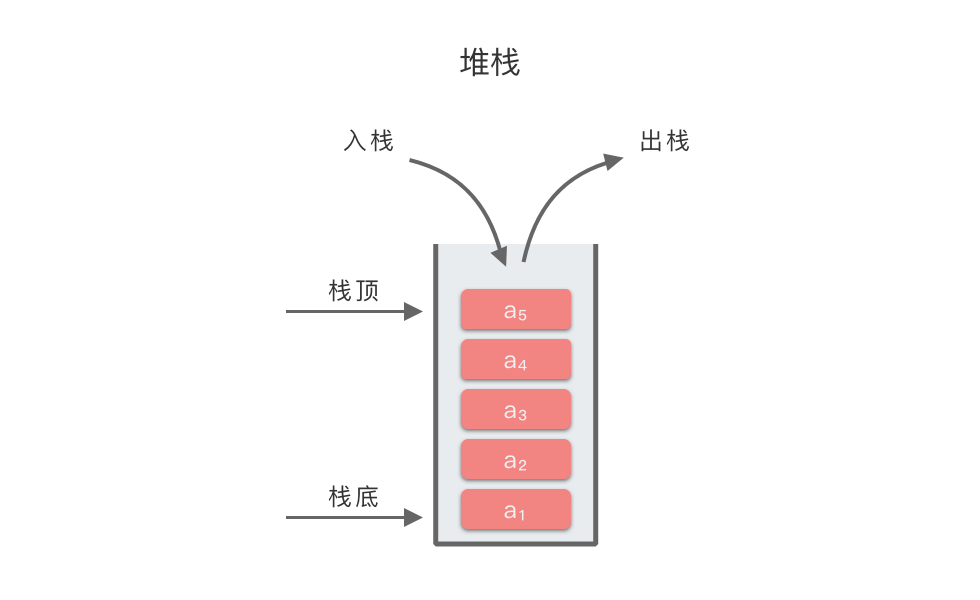
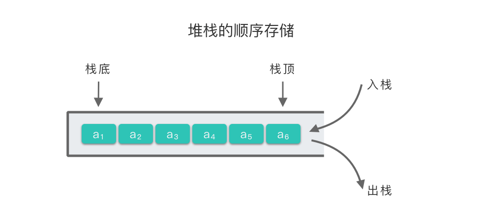
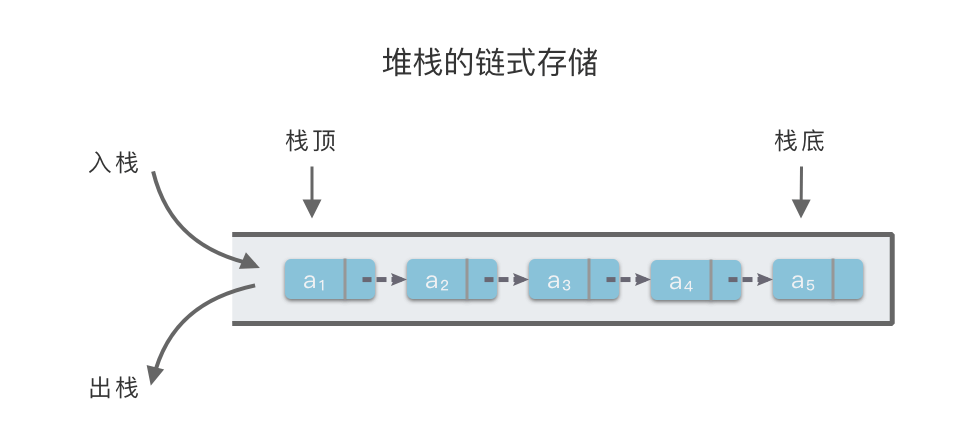

# 02.02.01 堆栈基础知识（第 05 ~ 06 天）
## 1. 堆栈简介
> **堆栈（Stack）**：简称为栈。一种线性表数据结构，是一种只允许在表的一端进行插入和删除操作的线性表。
我们把栈中允许插入和删除的一端称为 **「栈顶（top）」**；另一端则称为 **「栈底（bottom）」**。当表中没有任何数据元素时，称之为 **「空栈」**。
堆栈有两种基本操作：**「插入操作」** 和 **「删除操作」**。
- 栈的插入操作又称为「入栈」或者「进栈」。
- 栈的删除操作又称为「出栈」或者「退栈」。

简单来说，栈是一种 **「后进先出（Last In First Out）」** 的线性表，简称为 **「LIFO 结构」**。
我们可以从两个方面来解释一下栈的定义：
- 第一个方面是 **「线性表」**。
栈首先是一个线性表，栈中元素具有前驱后继的线性关系。栈中元素按照 $a_1, a_2, ... , a_n$ 的次序依次进栈。栈顶元素为 $a_n$。
- 第二个方面是 **「后进先出原则」**。
根据堆栈的定义，每次删除的总是堆栈中当前的栈顶元素，即最后进入堆栈的元素。而在进栈时，最先进入堆栈的元素一定在栈底，最后进入堆栈的元素一定在栈顶。也就是说，元素进入堆栈或者退出退栈是按照「后进先出（Last In First Out）」的原则进行的。
## 2. 堆栈的顺序存储与链式存储
和线性表类似，栈有两种存储表示方法：**「顺序栈」** 和 **「链式栈」**。
- **「顺序栈」**：即堆栈的顺序存储结构。利用一组地址连续的存储单元依次存放自栈底到栈顶的元素，同时使用指针 `top` 指示栈顶元素在顺序栈中的位置。
- **「链式栈」**：即堆栈的链式存储结构。利用单链表的方式来实现堆栈。栈中元素按照插入顺序依次插入到链表的第一个节点之前，并使用栈顶指针 `top` 指示栈顶元素，`top` 永远指向链表的头节点位置。
在描述堆栈的顺序存储与链式存储具体实现之前，我们先来看看堆栈具有哪些基本操作。
### 2.1 堆栈的基本操作
栈作为一种线性表来说，理论上应该具备线性表所有的操作特性，但由于「后进先出」的特殊性，所以针对栈的操作进行了一些变化。尤其是插入操作和删除操作，改为了入栈（push）和出栈（pop）。
堆栈的基本操作如下：
- **初始化空栈**：创建一个空栈，定义栈的大小 `size`，以及栈顶元素指针 `top`。
- **判断栈是否为空**：当堆栈为空时，返回 `True`。当堆栈不为空时，返回 `False`。一般只用于栈中删除操作和获取当前栈顶元素操作中。
- **判断栈是否已满**：当堆栈已满时，返回 `True`，当堆栈未满时，返回 `False`。一般只用于顺序栈中插入元素和获取当前栈顶元素操作中。
- **插入元素（进栈、入栈）**：相当于在线性表最后元素后面插入一个新的数据元素。并改变栈顶指针 `top` 的指向位置。
- **删除元素（出栈、退栈）**：相当于在线性表最后元素后面删除最后一个数据元素。并改变栈顶指针 `top` 的指向位置。
- **获取栈顶元素**：相当于获取线性表中最后一个数据元素。与插入元素、删除元素不同的是，该操作并不改变栈顶指针 `top` 的指向位置。
接下来我们来看一下栈的顺序存储与链式存储两种不同的实现方式。
### 2.2 堆栈的顺序存储实现
堆栈最简单的实现方式就是借助于一个数组来描述堆栈的顺序存储结构。在 `Python` 中我们可以借助列表 `list` 来实现。这种采用顺序存储结构的堆栈也被称为 **「顺序栈」**。
#### 2.2.1 堆栈的顺序存储基本描述

我们约定 `self.top` 指向栈顶元素所在位置。
- **初始化空栈**：使用列表创建一个空栈，定义栈的大小 `self.size`，并令栈顶元素指针 `self.top` 指向 `-1`，即 `self.top = -1`。
- **判断栈是否为空**：当 `self.top == -1` 时，说明堆栈为空，返回 `True`，否则返回 `False`。
- **判断栈是否已满**：当 `self.top == self.size - 1`，说明堆栈已满，返回 `True`，否则返回返回 `False`。
- **插入元素（进栈、入栈）**：先判断堆栈是否已满，已满直接抛出异常。如果堆栈未满，则在 `self.stack` 末尾插入新的数据元素，并令 `self.top` 向右移动 `1` 位。
- **删除元素（出栈、退栈）**：先判断堆栈是否为空，为空直接抛出异常。如果堆栈不为空，则删除 `self.stack` 末尾的数据元素，并令 `self.top` 向左移动 `1` 位。
- **获取栈顶元素**：先判断堆栈是否为空，为空直接抛出异常。不为空则返回 `self.top` 指向的栈顶元素，即 `self.stack[self.top]`。
#### 2.2.2 堆栈的顺序存储实现代码
```python
class Stack:
    # 初始化空栈
    def __init__(self, size=100):
        self.stack = []
        self.size = size
        self.top = -1    
        
    # 判断栈是否为空
    def is_empty(self):
        return self.top == -1
    
    # 判断栈是否已满
    def is_full(self):
        return self.top + 1 == self.size
    
    # 入栈操作
    def push(self, value):
        if self.is_full():
            raise Exception('Stack is full')
        else:
            self.stack.append(value)
            self.top += 1
    
    # 出栈操作
    def pop(self):
        if self.is_empty():
            raise Exception('Stack is empty')
        else:
            self.stack.pop()
            self.top -= 1
    
    # 获取栈顶元素
    def peek(self):
        if self.is_empty():
            raise Exception('Stack is empty')
        else:
            return self.stack[self.top]
```
### 2.3 堆栈的链式存储实现
堆栈的顺序存储结构保留着顺序存储分配空间的固有缺陷，即在栈满或者其他需要重新调整存储空间时需要移动大量元素。为此，堆栈可以采用链式存储方式来实现。在 `Python` 中我们通过构造链表节点 `Node` 的方式来实现。这种采用链式存储结构的堆栈也被称为 **「链式栈」**。

#### 2.3.1 堆栈的链式存储基本描述
我们约定 `self.top` 指向栈顶元素所在位置。
- **初始化空栈**：使用列表创建一个空栈，并令栈顶元素指针 `self.top` 指向 `None`，即 `self.top = None`。
- **判断栈是否为空**：当 `self.top == None` 时，说明堆栈为空，返回 `True`，否则返回 `False`。
- **插入元素（进栈、入栈）**：创建值为 `value` 的链表节点，插入到链表头节点之前，并令栈顶指针 `self.top` 指向新的头节点。
- **删除元素（出栈、退栈）**：先判断堆栈是否为空，为空直接抛出异常。如果堆栈不为空，则先使用变量 `cur` 存储当前栈顶指针 `self.top` 指向的头节点，然后令 `self.top` 沿着链表移动 `1` 位，然后再删除之前保存的 `cur` 节点。
- **获取栈顶元素**：先判断堆栈是否为空，为空直接抛出异常。不为空则返回 `self.top` 指向的栈顶节点的值，即 `self.top.value`。
#### 2.3.2 堆栈的链式存储实现代码
```python
class Node:
    def __init__(self, value):
        self.value = value
        self.next = None
        
class Stack:
    # 初始化空栈
    def __init__(self):
        self.top = None
    
    # 判断栈是否为空
    def is_empty(self):
        return self.top == None
    
    # 入栈操作
    def push(self, value):
        cur = Node(value)
        cur.next = self.top
        self.top = cur
    
    # 出栈操作
    def pop(self):
        if self.is_empty():
            raise Exception('Stack is empty')
        else:
            cur = self.top
            self.top = self.top.next
            del cur
    
    # 获取栈顶元素
    def peek(self):
        if self.is_empty():
            raise Exception('Stack is empty')
        else:
            return self.top.value
```
## 3. 堆栈的应用
堆栈是算法和程序中最常用的辅助结构，其的应用十分广泛。堆栈基本应用于两个方面：
- 使用堆栈可以很方便的保存和取用信息，因此长被用作算法和程序中的辅助存储结构，临时保存信息，供后面操作中使用。
  - 例如：操作系统中的函数调用栈，浏览器中的前进、后退功能。
- 堆栈的后进先出规则，可以保证特定的存取顺序。
  - 例如：翻转一组元素的顺序、铁路列车车辆调度。
下面我们来讲解一下栈应用的典型例子。
### 3.1 括号匹配问题
#### 3.1.1 题目链接
- [20. 有效的括号 - 力扣（LeetCode）](https://leetcode.cn/problems/valid-parentheses/)
#### 3.1.2 题目大意
**描述**：给定一个只包括 `'('`，`')'`，`'{'`，`'}'`，`'['`，`']'` 的字符串 `s` 。
**要求**：判断字符串 `s` 是否有效（即括号是否匹配）。
**说明**：
- 有效字符串需满足：
  1. 左括号必须用相同类型的右括号闭合。
  2. 左括号必须以正确的顺序闭合。
**示例**：
```python
输入：s = "()"
输出：True
输入：s = "()[]{}"
输出：True
```
#### 3.2.3 解题思路
##### 思路 1：栈
括号匹配是「栈」的经典应用。我们可以用栈来解决这道题。具体做法如下：
1. 先判断一下字符串的长度是否为偶数。因为括号是成对出现的，所以字符串的长度应为偶数，可以直接判断长度为奇数的字符串不匹配。如果字符串长度为奇数，则说明字符串 `s` 中的括号不匹配，直接返回 `False`。
2. 使用栈 `stack` 来保存未匹配的左括号。然后依次遍历字符串 `s` 中的每一个字符。
   1. 如果遍历到左括号时，将其入栈。
   2. 如果遍历到右括号时，先看栈顶元素是否是与当前右括号相同类型的左括号。
      1. 如果是与当前右括号相同类型的左括号，则令其出栈，继续向前遍历。
      2. 如果不是与当前右括号相同类型的左括号，则说明字符串 `s` 中的括号不匹配，直接返回 `False`。
3. 遍历完，还要再判断一下栈是否为空。
   1. 如果栈为空，则说明字符串 `s` 中的括号匹配，返回 `True`。
   2. 如果栈不为空，则说明字符串 `s` 中的括号不匹配，返回 `False`。
##### 思路 1：代码
```python
class Solution:
    def isValid(self, s: str) -> bool:
        if len(s) % 2 == 1:
            return False
        stack = list()
        for ch in s:
            if ch == '(' or ch == '[' or ch == '{':
                stack.append(ch)
            elif ch == ')':
                if len(stack) !=0 and stack[-1] == '(':
                    stack.pop()
                else:
                    return False
            elif ch == ']':
                if len(stack) !=0 and stack[-1] == '[':
                    stack.pop()
                else:
                    return False
            elif ch == '}':
                if len(stack) !=0 and stack[-1] == '{':
                    stack.pop()
                else:
                    return False
        if len(stack) == 0:
            return True
        else:
            return False
```
##### 思路 1：复杂度分析
- **时间复杂度**：$O(n)$。
- **空间复杂度**：$O(1)$。
### 3.2 表达式求值问题
#### 3.2.1 题目链接
- [227. 基本计算器 II - 力扣（LeetCode）](https://leetcode.cn/problems/basic-calculator-ii/)
#### 3.2.2 题目大意
**描述**：给定一个字符串表达式 `s`，表达式中所有整数为非负整数，运算符只有 `+`、`-`、`*`、`/`，没有括号。
**要求**：实现一个基本计算器来计算并返回它的值。
**说明**：
- $1 \le s.length \le 3 * 10^5$。
- `s` 由整数和算符（`+`、`-`、`*`、`/`）组成，中间由一些空格隔开。
- `s` 表示一个有效表达式。
- 表达式中的所有整数都是非负整数，且在范围 $[0, 2^{31} - 1]$ 内。
- 题目数据保证答案是一个 32-bit 整数。
**示例**：
```python
输入：s = "3+2*2"
输出：7
输入：s = " 3/2 "
输出：1
```
#### 3.2.3 解题思路
##### 思路 1：栈
计算表达式中，乘除运算优先于加减运算。我们可以先进行乘除运算，再将进行乘除运算后的整数值放入原表达式中相应位置，再依次计算加减。
可以考虑使用一个栈来保存进行乘除运算后的整数值。正整数直接压入栈中，负整数，则将对应整数取负号，再压入栈中。这样最终计算结果就是栈中所有元素的和。
具体做法：
1. 遍历字符串 `s`，使用变量 `op` 来标记数字之前的运算符，默认为 `+`。
2. 如果遇到数字，继续向后遍历，将数字进行累积，得到完整的整数 num。判断当前 op 的符号。
   1. 如果 `op` 为 `+`，则将 `num` 压入栈中。
   2. 如果 `op` 为 `-`，则将 `-num` 压入栈中。
   3. 如果 `op` 为 `*`，则将栈顶元素 `top` 取出，计算 `top * num`，并将计算结果压入栈中。
   4. 如果 `op` 为 `/`，则将栈顶元素 `top` 取出，计算 `int(top / num)`，并将计算结果压入栈中。
3. 如果遇到 `+`、`-`、`*`、`/` 操作符，则更新 `op`。
4. 最后将栈中整数进行累加，并返回结果。
##### 思路 1：代码
```python
class Solution:
    def calculate(self, s: str) -> int:
        size = len(s)
        stack = []
        op = '+'
        index = 0
        while index < size:
            if s[index] == ' ':
                index += 1
                continue
            if s[index].isdigit():
                num = ord(s[index]) - ord('0')
                while index + 1 < size and s[index+1].isdigit():
                    index += 1
                    num = 10 * num + ord(s[index]) - ord('0')
                if op == '+':
                    stack.append(num)
                elif op == '-':
                    stack.append(-num)
                elif op == '*':
                    top = stack.pop()
                    stack.append(top * num)
                elif op == '/':
                    top = stack.pop()
                    stack.append(int(top / num))
            elif s[index] in "+-*/":
                op = s[index]
            index += 1
        return sum(stack)
```
##### 思路 1：复杂度分析
- **时间复杂度**：$O(n)$。
- **空间复杂度**：$O(n)$。
## 参考资料
- 【书籍】数据结构与算法 Python 语言描述 - 裘宗燕 著
- 【书籍】数据结构教程 第 3 版 - 唐发根 著
- 【书籍】大话数据结构 程杰 著
- 【文章】[栈 - 数据结构与算法之美 - 极客时间](https://time.geekbang.org/column/article/41222)
