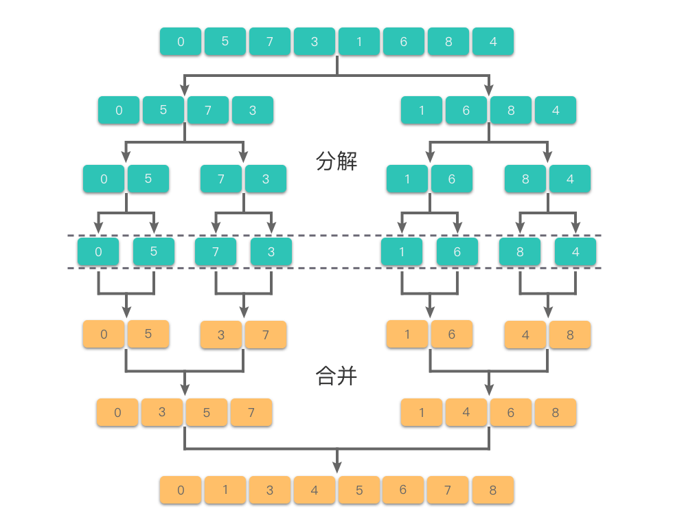

# 01.03.07 习题解析（第 06 天）

## 1. [0506. 相对名次](https://leetcode.cn/problems/relative-ranks/)

### 1.1 题目大意

**描述**：给定一个长度为 `n` 的数组 `score`。其中 `score[i]` 表示第 `i` 名运动员在比赛中的成绩。所有成绩互不相同。

**要求**：找出他们的相对名次，并授予前三名对应的奖牌。前三名运动员将会被分别授予「金牌（`Gold Medal`）」，「银牌（`Silver Medal`）」和「铜牌（`Bronze Medal`）」。

**说明**：

- $n == score.length$。
- $1 \le n \le 10^4$。
- $0 \le score[i] \le 10^6$。
- `score` 中的所有值互不相同。

**示例**：

```python
输入：score = [5,4,3,2,1]
输出：["Gold Medal","Silver Medal","Bronze Medal","4","5"]
解释：名次为 [1st, 2nd, 3rd, 4th, 5th] 。


输入：score = [10,3,8,9,4]
输出：["Gold Medal","5","Bronze Medal","Silver Medal","4"]
解释：名次为 [1st, 5th, 3rd, 2nd, 4th] 。
```

### 1.2 解题思路

#### 思路 1：排序

1. 先对数组 `score` 进行排序。
2. 再将对应前三个位置上的元素替换成对应的字符串：`Gold Medal`, `Silver Medal`, `Bronze Medal`。

#### 思路 1：代码

```python
class Solution:
    def shellSort(self, arr):
        size = len(arr)
        gap = size // 2

        while gap > 0:
            for i in range(gap, size):
                temp = arr[i]
                j = i
                while j >= gap and arr[j - gap] < temp:
                    arr[j] = arr[j - gap]
                    j -= gap
                arr[j] = temp
            gap = gap // 2
        return arr

    def findRelativeRanks(self, score: List[int]) -> List[str]:
        nums = score.copy()
        nums = self.shellSort(nums)
        score_map = dict()
        for i in range(len(nums)):
            score_map[nums[i]] = i + 1

        res = []
        for i in range(len(score)):
            if score[i] == nums[0]:
                res.append("Gold Medal")
            elif score[i] == nums[1]:
                res.append("Silver Medal")
            elif score[i] == nums[2]:
                res.append("Bronze Medal")
            else:
                res.append(str(score_map[score[i]]))
        return res
```

#### 思路 1：复杂度分析

- **时间复杂度**：$O(n \times \log_2n)$。因为采用了时间复杂度为 $O(n \times \log_2n)$ 的希尔排序。
- **空间复杂度**：$O(n)$。

## 2. [0088. 合并两个有序数组](https://leetcode.cn/problems/merge-sorted-array/)

### 2.1 题目大意

**描述**：给定两个有序数组 $nums1$、$nums2$。

**要求**：将 $nums2$ 合并到 $nums1$ 中，使 $nums1$ 成为一个有序数组。

**说明**：

- 给定数组 $nums1$ 空间大小为 $m + n$ 个，其中前 $m$ 个为 $nums1$ 的元素。$nums2$ 空间大小为 $n$。这样可以用 $nums1$ 的空间来存储最终的有序数组。
- $nums1.length == m + n$。
- $nums2.length == n$。
- $0 \le m, n \le 200$。
- $1 \le m + n \le 200$。
- $-10^9 \le nums1[i], nums2[j] \le 10^9$。

**示例**：

- 示例 1：

```python
输入：nums1 = [1,2,3,0,0,0], m = 3, nums2 = [2,5,6], n = 3
输出：[1,2,2,3,5,6]
解释：需要合并 [1,2,3] 和 [2,5,6] 。
合并结果是 [1,2,2,3,5,6] ，其中斜体加粗标注的为 nums1 中的元素。
```

- 示例 2：

```python
输入：nums1 = [1], m = 1, nums2 = [], n = 0
输出：[1]
解释：需要合并 [1] 和 [] 。
合并结果是 [1] 。
```

### 2.2 解题思路

### 思路 1：快慢指针

1. 将两个指针 `index1`、`index2` 分别指向 `nums1`、`nums2` 数组的尾部，再用一个指针 `index` 指向数组 `nums1` 的尾部。
2. 从后向前判断当前指针下 `nums1[index1]` 和 `nums[index2]` 的值大小，将较大值存入 `num1[index]` 中，然后继续向前遍历。
3. 最后再将 `nums2` 中剩余元素赋值到 `num1` 前面对应位置上。

### 思路 1：代码

```python
class Solution:
    def merge(self, nums1: List[int], m: int, nums2: List[int], n: int) -> None:
        index1 = m - 1
        index2 = n - 1
        index = m + n - 1
        while index1 >= 0 and index2 >= 0:
            if nums1[index1] < nums2[index2]:
                nums1[index] = nums2[index2]
                index2 -= 1
            else:
                nums1[index] = nums1[index1]
                index1 -= 1
            index -= 1

        nums1[:index2+1] = nums2[:index2+1]
```

### 思路 1：复杂度分析

- **时间复杂度**：$O(m + n)$。
- **空间复杂度**：$O(m + n)$。

## 3. [剑指 Offer 51. 数组中的逆序对](https://leetcode.cn/problems/shu-zu-zhong-de-ni-xu-dui-lcof/)

### 3.1 题目大意

**描述**：给定一个数组 `nums`。

**要求**：计算出数组中的逆序对的总数。

**说明**：

- **逆序对**：在数组中的两个数字，如果前面一个数字大于后面的数字，则这两个数字组成一个逆序对。
- $0 \le nums.length \le 50000$。

**示例**：

```python
输入: [7,5,6,4]
输出: 5
```

### 3.2 解题思路

#### 思路 1：归并排序

归并排序主要分为：「分解过程」和「合并过程」。其中「合并过程」实质上是两个有序数组的合并过程。



每当遇到 左子数组当前元素 > 右子树组当前元素时，意味着「左子数组从当前元素开始，一直到左子数组末尾元素」与「右子树组当前元素」构成了若干个逆序对。

比如上图中的左子数组 `[0, 3, 5, 7]` 与右子树组 `[1, 4, 6, 8]`，遇到左子数组中元素 `3` 大于右子树组中元素 `1`。则左子数组从 `3` 开始，经过 `5` 一直到 `7`，与右子数组当前元素 `1` 都构成了逆序对。即 `[3, 1]`、`[5, 1]`、`[7, 1]` 都构成了逆序对。

因此，我们可以在合并两个有序数组的时候计算逆序对。具体做法如下：

1. 使用全局变量 `cnt` 来存储逆序对的个数。然后进行归并排序。
2. **分割过程**：先递归地将当前序列平均分成两半，直到子序列长度为 `1`。
   1. 找到序列中心位置 `mid`，从中心位置将序列分成左右两个子序列 `left_arr`、`right_arr`。
   2. 对左右两个子序列 `left_arr`、`right_arr` 分别进行递归分割。
   3. 最终将数组分割为 `n` 个长度均为 `1` 的有序子序列。
3. **归并过程**：从长度为 `1` 的有序子序列开始，依次进行两两归并，直到合并成一个长度为 `n` 的有序序列。
   1. 使用数组变量 `arr` 存放归并后的有序数组。
   2. 使用两个指针 `left_i`、`right_i` 分别指向两个有序子序列 `left_arr`、`right_arr` 的开始位置。
   3. 比较两个指针指向的元素：
      1. 如果 `left_arr[left_i] <= right_arr[right_i]`，则将 `left_arr[left_i]` 存入到结果数组 `arr` 中，并将指针移动到下一位置。
      2. 如果 `left_arr[left_i] > right_arr[right_i]`，则 **记录当前左子序列中元素与当前右子序列元素所形成的逆序对的个数，并累加到 `cnt` 中，即 `self.cnt += len(left_arr) - left_i`**，然后将 `right_arr[right_i]` 存入到结果数组 `arr` 中，并将指针移动到下一位置。
   4. 重复步骤 `3`，直到某一指针到达子序列末尾。
   5. 将另一个子序列中的剩余元素存入到结果数组 `arr` 中。
   6. 返回归并后的有序数组 `arr`。
4. 返回数组中的逆序对的总数，即 `self.cnt`。

#### 思路 1：代码

```python
class Solution:
    cnt = 0
    def merge(self, left_arr, right_arr):           # 归并过程
        arr = []
        left_i, right_i = 0, 0
        while left_i < len(left_arr) and right_i < len(right_arr):
            # 将两个有序子序列中较小元素依次插入到结果数组中
            if left_arr[left_i] <= right_arr[right_i]:
                arr.append(left_arr[left_i])
                left_i += 1
            else:
                self.cnt += len(left_arr) - left_i
                arr.append(right_arr[right_i])
                right_i += 1
        
        while left_i < len(left_arr):
            # 如果左子序列有剩余元素，则将其插入到结果数组中
            arr.append(left_arr[left_i])
            left_i += 1
            
        while right_i < len(right_arr):
            # 如果右子序列有剩余元素，则将其插入到结果数组中
            arr.append(right_arr[right_i])
            right_i += 1
        
        return arr                                  # 返回排好序的结果数组

    def mergeSort(self, arr):                       # 分割过程
        if len(arr) <= 1:                           # 数组元素个数小于等于 1 时，直接返回原数组
            return arr
        
        mid = len(arr) // 2                         # 将数组从中间位置分为左右两个数组。
        left_arr = self.mergeSort(arr[0: mid])      # 递归将左子序列进行分割和排序
        right_arr =  self.mergeSort(arr[mid:])      # 递归将右子序列进行分割和排序
        return self.merge(left_arr, right_arr)      # 把当前序列组中有序子序列逐层向上，进行两两合并。

    def reversePairs(self, nums: List[int]) -> int:
        self.cnt = 0
        self.mergeSort(nums)
        return self.cnt
```

#### 思路 1：复杂度分析

- **时间复杂度**：$O(n \times \log_2n)$。
- **空间复杂度**：$O(n)$。

#### 思路 2：树状数组

数组 `tree[i]` 表示数字 `i` 是否在序列中出现过，如果数字 `i` 已经存在于序列中，`tree[i] = 1`，否则 `tree[i] = 0`。

1. 按序列从左到右将值为 `nums[i]` 的元素当作下标为`nums[i]`，赋值为 `1` 插入树状数组里，这时，比 `nums[i]` 大的数个数就是 `i + 1 - query(a)`。
2. 将全部结果累加起来就是逆序数了。

#### 思路 2：代码

```python
import bisect

class BinaryIndexTree:

    def __init__(self, n):
        self.size = n
        self.tree = [0 for _ in range(n + 1)]

    def lowbit(self, index):
        return index & (-index)

    def update(self, index, delta):
        while index <= self.size:
            self.tree[index] += delta
            index += self.lowbit(index)

    def query(self, index):
        res = 0
        while index > 0:
            res += self.tree[index]
            index -= self.lowbit(index)
        return res

class Solution:
    def reversePairs(self, nums: List[int]) -> int:
        size = len(nums)
        sort_nums = sorted(nums)
        for i in range(size):
            nums[i] = bisect.bisect_left(sort_nums, nums[i]) + 1

        bit = BinaryIndexTree(size)
        ans = 0
        for i in range(size):
            bit.update(nums[i], 1)
            ans += (i + 1 - bit.query(nums[i]))
        return ans
```

#### 思路 2：复杂度分析

- **时间复杂度**：$O(n \times \log_2n)$。
- **空间复杂度**：$O(n)$。