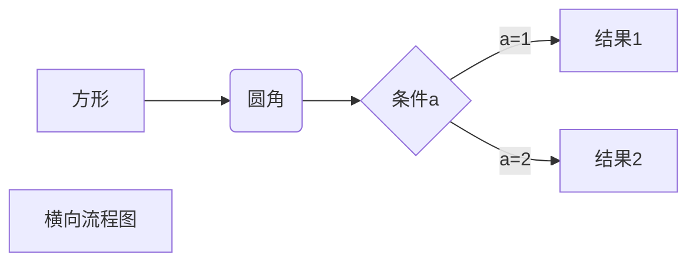
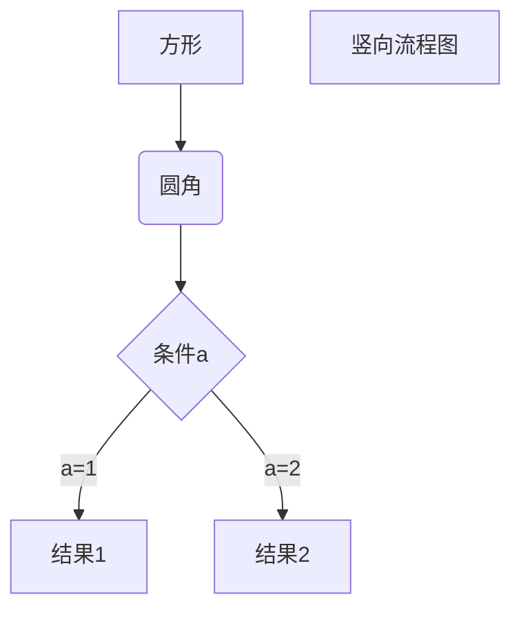

Markdown是一种轻量级的标记语言，常用于编写简单的格式化文档。以下是Markdown的基础语法：
1. 标题：使用"#"符号来表示标题，一个"#"代表一级标题，两个"#"代表二级标题，以此类推。
2. 段落：段落之间空一行即可。
3. 强调：使用"*"或"_"包围文本来表示斜体，使用"**"或"__"包围文本来表示加粗。
4. 链接：使用的格式来创建链接。``这是一个链接 [Markdown语法](https://markdown.com.cn)。
6. 列表：使用"*"、"+"或"-"加上空格来创建无序列表，使用数字加上"."和空格来创建有序列表。
7. 引用：使用">"符号加上空格来表示引用。
8. 图片：使用"``"的格式来插入图片。
9. 代码块：使用"```"包围代码来创建代码块。
10. 水平线：使用三个以上的"-"、"*"或"_"来创建水平线。
11. 表格：使用"|"和"-"来创建表格。
这些是Markdown的基础语法，可以帮助你快速编写格式化的文档。
在Markdown中，您可以使用HTML实体或Unicode代码来输入希腊字符。以下是一些常见的希腊字符及其对应的HTML实体和Unicode代码：
- α（Alpha）：`&alpha;` 或 `&#945;`
- β（Beta）：`&beta;` 或 `&#946;`
- γ（Gamma）：`&gamma;` 或 `&#947;`
- δ（Delta）：`&delta;` 或 `&#948;`
- ε（Epsilon）：`&epsilon;` 或 `&#949;`
- ζ（Zeta）：`&zeta;` 或 `&#950;`
- η（Eta）：`&eta;` 或 `&#951;`
- θ（Theta）：`&theta;` 或 `&#952;`
- ι（Iota）：`&iota;` 或 `&#953;`
- κ（Kappa）：`&kappa;` 或 `&#954;`
- λ（Lambda）：`&lambda;` 或 `&#955;`
- μ（Mu）：`&mu;` 或 `&#956;`
- ν（Nu）：`&nu;` 或 `&#957;`
- ξ（Xi）：`&xi;` 或 `&#958;`
- ο（Omicron）：`&omicron;` 或 `&#959;`
- π（Pi）：`&pi;` 或 `&#960;`
- ρ（Rho）：`&rho;` 或 `&#961;`
- σ（Sigma）：`&sigma;` 或 `&#963;`
- τ（Tau）：`&tau;` 或 `&#964;`
- υ（Upsilon）：`&upsilon;` 或 `&#965;`
- φ（Phi）：`&phi;` 或 `&#966;`
- χ（Chi）：`&chi;` 或 `&#967;`
- ψ（Psi）：`&psi;` 或 `&#968;`
- ω（Omega）：`&omega;` 或 `&#969;`
您可以在Markdown文本中使用这些HTML实体或Unicode代码来输入希腊字符，并在渲染时显示相应的字符。
在Markdown中，可以使用数学公式的语法和标记来显示数学公式。常用的方法是使用LaTeX语法进行数学公式的输入。以下是使用LaTeX语法在Markdown中输入数学公式的步骤：
1. 行内公式（Inline Formula）：将数学公式插入到文本中。
   - 使用单个美元符号 `$` 将数学公式括起来。例如：`$y = mx + b$`。
   - 如果希望数学公式居中显示，可以使用两个美元符号 `$$` 将数学公式括起来。例如：`$$y = mx + b$$`。
2. 块级公式（Block Formula）：将数学公式作为一个段落进行显示。
   - 使用两个美元符号 `$$` 将数学公式括起来，并将其放置在单独的一行。例如：
   ```
   $$
   y = mx + b
   $$
   ```
3. 使用LaTeX语法输入数学公式。
   - 可以使用各种LaTeX命令和符号来构建数学公式，如下面提到的上标、下标、分数、根号、求和、积分、极限等。
   - 可以在公式中使用各种数学符号和运算符，如加法、减法、乘法、除法、等号、不等号等。
在Markdown中，您可以使用LaTeX语法来输入数学公式。以下是一些常见的数学公式示例及其对应的LaTeX语法：
1. 上标和下标：
- 上标：使用 `^` 符号，例如 `x^2` 表示 x 的平方。
- 下标：使用 `_` 符号，例如 `x_i` 表示 x 的下标为 i。
2. 分数：
- 使用 `\frac{分子}{分母}` 表示分数，例如 `\frac{1}{2}` 表示1/2。
3. 根号：
- 使用 `\sqrt{}` 表示平方根，例如 `\sqrt{2}` 表示根号下的2。
4. 求和、积分、极限：
- 求和：使用 `\sum`，例如 `\sum_{i=1}^{n} x_i` 表示求和符号。
- 积分：使用 `\int`，例如 `\int_{0}^{1} f(x) dx` 表示积分符号。
- 极限：使用 `\lim`，例如 `\lim_{x \to \infty} f(x)` 表示极限符号。
5. 上大括号和矩阵：
- 上大括号：使用 `\{` 和 `\}`，例如 `\{x | x > 0\}` 表示集合。
- 矩阵：使用 `\begin{matrix} \end{matrix}` 和 `&` 来表示矩阵，例如：
```
\begin{matrix}
1 & 2 \\
3 & 4 \\
\end{matrix}
```
您可以在Markdown文本中使用这些LaTeX语法来输入数学公式，并在渲染时显示相应的数学符号和格式。
以下几个实例效果图如下：
**1、横向流程图源码格式：**

**2、竖向流程图源码格式：**



## 加帽子、横线、波浪线、加点

加^号 输入$\hat{a}$或$\widehat{a}$
加横线 输入$\overline{a}$
加波浪线 输入$\widetilde{a}$
加一个点$\dot{a}$加两个点$\ddot{a}$

在LaTeX中，属于符号可以使用以下命令打印：
- $\in$表示"属于"符号，如x$\in A$，表示 x 属于集合 A。
- $\notin$表示"不属于"符号，如x$\notin A$，表示 x 不属于集合 A。
- $\subset$表示"子集"符号，如A$\subset B$，表示集合 A 是集合 B 的子集。
- $\subseteq$表示"真子集"符号，如A$\subseteq B$，表示集合 A 是集合 B 的真子集（可以相等）。
- $\supset$表示"超集"符号，如A$\supset B$，表示集合 A 是集合 B 的超集。
- q$表示"真超集"符号，如A$\supseteq B$，表示集合 A 是集合 B 的真超集（可以相等）。
这些符号可以用于在LaTeX中表示集合关系和属于关系。使用这些命令可以方便地在公式中打印对应的符号。
### 声调

|  |  |  |
| --- | --- | --- | 
|$\bar{x}$|$\acute{\eta}$|$\check{\alpha}$|
|$\grave{\eta}$|$\breve{a}$|$\ddot{y}$|
|$\dot{x}$|$\hat{\alpha}$|$\tilde{\iota}$|
### 函数

|  |  |  |
| --- | --- | --- |
|$\sin\theta$|$\cos\theta$|$\tan\theta$|
|$\arcsin\frac{L}{r}$|$\arccos\frac{T}{r}$|$\arctan\frac{L}{T}$|
|$\sinh g$|$\cosh h$|$\tanh i$|
|$\operatorname{sh}j$|$\operatorname{argsh}k$|$\operatorname{ch}h$|
|$\operatorname{argch}l$|$\operatorname{th}i$|$\operatorname{argth}m$|
|$k'(x)=\lim_{\Delta x\to 0}\frac{k(x)-k(x-\Delta x)}{\Delta x}$|$\limsup S$|$\liminf I$|
|$\max H$|$\min L$|$\inf s$|
|$\sup t$|$\exp$\t$|$\ln X$|
|$\lg X$|$\log X$|$\log_\alpha X$|
|$\ker x$|$\deg x$|$\gcd(T,U,V,W,X)$|
|$\Pr x$|$\det x$|$\hom x$|
|$\arg x$|$\dim x$|$\lim_{t\to n}T$|
### 同余

|  |  |
| --- | --- | 
|$\pmod{m}$| a$\bmod b$|
### 微分

|  |  |  |
| --- | --- | --- |
|$\nabla$|$\partial x$|$\mathrm{d}x$|
|$\dot x$|$\ddot y$|   
### 集合

|  |  |  |  |  |
| --- | --- | --- | --- |
|$\forall$|$\exists$|$\empty$|$\emptyset$|$\varnothing$|   
|$\in$|$\ni$|$\not\in$|$\notin$|$\subset$|   
|$\subseteq$|$\supset$|$\supseteq$|$\cap$|$\bigcap$|   
|$\cup$|$\bigcup$|$\biguplus$|$\sqsubset$|$\sqsubseteq$|   
|$\sqsupset$|$\sqsupseteq$|$\sqcap$|$\sqcup$|$\bigsqcup$|   

以下是每个符号的意思：
- $\forall$：表示“对于所有”或“任意的”，是普遍量词的符号化表示。
- $\exists$：表示“存在”或“至少存在一个”，是存在量词的符号化表示。
- $\emptyset$：表示空集，即不包含任何元素的集合。
- $\varnothing$：与 $\emptyset$ 相同，表示空集。
- $\in$：表示属于，用于描述元素属于某个集合的关系。
- $\ni$：与 $\in$ 相同，表示包含，用于描述集合包含某个元素的关系。
- $\not\in$：表示不属于，用于描述元素不属于某个集合的关系。
- $\notin$：与 $\not\in$ 相同，表示不属于。
- $\subset$：表示真子集关系，表示一个集合是另一个集合的真子集。
- $\subseteq$：表示子集关系，表示一个集合是另一个集合的子集，可以相等。
- $\supset$：表示真超集关系，表示一个集合是另一个集合的真超集。
- $\supseteq$：表示超集关系，表示一个集合是另一个集合的超集，可以相等。
- $\cap$：表示交集，表示两个集合共有的元素组成的集合。
- $\bigcap$：表示大交集，表示多个集合的交集。
- $\cup$：表示并集，表示两个集合合并后的集合。
- $\bigcup$：表示大并集，表示多个集合的并集。
- $\biguplus$：表示多重并集，表示多个集合的不相交并集。
- $\sqsubset$：表示子集关系，用于描述一个集合是另一个集合的子集。
- $\sqsubseteq$：表示子集或相等关系，用于描述一个集合是另一个集合的子集或相等。
- $\sqsupset$：表示超集关系，用于描述一个集合是另一个集合的超集。
- $\sqsupseteq$：表示超集或相等关系，用于描述一个集合是另一个集合的超集或相等。
- $\sqcap$：表示交集，用于描述两个集合的交集。
- $\sqcup$：表示并集，用于描述两个集合的并集。
- $\bigsqcup$：表示大并集，用于描述多个集合的并集。
### 逻辑

|  |  |  |  |
| --- | --- | --- | --- | --- |
|p|$\land$|$\wedge$|$\bigwedge$|   
|$\bar{q}\to p$|$\lor$|$\vee$|$\bigvee$|   
|$\lnot$|$\neg q$|$\setminus$|$\smallsetminus$|   
### 根号
$\sqrt{3}$
### 关系符号
|  | |
| --- | --- |
|$\Delta ABC\sim\Delta XYZ$|$\sqrt{3}\approx1.732050808\ldots$|
|$\simeq$|$\cong$|
|$\dot=$|$\ggg$|
|$\gg$|$>$|
|$\ge$|$\geqq$|$=$|
|$\leq$|$\leqq$|
|$<$|$\ll$|
|$\lll$|$(x-y)^2\equiv(-x+y)^2\equiv x^2-2xy+y^2$|
|$x\not\equiv N$ |$x\ne A$|   
|$x\neq C$  |$t\propto v$|   
|$\pm$|$\mp$|   

### 几何符号

| 特征 |  |
| --- | --- |
|菱形 |$\Diamond$|   
|正方形 |$\Box$|   
|三角形 |$\Delta$|   
|角 |$\angle$|   
|垂直|$\perp$|  

### 箭头符号

|  |  |  |
| --- | --- | --- |
|$\leftarrow$|$\gets$|$\rightarrow$|   
|$\to$|$\leftrightarrow$|$\longleftarrow$|   
|$\longrightarrow$|$\mapsto$|$\longmapsto$|   
|$\hookrightarrow$|$\hookleftarrow$|$\nearrow$|   
|$\searrow$|$\swarrow$|$\nwarrow$|   
|$\uparrow$|$\downarrow$|$\updownarrow$|   

|  |  |  |  |
| --- | --- | --- | --- | --- |
|$\rightharpoonup$|$\rightharpoondown$|$\leftharpoonup$|$\leftharpoondown$|   
|$\upharpoonleft$|$\upharpoonright$|$\downharpoonleft$|$\downharpoonright$|   

|  |  |  |
| --- | --- | --- |
|$\Leftarrow$|$\Rightarrow$|$\Leftrightarrow$|   
|$\Longleftarrow$|$\Longrightarrow$|$\Longleftrightarrow (or \iff)$|   
|$\Uparrow$|$\Downarrow$|$\Updownarrow$|   

### 特殊符号

|  |  |  |  |  |  |
| --- | --- | --- |
|$\eth$|$\S$|$\P$|$\%$|$\dagger$|$\ddagger$|   
|$\star$|$\*$|$\ldots$|$\smile$|$\frown$|$\wr$|   

|  |  |  |
| --- | --- | --- |
|$\oplus$|\bigoplus$|$\otimes$|   
|\bigotimes$|$\times$|$\cdot$|   
|$\div$|$\circ$|$\bullet$|   
|\bigodot$|$\boxtimes$|$\boxplus$|   

|  |  |  |  |
| --- | --- | --- | --- | 
|$\triangleleft$|$\triangleright$|$\infty$|$\bot$|   
|$\top$|$\vdash$|$\vDash$|$\Vdash$|   
|$\models$|$\lVert$|$\rVert$|   

|  |  |  |
| --- | --- | --- |
|$\imath$|$\hbar$|$\ell$|   
|$\mho$|$\Finv$|$\Re$|   
|$\Im$|$\wp$|$\complement$|   

|  |  |  |  |
| --- | --- | --- | --- |
|$\diamondsuit$|$\heartsuit$|$\clubsuit$|$\spadesuit$|   
|$\Game$|$\flat$|$\natural$|$\sharp$|   

## 上标、下标及等

| |  | |  |
| --- | --- | --- | --- | 
| 上标 |$a^2$| 下标 |$a_2$|
| 组合 |$a^{2+2}$|$a_{i,j}$||
| 结合上下标 |$x_2^3$| 前置上下标 |${}_1^2X_3^4$|
|（HTML） |$x'$| 导数  （PNG） |$x^\prime$|
| 导数  （错误） |$x\prime$|
| 导数点 |$\dot{x}$|$\ddot{y}$|
|$\vec{c}$|$\overleftarrow{a b}$|$\overrightarrow{c d}$|$\widehat{e f g}$|
| 上弧  (注: 正确应该用\overarc, 但在这里行不通。要用建议的语法作为解决办法) |$\overset{\frown} {AB}$|
| 上划线 |$\overline{h i j}$|
| 下划线 |$\underline{k l m}$|
| 上括号 |$\overbrace{1+2+\cdots+100}$|$\begin{matrix} \overbrace{ 1+2+\cdots+100 }^{5050}\end{matrix}$|
| 下括号 |$\underbrace{a+b+\cdots+z}$|$\begin{matrix}\underbrace{ a+b+cdots+z }_{abc}\end{matrix}$|
| 求和 |$\sum_{k=1}^N k^2$|$\begin{matrix}\sum_{k=1}^N k^2\end{matrix}$|
| 求积 |$\prod_{i=1}^N x_i$|$\begin{matrix}\prod_{i=1}^N x_i\end{matrix}$|
| 上积 |$\coprod_{i=1}^N x_i$|$\begin{matrix}\coprod_{i=1}^N x_i\end{matrix}$|$\lim_{n\to\infty}x_n$|$\begin{matrix}\lim_{n\to\infty}x_n\end{matrix}$|
||$\int_{-N}^{N} e^x\, dx$|$\begin{matrix}\int_{-N}^{N} e^x\, dx\end{matrix}$|$\iint_{D}^{W}\, dx\,dy$|
| 多重积分 |$\iiint_{E}^{V}\, dx\,dy\,dz$|$\iiiint_{F}^{U}\, dx\,dy\,dz\,dt$|
| 闭合的、 |$\oint_{C} x^3\, dx + 4y^2\, dy$|\bigcap_1^{n} p$|\bigcup_1^{k} p$|

## 分数、矩阵和多行列式

| |  ||  |
| --- | --- |  --- | --- | 
| 分数 |$\frac{2}{4}=0.5$| 小型分数 |$\tfrac{2}{4} = 0.5$|
| 大型分数（嵌套） |$\cfrac{2}{c +\cfrac{2}{d +\cfrac{2}{4}}} = a$| 大型分数（不嵌套） |$\dfrac{2}{4} = 0.5\qquad\dfrac{2}{c +\dfrac{2}{d +\dfrac{2}{4}}} = a$|
| 系数 |$\dbinom{n}{r}=\binom{n}{n-r}=C^n_r=C^n_{n-r}$| 小型系数 |$\tbinom{n}{r}=\tbinom{n}{n-r}=C^n_r=C^n_{n-r}$|
| 大型系数 |$\binom{n}{r}=\dbinom{n}{n-r}=C^n_r=C^n_{n-r}$| 条件定义 |$f(n) =\begin{cases} n/2, \mbox{if }n\mbox{ is even}\\ 3n+1, &\mbox{if }n\mbox{ is odd}\end{cases}$|
| 矩阵 |$\begin{matrix} x & y\\ z & v\end{matrix}$|$\begin{vmatrix} x & y\\ z & v\end{vmatrix}$|$\begin{Vmatrix} x & y\\ z & v\end{Vmatrix}$|
||$\begin{bmatrix} 0 &\cdots & 0\\\vdots &\ddots &\vdots\\ 0 &\cdots & 0\end{bmatrix}$|$\begin{Bmatrix} x & y\\ z & v\end{Bmatrix}$|$\begin{pmatrix} x & y\\ z & v\end{pmatrix}$|\bigl(\begin{smallmatrix} ab\\ cd\end{smallmatrix}\bigr)$|
| 多行等式 |$\begin{align} f(x) & = (m+n)^2\\ & = m^2+2mn+n^2\\\end{align}$|$\begin{alignat}{2} f(x) & = (m-n)^2\\ f(x) & = (-m+n)^2\\ & = m^2-2mn+n^2\\\end{alignat}$|
| 多行等式（左对齐）|$\begin{array}{lcl} z & = & a\\ f(x,y,z) & = & x + y + z \end{array}$| 多行等式（右对齐）|$\begin{array}{lcr} z & = & a\\ f(x,y,z) & = & x + y + z \end{array}$|
| 长公式换行 |$f(x) = \sum_{n=0}^\infty a_n x^n = a_0 + a_1x + a_2x^2 + \cdots$|$\begin{cases} 3x + 5y + z\\ 7x - 2y + 4z\\ -6x + 3y + 2z\end{cases}$|
| 数组 |$\begin{array}{\|c\|c\|\|c\|} a & b & S\\\hline 0&0&1\\ 0&1&1\\ 1&0&1\\ 1&1&0\\\end{array}$|

## 字体
| |  | ||
| --- | --- |--- |--- |
| 希腊大写字母||||
|$AB\Gamma\Delta EZE\Theta$|$IK\Lambda MN\Xi O\Pi$|$R\Sigma T\Upsilon\Phi C \Psi\Omega$|
| 希腊小写字母||||
|$\alpha\beta\gamma\delta\epsilon\zeta\eta\theta$|$\iota\kappa\lambda\mu\nu\xi\omicron\pi$|$\rho\sigma\tau\upsilon\phi\chi\psi\omega$|
| 异体字母||||
|$E\epsilon\varepsilon$|$\Theta\theta\vartheta$|$K\kappa\varkappa$|$\Pi\pi\varpi$|$\Rho\rho\varrho$|$\Sigma\sigma\varsigma$|$\Phi\phi\varphi$|||

| 字体 | 命令 |
| --- | --- |
| 直立 | \\textup{} |
| 意大利 | \\textit{} |
| 倾斜 | \\textsl{} |
| 小型大写 | \\textsc{} |
| 加宽加粗 | \\textbf{} |

## 括号

| |  |
| --- | --- |
| 不好看 |$(\frac{1}{2} )$|
| 好看了 |$\left(\frac{1}{2}\right)$|

您可以使用 $\left 和 $\right 来显示不同的括号：

| |  |  |  |
| --- | --- | --- | --- | 
| 圆括号，小括号 |$\left(\frac{a}{b}\right)$| 方括号，中括号 |$\left[\frac{a}{b}\right]$|
| 花括号，大括号 |$\left\{\frac{a}{b}\right\}$| 角括号 |$\left\langle\frac{a}{b}\right\rangle$|
| 单竖线，绝对值 |$\left|\frac{a}{b}\right|$| 双竖线，范 |$\left\|\frac{a}{b}\right\|$|
| 取整函数  （Floor function） |$\left\lfloor\frac{a}{b}\right\rfloor$| 取顶函数  （Ceiling function) |$\left\lceil\frac{c}{d}\right\rceil$|
|上下箭头 |$\left\uparrow\frac{a}{b}\right\downarrow$ |$\left\uparrow\frac{a}{b}\right\downarrow$ |$\left\updownarrow\frac{a}{b}\right\Updownarrow$|
| 单左括号 |$\left\{\frac{a}{b}\right .$ | 单右括号 |$\left .\frac{a}{b}\right\}$|
| 斜线与反斜线 |$\left/\frac{a}{b}\right\backslash$ |

备注：
- 可以使用\big,\bigg 控制括号的大小，比如：

$\bigg (\bigg [\big \{\big \langle\left |\|\frac{a}{b}\|\right |\big\rangle\big \}\bigg ]\bigg )$

## 空格

注意TEX能够自动处理大多数的空格，但是您有时候需要自己来控制。

| | | 
| --- | --- | 
|2个quad空格 |$\alpha\qquad\beta$|   
|quad空格 |$\alpha\quad\beta$|   
|大空格 |$\alpha\beta$|   
|中等空格 |$\alpha\;\beta$|   
|小空格 |$\alpha\,\beta$|   
|没有空格 |$\alpha\beta$|   
|紧贴|$\alpha\beta$|   

## 颜色

语法
- 字体颜色︰${\color{色调}表达式}$
- 背景颜色︰${\pagecolor{色调}表达式}$

在 LaTeX 中，可以使用 `xcolor` 宏包来扩展颜色的选择范围。`xcolor` 宏包提供了多种预定义的颜色名称，以及自定义颜色的选项。
下面是一些示例，展示了一些常见的预定义颜色名称：
$$
\begin{gather}
\textcolor{red}{Red text}, \\
\textcolor{blue}{blue text}, \\
\textcolor{green}{green text}, \\
\textcolor{cyan}{cyan text}, \\
\textcolor{magenta}{magenta text}, \\
\textcolor{yellow}{yellow text}, \\
\textcolor{black}{black text}, \\
\textcolor{gray}{gray text}.
\end{gather}
$$
在上面的示例中，`xcolor` 宏包被加载，并使用 `\textcolor` 命令将文本设置为不同的预定义颜色。
除了预定义颜色之外，你还可以使用 RGB 颜色模型来定义自定义颜色。例如：
$$
\definecolor{mycolor}{RGB}{255, 0, 128}
\textcolor{mycolor}{Custom color text}.
$$
在这个示例中，使用 `\definecolor` 命令定义了名为 `mycolor` 的自定义颜色，其 RGB 值为 255、0、128。然后，使用 `\textcolor` 命令将文本设置为自定义颜色。
通过 `xcolor` 宏包和自定义颜色的选项，你可以在 LaTeX 中使用各种颜色来渲染文本和背景。你可以根据需要自由选择颜色，以满足你的排版需求。

---

以下是一些常见的环境以及与之对应的 `\begin{}` 和 `\end{}` 指令：
1. 文本环境：
   - `document`：整个文档的环境，包含在 `\begin{document}` 和 `\end{document}` 之间。
   - `itemize`：无序列表环境。
   - `enumerate`：有序列表环境。
   - `description`：描述列表环境。
2. 数学环境：
   - `equation`：单行的数学公式环境。
   - `align`：多行对齐的数学公式环境。
   - `gather`：多行居中的数学公式环境。
   - `cases`：多行公式的分支条件环境。
3. 图表环境：
   - `figure`：单个图形的环境。
   - `table`：单个表格的环境。
4. 引用环境：
   - `quote`：引用块环境。
   - `verbatim`：原样输出环境。
---
### 图片

插入图片需要使用`graphicx`宏包，建议使用如下方式：

```tex
\begin{figure}[htbp]
    \centering
    \includegraphics[width=8cm]{图片.jpg}
    \caption{图片标题}
\end{figure}
```

其中，`[htbp]`的作用是自动选择插入图片的最优位置，`\centering`设置让图片居中，`[width=8cm]`设置了图片的宽度为8cm，`\caption{}`用于设置图片的标题。

### 表格

LaTeX中表格的插入较为麻烦，可以直接使用[Create LaTeX tables online – TablesGenerator.com](https://link.zhihu.com/?target=https%3A//www.tablesgenerator.com/%23)来生成。建议使用如下方式：

```tex
\begin{table}[htbp]
    \centering
    \caption{表格标题}
    \begin{tabular}{ccc}
        1 & 2 & 3 \\
        4 & 5 & 6 \\
        7 & 8 & 9
    \end{tabular}
\end{table}
```

### 列表

LaTeX中的列表环境包含无序列表`itemize`、有序列表`enumerate`和描述`description`，以`enumerate`为例，用法如下：

```tex
\begin{enumerate}
    \item 这是第一点; 
    \item 这是第二点;
    \item 这是第三点. 
\end{enumerate}
```

另外，也可以自定义`\item`的样式：

```tex
\begin{enumerate}
    \item[(1)] 这是第一点; 
    \item[(2)] 这是第二点;
    \item[(3)] 这是第三点. 
\end{enumerate}
```

### 定理环境

定理环境需要使用`amsthm`宏包，首先在导言区加入：

```text
\newtheorem{theorem}{定理}[section]
```

其中`{theorem}`是环境的名称，`{定理}`设置了该环境显示的名称是“定理”，`[section]`的作用是让`theorem`环境在每个section中单独编号。在正文中，用如下方式来加入一条定理：

```tex
\begin{theorem}[定理名称]
    这里是定理的内容. 
\end{theorem}
```

其中`[定理名称]`不是必须的。另外，我们还可以建立新的环境，如果要让新的环境和`theorem`环境一起计数的话，可以用如下方式：

```tex
\newtheorem{theorem}{定理}[section]
\newtheorem{definition}[theorem]{定义}
\newtheorem{lemma}[theorem]{引理}
\newtheorem{corollary}[theorem]{推论}
\newtheorem{example}[theorem]{例}
\newtheorem{proposition}[theorem]{命题}
```

另外，定理的证明可以直接用`proof`环境。
### 页面

最开始选择文件类型时，我们设置的页面大小是a4paper，除此之外，我们也可以修改页面大小为b5paper等等。

一般情况下，LaTeX默认的页边距很大，为了让每一页显示的内容更多一些，我们可以使用`geometry`宏包，并在导言区加入以下代码：

```tex
\usepackage{geometry}
\geometry{left=2.54cm, right=2.54cm, top=3.18cm, bottom=3.18cm}
```

另外，为了设置行间距，可以使用如下代码：

```tex
\linespread{1.5}
```
### 页码
默认的页码编码方式是阿拉伯数字，用户也可以自己设置为小写罗马数字：

```tex
\pagenumbering{roman}
```

另外，`aiph`表示小写字母，`Aiph`表示大写字母，`Roman`表示大写罗马数字，`arabic`表示默认的阿拉伯数字。如果要设置页码的话，可以用如下代码来设置页码从0开始：

```tex
\setcounter{page}{0}
```

---

如果需要在多行公式中添加编号，可以使用`align`环境嵌套`equation`环境，并在需要编号的行使用`\label`命令。以下是一个示例：
```latex
\begin{align}
    f(x) &= x^2 + 3x + 2 \label{eq:1} \\
    &= (x+2)(x+1) \label{eq:2}
\end{align}
```
这样，你可以在文本中引用这些编号，例如，通过使用`\eqref{eq:1}`或`\eqref{eq:2}`引用公式。该代码会生成一个包含两行的公式，每行都以等号对齐。第一行是$f(x) = x^2 + 3x + 2$，第二行是$f(x) = (x+2)(x+1)$。

在LaTeX中，与 `\math` 相关的函数有很多，以下是一些常用的函数列表：
- `\mathbf{}`: 用于显示粗体字体，通常用于向量或矩阵表示。例如，$\mathbf{v}$ 会显示为粗体字母v。
- \mathbb{}: 用于显示黑板粉笔字体，通常用于表示特定的数学集合，如实数集、自然数集等。例如，$\mathbb{R}$ 会显示为黑板粉笔字母R，表示实数集。
- \mathcal{}: 用于显示花体字母，通常用于表示特定的数学对象，如集合、代数结构等。例如，$\mathcal{A}$ 会显示为花体字母A。
- \mathit{}: 用于显示斜体字体，通常用于表示变量或标识符。例如，$\mathit{x}$ 会显示为斜体字母x。
- \mathrm{}: 用于显示正体字体，通常用于显示数学运算符或常数。例如，$\mathrm{sin}$ 会显示为正体的sin函数。
- \mathsf{}: 用于显示无衬线字体，通常用于表示特定的数学对象。例如，$\mathsf{P}$ 会显示为无衬线字母P。
- \mathtt{}: 用于显示等宽字体，通常用于表示计算机代码或特定的数学符号。例如，$\mathtt{sum}$会显示为等宽字体的sum符号。
这些函数可以根据需要在数学环境中使用，以显示不同的数学符号和字体效果。